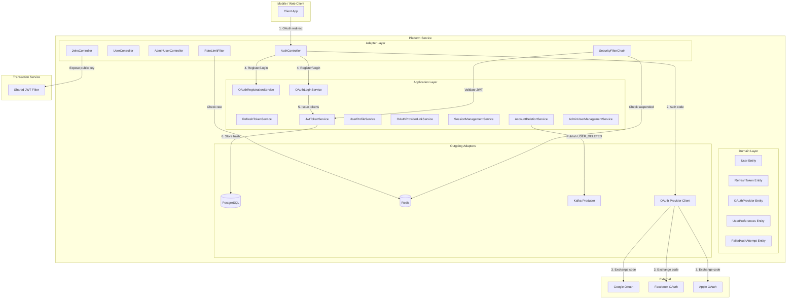
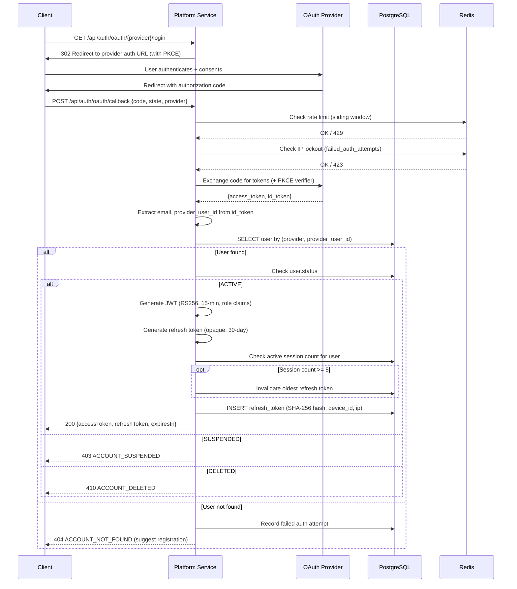
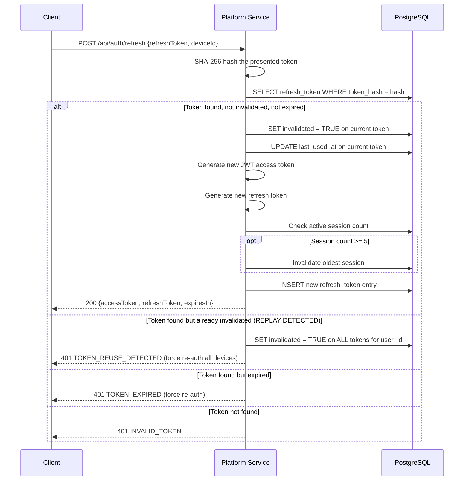
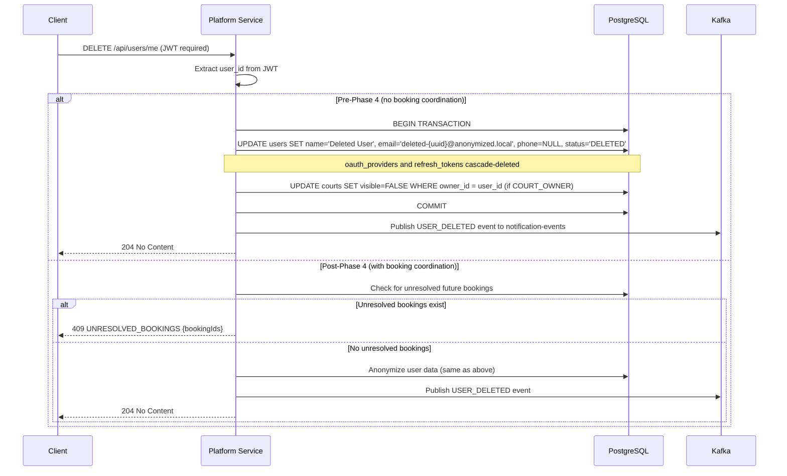

# Design Document — Phase 2: Auth & User Management

## Overview

Phase 2 implements the complete authentication, authorization, and user management subsystem for the Court Booking Platform within the `court-booking-platform-service`. It builds on the Phase 1b scaffolding (database schema, hexagonal architecture, CI/CD) and delivers:

- **OAuth-based registration and login** (Google, Facebook, Apple) using Authorization Code Flow with PKCE
- **JWT access token issuance** (RS256, 15-minute lifetime) with role-based claims including COURT_OWNER sub-states
- **Refresh token lifecycle** (30-day, rotation with replay detection, device tracking)
- **Biometric authentication support** (secure enclave token designation, V2 migration)
- **Role-based access control** (4 roles, full authorization matrix, Spring Security method-level enforcement)
- **User profile management** (CRUD, business fields, notification preferences, DND hours)
- **OAuth provider linking/unlinking** (multi-provider support, minimum-one-provider guard)
- **Concurrent session management** (max 5 devices, oldest-eviction strategy)
- **Rate limiting** (Redis sliding window, IP lockout via `failed_auth_attempts`, in-memory fallback)
- **GDPR-compliant account deletion** (anonymization, pre-Phase 4 direct flow, USER_DELETED event)
- **Cross-service JWT validation** (JWKS endpoint, shared JWT filter in `court-booking-common`)
- **Subscription stub strategy** (NONE → ACTIVE mapping until Phase 10)
- **Admin user management** (create SUPPORT_AGENT/PLATFORM_ADMIN, suspend/unsuspend, seed migration)

### Key Design Decisions

| Decision | Choice | Rationale |
|----------|--------|-----------|
| RS256 key management | K8s Secret-mounted PEM files, `kid` header for rotation | Enables zero-downtime key rotation; both services load public key independently |
| OAuth flow | Authorization Code with PKCE | Mobile-safe, no client secret exposure; industry standard for native/SPA apps |
| Refresh token storage | SHA-256 hash in `refresh_tokens` table | Server-side storage enables revocation; hashing prevents token theft from DB dumps |
| Replay detection | Token family invalidation on reuse | Detects stolen refresh tokens; revokes entire family forcing re-auth on all devices |
| Rate limiting | Redis ZSET sliding window + in-memory fallback | Distributed rate limiting across pods; graceful degradation when Redis is down |
| Suspended users check | Redis SET (`suspended_users`) checked in JWT filter | O(1) lookup per request; avoids DB hit on every authenticated request |
| GDPR deletion | Anonymize-in-place (not hard delete) | Preserves analytics/audit integrity; ON DELETE CASCADE handles oauth_providers and refresh_tokens |
| Shared JWT filter | `court-booking-common` library with `JwtAuthenticationFilter` | Consistent validation logic across services; single source of truth for claim extraction |
| Subscription stub | JWT maps NONE → ACTIVE | Zero code changes needed when Phase 10 lands; just remove the mapping |

### Scope Boundaries

| In Scope (Phase 2) | Out of Scope |
|---------------------|-------------|
| OAuth registration/login flows | Court owner verification workflow (Phase 3) |
| JWT issuance + validation | Stripe Connect onboarding (Phase 4) |
| Refresh token rotation + replay detection | Booking cancellation coordination (Phase 4) |
| RBAC enforcement | Email verification for email changes (Phase 5) |
| User profile CRUD | USER_DELETED event consumer in Transaction Service (Phase 5) |
| GDPR account deletion (direct anonymization) | Subscription billing enforcement (Phase 10) |
| Rate limiting on auth endpoints | Security hardening / abuse detection (Phase 7) |
| Admin user management | IP blocklist management (Phase 7) |

## Architecture

### High-Level Auth Flow



### OAuth Login Sequence



### Refresh Token Rotation with Replay Detection



### GDPR Account Deletion Flow



### Hexagonal Architecture Package Layout

```
gr.courtbooking.platform/
├── domain/
│   ├── model/
│   │   ├── User.java                          # Rich entity
│   │   ├── UserId.java                        # Value object (record)
│   │   ├── RefreshToken.java                  # Rich entity
│   │   ├── RefreshTokenId.java                # Value object (record)
│   │   ├── OAuthProvider.java                 # Entity
│   │   ├── OAuthProviderId.java               # Value object (record)
│   │   ├── UserPreferences.java               # Entity
│   │   ├── FailedAuthAttempt.java             # Entity
│   │   ├── UserRole.java                      # Enum
│   │   ├── UserStatus.java                    # Enum
│   │   ├── OAuthProviderType.java             # Enum (GOOGLE, FACEBOOK, APPLE)
│   │   ├── SubscriptionStatus.java            # Enum
│   │   └── Language.java                      # Enum (EL, EN)
│   ├── exception/
│   │   ├── AccountSuspendedException.java
│   │   ├── AccountDeletedException.java
│   │   ├── DuplicateEmailException.java
│   │   ├── OAuthProviderAlreadyLinkedException.java
│   │   ├── LastProviderUnlinkException.java
│   │   ├── TokenReplayDetectedException.java
│   │   ├── RefreshTokenExpiredException.java
│   │   ├── InvalidRefreshTokenException.java
│   │   ├── SessionLimitExceededException.java
│   │   ├── RateLimitExceededException.java
│   │   ├── IpLockedException.java
│   │   └── UnresolvedBookingsException.java
│   └── service/
│       └── TokenDomainService.java            # SHA-256 hashing, token generation
├── application/
│   ├── port/
│   │   ├── in/
│   │   │   ├── OAuthRegistrationUseCase.java
│   │   │   ├── OAuthLoginUseCase.java
│   │   │   ├── RefreshTokenUseCase.java
│   │   │   ├── LogoutUseCase.java
│   │   │   ├── GetUserProfileQuery.java
│   │   │   ├── UpdateUserProfileUseCase.java
│   │   │   ├── UpdatePreferencesUseCase.java
│   │   │   ├── LinkOAuthProviderUseCase.java
│   │   │   ├── UnlinkOAuthProviderUseCase.java
│   │   │   ├── ListSessionsQuery.java
│   │   │   ├── RevokeSessionUseCase.java
│   │   │   ├── DeleteAccountUseCase.java
│   │   │   ├── CreateAdminUserUseCase.java
│   │   │   ├── SuspendUserUseCase.java
│   │   │   ├── UnsuspendUserUseCase.java
│   │   │   └── ListUsersQuery.java
│   │   └── out/
│   │       ├── LoadUserPort.java
│   │       ├── SaveUserPort.java
│   │       ├── LoadRefreshTokenPort.java
│   │       ├── SaveRefreshTokenPort.java
│   │       ├── InvalidateRefreshTokensPort.java
│   │       ├── LoadOAuthProviderPort.java
│   │       ├── SaveOAuthProviderPort.java
│   │       ├── DeleteOAuthProviderPort.java
│   │       ├── LoadPreferencesPort.java
│   │       ├── SavePreferencesPort.java
│   │       ├── LoadFailedAuthAttemptPort.java
│   │       ├── SaveFailedAuthAttemptPort.java
│   │       ├── OAuthExchangePort.java         # Exchange auth code for tokens
│   │       ├── RateLimitPort.java             # Redis sliding window
│   │       ├── SuspendedUsersCachePort.java   # Redis SET operations
│   │       ├── JwtTokenPort.java              # JWT generation + validation
│   │       └── EventPublisherPort.java        # Kafka event publishing
│   └── service/
│       ├── OAuthRegistrationService.java
│       ├── OAuthLoginService.java
│       ├── RefreshTokenService.java
│       ├── LogoutService.java
│       ├── UserProfileService.java
│       ├── PreferencesService.java
│       ├── OAuthProviderLinkService.java
│       ├── SessionManagementService.java
│       ├── AccountDeletionService.java
│       ├── AdminUserManagementService.java
│       └── JwtTokenService.java
├── adapter/
│   ├── in/
│   │   └── web/
│   │       ├── AuthController.java
│   │       ├── UserController.java
│   │       ├── AdminUserController.java
│   │       ├── JwksController.java
│   │       ├── dto/
│   │       │   ├── OAuthCallbackRequest.java
│   │       │   ├── RefreshTokenRequest.java
│   │       │   ├── AuthResponse.java
│   │       │   ├── UserProfileResponse.java
│   │       │   ├── UpdateProfileRequest.java
│   │       │   ├── UpdatePreferencesRequest.java
│   │       │   ├── PreferencesResponse.java
│   │       │   ├── SessionResponse.java
│   │       │   ├── CreateAdminUserRequest.java
│   │       │   ├── AdminUserResponse.java
│   │       │   └── UserListResponse.java
│   │       └── mapper/
│   │           ├── UserWebMapper.java         # MapStruct
│   │           └── SessionWebMapper.java      # MapStruct
│   └── out/
│       ├── persistence/
│       │   ├── entity/
│       │   │   ├── UserJpaEntity.java
│       │   │   ├── OAuthProviderJpaEntity.java
│       │   │   ├── RefreshTokenJpaEntity.java
│       │   │   ├── UserPreferencesJpaEntity.java
│       │   │   └── FailedAuthAttemptJpaEntity.java
│       │   ├── repository/
│       │   │   ├── UserRepository.java
│       │   │   ├── OAuthProviderRepository.java
│       │   │   ├── RefreshTokenRepository.java
│       │   │   ├── UserPreferencesRepository.java
│       │   │   └── FailedAuthAttemptRepository.java
│       │   ├── mapper/
│       │   │   ├── UserPersistenceMapper.java     # MapStruct
│       │   │   └── RefreshTokenPersistenceMapper.java
│       │   ├── UserPersistenceAdapter.java
│       │   ├── RefreshTokenPersistenceAdapter.java
│       │   ├── OAuthProviderPersistenceAdapter.java
│       │   ├── PreferencesPersistenceAdapter.java
│       │   └── FailedAuthAttemptPersistenceAdapter.java
│       ├── redis/
│       │   ├── RateLimitRedisAdapter.java
│       │   └── SuspendedUsersCacheRedisAdapter.java
│       ├── oauth/
│       │   ├── GoogleOAuthAdapter.java
│       │   ├── FacebookOAuthAdapter.java
│       │   ├── AppleOAuthAdapter.java
│       │   └── OAuthExchangeAdapter.java      # Delegates to provider-specific adapters
│       └── kafka/
│           └── UserEventKafkaAdapter.java
└── config/
    ├── SecurityConfig.java
    ├── JwtConfig.java                         # RS256 key pair loading
    ├── RedisConfig.java
    ├── RateLimitConfig.java
    ├── OAuthProviderConfig.java
    └── MapStructConfig.java
```

## Components and Interfaces

### 1. Spring Security Filter Chain

The security filter chain processes requests in this order:

```
Request → RateLimitFilter → JwtAuthenticationFilter → SuspendedUserFilter → RoleAuthorizationFilter → Controller
```

**SecurityConfig.java:**

```java
@Configuration
@EnableWebSecurity
@EnableMethodSecurity
@RequiredArgsConstructor
public class SecurityConfig {

    private final JwtAuthenticationFilter jwtAuthenticationFilter;
    private final RateLimitFilter rateLimitFilter;
    private final SuspendedUserFilter suspendedUserFilter;

    @Bean
    public SecurityFilterChain filterChain(HttpSecurity http) throws Exception {
        return http
            .csrf(AbstractHttpConfigurer::disable)
            .sessionManagement(session -> session.sessionCreationPolicy(STATELESS))
            .authorizeHttpRequests(auth -> auth
                // Public endpoints
                .requestMatchers("/actuator/health/**").permitAll()
                .requestMatchers("/api/auth/oauth/**").permitAll()
                .requestMatchers("/api/auth/refresh").permitAll()
                .requestMatchers("/api/auth/.well-known/jwks.json").permitAll()
                .requestMatchers("/v3/api-docs/**", "/swagger-ui/**").permitAll()

                // Admin endpoints — PLATFORM_ADMIN only
                .requestMatchers("/api/admin/**").hasRole("PLATFORM_ADMIN")

                // All other API endpoints require authentication
                .requestMatchers("/api/**").authenticated()

                // Internal endpoints — service-to-service
                .requestMatchers("/internal/**").hasRole("INTERNAL_SERVICE")

                .anyRequest().denyAll()
            )
            .addFilterBefore(rateLimitFilter, UsernamePasswordAuthenticationFilter.class)
            .addFilterBefore(jwtAuthenticationFilter, UsernamePasswordAuthenticationFilter.class)
            .addFilterAfter(suspendedUserFilter, JwtAuthenticationFilter.class)
            .build();
    }
}
```

### 2. RS256 Key Pair Management

**JwtConfig.java:**

```java
@Configuration
@RequiredArgsConstructor
public class JwtConfig {

    @Value("${jwt.private-key-path:#{null}}")
    private String privateKeyPath;

    @Value("${jwt.public-key-path:#{null}}")
    private String publicKeyPath;

    @Value("${jwt.key-id:court-booking-key-1}")
    private String keyId;

    @Value("${jwt.access-token-ttl:PT15M}")
    private Duration accessTokenTtl;

    @Value("${jwt.refresh-token-ttl:P30D}")
    private Duration refreshTokenTtl;

    @Bean
    public RSAPrivateKey rsaPrivateKey() throws Exception {
        // Loaded from K8s Secret-mounted PEM file or env var
        String pem = Files.readString(Path.of(privateKeyPath));
        return parsePrivateKey(pem);
    }

    @Bean
    public RSAPublicKey rsaPublicKey() throws Exception {
        String pem = Files.readString(Path.of(publicKeyPath));
        return parsePublicKey(pem);
    }

    // Key ID for JWKS endpoint and JWT kid header
    @Bean
    public String jwtKeyId() { return keyId; }
}
```

**Key storage strategy:**
- **Local/dev:** PEM files in `src/main/resources/keys/` (gitignored), generated via `openssl`
- **Staging/prod:** Kubernetes Secrets mounted as files at `/etc/secrets/jwt/`
- **Key rotation:** Deploy new key pair with new `kid`, keep old public key in JWKS for grace period

### 3. OAuth Provider Adapters

Each OAuth provider implements the `OAuthExchangePort`:

```java
// Outgoing port
public interface OAuthExchangePort {
    OAuthUserInfo exchangeCodeForUserInfo(OAuthProviderType provider, String authorizationCode,
                                           String redirectUri, String codeVerifier);
}

// Domain value object returned by OAuth exchange
public record OAuthUserInfo(
    String providerUserId,
    String email,
    String name,
    OAuthProviderType provider
) {
    public OAuthUserInfo {
        requireNonNull(providerUserId, "providerUserId must not be null");
        requireNonNull(email, "email must not be null");
        requireNonNull(provider, "provider must not be null");
    }
}
```

Provider-specific adapters use Spring's `RestClient` to exchange authorization codes:
- **GoogleOAuthAdapter:** Calls `https://oauth2.googleapis.com/token`, then `https://www.googleapis.com/oauth2/v3/userinfo`
- **FacebookOAuthAdapter:** Calls `https://graph.facebook.com/v18.0/oauth/access_token`, then `/me?fields=id,email,name`
- **AppleOAuthAdapter:** Calls `https://appleid.apple.com/auth/token`, decodes `id_token` JWT for user info

### 4. Rate Limiting (Redis Sliding Window)

**Redis data structure:** Sorted Set (ZSET) per endpoint per IP

```
Key:    rate_limit:{endpoint}:{ip_address}
Score:  timestamp (epoch millis)
Member: unique request ID (UUID)
TTL:    window size (e.g., 60 seconds)
```

**Algorithm:**
1. `ZREMRANGEBYSCORE key 0 (now - windowSize)` — remove expired entries
2. `ZCARD key` — count requests in window
3. If count >= limit → reject with 429 + `Retry-After` header
4. `ZADD key now requestId` — add current request
5. `EXPIRE key windowSize` — set TTL

**In-memory fallback** (when Redis is unavailable):
- `ConcurrentHashMap<String, AtomicInteger>` per instance
- Scheduled task resets counters every window period
- Logs warning: "Redis unavailable, using non-distributed rate limiting"
- Does NOT fail-open (rate limiting is always enforced)

**Default rate limits:**

| Endpoint Pattern | Limit | Window |
|-----------------|-------|--------|
| `/api/auth/oauth/*/login` | 10 | 1 minute |
| `/api/auth/oauth/callback` | 10 | 1 minute |
| `/api/auth/refresh` | 5 | 1 minute |
| `/api/auth/oauth/*/register` | 3 | 1 minute |

### 5. Suspended Users Cache (Redis)

**Redis data structure:** SET

```
Key:    suspended_users
Type:   SET of user UUID strings
```

**Operations:**
- `SADD suspended_users {userId}` — on suspend
- `SREM suspended_users {userId}` — on unsuspend
- `SISMEMBER suspended_users {userId}` — on every authenticated request (in SuspendedUserFilter)

**Cache warming:** On application startup, load all suspended user IDs from `users` table where `status = 'SUSPENDED'`.

### 6. JWKS Endpoint

```java
@RestController
@RequestMapping("/api/auth/.well-known")
@RequiredArgsConstructor
public class JwksController {

    private final RSAPublicKey publicKey;
    private final String jwtKeyId;

    @GetMapping(value = "/jwks.json", produces = "application/json")
    public ResponseEntity<Map<String, Object>> getJwks() {
        Map<String, Object> jwk = Map.of(
            "kty", "RSA",
            "use", "sig",
            "alg", "RS256",
            "kid", jwtKeyId,
            "n", Base64.getUrlEncoder().withoutPadding()
                    .encodeToString(publicKey.getModulus().toByteArray()),
            "e", Base64.getUrlEncoder().withoutPadding()
                    .encodeToString(publicKey.getPublicExponent().toByteArray())
        );
        return ResponseEntity.ok()
            .cacheControl(CacheControl.maxAge(Duration.ofHours(24)).cachePublic())
            .body(Map.of("keys", List.of(jwk)));
    }
}
```

### 7. Shared JWT Filter (court-booking-common)

New package in common library: `gr.courtbooking.common.security`

```java
package gr.courtbooking.common.security;

/**
 * Shared JWT authentication filter for both Platform Service and Transaction Service.
 * Validates RS256 signatures, checks expiration, extracts role-based claims.
 */
public class JwtAuthenticationFilter extends OncePerRequestFilter {

    private final RSAPublicKey publicKey;
    private final String expectedKeyId;

    @Override
    protected void doFilterInternal(HttpServletRequest request,
                                     HttpServletResponse response,
                                     FilterChain filterChain) {
        // 1. Extract Bearer token from Authorization header
        // 2. Validate RS256 signature using public key
        // 3. Verify kid matches expectedKeyId
        // 4. Check exp claim (reject expired)
        // 5. Verify required claims: sub, role, email, iat, exp
        // 6. Build AuthenticatedUser principal with all claims
        // 7. Set SecurityContext authentication
    }
}

/**
 * Authenticated user principal extracted from JWT claims.
 */
public record AuthenticatedUser(
    UUID userId,        // from sub claim
    String email,       // from email claim
    UserRole role,      // from role claim
    boolean verified,   // COURT_OWNER only
    boolean stripeConnected,  // COURT_OWNER only
    String subscriptionStatus // COURT_OWNER only
) implements Principal {}
```

**Common library dependency additions** (build.gradle.kts):
```kotlin
// New compileOnly dependencies for JWT filter
compileOnly("org.springframework.boot:spring-boot-starter-web:$springBootVersion")
compileOnly("org.springframework.boot:spring-boot-starter-security:$springBootVersion")
compileOnly("io.jsonwebtoken:jjwt-api:0.12.6")
```

### 8. API Endpoint Specifications

#### Auth Endpoints (`/api/auth`)

| Method | Path | Auth | Description | Req |
|--------|------|------|-------------|-----|
| GET | `/api/auth/oauth/{provider}/register?role={role}` | Public | Initiate OAuth registration flow | 1 |
| GET | `/api/auth/oauth/{provider}/login` | Public | Initiate OAuth login flow | 2 |
| POST | `/api/auth/oauth/callback` | Public | Handle OAuth callback (code exchange) | 1, 2 |
| POST | `/api/auth/refresh` | Public | Refresh access token | 4 |
| POST | `/api/auth/logout` | JWT | Logout (invalidate device tokens) | 4 |
| GET | `/api/auth/sessions` | JWT | List active sessions | 9 |
| DELETE | `/api/auth/sessions/{tokenId}` | JWT | Revoke specific session | 9 |
| GET | `/api/auth/.well-known/jwks.json` | Public | JWKS public key endpoint | 12 |

#### User Endpoints (`/api/users`)

| Method | Path | Auth | Description | Req |
|--------|------|------|-------------|-----|
| GET | `/api/users/me` | JWT | Get current user profile | 7 |
| PATCH | `/api/users/me` | JWT | Update profile fields | 7 |
| PATCH | `/api/users/me/preferences` | JWT | Update notification preferences | 7 |
| GET | `/api/users/me/preferences` | JWT | Get notification preferences | 7 |
| POST | `/api/users/me/providers/{provider}` | JWT | Link OAuth provider | 8 |
| DELETE | `/api/users/me/providers/{provider}` | JWT | Unlink OAuth provider | 8 |
| GET | `/api/users/me/providers` | JWT | List linked providers | 8 |
| DELETE | `/api/users/me` | JWT | Delete account (GDPR) | 11 |

#### Admin Endpoints (`/api/admin/users`)

| Method | Path | Auth | Description | Req |
|--------|------|------|-------------|-----|
| POST | `/api/admin/users` | PLATFORM_ADMIN | Create SUPPORT_AGENT or PLATFORM_ADMIN | 14 |
| GET | `/api/admin/users` | PLATFORM_ADMIN | List users (paginated, filterable) | 14 |
| PATCH | `/api/admin/users/{userId}/suspend` | PLATFORM_ADMIN | Suspend user account | 14 |
| PATCH | `/api/admin/users/{userId}/unsuspend` | PLATFORM_ADMIN | Unsuspend user account | 14 |

### 9. Flyway V2 Migrations

**V2__add_biometric_flag.sql:**
```sql
-- Add biometric flag to refresh_tokens for secure enclave token differentiation
ALTER TABLE platform.refresh_tokens
    ADD COLUMN biometric BOOLEAN NOT NULL DEFAULT FALSE;

COMMENT ON COLUMN platform.refresh_tokens.biometric IS
    'TRUE for tokens designated for device secure enclave (biometric auth)';
```

**V3__seed_platform_admin.sql:**
```sql
-- Idempotent seed migration for initial PLATFORM_ADMIN account
-- Environment-specific: uses different OAuth provider configs per environment

DO $$
BEGIN
    -- Only insert if no PLATFORM_ADMIN exists
    IF NOT EXISTS (SELECT 1 FROM platform.users WHERE role = 'PLATFORM_ADMIN') THEN
        INSERT INTO platform.users (
            id, email, name, role, language, verified, status,
            subscription_status, terms_accepted_at, created_at, updated_at
        ) VALUES (
            '00000000-0000-0000-0000-000000000001',
            'admin@courtbooking.gr',
            'Platform Admin',
            'PLATFORM_ADMIN',
            'en',
            TRUE,
            'ACTIVE',
            'NONE',
            NOW(),
            NOW(),
            NOW()
        );

        -- Link to Google OAuth (environment-specific provider_user_id)
        INSERT INTO platform.oauth_providers (
            user_id, provider, provider_user_id, email, linked_at
        ) VALUES (
            '00000000-0000-0000-0000-000000000001',
            'GOOGLE',
            'SEED_ADMIN_GOOGLE_ID',  -- Override per environment
            'admin@courtbooking.gr',
            NOW()
        );
    END IF;
END $$;
```

Environment-specific overrides are handled via Flyway's location-based loading:
- `db/migration/platform/local/V999__seed_local_data.sql` — local admin with test OAuth ID
- Production admin is seeded via the V3 migration with real OAuth provider IDs configured at deploy time

## Data Models

### Domain Entities

#### User (Rich Domain Entity)

```java
public class User {
    private final UserId id;
    private String email;
    private String name;
    private String phone;
    private final UserRole role;
    private Language language;
    private boolean verified;
    private String stripeConnectAccountId;
    private String stripeConnectStatus;
    private String stripeCustomerId;
    private SubscriptionStatus subscriptionStatus;
    private Instant trialEndsAt;
    // COURT_OWNER business fields
    private String businessName;
    private String taxId;
    private String businessType;
    private String businessAddress;
    private boolean vatRegistered;
    private String vatNumber;
    private String contactPhone;
    private String profileImageUrl;
    private UserStatus status;
    private Instant termsAcceptedAt;
    private Instant createdAt;
    private Instant updatedAt;

    // Creation constructor — new user registration
    public User(String email, String name, UserRole role, Language language, Instant termsAcceptedAt) {
        this.id = null;
        this.email = requireNonNull(email);
        this.name = requireNonNull(name);
        this.role = requireNonNull(role);
        this.language = requireNonNull(language);
        this.termsAcceptedAt = requireNonNull(termsAcceptedAt);
        this.status = UserStatus.ACTIVE;
        this.verified = false;
        this.subscriptionStatus = SubscriptionStatus.NONE;
        this.stripeConnectStatus = "NOT_STARTED";
        validateSelfRegistration();
    }

    // Reconstitution factory — loading from database
    public static User withId(UserId id, String email, String name, UserRole role, /* ... all fields */) {
        // Reconstruct without validation (data is already valid in DB)
    }

    // Business methods
    public void updateProfile(String name, String phone, Language language) { /* ... */ }
    public void updateEmail(String newEmail) { /* ... */ }
    public void updateBusinessFields(/* COURT_OWNER fields */) { /* ... */ }
    public void suspend() { /* sets status = SUSPENDED, validates not already suspended */ }
    public void unsuspend() { /* sets status = ACTIVE, validates is suspended */ }
    public void anonymize() { /* GDPR: replaces PII with anonymized values */ }

    public boolean isActive() { return status == UserStatus.ACTIVE; }
    public boolean isSuspended() { return status == UserStatus.SUSPENDED; }
    public boolean isCourtOwner() { return role == UserRole.COURT_OWNER; }

    // JWT claim helpers
    public boolean isStripeConnected() {
        return "ACTIVE".equals(stripeConnectStatus);
    }

    public String getEffectiveSubscriptionStatus() {
        // Stub strategy: NONE → ACTIVE until Phase 10
        return subscriptionStatus == SubscriptionStatus.NONE
            ? "ACTIVE"
            : subscriptionStatus.name();
    }

    private void validateSelfRegistration() {
        if (role == UserRole.SUPPORT_AGENT || role == UserRole.PLATFORM_ADMIN) {
            throw new IllegalArgumentException(
                "SUPPORT_AGENT and PLATFORM_ADMIN roles are not self-registerable");
        }
    }
}
```

#### RefreshToken (Rich Domain Entity)

```java
public class RefreshToken {
    private final RefreshTokenId id;
    private final UserId userId;
    private final String tokenHash;
    private final String deviceId;
    private final String deviceInfo;
    private final String ipAddress;
    private boolean invalidated;
    private boolean biometric;
    private Instant lastUsedAt;
    private final Instant expiresAt;
    private final Instant createdAt;

    // Creation constructor
    public RefreshToken(UserId userId, String tokenHash, String deviceId,
                        String deviceInfo, String ipAddress, boolean biometric,
                        Instant expiresAt) {
        this.id = null;
        this.userId = requireNonNull(userId);
        this.tokenHash = requireNonNull(tokenHash);
        this.deviceId = deviceId;
        this.deviceInfo = deviceInfo;
        this.ipAddress = ipAddress;
        this.biometric = biometric;
        this.invalidated = false;
        this.expiresAt = requireNonNull(expiresAt);
        this.createdAt = Instant.now();
    }

    // Reconstitution factory
    public static RefreshToken withId(RefreshTokenId id, /* ... all fields */) { /* ... */ }

    public void invalidate() { this.invalidated = true; }
    public void markUsed() { this.lastUsedAt = Instant.now(); }

    public boolean isExpired() { return Instant.now().isAfter(expiresAt); }
    public boolean isValid() { return !invalidated && !isExpired(); }
}
```

#### OAuthProvider (Entity)

```java
public class OAuthProvider {
    private final OAuthProviderId id;
    private final UserId userId;
    private final OAuthProviderType provider;
    private final String providerUserId;
    private final String email;
    private final Instant linkedAt;

    public OAuthProvider(UserId userId, OAuthProviderType provider,
                         String providerUserId, String email) {
        this.id = null;
        this.userId = requireNonNull(userId);
        this.provider = requireNonNull(provider);
        this.providerUserId = requireNonNull(providerUserId);
        this.email = email;
        this.linkedAt = Instant.now();
    }

    public static OAuthProvider withId(OAuthProviderId id, /* ... */) { /* ... */ }
}
```

#### UserPreferences (Entity)

```java
public class UserPreferences {
    private final UserId userId;
    private List<String> preferredDays;
    private LocalTime preferredStartTime;
    private LocalTime preferredEndTime;
    private BigDecimal maxSearchDistanceKm;
    private boolean notifyBookingEvents;
    private boolean notifyFavoriteAlerts;
    private boolean notifyPromotional;
    private boolean notifyEmail;
    private boolean notifyPush;
    private LocalTime dndStart;
    private LocalTime dndEnd;

    // Creation constructor — defaults
    public UserPreferences(UserId userId) {
        this.userId = requireNonNull(userId);
        this.notifyBookingEvents = true;
        this.notifyFavoriteAlerts = true;
        this.notifyPromotional = true;
        this.notifyEmail = true;
        this.notifyPush = true;
    }

    public void updateNotificationPreferences(boolean bookingEvents, boolean favoriteAlerts,
                                               boolean promotional, boolean email, boolean push) {
        this.notifyBookingEvents = bookingEvents;
        this.notifyFavoriteAlerts = favoriteAlerts;
        this.notifyPromotional = promotional;
        this.notifyEmail = email;
        this.notifyPush = push;
    }

    public void updateDndHours(LocalTime start, LocalTime end) {
        this.dndStart = start;
        this.dndEnd = end;
    }
}
```

#### FailedAuthAttempt (Entity)

```java
public class FailedAuthAttempt {
    private final UUID id;
    private final String ipAddress;
    private String email;
    private int attemptCount;
    private Instant windowStart;
    private Instant lockedUntil;

    private static final int MAX_ATTEMPTS = 20;
    private static final Duration WINDOW_DURATION = Duration.ofMinutes(15);
    private static final Duration LOCKOUT_DURATION = Duration.ofMinutes(30);

    public void recordFailedAttempt() {
        Instant now = Instant.now();
        if (windowStart == null || now.isAfter(windowStart.plus(WINDOW_DURATION))) {
            // Reset window
            this.windowStart = now;
            this.attemptCount = 1;
        } else {
            this.attemptCount++;
        }
        if (attemptCount > MAX_ATTEMPTS) {
            this.lockedUntil = now.plus(LOCKOUT_DURATION);
        }
    }

    public boolean isLocked() {
        return lockedUntil != null && Instant.now().isBefore(lockedUntil);
    }
}
```

### Value Objects

```java
public record UserId(UUID value) {
    public UserId { requireNonNull(value, "User ID must not be null"); }
}

public record RefreshTokenId(UUID value) {
    public RefreshTokenId { requireNonNull(value, "RefreshToken ID must not be null"); }
}

public record OAuthProviderId(UUID value) {
    public OAuthProviderId { requireNonNull(value, "OAuthProvider ID must not be null"); }
}
```

### Enums

```java
public enum UserRole { CUSTOMER, COURT_OWNER, SUPPORT_AGENT, PLATFORM_ADMIN }
public enum UserStatus { ACTIVE, SUSPENDED, DELETED }
public enum OAuthProviderType { GOOGLE, FACEBOOK, APPLE }
public enum SubscriptionStatus { TRIAL, ACTIVE, EXPIRED, NONE }
public enum Language { EL, EN }
```

### Self-Validating Commands

```java
public record OAuthRegistrationCommand(
    OAuthProviderType provider,
    String authorizationCode,
    String redirectUri,
    String codeVerifier,
    UserRole role,
    boolean termsAccepted
) {
    public OAuthRegistrationCommand {
        requireNonNull(provider, "provider must not be null");
        requireNonNull(authorizationCode, "authorizationCode must not be null");
        requireNonNull(redirectUri, "redirectUri must not be null");
        requireNonNull(role, "role must not be null");
        if (role == UserRole.SUPPORT_AGENT || role == UserRole.PLATFORM_ADMIN) {
            throw new IllegalArgumentException("Cannot self-register as " + role);
        }
        if (!termsAccepted) {
            throw new IllegalArgumentException("Terms must be accepted");
        }
    }
}

public record OAuthLoginCommand(
    OAuthProviderType provider,
    String authorizationCode,
    String redirectUri,
    String codeVerifier,
    String deviceId,
    String deviceInfo,
    String ipAddress
) {
    public OAuthLoginCommand {
        requireNonNull(provider, "provider must not be null");
        requireNonNull(authorizationCode, "authorizationCode must not be null");
        requireNonNull(redirectUri, "redirectUri must not be null");
    }
}

public record RefreshTokenCommand(
    String refreshToken,
    String deviceId,
    String deviceInfo,
    String ipAddress,
    boolean biometric
) {
    public RefreshTokenCommand {
        requireNonNull(refreshToken, "refreshToken must not be null");
    }
}

public record UpdateProfileCommand(
    UserId userId,
    String name,
    String phone,
    Language language,
    String email
) {
    public UpdateProfileCommand {
        requireNonNull(userId, "userId must not be null");
    }
}

public record UpdateCourtOwnerProfileCommand(
    UserId userId,
    String businessName,
    String taxId,
    String businessType,
    String businessAddress,
    Boolean vatRegistered,
    String vatNumber,
    String contactPhone,
    String profileImageUrl
) {
    public UpdateCourtOwnerProfileCommand {
        requireNonNull(userId, "userId must not be null");
    }
}

public record UpdatePreferencesCommand(
    UserId userId,
    Boolean notifyBookingEvents,
    Boolean notifyFavoriteAlerts,
    Boolean notifyPromotional,
    Boolean notifyEmail,
    Boolean notifyPush,
    LocalTime dndStart,
    LocalTime dndEnd
) {
    public UpdatePreferencesCommand {
        requireNonNull(userId, "userId must not be null");
    }
}

public record CreateAdminUserCommand(
    UserRole role,
    OAuthProviderType provider,
    String providerUserId,
    String email,
    String name
) {
    public CreateAdminUserCommand {
        requireNonNull(role, "role must not be null");
        requireNonNull(provider, "provider must not be null");
        requireNonNull(providerUserId, "providerUserId must not be null");
        requireNonNull(email, "email must not be null");
        requireNonNull(name, "name must not be null");
        if (role != UserRole.SUPPORT_AGENT && role != UserRole.PLATFORM_ADMIN) {
            throw new IllegalArgumentException("Admin API only creates SUPPORT_AGENT or PLATFORM_ADMIN");
        }
    }
}

public record SuspendUserCommand(UserId targetUserId, UserId adminUserId) {
    public SuspendUserCommand {
        requireNonNull(targetUserId, "targetUserId must not be null");
        requireNonNull(adminUserId, "adminUserId must not be null");
    }
}
```

### JWT Claims Structure

```json
{
  "sub": "550e8400-e29b-41d4-a716-446655440000",
  "role": "COURT_OWNER",
  "email": "owner@example.com",
  "iat": 1700000000,
  "exp": 1700000900,
  "kid": "court-booking-key-1",
  "verified": true,
  "stripeConnected": false,
  "subscriptionStatus": "ACTIVE"
}
```

For CUSTOMER / SUPPORT_AGENT / PLATFORM_ADMIN, the COURT_OWNER-specific claims (`verified`, `stripeConnected`, `subscriptionStatus`) are omitted.

### Redis Data Structures Summary

| Key Pattern | Type | Purpose | TTL |
|-------------|------|---------|-----|
| `rate_limit:login:{ip}` | ZSET | Login rate limiting | 60s |
| `rate_limit:refresh:{ip}` | ZSET | Refresh rate limiting | 60s |
| `rate_limit:register:{ip}` | ZSET | Registration rate limiting | 60s |
| `suspended_users` | SET | Suspended user IDs for fast lookup | None (persistent) |

## Correctness Properties

*A property is a characteristic or behavior that should hold true across all valid executions of a system — essentially, a formal statement about what the system should do. Properties serve as the bridge between human-readable specifications and machine-verifiable correctness guarantees.*

### Property 1: Registration round-trip preserves user data and defaults

*For any* valid OAuth user info (email, name, provider) and self-registerable role (CUSTOMER or COURT_OWNER), registering a new user and then loading that user by ID should return a user with the same email, name, role, and linked provider. Additionally, if the role is COURT_OWNER, the user should have `verified = false`, `stripeConnectStatus = "NOT_STARTED"`, and `subscriptionStatus = NONE`.

**Validates: Requirements 1.4, 1.8, 13.1**

### Property 2: Invalid registration commands are rejected

*For any* registration command where either `termsAccepted` is false, or the role is SUPPORT_AGENT or PLATFORM_ADMIN, the registration should be rejected with an appropriate error, and no user record should be created.

**Validates: Requirements 1.6, 1.9, 6.6, 6.7**

### Property 3: Duplicate email registration is rejected

*For any* email that is already associated with an existing user, attempting to register a new user with that same email should fail with a duplicate email error, and the existing user should remain unchanged.

**Validates: Requirements 1.7**

### Property 4: JWT issuance round-trip (sign then verify)

*For any* authenticated user, the issued JWT access token should be verifiable using the RS256 public key, should contain all required claims (`sub`, `role`, `email`, `iat`, `exp`), and should have `exp` equal to `iat` + 15 minutes exactly.

**Validates: Requirements 3.1, 3.2, 3.4, 3.5**

### Property 5: COURT_OWNER JWT contains role-specific claims with subscription stub

*For any* COURT_OWNER user, the issued JWT should additionally contain `verified` (matching the user's verified status), `stripeConnected` (derived from stripe_connect_status), and `subscriptionStatus` set to `"ACTIVE"` when the database value is `NONE` (subscription stub strategy).

**Validates: Requirements 3.3, 13.2**

### Property 6: JWT validation rejects tampered, expired, and malformed tokens

*For any* valid JWT, modifying the signature, setting `exp` to a past timestamp, or removing any required claim (`sub`, `role`, `email`, `iat`, `exp`) should cause validation to fail with the appropriate error code (`AUTH_INVALID_TOKEN`, `AUTH_TOKEN_EXPIRED`, or `AUTH_MALFORMED_TOKEN` respectively).

**Validates: Requirements 3.4, 12.1, 12.2, 12.3, 12.4**

### Property 7: Refresh token rotation invalidates previous token

*For any* valid (non-invalidated, non-expired) refresh token, presenting it to the refresh endpoint should return a new access token and a new refresh token, the previous refresh token should be marked as invalidated, and `last_used_at` should be updated on the previous token.

**Validates: Requirements 4.2, 4.6**

### Property 8: Refresh token replay detection revokes all user tokens

*For any* user with N active refresh tokens (N ≥ 1), if a previously invalidated refresh token is presented (replay attack), then ALL refresh tokens for that user should be invalidated, forcing re-authentication on all devices.

**Validates: Requirements 4.3**

### Property 9: Expired refresh tokens are rejected

*For any* refresh token whose `expires_at` is in the past, presenting it to the refresh endpoint should fail with a token expired error.

**Validates: Requirements 4.4**

### Property 10: Logout invalidates device-specific tokens

*For any* user with refresh tokens across multiple devices, logging out with a specific `device_id` should invalidate only the tokens associated with that device, leaving tokens on other devices unaffected.

**Validates: Requirements 4.5**

### Property 11: Biometric refresh tokens are flagged correctly

*For any* refresh token issued with `biometric = true`, the stored token in the database should have the `biometric` column set to TRUE, and for tokens issued with `biometric = false`, the column should be FALSE.

**Validates: Requirements 5.1, 5.6**

### Property 12: Non-ACTIVE users are rejected at authentication

*For any* user whose status is SUSPENDED or DELETED, login attempts should be rejected with the appropriate error (ACCOUNT_SUSPENDED or ACCOUNT_DELETED), and for suspended users, authenticated requests with a still-valid JWT should be rejected by the SuspendedUserFilter.

**Validates: Requirements 2.5, 2.6, 14.6**

### Property 13: Authorization matrix enforcement

*For any* role and protected endpoint combination, the system should allow access if and only if the authorization matrix grants that role permission for that operation. Specifically, for any role that lacks permission, the request should return HTTP 403 with error code `AUTHZ_INSUFFICIENT_ROLE`.

**Validates: Requirements 6.1, 6.3**

### Property 14: Profile update round-trip

*For any* registered user and valid profile update (name, phone, language where language ∈ {EL, EN}), updating the profile and then retrieving it should return the updated values, and `updated_at` should be greater than or equal to the pre-update value.

**Validates: Requirements 7.1, 7.2, 7.4, 7.5**

### Property 15: Email uniqueness on profile update

*For any* email that is already associated with a different user, attempting to update a user's email to that value should fail, and the user's email should remain unchanged.

**Validates: Requirements 7.3**

### Property 16: COURT_OWNER business field updates round-trip

*For any* COURT_OWNER user and valid business field values (businessName, taxId, businessType, businessAddress, vatRegistered, vatNumber, contactPhone, profileImageUrl), updating and then retrieving should return the updated values.

**Validates: Requirements 7.6**

### Property 17: Notification preferences round-trip

*For any* user and valid preference values (notification toggles, DND hours), updating preferences via the preferences endpoint and then retrieving them should return the same values.

**Validates: Requirements 7.7, 7.8, 7.9, 7.10**

### Property 18: OAuth provider link/unlink round-trip

*For any* user with at least one linked provider, linking a new provider and then listing providers should include the new provider. Unlinking a provider (when more than one exists) and then listing should exclude the unlinked provider.

**Validates: Requirements 8.1, 8.3**

### Property 19: Provider already linked to another account is rejected

*For any* OAuth provider credentials (provider + providerUserId) that are already linked to user A, attempting to link them to user B should fail with an error.

**Validates: Requirements 8.2**

### Property 20: Concurrent session limit invariant

*For any* user, the number of active (non-invalidated, non-expired) refresh tokens should never exceed the configured session limit (default: 5). When a new session would exceed the limit, the oldest session (by `created_at`) should be invalidated.

**Validates: Requirements 9.1, 9.2**

### Property 21: Session revocation removes specific session

*For any* user with N active sessions (N ≥ 2), revoking a specific session by token ID should reduce the active session count by 1, and the revoked session should no longer appear in the session list.

**Validates: Requirements 9.3, 9.4**

### Property 22: Rate limiting enforces request ceiling

*For any* IP address and rate-limited endpoint, sending more requests than the configured limit within the time window should result in subsequent requests being rejected with HTTP 429 and a `Retry-After` header.

**Validates: Requirements 10.1, 10.2**

### Property 23: IP lockout after excessive failed attempts

*For any* IP address that accumulates more than 20 failed authentication attempts within a 15-minute window, the IP should be locked for 30 minutes, and all auth attempts from that IP should be rejected until the lock expires.

**Validates: Requirements 10.4, 10.5**

### Property 24: GDPR account deletion anonymizes data and cascades

*For any* user who requests account deletion (pre-Phase 4), the user's name should become "Deleted User", email should be anonymized (matching pattern `deleted-{uuid}@anonymized.local`), phone should be null, status should be DELETED, all oauth_providers and refresh_tokens for that user should be deleted, and a USER_DELETED event should be published.

**Validates: Requirements 11.4, 11.5, 11.7, 11.8**

### Property 25: COURT_OWNER deletion hides courts

*For any* COURT_OWNER who is deleted, all courts owned by that user should have `visible = false`.

**Validates: Requirements 11.6**

### Property 26: JWKS endpoint returns valid public key

*For any* JWT signed by the platform's private key, the public key retrieved from the JWKS endpoint should successfully verify that JWT's signature.

**Validates: Requirements 12.6**

### Property 27: Admin user creation round-trip

*For any* valid admin user creation command (role ∈ {SUPPORT_AGENT, PLATFORM_ADMIN}, valid OAuth provider info), creating the user and then loading by ID should return a user with the correct role, email, name, and linked provider.

**Validates: Requirements 14.1, 14.2**

### Property 28: Non-PLATFORM_ADMIN cannot access admin endpoints

*For any* user with role CUSTOMER, COURT_OWNER, or SUPPORT_AGENT, requests to any `/api/admin/**` endpoint should return HTTP 403.

**Validates: Requirements 14.3**

### Property 29: Suspend revokes all tokens and caches user

*For any* active user with N refresh tokens, suspending that user should set their status to SUSPENDED, invalidate all N refresh tokens, and add the user ID to the suspended users cache.

**Validates: Requirements 14.4, 14.5**

### Property 30: Unsuspend restores access and clears cache

*For any* suspended user, unsuspending should set their status to ACTIVE and remove the user ID from the suspended users cache.

**Validates: Requirements 14.7**

### Property 31: Admin user listing with filters

*For any* set of users with various roles and statuses, querying the admin user list with a role filter should return only users matching that role, and querying with a status filter should return only users matching that status.

**Validates: Requirements 14.8**

## Error Handling

### Error Code Catalog

All auth-related errors use the existing `GlobalExceptionHandler` pattern with structured `ErrorResponse` from `court-booking-common`.

| Error Code | HTTP Status | Trigger | Response Body |
|------------|-------------|---------|---------------|
| `AUTH_INVALID_TOKEN` | 401 | JWT signature verification fails | `{"errorCode":"AUTH_INVALID_TOKEN","message":"Invalid token signature"}` |
| `AUTH_TOKEN_EXPIRED` | 401 | JWT `exp` claim is in the past | `{"errorCode":"AUTH_TOKEN_EXPIRED","message":"Token has expired"}` |
| `AUTH_MALFORMED_TOKEN` | 401 | JWT missing required claims | `{"errorCode":"AUTH_MALFORMED_TOKEN","message":"Token missing required claims: {claims}"}` |
| `AUTH_TOKEN_MISSING` | 401 | No Bearer token on protected endpoint | `{"errorCode":"AUTH_TOKEN_MISSING","message":"Authorization header required"}` |
| `AUTH_TOKEN_REUSE` | 401 | Replay detection triggered | `{"errorCode":"AUTH_TOKEN_REUSE","message":"Token reuse detected, all sessions revoked"}` |
| `AUTH_REFRESH_EXPIRED` | 401 | Refresh token past `expires_at` | `{"errorCode":"AUTH_REFRESH_EXPIRED","message":"Refresh token expired, please log in again"}` |
| `AUTH_REFRESH_INVALID` | 401 | Refresh token not found in DB | `{"errorCode":"AUTH_REFRESH_INVALID","message":"Invalid refresh token"}` |
| `ACCOUNT_SUSPENDED` | 403 | Suspended user attempts access | `{"errorCode":"ACCOUNT_SUSPENDED","message":"Account is suspended"}` |
| `ACCOUNT_DELETED` | 410 | Deleted user attempts login | `{"errorCode":"ACCOUNT_DELETED","message":"Account no longer exists"}` |
| `ACCOUNT_NOT_FOUND` | 404 | OAuth login with unregistered provider | `{"errorCode":"ACCOUNT_NOT_FOUND","message":"No account found, please register"}` |
| `ACCOUNT_EXISTS` | 409 | Registration with existing email | `{"errorCode":"ACCOUNT_EXISTS","message":"Account already exists, please log in"}` |
| `AUTHZ_INSUFFICIENT_ROLE` | 403 | Role lacks permission for operation | `{"errorCode":"AUTHZ_INSUFFICIENT_ROLE","message":"Insufficient permissions"}` |
| `AUTHZ_SUBSCRIPTION_EXPIRED` | 403 | COURT_OWNER with expired subscription | `{"errorCode":"AUTHZ_SUBSCRIPTION_EXPIRED","message":"Subscription expired"}` |
| `RATE_LIMIT_EXCEEDED` | 429 | Rate limit hit | `{"errorCode":"RATE_LIMIT_EXCEEDED","message":"Too many requests"}` + `Retry-After` header |
| `IP_LOCKED` | 423 | IP locked due to failed attempts | `{"errorCode":"IP_LOCKED","message":"IP temporarily locked"}` |
| `OAUTH_PROVIDER_ERROR` | 502 | OAuth provider unavailable | `{"errorCode":"OAUTH_PROVIDER_ERROR","message":"{provider} is unavailable, try another provider"}` |
| `OAUTH_PROVIDER_LINKED` | 409 | Provider already linked to another user | `{"errorCode":"OAUTH_PROVIDER_LINKED","message":"Provider already linked to another account"}` |
| `OAUTH_LAST_PROVIDER` | 400 | Attempting to unlink last provider | `{"errorCode":"OAUTH_LAST_PROVIDER","message":"Cannot unlink last provider"}` |
| `TERMS_NOT_ACCEPTED` | 400 | Registration without terms acceptance | `{"errorCode":"TERMS_NOT_ACCEPTED","message":"Terms must be accepted"}` |
| `INVALID_ROLE_SELECTION` | 400 | Self-registering as admin role | `{"errorCode":"INVALID_ROLE_SELECTION","message":"Role not available for self-registration"}` |
| `UNRESOLVED_BOOKINGS` | 409 | COURT_OWNER deletion with active bookings | `{"errorCode":"UNRESOLVED_BOOKINGS","message":"Resolve bookings before deletion","bookingIds":[...]}` |
| `VALIDATION_ERROR` | 400 | Bean validation failure | Standard Spring validation error format |

### Exception Hierarchy

```
CourtBookingException (common)
├── UnauthorizedException (401)
│   ├── InvalidTokenException
│   ├── TokenExpiredException
│   ├── MalformedTokenException
│   ├── TokenReplayDetectedException
│   ├── RefreshTokenExpiredException
│   └── InvalidRefreshTokenException
├── ForbiddenException (403)
│   ├── AccountSuspendedException
│   ├── InsufficientRoleException
│   └── SubscriptionExpiredException
├── ResourceNotFoundException (404)
│   └── AccountNotFoundException
├── ConflictException (409)
│   ├── DuplicateEmailException
│   ├── OAuthProviderAlreadyLinkedException
│   └── UnresolvedBookingsException
├── ValidationException (400)
│   ├── TermsNotAcceptedException
│   ├── InvalidRoleSelectionException
│   └── LastProviderUnlinkException
└── RateLimitExceededException (429)
    └── IpLockedException (423)
```

### Error Handling Strategy

1. **Domain exceptions** are thrown by domain entities and use case services
2. **GlobalExceptionHandler** catches all exceptions and maps to structured `ErrorResponse`
3. **Security filter exceptions** (JWT validation, rate limiting) are handled within the filter chain before reaching controllers, writing error responses directly to `HttpServletResponse`
4. **OAuth provider errors** are caught in the OAuth adapter layer and wrapped in `OAuthProviderException` with the provider name
5. **Redis failures** in rate limiting trigger fallback to in-memory; logged as WARN, never propagated to the client

## Testing Strategy

### Test Pyramid

Following the rieckpil Masterclass standards and the steering file test pyramid:

```
        /\
       /E2E\        ← 2-3 tests: Full auth flow (OAuth → JWT → refresh → logout)
      /------\
     / Slice  \     ← ~20 tests: @WebMvcTest (controllers), @DataJpaTest (repos)
    /----------\
   /   Unit     \   ← ~50+ tests: Domain entities, commands, token service, domain logic
  /--------------\
 / Property (jqwik)\← ~31 tests: All correctness properties from design
/------------------\
```

### Property-Based Testing (jqwik)

**Library:** [jqwik](https://jqwik.net/) 1.9.2 (already in build.gradle.kts)

**Configuration:**
- Minimum 100 iterations per property test (`@Property(tries = 100)`)
- Each test references its design document property via tag comment
- Tag format: `Feature: phase-2-auth-user-management, Property {N}: {title}`

**Each correctness property (Properties 1-31) MUST be implemented by a SINGLE `@Property` test.**

**Generator Strategy:**

Custom `@Provide` generators for domain objects:

```java
@Provide
Arbitrary<String> validEmails() {
    return Arbitraries.strings().alpha().ofMinLength(3).ofMaxLength(20)
        .map(local -> local.toLowerCase() + "@example.com");
}

@Provide
Arbitrary<UserRole> selfRegisterableRoles() {
    return Arbitraries.of(UserRole.CUSTOMER, UserRole.COURT_OWNER);
}

@Provide
Arbitrary<UserRole> adminOnlyRoles() {
    return Arbitraries.of(UserRole.SUPPORT_AGENT, UserRole.PLATFORM_ADMIN);
}

@Provide
Arbitrary<OAuthProviderType> oauthProviders() {
    return Arbitraries.of(OAuthProviderType.GOOGLE, OAuthProviderType.FACEBOOK, OAuthProviderType.APPLE);
}

@Provide
Arbitrary<Language> languages() {
    return Arbitraries.of(Language.EL, Language.EN);
}

@Provide
Arbitrary<User> validUsers() {
    return Combinators.combine(
        validEmails(),
        Arbitraries.strings().alpha().ofMinLength(2).ofMaxLength(50),
        selfRegisterableRoles(),
        languages()
    ).as((email, name, role, lang) -> new User(email, name, role, lang, Instant.now()));
}
```

### Unit Tests (Domain Layer)

Pure Java, no Spring context. Test domain entity business logic:

| Test Class | What It Tests |
|-----------|---------------|
| `UserTest` | Creation validation, self-registration role guard, suspend/unsuspend state transitions, anonymize, getEffectiveSubscriptionStatus |
| `RefreshTokenTest` | Creation, invalidate, isExpired, isValid state checks |
| `OAuthProviderTest` | Creation validation |
| `UserPreferencesTest` | Default values, update methods |
| `FailedAuthAttemptTest` | recordFailedAttempt window reset, lockout threshold, isLocked |
| `OAuthRegistrationCommandTest` | Self-validating command rejection for invalid roles, missing terms |
| `OAuthLoginCommandTest` | Self-validating command null checks |
| `RefreshTokenCommandTest` | Self-validating command null checks |
| `CreateAdminUserCommandTest` | Role validation (only SUPPORT_AGENT/PLATFORM_ADMIN) |
| `TokenDomainServiceTest` | SHA-256 hashing consistency, token generation uniqueness |

### Slice Tests

**Controller Tests (`@WebMvcTest`):**

| Test Class | Controller | Key Scenarios |
|-----------|-----------|---------------|
| `AuthControllerTest` | AuthController | OAuth redirect URLs, callback handling, refresh, logout |
| `UserControllerTest` | UserController | Profile retrieval, update, preferences, provider link/unlink, delete |
| `AdminUserControllerTest` | AdminUserController | Create admin user, suspend, unsuspend, list users, 403 for non-admin |
| `JwksControllerTest` | JwksController | JWKS response format, cache headers |

All controller tests use `@MockBean` for use case ports. Verify request/response mapping, HTTP status codes, and error responses.

**Repository Tests (`@DataJpaTest` + Testcontainers PostgreSQL):**

| Test Class | Repository | Key Scenarios |
|-----------|-----------|---------------|
| `UserRepositoryTest` | UserRepository | findByEmail, findByStatus, existsByEmail |
| `OAuthProviderRepositoryTest` | OAuthProviderRepository | findByProviderAndProviderUserId, findByUserId, countByUserId |
| `RefreshTokenRepositoryTest` | RefreshTokenRepository | findByTokenHash, findActiveByUserId, invalidateAllByUserId, findOldestActiveByUserId |
| `FailedAuthAttemptRepositoryTest` | FailedAuthAttemptRepository | findByIpAddress, upsert behavior |
| `UserPreferencesRepositoryTest` | UserPreferencesRepository | findByUserId, save/update |

All repository tests use Testcontainers with real PostgreSQL 15 (no H2). Flyway migrations run against the test container.

### Integration Tests (Sparingly)

| Test Class | Scope | What It Tests |
|-----------|-------|---------------|
| `AuthFlowIntegrationTest` | `@SpringBootTest` + Testcontainers + WireMock | Full OAuth login → JWT issuance → refresh → logout flow with mocked OAuth provider |
| `AccountDeletionIntegrationTest` | `@SpringBootTest` + Testcontainers | GDPR deletion flow: anonymization, cascade, event publishing |
| `RateLimitIntegrationTest` | `@SpringBootTest` + Testcontainers (Redis) | Rate limiting with real Redis, fallback to in-memory when Redis is stopped |

### JSON Serialization Tests (`@JsonTest`)

| Test Class | What It Tests |
|-----------|---------------|
| `AuthResponseJsonTest` | AuthResponse serialization (accessToken, refreshToken, expiresIn) |
| `UserProfileResponseJsonTest` | UserProfileResponse with role-specific fields |
| `JwksResponseJsonTest` | JWKS JSON format compliance |

### Security Filter Tests

| Test Class | What It Tests |
|-----------|---------------|
| `JwtAuthenticationFilterTest` | Token extraction, signature validation, claim extraction, error responses |
| `RateLimitFilterTest` | Rate limit enforcement, 429 response, Retry-After header |
| `SuspendedUserFilterTest` | Redis cache lookup, 403 for suspended users |

### Test Infrastructure

**Shared Testcontainers configuration:**

```java
@Testcontainers
public abstract class BaseIntegrationTest {

    @Container
    static PostgreSQLContainer<?> postgres =
        new PostgreSQLContainer<>("postgres:15-alpine")
            .withDatabaseName("courtbooking_test")
            .withInitScript("init-test-schema.sql");

    @Container
    static GenericContainer<?> redis =
        new GenericContainer<>("redis:7-alpine")
            .withExposedPorts(6379);

    @DynamicPropertySource
    static void configureProperties(DynamicPropertyRegistry registry) {
        registry.add("spring.datasource.url", postgres::getJdbcUrl);
        registry.add("spring.datasource.username", postgres::getUsername);
        registry.add("spring.datasource.password", postgres::getPassword);
        registry.add("spring.data.redis.host", redis::getHost);
        registry.add("spring.data.redis.port", () -> redis.getMappedPort(6379));
    }
}
```

**WireMock for OAuth providers:**

```java
@AutoConfigureWireMock(port = 0)
public class OAuthProviderMockSetup {
    // Stub Google token exchange
    // Stub Google userinfo endpoint
    // Stub Facebook token exchange
    // Stub Apple token exchange + id_token
}
```

### Test Naming Convention

Following rieckpil Masterclass: `should[Behavior]When[Condition]()`

Examples:
- `shouldRejectRegistrationWhenTermsNotAccepted()`
- `shouldRevokeAllTokensWhenReplayDetected()`
- `shouldReturn403WhenNonAdminAccessesAdminEndpoint()`
- `shouldAnonymizeUserDataWhenAccountDeleted()`
