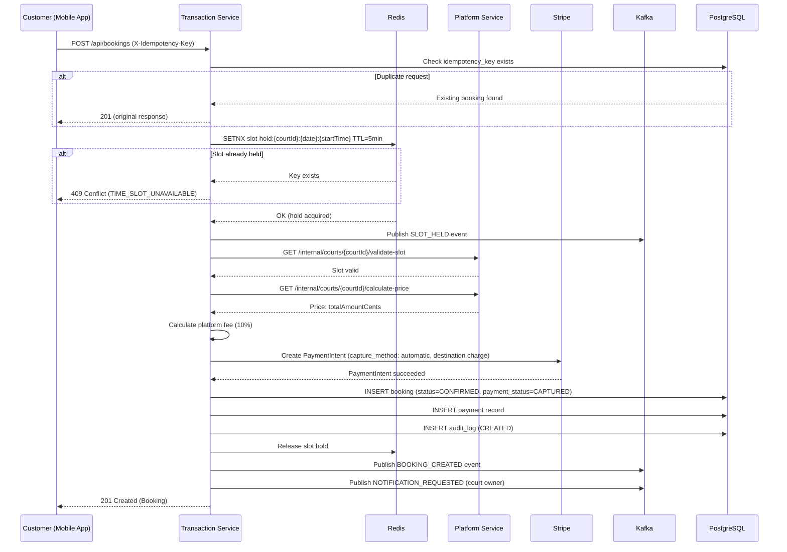
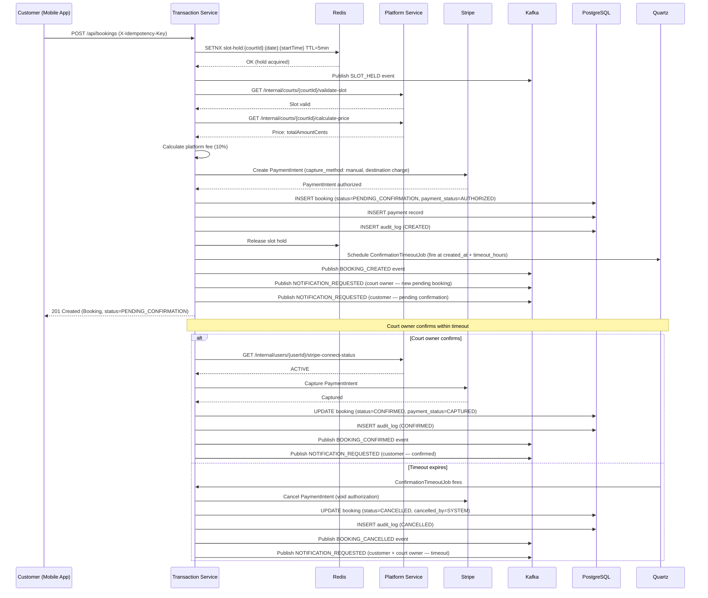
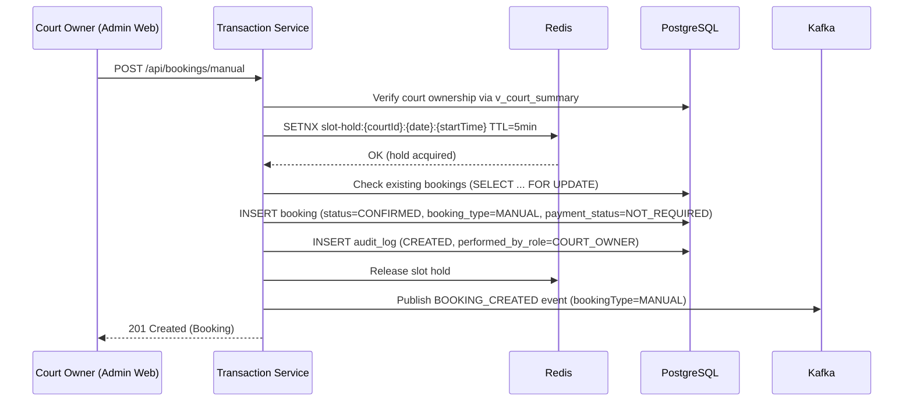
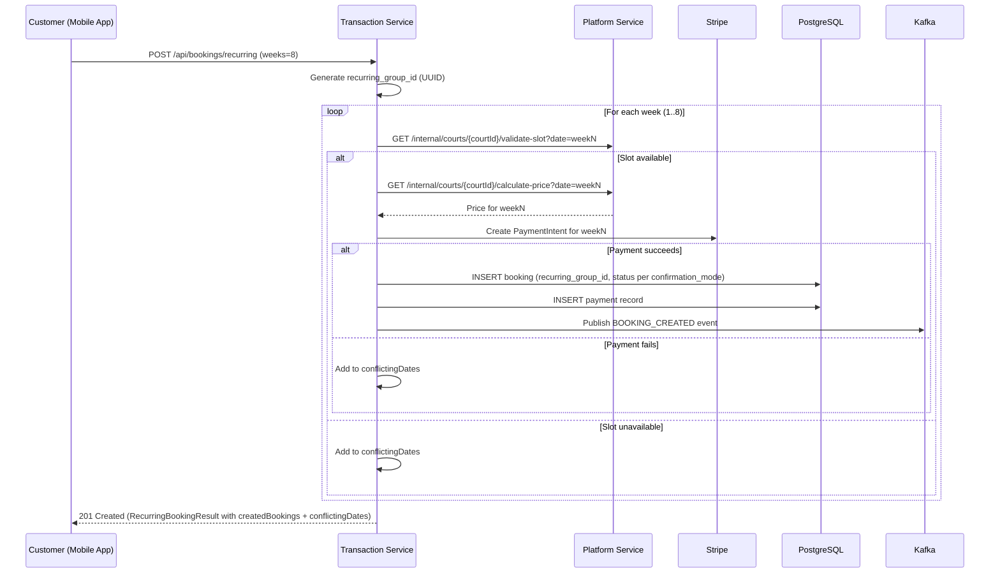
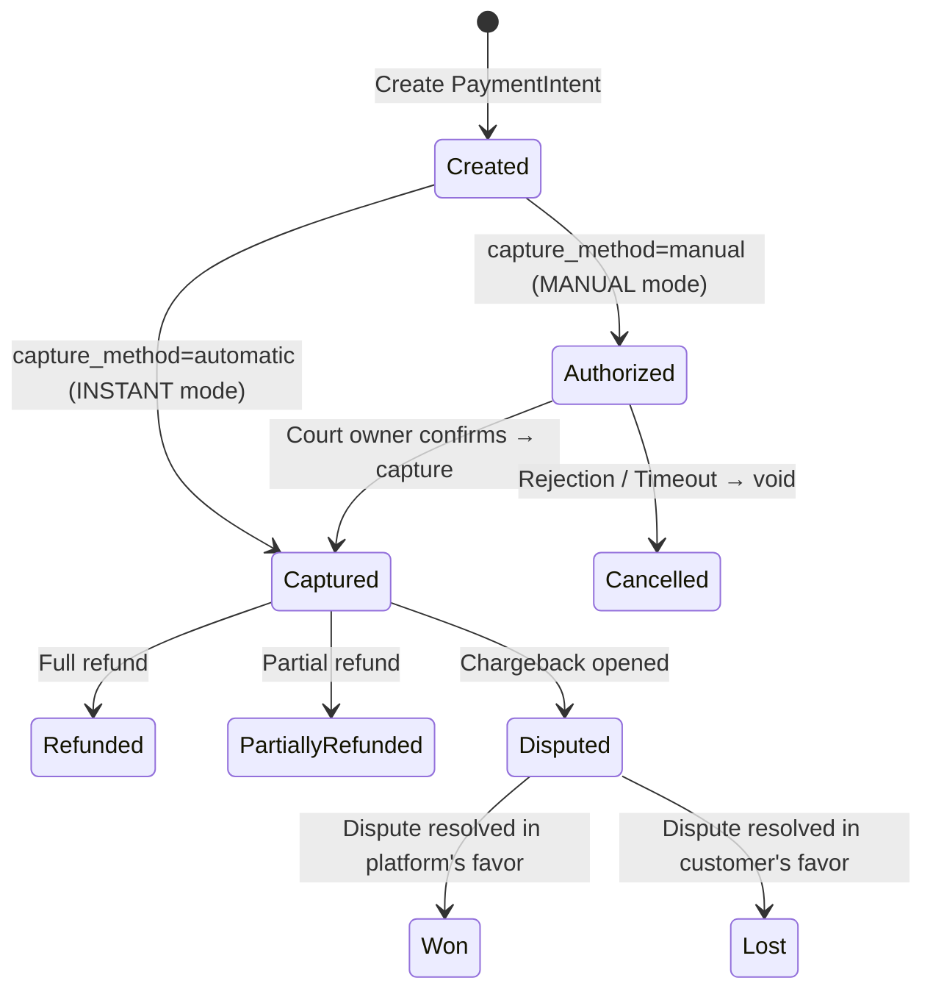
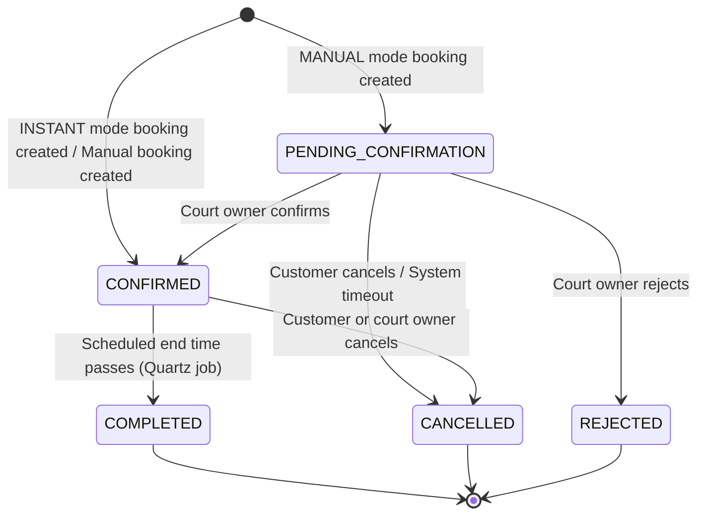
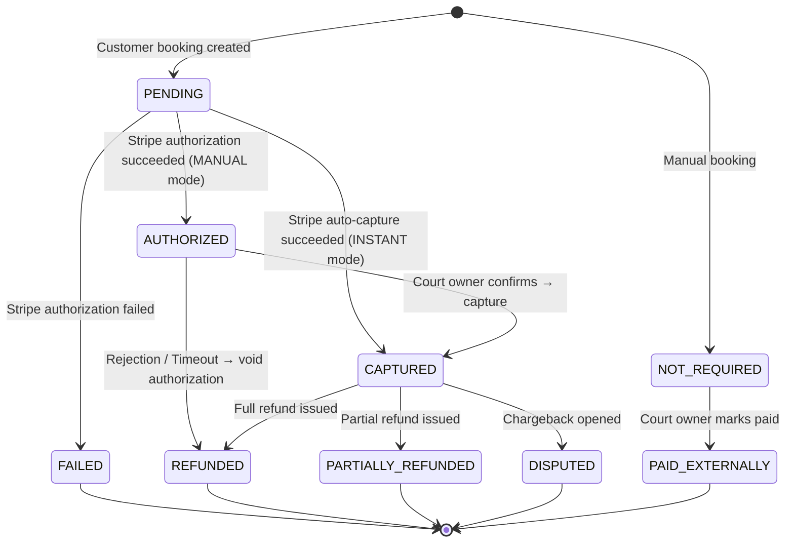
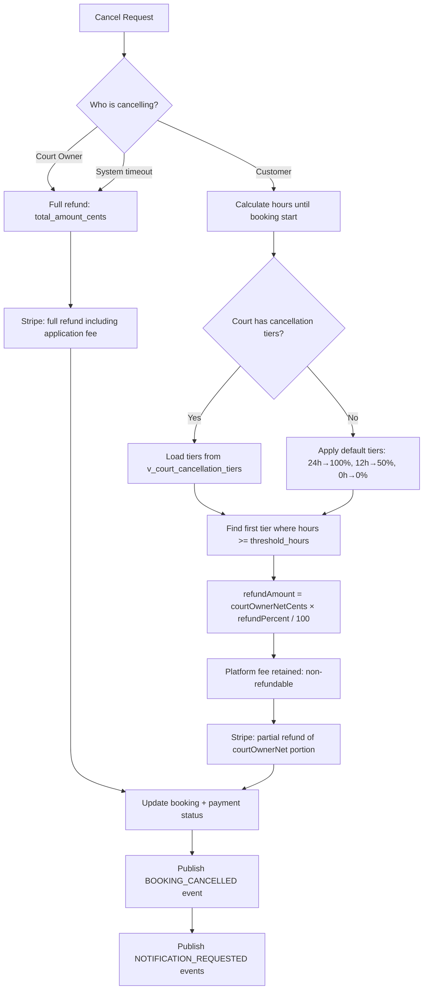
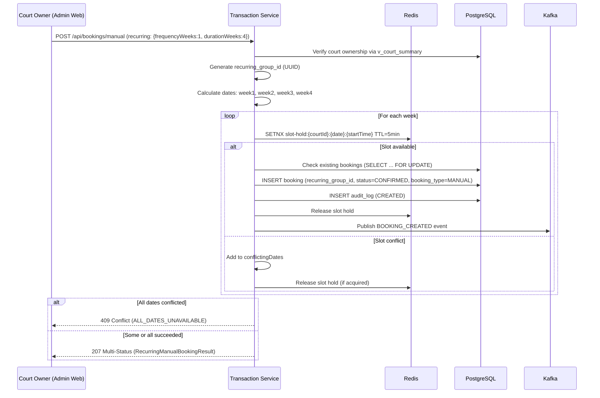
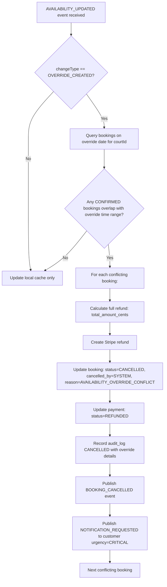

# Design Document — Phase 4: Booking & Payments

## Overview

Phase 4 implements the complete booking and payment subsystem for the Court Booking Platform, targeting the `court-booking-transaction-service`. This phase delivers the customer booking flow with atomic conflict prevention, Stripe Connect onboarding, payment processing with PaymentIntent authorize/capture/refund, manual booking creation, pending confirmation workflow, recurring bookings, booking modifications and cancellations with tiered refund policy, and comprehensive Kafka event publishing.

### Key Capabilities

1. **Customer Booking Creation**: Atomic slot hold → payment → confirm flow with Redis-based conflict prevention and database-level uniqueness constraints
2. **Stripe Connect Onboarding**: Express account creation, hosted onboarding flow, webhook-driven status sync, payout management
3. **Payment Processing**: Stripe PaymentIntent with authorize/capture for MANUAL mode, automatic capture for INSTANT mode, destination charges with application fees
4. **Manual Bookings**: Court owner walk-in/phone bookings without payment processing, with external payment tracking
5. **Pending Confirmation Workflow**: MANUAL mode with configurable timeout, Quartz-scheduled auto-cancellation, bulk confirm/reject
6. **Recurring Bookings**: Weekly pattern creation (2-12 weeks), partial creation on conflicts, advance scheduling via Quartz
7. **Booking Modification**: Time slot changes with automatic price adjustment (additional charge or partial refund)
8. **Cancellation with Tiered Refunds**: Court-specific cancellation tiers, default policy fallback, platform fee retention rules
9. **No-Show Flagging**: Court owner flags within 24-hour window, informational tracking only
10. **iCal Export**: RFC 5545 calendar feed for Google Calendar/Outlook integration
11. **Kafka Integration**: Publishing to `booking-events` and `notification-events`; consuming from `court-update-events`
12. **Stripe Webhook Handling**: Signature verification, idempotent processing, payment reconciliation
13. **Idempotency**: Client-generated keys for all state-changing operations, database + Redis deduplication
14. **Audit Trail**: Append-only `audit_logs` with full booking lifecycle tracking
15. **State Machine Enforcement**: Strict booking and payment status transitions at application layer

### Architecture Principles

Following the hexagonal architecture (Buckpal pattern) established in Phase 2/3:
- **Domain Layer**: Pure Java entities, value objects, and domain services with business logic (no framework imports)
- **Application Layer**: Use cases (incoming ports), outgoing port interfaces, and service implementations orchestrating domain operations
- **Adapter Layer**: Web controllers, persistence adapters, Kafka producers/consumers, Stripe client, Redis client

## Architecture

### High-Level Component Diagram

```
┌─────────────────────────────────────────────────────────────────────────────────┐
│                           Transaction Service                                    │
├─────────────────────────────────────────────────────────────────────────────────┤
│  ┌─────────────────────────────────────────────────────────────────────────┐   │
│  │                         Adapter Layer (In)                               │   │
│  │  ┌──────────────┐ ┌──────────────┐ ┌──────────────┐ ┌──────────────┐   │   │
│  │  │   Booking    │ │   Manual     │ │  Recurring   │ │   Payment    │   │   │
│  │  │ Controller   │ │  Booking     │ │  Booking     │ │ Controller   │   │   │
│  │  │              │ │ Controller   │ │ Controller   │ │              │   │   │
│  │  └──────────────┘ └──────────────┘ └──────────────┘ └──────────────┘   │   │
│  │  ┌──────────────┐ ┌──────────────┐ ┌──────────────┐ ┌──────────────┐   │   │
│  │  │  Stripe      │ │   Bulk       │ │   iCal       │ │   Stripe     │   │   │
│  │  │  Connect     │ │  Action      │ │  Export      │ │  Webhook     │   │   │
│  │  │ Controller   │ │ Controller   │ │ Controller   │ │ Controller   │   │   │
│  │  └──────────────┘ └──────────────┘ └──────────────┘ └──────────────┘   │   │
│  │  ┌──────────────────────────────────────────────────────────────────┐  │   │
│  │  │           CourtUpdateEventKafkaConsumer                          │  │   │
│  │  └──────────────────────────────────────────────────────────────────┘  │   │
│  └─────────────────────────────────────────────────────────────────────────┘   │
│                                      │                                          │
│  ┌─────────────────────────────────────────────────────────────────────────┐   │
│  │                        Application Layer                                 │   │
│  │  ┌──────────────┐ ┌──────────────┐ ┌──────────────┐ ┌──────────────┐   │   │
│  │  │ CreateBooking│ │ ManualBooking│ │  Recurring   │ │  Confirm     │   │   │
│  │  │ Service      │ │ Service      │ │ Booking Svc  │ │ Booking Svc  │   │   │
│  │  └──────────────┘ └──────────────┘ └──────────────┘ └──────────────┘   │   │
│  │  ┌──────────────┐ ┌──────────────┐ ┌──────────────┐ ┌──────────────┐   │   │
│  │  │  Cancel      │ │  Modify      │ │  Payment     │ │  Stripe      │   │   │
│  │  │ Booking Svc  │ │ Booking Svc  │ │  Method Svc  │ │ Connect Svc  │   │   │
│  │  └──────────────┘ └──────────────┘ └──────────────┘ └──────────────┘   │   │
│  │  ┌──────────────┐ ┌──────────────┐ ┌──────────────┐ ┌──────────────┐   │   │
│  │  │  NoShow      │ │  External    │ │  Booking     │ │  Bulk        │   │   │
│  │  │ Flagging Svc │ │ Payment Svc  │ │ Listing Svc  │ │ Action Svc   │   │   │
│  │  └──────────────┘ └──────────────┘ └──────────────┘ └──────────────┘   │   │
│  │  ┌──────────────┐ ┌──────────────┐ ┌──────────────┐                    │   │
│  │  │  iCal        │ │  Receipt     │ │  Webhook     │                    │   │
│  │  │ Export Svc   │ │  Service     │ │ Processing   │                    │   │
│  │  └──────────────┘ └──────────────┘ │  Service     │                    │   │
│  │                                    └──────────────┘                    │   │
│  └─────────────────────────────────────────────────────────────────────────┘   │
│                                      │                                          │
│  ┌─────────────────────────────────────────────────────────────────────────┐   │
│  │                          Domain Layer                                    │   │
│  │  ┌──────────────┐ ┌──────────────┐ ┌──────────────┐ ┌──────────────┐   │   │
│  │  │   Booking    │ │   Payment    │ │  AuditLog    │ │ Cancellation │   │   │
│  │  │  (Entity)    │ │  (Entity)    │ │   Entry      │ │  Calculator  │   │   │
│  │  └──────────────┘ └──────────────┘ └──────────────┘ └──────────────┘   │   │
│  │  ┌──────────────┐ ┌──────────────┐ ┌──────────────┐ ┌──────────────┐   │   │
│  │  │ PlatformFee  │ │  BookingSlot │ │ Recurring    │ │  BookingId   │   │   │
│  │  │ Calculator   │ │  (VO)        │ │ Pattern (VO) │ │  (VO)        │   │   │
│  │  └──────────────┘ └──────────────┘ └──────────────┘ └──────────────┘   │   │
│  └─────────────────────────────────────────────────────────────────────────┘   │
│                                      │                                          │
│  ┌─────────────────────────────────────────────────────────────────────────┐   │
│  │                        Adapter Layer (Out)                               │   │
│  │  ┌──────────────┐ ┌──────────────┐ ┌──────────────┐ ┌──────────────┐   │   │
│  │  │   Booking    │ │   Payment    │ │  AuditLog    │ │  Cross-Schema│   │   │
│  │  │ Persistence  │ │ Persistence  │ │ Persistence  │ │  View Adapter│   │   │
│  │  └──────────────┘ └──────────────┘ └──────────────┘ └──────────────┘   │   │
│  │  ┌──────────────┐ ┌──────────────┐ ┌──────────────┐ ┌──────────────┐   │   │
│  │  │   Stripe     │ │   Redis      │ │   Kafka      │ │  Platform    │   │   │
│  │  │   Adapter    │ │  Slot Hold   │ │  Publisher   │ │  Service     │   │   │
│  │  │              │ │  + Idempot.  │ │              │ │  Client      │   │   │
│  │  └──────────────┘ └──────────────┘ └──────────────┘ └──────────────┘   │   │
│  └─────────────────────────────────────────────────────────────────────────┘   │
│                                                                                 │
│  ┌─────────────────────────────────────────────────────────────────────────┐   │
│  │                        Scheduled Jobs (Quartz)                           │   │
│  │  ┌──────────────────────┐ ┌──────────────────────────────────────────┐  │   │
│  │  │ ConfirmationTimeout  │ │ BookingCompletionJob                     │  │   │
│  │  │ Job (per-booking)    │ │ (every 15 min — transitions CONFIRMED   │  │   │
│  │  │ Req 4.5: auto-cancel │ │  bookings past end time to COMPLETED)   │  │   │
│  │  │ pending bookings     │ │ Req 16.1                                 │  │   │
│  │  └──────────────────────┘ └──────────────────────────────────────────┘  │   │
│  │  ┌──────────────────────┐ ┌──────────────────────────────────────────┐  │   │
│  │  │ RecurringAdvance     │ │ PaymentReconciliationJob                 │  │   │
│  │  │ SchedulingJob        │ │ (every 15 min — reconciles payment      │  │   │
│  │  │ (weekly — creates    │ │  state between platform and Stripe)     │  │   │
│  │  │  future instances)   │ │ Req 19.7                                 │  │   │
│  │  │ Req 10.1             │ │                                          │  │   │
│  │  └──────────────────────┘ └──────────────────────────────────────────┘  │   │
│  │  ┌──────────────────────────────────────────────────────────────────┐  │   │
│  │  │ PendingConfirmationReminderJob (configurable intervals —        │  │   │
│  │  │ 1h, 4h, 12h after creation for PENDING_CONFIRMATION bookings)  │  │   │
│  │  │ Req 4.17                                                        │  │   │
│  │  └──────────────────────────────────────────────────────────────────┘  │   │
│  └─────────────────────────────────────────────────────────────────────────┘   │
└─────────────────────────────────────────────────────────────────────────────────┘
                                       │
        ┌──────────────────────────────┼──────────────────────────────┐
        │                              │                              │
        ▼                              ▼                              ▼
┌───────────────┐            ┌───────────────┐            ┌───────────────┐
│  PostgreSQL   │            │     Redis     │            │     Kafka     │
│  transaction  │            │  Slot holds   │            │  booking-     │
│  schema       │            │  Idempotency  │            │  events       │
│  + platform   │            │  Webhook dedup│            │  notification-│
│  views (RO)   │            │  Stripe cache │            │  events       │
└───────────────┘            └───────────────┘            └───────────────┘
        │                                                         │
        │                                                         ▼
┌───────────────┐                                        ┌───────────────┐
│  Platform     │                                        │  court-update-│
│  Service      │                                        │  events       │
│  (internal    │                                        │  (consumed)   │
│   APIs)       │                                        └───────────────┘
└───────────────┘
        │
        ▼
┌───────────────┐
│    Stripe     │
│  Connect API  │
│  PaymentIntent│
│  Webhooks     │
└───────────────┘
```


### Kafka Event Flow

```
┌─────────────────────────────────────────────────────────────────────────────┐
│                           Kafka Topics                                       │
├─────────────────────────────────────────────────────────────────────────────┤
│                                                                              │
│  booking-events (published)             notification-events (published)      │
│  ┌────────────────────┐                ┌────────────────────┐               │
│  │ BOOKING_CREATED    │                │ NOTIFICATION_      │               │
│  │ BOOKING_CONFIRMED  │                │ REQUESTED          │               │
│  │ BOOKING_CANCELLED  │                │                    │               │
│  │ BOOKING_MODIFIED   │                │ Types:             │               │
│  │ BOOKING_COMPLETED  │                │ BOOKING_CONFIRMED  │               │
│  │ SLOT_HELD          │                │ BOOKING_CANCELLED  │               │
│  │ SLOT_RELEASED      │                │ BOOKING_REJECTED   │               │
│  └────────────────────┘                │ BOOKING_PENDING_   │               │
│           │                            │   CONFIRMATION     │               │
│           ▼                            │ PAYMENT_RECEIVED   │               │
│  ┌────────────────────┐                │ PAYMENT_FAILED     │               │
│  │ Platform Service   │                │ PAYMENT_DISPUTE    │               │
│  │ (cache invalidation│                │ REFUND_COMPLETED   │               │
│  │  + WebSocket)      │                │ RECURRING_BOOKING_ │               │
│  └────────────────────┘                │   PRICE_CHANGED    │               │
│                                        │ PENDING_CONFIRM_   │               │
│  court-update-events (consumed)        │   ATION_REMINDER   │               │
│  ┌────────────────────┐                └────────────────────┘               │
│  │ COURT_UPDATED      │───► Transaction Service                             │
│  │ PRICING_UPDATED    │    (local cache update,                             │
│  │ AVAILABILITY_      │     recurring price recalc,                         │
│  │   UPDATED          │     Stripe Connect status)                          │
│  │ CANCELLATION_      │                                                     │
│  │   POLICY_UPDATED   │                                                     │
│  │ COURT_DELETED      │                                                     │
│  │ STRIPE_CONNECT_    │                                                     │
│  │   STATUS_CHANGED   │                                                     │
│  └────────────────────┘                                                     │
│                                                                              │
└─────────────────────────────────────────────────────────────────────────────┘
```

### Scheduled Jobs

| Job | Schedule | Description | Requirement |
|-----|----------|-------------|-------------|
| `ConfirmationTimeoutJob` | Per-booking (Quartz trigger at `created_at + confirmation_timeout_hours`) | Auto-cancels `PENDING_CONFIRMATION` bookings that exceed the court's timeout. Voids Stripe authorization, publishes `BOOKING_CANCELLED` and `NOTIFICATION_REQUESTED` events. Idempotent — no-op if already confirmed/cancelled. | Req 4.5, 4.14 |
| `BookingCompletionJob` | Every 15 minutes (cron: `0 0/15 * * * ?`) | Transitions `CONFIRMED` bookings past their scheduled end time to `COMPLETED`. Uses court timezone for comparison. Publishes `BOOKING_COMPLETED` events. | Req 16.1 |
| `RecurringAdvanceSchedulingJob` | Weekly (cron: `0 0 3 ? * MON`) | Creates new booking instances for active recurring groups to maintain a 4-week advance window. Validates availability, processes payments, skips conflicts. | Req 10.1, 10.2 |
| `PaymentReconciliationJob` | Every 15 minutes (cron: `0 7/15 * * * ?`) | Reconciles payment state between platform and Stripe. Captures/cancels orphaned authorizations, flags discrepancies for manual review. | Req 19.7 |
| `PendingConfirmationReminderJob` | Every hour (cron: `0 0 * * * ?`) | Sends reminder notifications to court owners for bookings still in `PENDING_CONFIRMATION` at 1h, 4h, and 12h after creation. | Req 4.17 |
| `AuthorizationHoldExpiryJob` | Every 6 hours (cron: `0 0 0/6 * * ?`) | Auto-cancels `PENDING_CONFIRMATION` bookings where the Stripe authorization hold is approaching expiry (24h before the 7-day window). Voids authorization, publishes cancellation and notification events. | Req 4.15 |
| `PaymentMethodExpiryTimeoutJob` | Per-booking (fire at capture_failure_time + 24h) | Auto-cancels pending bookings where the payment method expired during capture attempt and wasn't updated within 24 hours. | Req 5.18 |

All jobs use Quartz clustered mode (`isClustered=true`) with JDBC job store to ensure single-pod execution.

## Components and Interfaces

### Incoming Ports (Use Cases)

#### Stripe Connect Onboarding (Req 1)

```java
public interface InitiateStripeConnectOnboardingUseCase {
    StripeConnectOnboardingResult initiateOnboarding(InitiateOnboardingCommand command);
}

public interface GetStripeConnectStatusUseCase {
    StripeConnectStatusResult getStatus(UserId courtOwnerId);
}

public interface GetStripeConnectPayoutsUseCase {
    StripePayoutsResult getPayouts(UserId courtOwnerId);
}

public interface UpdatePayoutScheduleUseCase {
    PayoutScheduleResult updatePayoutSchedule(UpdatePayoutScheduleCommand command);
}
```

#### Customer Booking Creation (Req 2)

```java
public interface CreateBookingUseCase {
    BookingResult createBooking(CreateBookingCommand command);
}

public record CreateBookingCommand(
    UserId customerId,
    CourtId courtId,
    LocalDate date,
    LocalTime startTime,
    Integer durationMinutes,       // nullable — defaults to court duration
    Integer numberOfPeople,        // nullable — defaults to 1
    String paymentMethodId,
    String idempotencyKey
) {
    public CreateBookingCommand {
        requireNonNull(customerId);
        requireNonNull(courtId);
        requireNonNull(date);
        requireNonNull(startTime);
        requireNonNull(paymentMethodId);
        requireNonNull(idempotencyKey);
    }
}
```

#### Manual Booking Creation (Req 3)

```java
public interface CreateManualBookingUseCase {
    BookingResult createManualBooking(CreateManualBookingCommand command);
}

public record CreateManualBookingCommand(
    UserId courtOwnerId,
    CourtId courtId,
    LocalDate date,
    LocalTime startTime,
    Integer durationMinutes,
    String customerName,
    String customerPhone,
    String customerEmail,
    String notes,
    RecurringConfig recurring       // nullable
) {
    public CreateManualBookingCommand {
        requireNonNull(courtOwnerId);
        requireNonNull(courtId);
        requireNonNull(date);
        requireNonNull(startTime);
    }
}

public record RecurringConfig(int frequencyWeeks, int durationWeeks) {
    public RecurringConfig {
        if (frequencyWeeks != 1) throw new IllegalArgumentException("Only weekly frequency supported");
        if (durationWeeks < 1 || durationWeeks > 12) throw new IllegalArgumentException("Duration must be 1-12 weeks");
    }
}
```

#### Pending Confirmation Workflow (Req 4)

```java
public interface ConfirmBookingUseCase {
    BookingResult confirmBooking(ConfirmBookingCommand command);
}

public interface RejectBookingUseCase {
    CancellationResult rejectBooking(RejectBookingCommand command);
}

public interface ListPendingBookingsQuery {
    Page<BookingResult> listPendingBookings(UserId courtOwnerId, CourtId courtId, Pageable pageable);
}
```

#### Payment Processing (Req 5)

```java
public interface ListPaymentMethodsUseCase {
    List<PaymentMethodResult> listPaymentMethods(UserId customerId);
}

public interface AddPaymentMethodUseCase {
    PaymentMethodResult addPaymentMethod(AddPaymentMethodCommand command);
}

public interface CreateSetupIntentUseCase {
    SetupIntentResult createSetupIntent(UserId customerId);
}

public interface GetReceiptUseCase {
    ReceiptResult getReceipt(BookingId bookingId, UserId requesterId);
}

public interface GetRefundStatusQuery {
    RefundStatusResult getRefundStatus(PaymentId paymentId, UserId requesterId);
}

public interface GetDisputeDetailsQuery {
    DisputeDetailResult getDisputeDetails(PaymentId paymentId, UserId requesterId);
}

public interface SubmitDisputeEvidenceUseCase {
    DisputeEvidenceResult submitEvidence(SubmitDisputeEvidenceCommand command);
}
```

#### Booking Modification (Req 7)

```java
public interface ModifyBookingUseCase {
    BookingModificationResult modifyBooking(ModifyBookingCommand command);
}

public record ModifyBookingCommand(
    BookingId bookingId,
    UserId customerId,
    LocalDate newDate,
    LocalTime newStartTime
) {
    public ModifyBookingCommand {
        requireNonNull(bookingId);
        requireNonNull(customerId);
        requireNonNull(newDate);
        requireNonNull(newStartTime);
    }
}
```

#### Booking Cancellation (Req 8)

```java
public interface CancelBookingUseCase {
    CancellationResult cancelBooking(CancelBookingCommand command);
}

public record CancelBookingCommand(
    BookingId bookingId,
    UserId cancelledBy,
    String cancelledByRole,    // CUSTOMER or COURT_OWNER
    String reason,
    String idempotencyKey
) {
    public CancelBookingCommand {
        requireNonNull(bookingId);
        requireNonNull(cancelledBy);
        requireNonNull(cancelledByRole);
        requireNonNull(idempotencyKey);
    }
}
```

#### Recurring Bookings (Req 9)

```java
public interface CreateRecurringBookingUseCase {
    RecurringBookingResult createRecurringBooking(CreateRecurringBookingCommand command);
}

public interface GetRecurringBookingGroupQuery {
    RecurringBookingGroupResult getRecurringGroup(UUID recurringGroupId, UserId requesterId);
}
```

#### No-Show Flagging (Req 11)

```java
public interface FlagNoShowUseCase {
    NoShowResult flagNoShow(FlagNoShowCommand command);
}
```

#### External Payment Tracking (Req 12)

```java
public interface MarkBookingPaidExternallyUseCase {
    ExternalPaymentResult markPaidExternally(MarkPaidExternallyCommand command);
}
```

#### Booking Listing (Req 13)

```java
public interface ListBookingsQuery {
    Page<BookingResult> listBookings(ListBookingsFilter filter, Pageable pageable);
}

public interface GetBookingDetailQuery {
    BookingDetailResult getBookingDetail(BookingId bookingId, UserId requesterId);
}
```

#### Bulk Operations (Req 14)

```java
public interface BulkBookingActionUseCase {
    BulkActionResult bulkAction(BulkBookingActionCommand command);
}
```

#### iCal Export (Req 15)

```java
public interface ExportBookingCalendarUseCase {
    String exportICalendar(ExportCalendarCommand command);
}
```

#### Webhook Processing (Req 19)

```java
public interface ProcessStripeWebhookUseCase {
    void processWebhook(String payload, String signatureHeader);
}
```

### Outgoing Ports (SPIs)

```java
// ── Persistence Ports ──

public interface LoadBookingPort {
    Optional<Booking> loadById(BookingId id);
    Optional<Booking> loadByIdempotencyKey(String idempotencyKey);
    List<Booking> loadByCourtAndDate(CourtId courtId, LocalDate date);
    Page<Booking> loadByUserId(UserId userId, BookingFilter filter, Pageable pageable);
    Page<Booking> loadByCourtOwnerId(UserId courtOwnerId, BookingFilter filter, Pageable pageable);
    Page<Booking> loadPendingByCourtOwnerId(UserId courtOwnerId, CourtId courtId, Pageable pageable);
    List<Booking> loadConfirmedPastEndTime(Instant now);
    List<Booking> loadByRecurringGroupId(UUID recurringGroupId);
    List<Booking> loadRecurringForPriceUpdate(CourtId courtId, LocalDate effectiveFrom);
}

public interface SaveBookingPort {
    Booking save(Booking booking);
    List<Booking> saveAll(List<Booking> bookings);
}

public interface LoadPaymentPort {
    Optional<Payment> loadById(PaymentId id);
    Optional<Payment> loadByStripePaymentIntentId(String stripePaymentIntentId);
    Optional<Payment> loadByBookingId(BookingId bookingId);
}

public interface SavePaymentPort {
    Payment save(Payment payment);
}

public interface AuditLogPort {
    void log(BookingAuditLogEntry entry);
    List<BookingAuditLogEntry> loadByBookingId(BookingId bookingId);
}

// ── Cross-Schema View Ports (read-only) ──

public interface CourtSummaryPort {
    Optional<CourtSummary> loadById(CourtId courtId);
    List<CourtSummary> loadByOwnerId(UserId ownerId);
}

public interface UserBasicPort {
    Optional<UserBasic> loadById(UserId userId);
}

public interface CancellationTierPort {
    List<CancellationTierView> loadByCourtId(CourtId courtId);
}

// ── External Service Ports ──

public interface StripePaymentPort {
    PaymentIntentResult createPaymentIntent(CreatePaymentIntentRequest request);
    PaymentIntentResult capturePaymentIntent(String paymentIntentId);
    PaymentIntentResult cancelPaymentIntent(String paymentIntentId);
    RefundResult createRefund(CreateRefundRequest request);
    List<PaymentMethodInfo> listPaymentMethods(String stripeCustomerId);
    SetupIntentResult createSetupIntent(String stripeCustomerId);
    void attachPaymentMethod(String stripeCustomerId, String setupIntentId);
    String createStripeCustomer(String email, String name);
}

public interface StripeConnectPort {
    StripeAccountResult createExpressAccount(CreateExpressAccountRequest request);
    String createAccountLink(String accountId, String returnUrl, String refreshUrl);
    StripeAccountStatus getAccountStatus(String accountId);
    StripePayoutsInfo getPayouts(String accountId);
    void updatePayoutSchedule(String accountId, PayoutScheduleConfig config);
    boolean verifyWebhookSignature(String payload, String signatureHeader, String secret);
}

public interface PlatformServicePort {
    SlotValidationResult validateSlot(CourtId courtId, LocalDate date, LocalTime startTime, LocalTime endTime);
    PriceCalculationResult calculatePrice(CourtId courtId, LocalDate date, LocalTime startTime, LocalTime endTime);
    StripeConnectStatusResult getStripeConnectStatus(UserId userId);
    void updateStripeConnectStatus(UserId userId, String status, String stripeAccountId);
    void updateStripeCustomerId(UserId userId, String stripeCustomerId);
}

// ── Caching / Locking Ports ──

public interface SlotHoldPort {
    boolean acquireHold(CourtId courtId, LocalDate date, LocalTime startTime, UserId userId, Duration ttl);
    void releaseHold(CourtId courtId, LocalDate date, LocalTime startTime);
    boolean isHeld(CourtId courtId, LocalDate date, LocalTime startTime);
}

public interface IdempotencyPort {
    Optional<String> getResponse(String operationKey);
    void storeResponse(String operationKey, String response, Duration ttl);
}

public interface WebhookDeduplicationPort {
    boolean isProcessed(String stripeEventId);
    void markProcessed(String stripeEventId, Duration ttl);
}

// ── Event Publishing Ports ──

public interface BookingEventPublisherPort {
    void publishBookingCreated(BookingCreatedEvent event);
    void publishBookingConfirmed(BookingConfirmedEvent event);
    void publishBookingCancelled(BookingCancelledEvent event);
    void publishBookingModified(BookingModifiedEvent event);
    void publishBookingCompleted(BookingCompletedEvent event);
    void publishSlotHeld(SlotHeldEvent event);
    void publishSlotReleased(SlotReleasedEvent event);
}

public interface NotificationEventPublisherPort {
    void publishNotificationRequested(NotificationRequestedEvent event);
}
```

### Web Controllers

| Controller | Endpoints | Description |
|------------|-----------|-------------|
| `BookingController` | `POST /api/bookings`, `GET /api/bookings`, `GET /api/bookings/{id}`, `PUT /api/bookings/{id}/modify`, `POST /api/bookings/{id}/cancel`, `POST /api/bookings/{id}/confirm`, `POST /api/bookings/{id}/reject`, `GET /api/bookings/pending`, `POST /api/bookings/{id}/no-show`, `POST /api/bookings/{id}/mark-paid` | Core booking CRUD + lifecycle |
| `ManualBookingController` | `POST /api/bookings/manual` | Manual booking creation |
| `RecurringBookingController` | `POST /api/bookings/recurring`, `GET /api/bookings/recurring/{recurringGroupId}` | Recurring booking management |
| `BulkBookingController` | `POST /api/bookings/bulk-action` | Bulk confirm/reject |
| `BookingCalendarController` | `GET /api/bookings/calendar/ical` | iCal export |
| `PaymentController` | `GET /api/payments/methods`, `POST /api/payments/methods`, `POST /api/payments/setup-intent`, `GET /api/payments/{id}/refund`, `GET /api/payments/{id}/dispute`, `POST /api/payments/{id}/dispute/evidence` | Payment method management + refund/dispute |
| `StripeConnectController` | `POST /api/payments/stripe-connect/onboard`, `GET /api/payments/stripe-connect/status`, `GET /api/payments/stripe-connect/payouts`, `PUT /api/payments/stripe-connect/payout-schedule` | Stripe Connect onboarding + payouts |
| `StripeWebhookController` | `POST /api/webhooks/stripe` | Stripe webhook handler (no JWT auth) |


## Data Models

### Domain Entities

#### Booking (Rich Domain Entity)

```java
public class Booking {
    private final BookingId id;
    private final CourtId courtId;
    private final UserId userId;                // null for manual bookings without linked customer
    private final UserId courtOwnerId;
    private final String idempotencyKey;
    private LocalDate date;
    private LocalTime startTime;
    private LocalTime endTime;
    private int durationMinutes;
    private BookingStatus status;
    private BookingType bookingType;            // CUSTOMER, MANUAL
    private ConfirmationMode confirmationMode;  // snapshot from court at creation
    private Integer totalAmountCents;           // null for manual bookings
    private Integer platformFeeCents;
    private Integer courtOwnerNetCents;
    private int discountCents;
    private PaymentStatus paymentStatus;
    private String stripePaymentIntentId;
    private boolean paidExternally;
    private String externalPaymentMethod;
    private String externalPaymentNotes;
    private boolean noShow;
    private Instant noShowFlaggedAt;
    private String customerName;               // manual bookings
    private String customerPhone;              // manual bookings
    private String notes;
    private UUID recurringGroupId;
    private RecurringPattern recurringPattern;
    private String cancelledBy;                // CUSTOMER, COURT_OWNER, SYSTEM
    private String cancellationReason;
    private Instant cancelledAt;
    private Integer refundAmountCents;
    private Instant confirmedAt;
    private Instant createdAt;
    private Instant updatedAt;

    // ── Business Methods ──

    public void confirm(UserId confirmedBy) {
        assertStatus(BookingStatus.PENDING_CONFIRMATION, "confirm");
        this.status = BookingStatus.CONFIRMED;
        this.confirmedAt = Instant.now();
        this.updatedAt = Instant.now();
    }

    public void reject(UserId rejectedBy, String reason) {
        assertStatus(BookingStatus.PENDING_CONFIRMATION, "reject");
        this.status = BookingStatus.REJECTED;
        this.cancelledBy = "COURT_OWNER";
        this.cancellationReason = reason;
        this.cancelledAt = Instant.now();
        this.updatedAt = Instant.now();
    }

    public void cancel(String cancelledByRole, String reason) {
        if (status != BookingStatus.CONFIRMED && status != BookingStatus.PENDING_CONFIRMATION) {
            throw new InvalidStatusTransitionException(status, "cancel");
        }
        this.status = BookingStatus.CANCELLED;
        this.cancelledBy = cancelledByRole;
        this.cancellationReason = reason;
        this.cancelledAt = Instant.now();
        this.updatedAt = Instant.now();
    }

    public void complete() {
        assertStatus(BookingStatus.CONFIRMED, "complete");
        this.status = BookingStatus.COMPLETED;
        this.updatedAt = Instant.now();
    }

    public void modifySlot(LocalDate newDate, LocalTime newStartTime, LocalTime newEndTime, int newAmountCents) {
        assertStatus(BookingStatus.CONFIRMED, "modify");
        if (bookingType != BookingType.CUSTOMER) {
            throw new IllegalStateException("Only customer bookings can be modified");
        }
        this.date = newDate;
        this.startTime = newStartTime;
        this.endTime = newEndTime;
        this.totalAmountCents = newAmountCents;
        this.platformFeeCents = PlatformFeeCalculator.calculate(newAmountCents);
        this.courtOwnerNetCents = newAmountCents - this.platformFeeCents;
        this.updatedAt = Instant.now();
    }

    public void flagNoShow(String notes) {
        assertStatus(BookingStatus.COMPLETED, "flag no-show");
        this.noShow = true;
        this.noShowFlaggedAt = Instant.now();
        this.updatedAt = Instant.now();
    }

    public void markPaidExternally(String paymentMethod, String notes) {
        if (bookingType != BookingType.MANUAL) {
            throw new IllegalStateException("Only manual bookings can be marked as paid externally");
        }
        this.paidExternally = true;
        this.externalPaymentMethod = paymentMethod;
        this.externalPaymentNotes = notes;
        this.paymentStatus = PaymentStatus.PAID_EXTERNALLY;
        this.updatedAt = Instant.now();
    }

    public boolean isModifiable() {
        return status == BookingStatus.CONFIRMED && bookingType == BookingType.CUSTOMER;
    }

    public boolean isCancellable() {
        return status == BookingStatus.CONFIRMED || status == BookingStatus.PENDING_CONFIRMATION;
    }

    private void assertStatus(BookingStatus expected, String action) {
        if (status != expected) {
            throw new InvalidStatusTransitionException(status, action);
        }
    }
}
```

#### Payment (Domain Entity)

```java
public class Payment {
    private final PaymentId id;
    private final BookingId bookingId;
    private final UserId userId;
    private int amountCents;
    private int platformFeeCents;
    private int courtOwnerNetCents;
    private String currency;                    // EUR
    private PaymentStatus status;
    private String stripePaymentIntentId;
    private String stripeChargeId;
    private String stripeTransferId;
    private String stripeRefundId;
    private String paymentMethodType;           // CARD, APPLE_PAY, GOOGLE_PAY
    private Integer refundAmountCents;
    private String refundReason;
    private Instant refundedAt;
    private String failureReason;
    private Instant createdAt;
    private Instant updatedAt;

    // ── Status Transition Methods ──

    public void authorize() {
        assertTransition(PaymentStatus.PENDING, PaymentStatus.AUTHORIZED);
        this.status = PaymentStatus.AUTHORIZED;
        this.updatedAt = Instant.now();
    }

    public void capture() {
        assertTransition(PaymentStatus.AUTHORIZED, PaymentStatus.CAPTURED);
        this.status = PaymentStatus.CAPTURED;
        this.updatedAt = Instant.now();
    }

    public void fail(String reason) {
        this.status = PaymentStatus.FAILED;
        this.failureReason = reason;
        this.updatedAt = Instant.now();
    }

    public void refund(int refundAmount, String reason) {
        if (status != PaymentStatus.CAPTURED && status != PaymentStatus.AUTHORIZED) {
            throw new InvalidPaymentStatusTransitionException(status, "refund");
        }
        this.refundAmountCents = refundAmount;
        this.refundReason = reason;
        this.refundedAt = Instant.now();
        this.status = (refundAmount >= amountCents) ? PaymentStatus.REFUNDED : PaymentStatus.PARTIALLY_REFUNDED;
        this.updatedAt = Instant.now();
    }

    public void dispute() {
        assertTransition(PaymentStatus.CAPTURED, PaymentStatus.DISPUTED);
        this.status = PaymentStatus.DISPUTED;
        this.updatedAt = Instant.now();
    }

    private void assertTransition(PaymentStatus expected, PaymentStatus target) {
        if (status != expected) {
            throw new InvalidPaymentStatusTransitionException(status, target.name());
        }
    }
}
```

#### BookingAuditLogEntry (Domain Entity)

```java
public class BookingAuditLogEntry {
    private final UUID id;
    private final BookingId bookingId;
    private final String action;               // CREATED, CONFIRMED, REJECTED, CANCELLED, MODIFIED, etc.
    private final UUID performedBy;
    private final String performedByRole;      // CUSTOMER, COURT_OWNER, SYSTEM
    private final Map<String, Object> details; // JSONB — before/after, refund details, etc.
    private final Instant createdAt;

    // Append-only: no setters, no update methods
}
```

### Value Objects

```java
public record BookingId(UUID value) {
    public BookingId {
        requireNonNull(value, "Booking ID cannot be null");
    }
}

public record PaymentId(UUID value) {
    public PaymentId {
        requireNonNull(value, "Payment ID cannot be null");
    }
}

public record BookingSlot(
    CourtId courtId,
    LocalDate date,
    LocalTime startTime,
    LocalTime endTime,
    int durationMinutes
) {
    public BookingSlot {
        requireNonNull(courtId);
        requireNonNull(date);
        requireNonNull(startTime);
        requireNonNull(endTime);
        if (!endTime.isAfter(startTime)) {
            throw new IllegalArgumentException("End time must be after start time");
        }
        if (durationMinutes <= 0) {
            throw new IllegalArgumentException("Duration must be positive");
        }
    }
}

public record RecurringPattern(
    DayOfWeek dayOfWeek,
    LocalTime startTime,
    LocalTime endTime,
    LocalDate startDate,
    LocalDate endDate,
    int weeksAhead
) {
    public RecurringPattern {
        requireNonNull(dayOfWeek);
        requireNonNull(startTime);
        requireNonNull(endTime);
        requireNonNull(startDate);
        requireNonNull(endDate);
        if (weeksAhead < 2 || weeksAhead > 12) {
            throw new IllegalArgumentException("Weeks must be between 2 and 12");
        }
    }
}

public record CourtSummary(
    CourtId courtId,
    UserId ownerId,
    String nameEl,
    String nameEn,
    String courtType,
    String locationType,
    String address,                    // needed for iCal LOCATION (Req 15.2) and booking detail
    ZoneId timezone,
    int basePriceCents,
    int durationMinutes,
    int maxCapacity,
    ConfirmationMode confirmationMode,
    int confirmationTimeoutHours,
    boolean waitlistEnabled,
    int version
) {}

public record BookingModificationResult(
    BookingId bookingId,
    LocalDate previousDate,
    LocalTime previousStartTime,
    LocalDate newDate,
    LocalTime newStartTime,
    LocalTime newEndTime,
    int previousAmountCents,
    int newAmountCents,
    int priceDifferenceCents,          // positive = customer pays more, negative = refund
    boolean additionalPaymentRequired, // true when priceDifferenceCents > 0
    String paymentIntentClientSecret,  // non-null when additionalPaymentRequired = true
    Integer refundAmountCents,         // non-null when priceDifferenceCents < 0
    String refundStatus                // "PROCESSING" when refund initiated
) {}

public record UserBasic(
    UserId userId,
    String email,
    String name,
    String phone,
    String role,
    String language,
    String stripeConnectAccountId,
    String stripeConnectStatus,
    String stripeCustomerId,
    boolean vatRegistered,
    String vatNumber,
    String status
) {}

public record CancellationTierView(
    CourtId courtId,
    int thresholdHours,
    int refundPercent,
    int sortOrder
) {}
```

### Domain Services

#### PlatformFeeCalculator

```java
/**
 * Calculates the platform fee (10% commission) on booking amounts.
 * Pure domain service — no framework dependencies.
 */
public class PlatformFeeCalculator {

    private static final BigDecimal FEE_RATE = new BigDecimal("0.10");

    /**
     * Calculates platform fee as 10% of total amount, rounded half-up.
     * Invariant: platformFee + courtOwnerNet = totalAmount
     */
    public static int calculate(int totalAmountCents) {
        return FEE_RATE.multiply(BigDecimal.valueOf(totalAmountCents))
                       .setScale(0, RoundingMode.HALF_UP)
                       .intValue();
    }
}
```

#### CancellationRefundCalculator

```java
/**
 * Determines refund amount based on cancellation tiers and cancellation context.
 * Pure domain service.
 */
public class CancellationRefundCalculator {

    private static final List<CancellationTierView> DEFAULT_TIERS = List.of(
        new CancellationTierView(null, 24, 100, 1),
        new CancellationTierView(null, 12, 50, 2),
        new CancellationTierView(null, 0, 0, 3)
    );

    /**
     * Calculates refund for customer-initiated cancellation.
     * Platform fee is non-refundable. Refund = courtOwnerNetCents * refundPercent / 100.
     */
    public static CancellationRefund calculateCustomerCancellation(
            Booking booking, List<CancellationTierView> tiers, ZoneId courtTimezone) {
        List<CancellationTierView> effectiveTiers = tiers.isEmpty() ? DEFAULT_TIERS : tiers;
        long hoursUntilBooking = calculateHoursUntilBooking(booking, courtTimezone);
        int refundPercent = determineRefundPercent(effectiveTiers, hoursUntilBooking);
        int refundAmount = (int) Math.round(
            (double) booking.getCourtOwnerNetCents() * refundPercent / 100.0
        );
        return new CancellationRefund(refundAmount, refundPercent, booking.getPlatformFeeCents());
    }

    /**
     * Court-owner-initiated cancellation: full refund including platform fee.
     */
    public static CancellationRefund calculateOwnerCancellation(Booking booking) {
        return new CancellationRefund(booking.getTotalAmountCents(), 100, 0);
    }

    private static int determineRefundPercent(List<CancellationTierView> tiers, long hoursUntilBooking) {
        return tiers.stream()
            .sorted(Comparator.comparingInt(CancellationTierView::thresholdHours).reversed())
            .filter(tier -> hoursUntilBooking >= tier.thresholdHours())
            .findFirst()
            .map(CancellationTierView::refundPercent)
            .orElse(0);
    }

    private static long calculateHoursUntilBooking(Booking booking, ZoneId courtTimezone) {
        ZonedDateTime bookingStart = ZonedDateTime.of(booking.getDate(), booking.getStartTime(), courtTimezone);
        return Duration.between(ZonedDateTime.now(courtTimezone), bookingStart).toHours();
    }
}

public record CancellationRefund(int refundAmountCents, int refundPercent, int platformFeeRetainedCents) {}
```

### Enums

```java
public enum BookingStatus {
    PENDING_CONFIRMATION, CONFIRMED, CANCELLED, COMPLETED, REJECTED
}

public enum BookingType { CUSTOMER, MANUAL }

public enum PaymentStatus {
    NOT_REQUIRED, PENDING, AUTHORIZED, CAPTURED,
    REFUNDED, PARTIALLY_REFUNDED, FAILED, PAID_EXTERNALLY, DISPUTED
}

public enum ConfirmationMode { INSTANT, MANUAL }
```


## Booking Flow Sequence Diagrams

### Customer Booking — INSTANT Mode



### Customer Booking — MANUAL Mode



### Manual Booking



### Recurring Booking



## Payment Flow

### Stripe PaymentIntent Lifecycle



### Destination Charge with Application Fee

```
Customer pays €25.00 (2500 cents)
├── Platform fee (10%): €2.50 (250 cents) → retained by platform via application_fee_amount
└── Court owner net: €22.50 (2250 cents) → transferred to court owner's Stripe Connect account

Stripe PaymentIntent parameters:
  amount: 2500
  currency: "eur"
  capture_method: "automatic" | "manual"
  transfer_data:
    destination: "acct_courtOwnerStripeId"
  application_fee_amount: 250
  payment_method: "pm_customerPaymentMethod"
  customer: "cus_customerStripeId"
```

## State Machines

### Booking Status Transitions



### Payment Status Transitions



## Cancellation Flow with Tiered Refund Calculation



**Refund Examples:**

| Scenario | Total | Platform Fee | Court Owner Net | Hours Before | Tier | Refund |
|----------|-------|-------------|-----------------|-------------|------|--------|
| Customer cancels 48h before | €25.00 | €2.50 | €22.50 | 48 | 100% | €22.50 |
| Customer cancels 18h before | €25.00 | €2.50 | €22.50 | 18 | 50% | €11.25 |
| Customer cancels 6h before | €25.00 | €2.50 | €22.50 | 6 | 0% | €0.00 |
| Court owner cancels | €25.00 | €2.50 | €22.50 | any | N/A | €25.00 (full) |
| System timeout | €25.00 | €2.50 | €22.50 | N/A | N/A | €25.00 (full) |

## Scheduled Jobs Detail

### ConfirmationTimeoutJob

- **Trigger**: Per-booking Quartz SimpleTrigger, fire time = `booking.created_at + court.confirmation_timeout_hours`
- **Idempotent**: Checks booking status before acting — no-op if already CONFIRMED, CANCELLED, or REJECTED
- **Actions**: Void Stripe authorization, update booking status to CANCELLED, set `cancelled_by = 'SYSTEM'`, publish events
- **Safety**: Validates timeout ≤ 144 hours (Stripe's 7-day hold minus 24h buffer)

### BookingCompletionJob

- **Trigger**: Cron `0 0/15 * * * ?` (every 15 minutes)
- **Query**: `SELECT * FROM bookings WHERE status = 'CONFIRMED' AND (date + end_time) < NOW() AT TIME ZONE court_timezone`
- **Actions**: Transition to COMPLETED, record audit log, publish BOOKING_COMPLETED event
- **Timezone**: Uses `v_court_summary.timezone` for each booking's court

### RecurringAdvanceSchedulingJob

- **Trigger**: Cron `0 0 3 ? * MON` (weekly, Monday 3 AM)
- **Query**: Active recurring groups where latest instance date < (today + 4 weeks)
- **Actions**: Create new instances, validate availability, process payments, skip conflicts
- **Notifications**: Publishes price change notifications if pricing has changed since original booking

### PaymentReconciliationJob

- **Trigger**: Cron `0 7/15 * * * ?` (every 15 minutes, offset by 7 min)
- **Checks**:
  1. `payment_status = 'AUTHORIZED'` older than 30 min → capture or cancel based on booking status
  2. Stripe PaymentIntents in `requires_capture` with no matching booking → cancel
  3. `status = 'CONFIRMED'` with `payment_status = 'PENDING'` → flag for manual review
- **Audit**: All reconciliation actions logged to `audit_logs`

### PendingConfirmationReminderJob

- **Trigger**: Cron `0 0 * * * ?` (hourly)
- **Query**: Bookings with `status = 'PENDING_CONFIRMATION'` at 1h, 4h, 12h after creation
- **Actions**: Publish `NOTIFICATION_REQUESTED` events with type `PENDING_CONFIRMATION_REMINDER` to court owner

## Kafka Integration

### Publishing (booking-events topic)

Partition key: `courtId`. All events wrapped in the standard EventEnvelope with `eventId`, `eventType`, `source: "transaction-service"`, `timestamp`, `traceId`, `spanId`.

| Event | Trigger | Key Payload Fields |
|-------|---------|-------------------|
| `BOOKING_CREATED` | Booking created (customer or manual) | bookingId, courtId, userId, date, startTime, endTime, status, bookingType, totalAmountCents, recurringGroupId |
| `BOOKING_CONFIRMED` | Court owner confirms pending booking | bookingId, courtId, confirmedBy, capturedAmountCents, platformFeeCents, courtOwnerNetCents |
| `BOOKING_CANCELLED` | Any cancellation | bookingId, courtId, cancelledBy, cancellationReason, refundAmountCents, refundPercentage, waitlistEnabled |
| `BOOKING_MODIFIED` | Time slot changed | bookingId, courtId, previousDate, previousStartTime, newDate, newStartTime, priceDifferenceCents |
| `BOOKING_COMPLETED` | End time passes (Quartz job) | bookingId, courtId, bookingType, totalAmountCents, noShow |
| `SLOT_HELD` | Slot hold acquired | courtId, date, startTime, endTime, holdExpiresAt |
| `SLOT_RELEASED` | Slot hold released | courtId, date, startTime, endTime, releaseReason |

### Consuming (court-update-events topic)

Consumer group: `transaction-service-court-update-consumer`. Config: `auto.offset.reset=latest`.

| Event | Action |
|-------|--------|
| `COURT_UPDATED` | Update local court config cache (confirmation mode, duration, capacity) |
| `PRICING_UPDATED` | Update pricing cache; recalculate prices for future unconfirmed recurring instances; notify affected customers |
| `AVAILABILITY_UPDATED` | Auto-cancel bookings conflicting with new overrides (full refund, cancelled_by=SYSTEM) |
| `CANCELLATION_POLICY_UPDATED` | Update local cancellation tier cache |
| `COURT_DELETED` | Remove from local cache; prevent new bookings |
| `STRIPE_CONNECT_STATUS_CHANGED` | Update Stripe Connect status cache; block captures if RESTRICTED/DISABLED |

All consumed events processed idempotently via `eventId` deduplication.

## Stripe Webhook Handling

### Endpoint: `POST /api/webhooks/stripe`

No JWT authentication. Security via Stripe webhook signature verification.

```
1. Receive raw request body + Stripe-Signature header
2. Verify signature using webhook signing secret (reject if invalid → 400)
3. Check timestamp tolerance (reject if > 5 min old → 400)
4. Check Redis for processed event ID (skip if duplicate → 200 OK)
5. Route by event type:
   - payment_intent.succeeded → update payment + booking to CAPTURED/CONFIRMED
   - payment_intent.payment_failed → update to FAILED, cancel booking, notify customer
   - payment_intent.canceled → update payment status, reconcile booking
   - charge.dispute.created → update to DISPUTED, notify court owner
   - charge.dispute.closed → update dispute status (WON/LOST)
   - charge.refunded → reconcile refund state
   - account.updated → update Stripe Connect status, call Platform Service internal API
6. Mark event ID as processed in Redis (24h TTL)
7. Return 200 OK
```

## Cross-Schema View Usage

| View | Used By | Purpose |
|------|---------|---------|
| `v_court_summary` | Booking creation, listing, iCal export | Court name, type, timezone, duration, capacity, confirmation mode, owner_id |
| `v_user_basic` | Booking creation, Stripe Connect, receipts | Email, name, stripe_connect_account_id, stripe_connect_status, stripe_customer_id, vat_registered, vat_number |
| `v_court_cancellation_tiers` | Cancellation flow | threshold_hours, refund_percent per court |
| `v_user_skill_level` | Future Phase 10 (open matches) | Read but not actively used in Phase 4 |

**Critical reads** (Stripe Connect status before payment capture) use Platform Service internal API `GET /internal/users/{userId}/stripe-connect-status` for fresh data, not the cross-schema view.

## Idempotency Strategy

| Operation | Mechanism | Key |
|-----------|-----------|-----|
| Create booking | DB UNIQUE constraint on `bookings.idempotency_key` | `X-Idempotency-Key` header value |
| Create manual booking | DB UNIQUE constraint on `bookings.idempotency_key` | Auto-generated if not provided |
| Confirm booking | Redis cache (24h TTL) | `confirm:{bookingId}:{idempotencyKey}` |
| Reject booking | Redis cache (24h TTL) | `reject:{bookingId}:{idempotencyKey}` |
| Cancel booking | Redis cache (24h TTL) | `cancel:{bookingId}:{idempotencyKey}` |
| Stripe PaymentIntent | Stripe's built-in idempotency | `X-Idempotency-Key` passed through |
| Stripe webhook | Redis cache (24h TTL) | Stripe event ID |
| Kafka event consumption | Redis cache (24h TTL) | `eventId` from EventEnvelope |

### Redis Key Patterns

| Key | TTL | Purpose |
|-----|-----|---------|
| `slot-hold:{courtId}:{date}:{startTime}` | 5 min | Slot hold during booking flow |
| `idempotency:{operation}:{bookingId}:{key}` | 24h | Operation deduplication |
| `webhook:processed:{stripeEventId}` | 24h | Webhook deduplication |
| `event:processed:{eventId}` | 24h | Kafka event deduplication |
| `stripe-connect-status:{courtOwnerId}` | 5 min | Cached Stripe Connect status |


## Correctness Properties

*A property is a characteristic or behavior that should hold true across all valid executions of a system—essentially, a formal statement about what the system should do. Properties serve as the bridge between human-readable specifications and machine-verifiable correctness guarantees.*

### Property 1: Platform Fee Invariant

*For any* customer booking with a non-null `totalAmountCents`, the following must hold: `platformFeeCents + courtOwnerNetCents = totalAmountCents`, where `platformFeeCents` equals 10% of `totalAmountCents` rounded half-up to the nearest cent.

**Validates: Requirements 2.8, 6.1, 6.2, 6.3, 6.7**

### Property 2: Confirmation Mode Determines Initial Booking Status

*For any* customer booking, if the court's `confirmationMode` is `INSTANT` then the booking's initial status should be `CONFIRMED` with `paymentStatus = CAPTURED`; if the court's `confirmationMode` is `MANUAL` then the booking's initial status should be `PENDING_CONFIRMATION` with `paymentStatus = AUTHORIZED`.

**Validates: Requirements 2.9, 2.10, 4.1**

### Property 3: Booking Creation Idempotency

*For any* booking creation request with an idempotency key, submitting the same request twice should return the same booking ID and status without creating a duplicate booking. The count of bookings with that idempotency key should always be exactly one.

**Validates: Requirements 2.11, 21.2**

### Property 4: Confirmation Mode Snapshot Immutability

*For any* booking, the `confirmationMode` field should equal the court's confirmation mode at the time of booking creation, regardless of subsequent changes to the court's confirmation mode.

**Validates: Requirements 2.12**

### Property 5: Default Duration Fallback

*For any* booking creation request where `durationMinutes` is not provided, the resulting booking's `durationMinutes` should equal the court's `duration_minutes` from `v_court_summary`.

**Validates: Requirements 2.17, 3.8**

### Property 6: Capacity Validation

*For any* booking creation request where `numberOfPeople` exceeds the court's `maxCapacity`, the request should be rejected with a `CAPACITY_EXCEEDED` error.

**Validates: Requirements 2.18**

### Property 7: Advance Booking Window Enforcement

*For any* booking creation request where the requested date is more than the configured maximum advance days (default 30) from today, the request should be rejected with a `BOOKING_WINDOW_EXCEEDED` error.

**Validates: Requirements 2.24**

### Property 8: Minimum Notice Period Enforcement

*For any* booking creation request where the booking start time is less than the configured minimum notice period (default 1 hour) from the current time in the court's timezone, the request should be rejected with a `MINIMUM_NOTICE_NOT_MET` error.

**Validates: Requirements 2.25**

### Property 9: Manual Booking Invariants

*For any* manual booking, the `bookingType` should be `MANUAL`, `paymentStatus` should be `NOT_REQUIRED`, `totalAmountCents` should be null, `platformFeeCents` should be null, and `status` should be `CONFIRMED` regardless of the court's `confirmationMode`.

**Validates: Requirements 3.1, 3.3, 3.5**

### Property 10: Court Ownership Validation for Manual Bookings

*For any* manual booking creation request where the authenticated court owner does not own the specified court (checked via `v_court_summary.owner_id`), the request should be rejected with a `NOT_COURT_OWNER` error.

**Validates: Requirements 3.2**

### Property 11: Stripe Connect Guard for Customer Bookings

*For any* customer booking creation attempt where the court owner's `stripe_connect_status` is not `ACTIVE`, the request should be rejected with a `STRIPE_CONNECT_NOT_ACTIVE` error.

**Validates: Requirements 1.7**

### Property 12: Slot Conflict Prevention

*For any* two booking requests for the same court, date, and overlapping time range, at most one should succeed. The second should receive a `409 Conflict` response.

**Validates: Requirements 2.2, 2.5**

### Property 13: Cancellation Tier Selection and Refund Calculation

*For any* customer-initiated cancellation with a set of cancellation tiers (or default tiers if none configured), the refund amount should equal `courtOwnerNetCents * refundPercent / 100` where `refundPercent` is determined by the first tier (ordered by `thresholdHours` descending) where `hoursUntilBooking >= thresholdHours`. The platform fee should be retained (non-refundable). Default tiers: 24h→100%, 12h→50%, 0h→0%.

**Validates: Requirements 8.1, 8.2, 8.3, 8.12**

### Property 14: Court Owner Cancellation Full Refund

*For any* court-owner-initiated or system-initiated cancellation, the refund amount should equal the full `totalAmountCents` (including platform fee).

**Validates: Requirements 8.4**

### Property 15: Pending Booking Customer Cancellation Full Refund

*For any* `PENDING_CONFIRMATION` booking cancelled by the customer, the Stripe authorization should be voided with a full refund regardless of cancellation tiers.

**Validates: Requirements 8.11**

### Property 16: Cancellation Status Guard

*For any* cancellation attempt on a booking with status not in (`CONFIRMED`, `PENDING_CONFIRMATION`), the request should be rejected with an `INVALID_STATUS_TRANSITION` error.

**Validates: Requirements 8.10**

### Property 17: Modification Status Guard

*For any* modification attempt on a booking that is not `CONFIRMED` or not of type `CUSTOMER`, the request should be rejected with a `MODIFICATION_NOT_ALLOWED` error.

**Validates: Requirements 7.2**

### Property 18: Recurring Booking Instance Count

*For any* recurring booking request with `weeks = N`, the sum of `createdBookings.size() + conflictingDates.size()` should equal `N`.

**Validates: Requirements 9.1, 9.3**

### Property 19: Recurring Weeks Validation

*For any* recurring booking request where `weeks` is less than 2 or greater than 12, the request should be rejected with a validation error.

**Validates: Requirements 9.8**

### Property 20: No-Show Eligibility

*For any* no-show flagging attempt, it should succeed only if the booking's status is `COMPLETED` AND the current time is within 24 hours after the booking's scheduled end time in the court's timezone. Otherwise, it should be rejected.

**Validates: Requirements 11.2, 11.3**

### Property 21: External Payment Marking Guard

*For any* mark-paid-externally request, it should succeed only if the booking's `bookingType` is `MANUAL`. The resulting `paymentStatus` should be `PAID_EXTERNALLY` and `paidExternally` should be `true`.

**Validates: Requirements 12.1, 12.2**

### Property 22: Booking Listing Authorization

*For any* booking listing request, a customer should only see their own bookings (`userId` matches), and a court owner should only see bookings for courts they own (`courtOwnerId` matches). No booking belonging to another user/owner should be returned.

**Validates: Requirements 13.5**

### Property 23: Bulk Action Independence

*For any* bulk booking action where some bookings fail (e.g., not in PENDING_CONFIRMATION status), the successful bookings should still be processed. The total of `successCount + failureCount` should equal the number of input booking IDs.

**Validates: Requirements 14.3**

### Property 24: Bulk Action Size Limit

*For any* bulk action request with more than 50 booking IDs, the request should be rejected with a `BATCH_SIZE_EXCEEDED` error.

**Validates: Requirements 14.8**

### Property 25: iCal Export Content Correctness

*For any* booking included in an iCal export, the VEVENT should contain `UID` (booking ID), `DTSTART`, `DTEND` (in court timezone), `SUMMARY`, `DESCRIPTION`, and `LOCATION`. Only bookings with status in (`CONFIRMED`, `PENDING_CONFIRMATION`) should be included.

**Validates: Requirements 15.2, 15.5**

### Property 26: Booking Status Transition Validity

*For any* booking, only the following status transitions should be allowed: `PENDING_CONFIRMATION → CONFIRMED`, `PENDING_CONFIRMATION → REJECTED`, `PENDING_CONFIRMATION → CANCELLED`, `CONFIRMED → CANCELLED`, `CONFIRMED → COMPLETED`. Any other transition should be rejected.

**Validates: Requirements 24.1**

### Property 27: Payment Status Transition Validity

*For any* payment, only the following status transitions should be allowed: `PENDING → AUTHORIZED`, `PENDING → CAPTURED`, `PENDING → FAILED`, `AUTHORIZED → CAPTURED`, `AUTHORIZED → REFUNDED`, `CAPTURED → REFUNDED`, `CAPTURED → PARTIALLY_REFUNDED`, `CAPTURED → DISPUTED`, `NOT_REQUIRED → PAID_EXTERNALLY`. Any other transition should be rejected.

**Validates: Requirements 25.1**

### Property 28: Audit Log Append-Only Integrity

*For any* audit log entry written to the `audit_logs` table, the entry should never be modified or deleted. The count of audit log entries for a booking should only increase over time.

**Validates: Requirements 23.6**

### Property 29: Webhook Signature Rejection

*For any* Stripe webhook request with an invalid signature or a timestamp older than 5 minutes, the request should be rejected with `400 Bad Request`.

**Validates: Requirements 19.1, 19.3**

### Property 30: Webhook Idempotent Processing

*For any* Stripe webhook event processed twice (same Stripe event ID), the second processing should be a no-op — the payment and booking state should remain unchanged after the second call.

**Validates: Requirements 19.5**

### Property 31: Stripe Connect Onboarding Idempotency

*For any* court owner who has already initiated Stripe Connect onboarding, a subsequent onboarding request should reuse the existing Stripe Connect account (not create a duplicate) and return a new onboarding link for the same account.

**Validates: Requirements 1.8**

### Property 32: Confirmation Timeout Job Idempotency

*For any* pending booking where the confirmation timeout job fires, if the booking has already been confirmed, cancelled, or rejected, the job should be a no-op with no state changes.

**Validates: Requirements 4.14**

### Property 33: Booking Event Partition Key

*For any* event published to the `booking-events` Kafka topic, the partition key should be the booking's `courtId` to guarantee ordering per court.

**Validates: Requirements 17.1**

## Stripe Connect Onboarding Detail (Req 1)

### Express Account Creation (Req 1.2)

When creating a Stripe Connect Express account, the `StripeConnectService` reads the court owner's data from `v_user_basic` and derives the `business_type` parameter from the Platform Service's `users.business_type` column (exposed via `v_user_basic`):

| `v_user_basic` field | Stripe parameter | Mapping |
|---------------------|-----------------|---------|
| `email` | `email` | Direct |
| `name` | `individual.first_name` / `last_name` | Split on space |
| Country | `country` | Default `GR` (Greece) — derived from court owner's business address or platform default |
| `business_type` (from verification) | `business_type` | `SOLE_PROPRIETOR` → `individual`, `COMPANY` → `company`, `ASSOCIATION` → `non_profit` |

### Webhook-Driven Status Sync (Req 1.4, 1.5, 1.6)

When the `account.updated` Stripe webhook fires, the `StripeWebhookProcessingService` handles Stripe Connect status transitions:

```
account.updated webhook received
  │
  ├── Extract stripeAccountId from event
  ├── Fetch account status: charges_enabled, payouts_enabled, requirements
  ├── Map to internal status:
  │     charges_enabled=true AND payouts_enabled=true → ACTIVE
  │     requirements.currently_due is non-empty → RESTRICTED
  │     requirements.disabled_reason is set → DISABLED
  │     otherwise → PENDING
  │
  ├── Call Platform Service: PUT /internal/users/{userId}/stripe-connect-status
  │
  ├── IF previousStatus != newStatus:
  │     ├── IF newStatus == ACTIVE:
  │     │     Publish NOTIFICATION_REQUESTED (type=PAYMENT_RECEIVED, urgency=STANDARD)
  │     │     "Payment setup complete — you can now receive customer bookings"
  │     │
  │     ├── IF newStatus == RESTRICTED:
  │     │     Publish NOTIFICATION_REQUESTED (urgency=CRITICAL)
  │     │     "Action required: Your payment account needs attention"
  │     │     Include actionUrl from Stripe's requirements.current_deadline
  │     │
  │     └── IF newStatus == DISABLED:
  │           Publish NOTIFICATION_REQUESTED (urgency=CRITICAL)
  │           "Payment account disabled — customer bookings paused"
```

### Slot Hold Expiry Mechanism (Req 2.4)

Redis slot holds use a 5-minute TTL via `SETNX`. For publishing `SLOT_RELEASED` events on expiry:

- **Primary mechanism**: Redis Keyspace Notifications (`__keyevent@0__:expired`). The `SlotHoldExpiryListener` (a Redis `MessageListener`) subscribes to expired key events matching `slot-hold:*` pattern and publishes `SLOT_RELEASED` with `releaseReason: "HOLD_EXPIRED"`.
- **Fallback**: If Redis keyspace notifications are unavailable (managed Redis limitation), a lightweight Quartz job (`SlotHoldCleanupJob`) runs every 60 seconds, queries for slot holds that should have expired (tracked in a secondary Redis sorted set with score = expiry timestamp), and publishes `SLOT_RELEASED` for any missed expirations.
- **Configuration**: `notify-keyspace-events Ex` must be set on Redis. If not available, the fallback job activates automatically via a health check on startup.

## Timezone Display in Booking Responses (Req 2.21)

Booking API responses include timezone context for cross-timezone scenarios:

```java
public record BookingResponse(
    // ... existing fields ...
    String courtTimezone,              // e.g., "Europe/Athens" — always present
    String courtLocalStartTime,        // e.g., "10:00" — in court's timezone
    String courtLocalEndTime,          // e.g., "11:30" — in court's timezone
    String customerTimezoneReference   // e.g., "09:00 CET" — only when customer timezone differs from court
) {}
```

The `customerTimezoneReference` field is populated by the controller layer using the `Accept-Timezone` header (if provided by the mobile app) or the customer's `preferences.timezone` from `v_user_basic`. When the customer's timezone matches the court's timezone, this field is `null`.

## Stripe Customer Auto-Creation (Req 5.17)

During the first customer booking, the `CreateBookingService` checks if the customer has a `stripe_customer_id` in `v_user_basic`:

```
1. Load customer from v_user_basic
2. IF stripe_customer_id IS NULL:
   a. Call stripePaymentPort.createStripeCustomer(email, name)
   b. Call platformServicePort.updateStripeCustomerId(userId, stripeCustomerId)
   c. Use the new stripeCustomerId for PaymentIntent creation
3. ELSE: Use existing stripe_customer_id
```

This is shown in the INSTANT mode sequence diagram implicitly (Stripe PaymentIntent creation requires `customer`), but the auto-creation step happens before the PaymentIntent call.

## Expired Payment Method Handling (Req 5.18)

When a `PENDING_CONFIRMATION` booking's payment method expires or is removed before capture:

```
1. Court owner calls POST /api/bookings/{id}/confirm
2. ConfirmBookingService attempts to capture PaymentIntent
3. Stripe returns error: payment_method_invalid or requires_payment_method
4. Service publishes NOTIFICATION_REQUESTED to customer:
   - type: PAYMENT_FAILED
   - urgency: CRITICAL
   - body: "Your payment method for booking at {courtName} on {date} is no longer valid. Please update within 24 hours."
   - channels: [PUSH, EMAIL, IN_APP]
5. Schedule a Quartz job: PaymentMethodExpiryTimeoutJob
   - Fire time: now + 24 hours
   - Idempotent: checks if payment method was updated
6. IF customer updates payment method within 24h:
   - Mobile app calls POST /api/payments/methods with new method
   - Court owner can retry confirmation
7. IF 24h expires without update (PaymentMethodExpiryTimeoutJob fires):
   - Auto-cancel booking (cancelled_by=SYSTEM, reason=PAYMENT_METHOD_EXPIRED)
   - Void authorization hold
   - Publish BOOKING_CANCELLED + NOTIFICATION_REQUESTED to both customer and court owner
```

This adds a new scheduled job to the Quartz jobs table:

| Job | Schedule | Description | Requirement |
|-----|----------|-------------|-------------|
| `PaymentMethodExpiryTimeoutJob` | Per-booking (fire at capture_failure_time + 24h) | Auto-cancels pending bookings where payment method expired and wasn't updated within 24 hours | Req 5.18 |

## Receipt Value Object (Req 5.13, 5.19)

```java
public record ReceiptResult(
    BookingId bookingId,
    String transactionId,           // Stripe PaymentIntent ID
    String courtName,               // from v_court_summary (localized)
    LocalDate date,
    LocalTime startTime,
    LocalTime endTime,
    int amountCents,                // total_amount_cents
    int platformFeeCents,
    int discountCents,              // always 0 in Phase 4 (promo codes deferred)
    int totalChargedCents,          // amountCents - discountCents
    String currency,                // "EUR"
    String paymentMethod,           // e.g., "Visa ending in 4242"
    Instant issuedAt,
    // VAT fields (Req 5.19) — populated only when court owner is VAT-registered
    boolean vatIncluded,            // true if vat_registered = true
    String vatNumber,               // from v_user_basic.vat_number (e.g., "EL123456789")
    Integer vatAmountCents          // gross_amount - (gross_amount / 1.24), Greek 24% VAT
) {
    /**
     * Calculates VAT amount for Greek standard rate (24%).
     * Formula: vatAmount = grossAmount - (grossAmount / 1.24)
     */
    public static int calculateGreekVat(int grossAmountCents) {
        return grossAmountCents - (int) Math.round(grossAmountCents / 1.24);
    }
}
```

The `GetReceiptService` checks `v_user_basic.vat_registered` for the court owner and populates VAT fields accordingly. PDF generation uses a template engine (e.g., Thymeleaf + Flying Saucer) when `Accept: application/pdf` is requested.

## Recurring Manual Booking Flow (Req 3.10-3.12)

### Sequence Diagram



### Response Format (207 Multi-Status)

```json
{
  "recurringGroupId": "uuid",
  "createdBookings": [{ "bookingId": "...", "date": "2026-04-06", "status": "CONFIRMED" }],
  "conflictingDates": ["2026-04-13", "2026-04-27"],
  "totalCreated": 2,
  "totalConflicts": 2
}
```

Each recurring manual booking instance is independently cancellable (Req 3.12) — cancelling one does not affect others in the group.

## Authorization Hold Expiry Safety (Req 4.15)

Stripe authorization holds expire after 7 days. The design includes a safety mechanism to auto-cancel pending bookings before the hold expires:

### AuthorizationHoldExpiryJob (New Scheduled Job)

| Job | Schedule | Description | Requirement |
|-----|----------|-------------|-------------|
| `AuthorizationHoldExpiryJob` | Every 6 hours (cron: `0 0 0/6 * * ?`) | Scans `PENDING_CONFIRMATION` bookings where `created_at + 6 days < NOW()` (24h before Stripe's 7-day hold window). Auto-cancels with `cancelled_by=SYSTEM`, `cancellation_reason=AUTHORIZATION_HOLD_EXPIRING`. Voids authorization, publishes events. | Req 4.15 |

```
1. Query: SELECT * FROM bookings 
   WHERE status = 'PENDING_CONFIRMATION' 
   AND payment_status = 'AUTHORIZED'
   AND created_at < NOW() - INTERVAL '6 days'
2. For each booking:
   a. Void Stripe authorization (cancelPaymentIntent)
   b. Update booking: status=CANCELLED, cancelled_by=SYSTEM, cancellation_reason=AUTHORIZATION_HOLD_EXPIRING
   c. Update payment: status=REFUNDED
   d. Record audit_log (CANCELLED)
   e. Publish BOOKING_CANCELLED event
   f. Publish NOTIFICATION_REQUESTED to customer (urgency=CRITICAL): "Your pending booking was cancelled because the payment hold was about to expire"
   g. Publish NOTIFICATION_REQUESTED to court owner (urgency=CRITICAL): "A pending booking was auto-cancelled due to authorization hold expiry"
```

### Confirmation Timeout Validation (Req 4.16)

When a `COURT_UPDATED` event is consumed with a `confirmationTimeoutHours` change, the `CourtUpdateEventConsumer` validates:

```java
if (event.getConfirmationTimeoutHours() != null && event.getConfirmationTimeoutHours() > 144) {
    log.warn("Court {} confirmation timeout {} exceeds Stripe hold limit (144h), capping at 144",
             event.getCourtId(), event.getConfirmationTimeoutHours());
    // Cache the capped value, not the original
    courtConfigCache.put(event.getCourtId(), 
        courtConfig.withConfirmationTimeoutHours(144));
}
```

The validation at 144 hours (7 days × 24 - 24h buffer) is enforced at the Platform Service API level (Req 4.16 returns `400 CONFIRMATION_TIMEOUT_EXCEEDS_STRIPE_HOLD`), but the Transaction Service also caps defensively when consuming the event.

## Availability Override Conflict Auto-Cancellation (Req 18.9)

When an `AVAILABILITY_UPDATED` event with `changeType: "OVERRIDE_CREATED"` is consumed:



The refund is court-owner-initiated (full refund of `total_amount_cents` including platform fee), since the court owner created the availability override that caused the conflict.

## Recurring Booking Advance Scheduling Detail (Req 10.1-10.6)

### RecurringAdvanceSchedulingJob Flow

```
1. Query active recurring groups:
   SELECT DISTINCT recurring_group_id, court_id, user_id, recurring_pattern
   FROM bookings
   WHERE recurring_group_id IS NOT NULL
   AND status NOT IN ('CANCELLED', 'REJECTED')
   GROUP BY recurring_group_id
   HAVING MAX(date) < (CURRENT_DATE + INTERVAL '4 weeks')

2. For each recurring group:
   a. Calculate next dates to create (from latest instance date to +4 weeks)
   b. For each new date:
      i.   Validate slot availability via Platform Service internal API
      ii.  IF slot unavailable → log skip reason, continue to next date
      iii. Calculate price via Platform Service internal API
      iv.  IF price differs from original booking:
           - Use current pricing (Req 10.4)
           - Publish NOTIFICATION_REQUESTED (type=RECURRING_BOOKING_PRICE_CHANGED, urgency=PROMOTIONAL)
           - Include old price, new price, affected date in notification body
      v.   Create Stripe PaymentIntent for the new instance
      vi.  IF payment fails → log, publish NOTIFICATION_REQUESTED (type=PAYMENT_FAILED), skip instance (Req 10.6)
      vii. INSERT booking with recurring_group_id, recurring_pattern
      viii. INSERT payment record
      ix.  Publish BOOKING_CREATED event with recurringGroupId
```

## Notification Event Catalog (Req 22)

Complete mapping of Phase 4 notification types with urgency, channels, and bilingual content templates:

| Notification Type | Trigger | Recipient | Urgency | Channels | Title (en) | Title (el) |
|-------------------|---------|-----------|---------|----------|------------|------------|
| `BOOKING_CONFIRMED` | Court owner confirms pending booking | Customer | STANDARD | PUSH, EMAIL, IN_APP | "Booking confirmed at {courtName}" | "Η κράτησή σας επιβεβαιώθηκε στο {courtName}" |
| `BOOKING_CANCELLED` | Any cancellation | Customer + Court Owner | CRITICAL | PUSH, EMAIL, IN_APP | "Booking cancelled — {courtName} on {date}" | "Η κράτηση ακυρώθηκε — {courtName} στις {date}" |
| `BOOKING_REJECTED` | Court owner rejects pending | Customer | CRITICAL | PUSH, EMAIL, IN_APP | "Booking rejected at {courtName}" | "Η κράτηση απορρίφθηκε στο {courtName}" |
| `BOOKING_PENDING_CONFIRMATION` | Booking created in MANUAL mode | Customer | STANDARD | PUSH, EMAIL, IN_APP | "Booking pending confirmation at {courtName}" | "Η κράτηση αναμένει επιβεβαίωση στο {courtName}" |
| `BOOKING_PENDING_CONFIRMATION` | New pending booking arrives | Court Owner | STANDARD | PUSH, EMAIL, IN_APP | "New booking request for {courtName}" | "Νέο αίτημα κράτησης για {courtName}" |
| `PAYMENT_RECEIVED` | Payment captured (INSTANT or confirmed MANUAL) | Court Owner | STANDARD | PUSH, EMAIL, IN_APP | "Payment received: €{amount} for {courtName}" | "Πληρωμή ελήφθη: €{amount} για {courtName}" |
| `PAYMENT_FAILED` | Stripe payment fails | Customer | CRITICAL | PUSH, EMAIL, IN_APP | "Payment failed for your booking at {courtName}" | "Η πληρωμή απέτυχε για την κράτησή σας στο {courtName}" |
| `PAYMENT_DISPUTE` | Chargeback opened | Court Owner | CRITICAL | PUSH, EMAIL, IN_APP | "Payment dispute opened for booking on {date}" | "Αμφισβήτηση πληρωμής για κράτηση στις {date}" |
| `REFUND_COMPLETED` | Refund processed | Customer | STANDARD | PUSH, EMAIL, IN_APP | "Refund of €{amount} processed" | "Επιστροφή €{amount} ολοκληρώθηκε" |
| `RECURRING_BOOKING_PRICE_CHANGED` | Pricing update affects recurring instances | Customer | PROMOTIONAL | EMAIL, IN_APP | "Price change for your recurring booking" | "Αλλαγή τιμής για την επαναλαμβανόμενη κράτησή σας" |
| `PENDING_CONFIRMATION_REMINDER` | 1h, 4h, 12h after creation | Court Owner | STANDARD | PUSH, IN_APP | "Reminder: {count} bookings awaiting confirmation" | "Υπενθύμιση: {count} κρατήσεις αναμένουν επιβεβαίωση" |

All notifications include a `data` payload with `bookingId`, `courtId`, `paymentId` (where applicable), and `deepLink` for client-side navigation. The `channels` array is the preferred set — the notification processor (Phase 5) may override based on user preferences and app state.

## Error Handling

### Error Response Format

All Phase 4 endpoints use a standardized error response format:

```json
{
  "error": "ERROR_CODE",
  "message": "Human-readable error description",
  "details": { },
  "timestamp": "2025-01-15T10:30:00Z",
  "path": "/api/bookings",
  "traceId": "550e8400-e29b-41d4-a716-446655440000"
}
```

### Error Code Categories

| Category | HTTP Status | Error Codes |
|----------|-------------|-------------|
| Validation | 400 | `INVALID_REQUEST`, `CAPACITY_EXCEEDED`, `INVALID_PAYOUT_ANCHOR`, `BATCH_SIZE_EXCEEDED`, `BOOKING_NOT_PENDING`, `INVALID_STATUS_TRANSITION` |
| Payment | 402 | `PAYMENT_FAILED` |
| Authorization | 403 | `AUTHZ_INSUFFICIENT_ROLE`, `NOT_COURT_OWNER` |
| Not Found | 404 | `BOOKING_NOT_FOUND`, `PAYMENT_NOT_FOUND` |
| Conflict | 409 | `TIME_SLOT_UNAVAILABLE`, `ALL_DATES_UNAVAILABLE`, `DUPLICATE_IDEMPOTENCY_KEY` |
| Business Logic | 422 | `STRIPE_CONNECT_NOT_ACTIVE`, `BOOKING_WINDOW_EXCEEDED`, `MINIMUM_NOTICE_NOT_MET`, `MODIFICATION_NOT_ALLOWED`, `NO_SHOW_WINDOW_EXPIRED`, `BOOKING_NOT_COMPLETED`, `NOT_MANUAL_BOOKING`, `NO_ACTIVE_DISPUTE`, `CONFIRMATION_TIMEOUT_EXCEEDS_STRIPE_HOLD` |
| Rate Limit | 429 | `RATE_LIMIT_EXCEEDED` |

### Exception Hierarchy

```java
// Base exception for Phase 4
public abstract class BookingException extends RuntimeException {
    private final String errorCode;
    private final Map<String, Object> details;
}

// Validation exceptions (400)
public class CapacityExceededException extends BookingException { }
public class InvalidStatusTransitionException extends BookingException { }
public class BatchSizeExceededException extends BookingException { }
public class BookingNotPendingException extends BookingException { }

// Payment exceptions (402)
public class PaymentFailedException extends BookingException { }

// Conflict exceptions (409)
public class TimeSlotUnavailableException extends BookingException { }
public class AllDatesUnavailableException extends BookingException { }

// Business logic exceptions (422)
public class StripeConnectNotActiveException extends BookingException { }
public class BookingWindowExceededException extends BookingException { }
public class MinimumNoticeNotMetException extends BookingException { }
public class ModificationNotAllowedException extends BookingException { }
public class NoShowWindowExpiredException extends BookingException { }
public class NotManualBookingException extends BookingException { }
public class InvalidPaymentStatusTransitionException extends BookingException { }

// Not Found exceptions (404)
public class BookingNotFoundException extends BookingException { }
public class PaymentNotFoundException extends BookingException { }
```

### Graceful Degradation

| Scenario | Behavior |
|----------|----------|
| Redis unavailable | Slot hold falls back to database-only locking (SELECT ... FOR UPDATE). Idempotency checks fall back to database UNIQUE constraint. |
| Stripe unavailable | Return 503 with retry guidance. Slot hold is released. |
| Kafka unavailable | Log event, continue operation (non-blocking publish). Events are lost but booking succeeds. |
| Platform Service internal API unavailable | Return 503 for booking creation (slot validation is required). Stripe Connect status check falls back to cross-schema view. |

## Testing Strategy

### Dual Testing Approach

Phase 4 employs both unit tests and property-based tests for comprehensive coverage:

- **Unit tests**: Specific examples, edge cases, integration points, Stripe webhook handling
- **Property tests**: Universal properties across randomized inputs (minimum 100 iterations)

### Property-Based Testing Configuration

Library: **jqwik** (JUnit 5 compatible property-based testing for Java)

Each property test MUST:
- Run minimum 100 iterations
- Reference its design document property via tag comment
- Tag format: `Feature: phase-4-booking-payments, Property {number}: {property_text}`
- Be implemented as a SINGLE property-based test per correctness property

```java
@PropertyDefaults(tries = 100)
public class BookingPropertyTests {

    // Feature: phase-4-booking-payments, Property 1: Platform Fee Invariant
    @Property
    void platformFeeInvariant(@ForAll @IntRange(min = 100, max = 1000000) int totalAmountCents) {
        int platformFee = PlatformFeeCalculator.calculate(totalAmountCents);
        int courtOwnerNet = totalAmountCents - platformFee;
        
        assertThat(platformFee + courtOwnerNet).isEqualTo(totalAmountCents);
        assertThat(platformFee).isGreaterThanOrEqualTo(0);
        assertThat(courtOwnerNet).isGreaterThanOrEqualTo(0);
    }

    // Feature: phase-4-booking-payments, Property 13: Cancellation Tier Selection and Refund Calculation
    @Property
    void cancellationTierSelection(
            @ForAll @IntRange(min = 0, max = 168) int hoursUntilBooking,
            @ForAll("validCancellationTiers") List<CancellationTierView> tiers) {
        int refundPercent = CancellationRefundCalculator.determineRefundPercent(tiers, hoursUntilBooking);
        
        assertThat(refundPercent).isBetween(0, 100);
        // Verify correct tier was selected
        tiers.stream()
            .sorted(Comparator.comparingInt(CancellationTierView::thresholdHours).reversed())
            .filter(t -> hoursUntilBooking >= t.thresholdHours())
            .findFirst()
            .ifPresent(tier -> assertThat(refundPercent).isEqualTo(tier.refundPercent()));
    }
}
```

### Test Slice Strategy

| Component | Test Type | Annotation |
|-----------|-----------|------------|
| Domain entities (Booking, Payment) | Unit + Property | Plain JUnit 5 + jqwik |
| PlatformFeeCalculator | Property | jqwik |
| CancellationRefundCalculator | Property | jqwik |
| Status transition logic | Property | jqwik |
| Use case services | Unit | `@ExtendWith(MockitoExtension.class)` |
| Controllers | Slice | `@WebMvcTest` |
| Repositories + cross-schema views | Slice | `@DataJpaTest` + Testcontainers |
| Stripe adapter | Integration | `@SpringBootTest` + WireMock |
| Kafka publisher/consumer | Integration | `@SpringBootTest` + Testcontainers (Kafka) |
| Stripe webhook handler | Integration | `@SpringBootTest` + WireMock |
| Quartz scheduled jobs | Integration | `@SpringBootTest` with clock mocking |
| Redis slot hold | Integration | `@SpringBootTest` + Testcontainers (Redis) |

### Test Data Generators

```java
public class BookingArbitraries {

    @Provide
    Arbitrary<Integer> validTotalAmountCents() {
        return Arbitraries.integers().between(100, 1000000);
    }

    @Provide
    Arbitrary<BookingSlot> validBookingSlot() {
        return Combinators.combine(
            Arbitraries.create(() -> new CourtId(UUID.randomUUID())),
            Arbitraries.of(LocalDate.now().plusDays(1), LocalDate.now().plusDays(7), LocalDate.now().plusDays(14)),
            Arbitraries.integers().between(8, 20).map(h -> LocalTime.of(h, 0)),
            Arbitraries.of(60, 90, 120)
        ).as((courtId, date, startTime, duration) ->
            new BookingSlot(courtId, date, startTime, startTime.plusMinutes(duration), duration));
    }

    @Provide
    Arbitrary<List<CancellationTierView>> validCancellationTiers() {
        return Arbitraries.of(
            List.of(
                new CancellationTierView(null, 48, 100, 1),
                new CancellationTierView(null, 24, 75, 2),
                new CancellationTierView(null, 12, 50, 3),
                new CancellationTierView(null, 0, 0, 4)
            ),
            List.of(
                new CancellationTierView(null, 24, 100, 1),
                new CancellationTierView(null, 12, 50, 2),
                new CancellationTierView(null, 0, 0, 3)
            ),
            List.of() // empty = default policy
        );
    }

    @Provide
    Arbitrary<BookingStatus> validBookingStatus() {
        return Arbitraries.of(BookingStatus.values());
    }

    @Provide
    Arbitrary<PaymentStatus> validPaymentStatus() {
        return Arbitraries.of(PaymentStatus.values());
    }
}
```

### Integration Test Infrastructure

```java
@SpringBootTest
@Testcontainers
class BookingIntegrationTest {

    @Container
    static PostgreSQLContainer<?> postgres = new PostgreSQLContainer<>("postgres:15-alpine")
        .withDatabaseName("courtbooking")
        .withUsername("test")
        .withPassword("test");

    @Container
    static GenericContainer<?> redis = new GenericContainer<>("redis:7-alpine")
        .withExposedPorts(6379);

    @Container
    static KafkaContainer kafka = new KafkaContainer(DockerImageName.parse("confluentinc/cp-kafka:7.5.0"));

    @DynamicPropertySource
    static void configureProperties(DynamicPropertyRegistry registry) {
        registry.add("spring.datasource.url", postgres::getJdbcUrl);
        registry.add("spring.data.redis.host", redis::getHost);
        registry.add("spring.data.redis.port", () -> redis.getMappedPort(6379));
        registry.add("spring.kafka.bootstrap-servers", kafka::getBootstrapServers);
    }
}
```

### Stripe Mocking (WireMock)

```java
@SpringBootTest
@AutoConfigureWireMock(port = 0)
class StripePaymentAdapterTest {

    @Test
    void shouldCreatePaymentIntentWithDestinationCharge() {
        stubFor(post("/v1/payment_intents").willReturn(aResponse()
            .withStatus(200)
            .withBody("""
                {
                  "id": "pi_test123",
                  "status": "succeeded",
                  "amount": 2500,
                  "currency": "eur"
                }
                """)));

        PaymentIntentResult result = stripeAdapter.createPaymentIntent(
            new CreatePaymentIntentRequest(2500, "eur", "pm_test", "acct_owner", 250));
        assertThat(result.id()).isEqualTo("pi_test123");
        assertThat(result.status()).isEqualTo("succeeded");
    }
}
```

## API Endpoint Summary

### Customer Endpoints (CUSTOMER)

| Method | Path | Description | Req |
|--------|------|-------------|-----|
| POST | `/api/bookings` | Create booking | 2.1 |
| GET | `/api/bookings` | List own bookings | 13.1 |
| GET | `/api/bookings/{id}` | Booking detail | 13.4 |
| PUT | `/api/bookings/{id}/modify` | Modify booking | 7.1 |
| POST | `/api/bookings/{id}/cancel` | Cancel booking | 8.1 |
| POST | `/api/bookings/recurring` | Create recurring booking | 9.1 |
| GET | `/api/bookings/recurring/{groupId}` | Get recurring group | 9.7 |
| GET | `/api/bookings/{id}/receipt` | Get receipt | 5.13 |
| GET | `/api/payments/methods` | List payment methods | 5.5 |
| POST | `/api/payments/methods` | Add payment method | 5.6 |
| POST | `/api/payments/setup-intent` | Create setup intent | 5.7 |
| GET | `/api/payments/{id}/refund` | Refund status | 5.15 |

### Court Owner Endpoints (COURT_OWNER)

| Method | Path | Description | Req |
|--------|------|-------------|-----|
| GET | `/api/bookings` | List bookings for owned courts | 13.2 |
| GET | `/api/bookings/pending` | List pending bookings | 4.11 |
| POST | `/api/bookings/{id}/confirm` | Confirm pending booking | 4.2 |
| POST | `/api/bookings/{id}/reject` | Reject pending booking | 4.4 |
| POST | `/api/bookings/{id}/cancel` | Cancel booking (full refund) | 8.4 |
| POST | `/api/bookings/manual` | Create manual booking | 3.1 |
| POST | `/api/bookings/{id}/no-show` | Flag no-show | 11.1 |
| POST | `/api/bookings/{id}/mark-paid` | Mark manual booking paid | 12.1 |
| POST | `/api/bookings/bulk-action` | Bulk confirm/reject | 14.1 |
| GET | `/api/bookings/calendar/ical` | iCal export | 15.1 |
| POST | `/api/payments/stripe-connect/onboard` | Initiate Stripe Connect | 1.1 |
| GET | `/api/payments/stripe-connect/status` | Stripe Connect status | 1.3 |
| GET | `/api/payments/stripe-connect/payouts` | Payout info | 1.10 |
| PUT | `/api/payments/stripe-connect/payout-schedule` | Update payout schedule | 1.11 |
| GET | `/api/payments/{id}/dispute` | Dispute details | 5.16 |
| POST | `/api/payments/{id}/dispute/evidence` | Submit dispute evidence | 5.20 |

### Webhook Endpoints (No Auth)

| Method | Path | Description | Req |
|--------|------|-------------|-----|
| POST | `/api/webhooks/stripe` | Stripe webhook handler | 19.1 |
