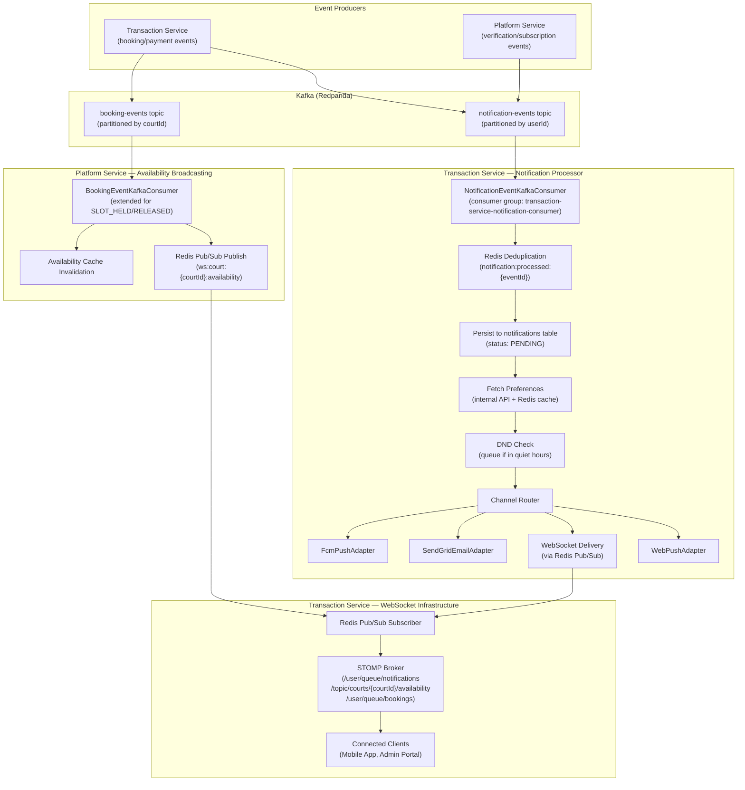
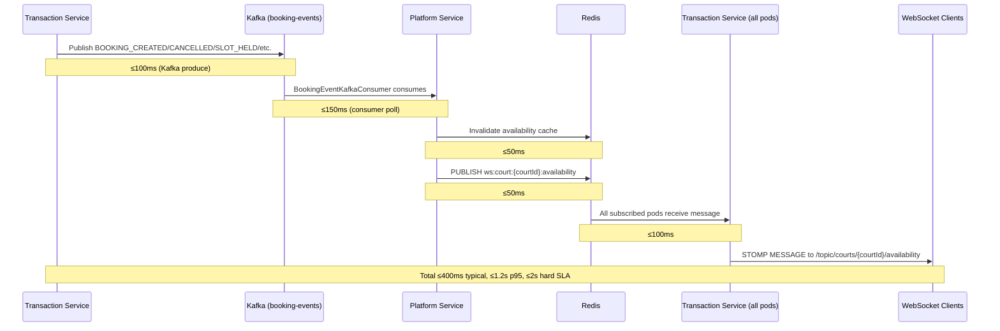
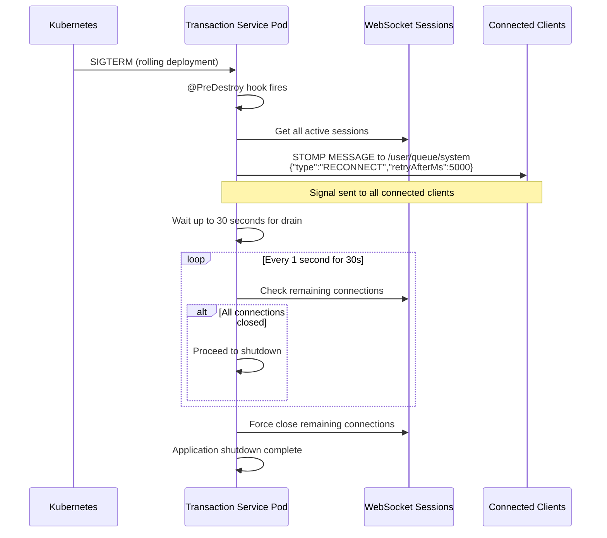

# Design Document — Phase 5: Real-time & Notifications

## Overview

Phase 5 implements the complete real-time communication and notification delivery subsystem for the Court Booking Platform, targeting both `court-booking-transaction-service` (primary) and `court-booking-platform-service` (availability broadcasting). This phase delivers the Kafka notification event consumer (Notification Processor) that routes `NOTIFICATION_REQUESTED` events to FCM push, SendGrid email, STOMP WebSocket, and W3C Web Push channels based on user preferences, urgency levels, and app state.

### Key Capabilities

1. **Notification Processor**: Kafka consumer that deduplicates, persists, resolves preferences, routes channels, delivers, and updates status for all 28 notification types
2. **FCM Push Notifications**: Firebase Admin SDK integration for mobile push delivery with multicast, exponential backoff retries, and automatic invalid token cleanup
3. **SendGrid Email Delivery**: Template-based email notifications with localized content (Greek/English) for booking lifecycle events
4. **STOMP WebSocket Infrastructure**: JWT-authenticated real-time connections with SockJS fallback, user-specific notification and booking queues, and court-specific availability topics
5. **Redis Pub/Sub Scaling**: Cross-pod WebSocket message distribution via Redis Pub/Sub channels, enabling horizontal scaling of WebSocket connections
6. **W3C Web Push (VAPID)**: Browser push notifications for the admin web portal when the tab is closed
7. **Real-time Availability Broadcasting**: Booking events flow from Kafka → Platform Service → Redis Pub/Sub → Transaction Service → WebSocket clients within 2-second SLA
8. **Do-Not-Disturb Scheduling**: User-configurable quiet hours with DND queue flush job for deferred delivery
9. **Booking Reminders**: Quartz-scheduled reminders based on court owner's configured reminder rules
10. **Device Token Management**: Encrypted FCM token and Web Push subscription storage with automatic cleanup
11. **Notification Center API**: Paginated notification history, mark-as-read, unread count endpoints
12. **Prometheus Metrics**: Comprehensive delivery, latency, and connection monitoring

### Architecture Principles

Following the hexagonal architecture (Buckpal pattern) established in Phases 3-4:
- **Domain Layer**: Pure Java entities (`Notification`, `DeviceToken`), value objects (`NotificationType`, `UrgencyLevel`, `DeliveryStatus`), and domain services
- **Application Layer**: Use cases (incoming ports), outgoing port interfaces (FCM, SendGrid, WebSocket, Web Push, Redis Pub/Sub), and service implementations
- **Adapter Layer**: Kafka consumers, REST controllers, FCM adapter, SendGrid adapter, Web Push adapter, WebSocket config, Redis Pub/Sub adapter, persistence adapters
- **NoOp Adapters**: `NoOpFcmAdapter`, `NoOpSendGridAdapter`, `NoOpWebPushAdapter` for local development without external dependencies

### Design Decisions

| Decision | Rationale |
|----------|-----------|
| Notification Processor in Transaction Service | Transaction Service owns the `notifications` and `device_tokens` tables, and already has Kafka consumer infrastructure |
| Redis Pub/Sub (not Redis Streams) for WebSocket | Pub/Sub is fire-and-forget which matches WebSocket semantics — missed messages during disconnection are handled by notification persistence, not message replay |
| Platform Service publishes to Redis Pub/Sub | Platform Service owns availability cache invalidation and already consumes `booking-events`. Publishing to Redis Pub/Sub from the same consumer avoids an extra Kafka hop |
| DND stored in Platform Service | DND is a user preference, co-located with notification preferences for single internal API fetch |
| Preference caching with 5-min TTL | Reduces cross-service calls at the cost of up to 5-minute preference change propagation delay — acceptable trade-off |
| In-memory retries only (no DLQ) | Simplicity for Phase 5. Failed notifications are logged and persisted for manual investigation |
| AES-256-GCM for device tokens | FCM tokens and Web Push subscriptions are sensitive credentials that must be encrypted at rest |

## Architecture

### High-Level Notification Flow



### Availability Broadcasting Flow (2-second SLA)




### Component Diagram — Transaction Service (Phase 5 Additions)

```
┌─────────────────────────────────────────────────────────────────────────────────┐
│                    Transaction Service — Phase 5 Additions                        │
├─────────────────────────────────────────────────────────────────────────────────┤
│  ┌─────────────────────────────────────────────────────────────────────────┐   │
│  │                         Adapter Layer (In)                               │   │
│  │  ┌──────────────────┐ ┌──────────────────┐ ┌──────────────────────┐    │   │
│  │  │ DeviceToken      │ │ Notification     │ │ WebPush              │    │   │
│  │  │ Controller       │ │ Controller       │ │ Controller           │    │   │
│  │  │ POST/GET/DELETE  │ │ GET/POST         │ │ GET vapid-key        │    │   │
│  │  │ /api/notif/      │ │ /api/notif       │ │ POST/DELETE subscribe│    │   │
│  │  │ devices          │ │ /read /read-all  │ │ /api/notif/web-push  │    │   │
│  │  └──────────────────┘ └──────────────────┘ └──────────────────────┘    │   │
│  │  ┌──────────────────┐ ┌──────────────────────────────────────────────┐ │   │
│  │  │ DndController    │ │ NotificationEventKafkaConsumer               │ │   │
│  │  │ PUT /api/notif/  │ │ (notification-events topic consumer)        │ │   │
│  │  │ dnd              │ └──────────────────────────────────────────────┘ │   │
│  │  └──────────────────┘                                                  │   │
│  │  ┌──────────────────────────────────────────────────────────────────┐  │   │
│  │  │ WebSocketConfig + JwtHandshakeInterceptor + StompChannelInterceptor│ │   │
│  │  └──────────────────────────────────────────────────────────────────┘  │   │
│  │  ┌──────────────────────────────────────────────────────────────────┐  │   │
│  │  │ RedisPubSubListener (availability + booking + notification channels)│ │   │
│  │  └──────────────────────────────────────────────────────────────────┘  │   │
│  └─────────────────────────────────────────────────────────────────────────┘   │
│                                      │                                          │
│  ┌─────────────────────────────────────────────────────────────────────────┐   │
│  │                        Application Layer                                 │   │
│  │  ┌──────────────────┐ ┌──────────────────┐ ┌──────────────────────┐    │   │
│  │  │ NotificationProc │ │ DeviceToken      │ │ NotificationQuery    │    │   │
│  │  │ essingService    │ │ Service          │ │ Service              │    │   │
│  │  │ (channel routing)│ │ (register/remove)│ │ (list/read/count)    │    │   │
│  │  └──────────────────┘ └──────────────────┘ └──────────────────────┘    │   │
│  │  ┌──────────────────┐ ┌──────────────────┐ ┌──────────────────────┐    │   │
│  │  │ WebSocketSession │ │ BookingReminder  │ │ DndConfiguration     │    │   │
│  │  │ Service          │ │ SchedulingService│ │ Service              │    │   │
│  │  │ (connection reg) │ │ (Quartz triggers)│ │ (delegate to PS)     │    │   │
│  │  └──────────────────┘ └──────────────────┘ └──────────────────────┘    │   │
│  └─────────────────────────────────────────────────────────────────────────┘   │
│                                      │                                          │
│  ┌─────────────────────────────────────────────────────────────────────────┐   │
│  │                          Domain Layer                                    │   │
│  │  ┌──────────────┐ ┌──────────────┐ ┌──────────────┐ ┌──────────────┐   │   │
│  │  │ Notification │ │ DeviceToken  │ │ Notification │ │ UrgencyLevel │   │   │
│  │  │  (Entity)    │ │  (Entity)    │ │ Type (Enum)  │ │   (Enum)     │   │   │
│  │  └──────────────┘ └──────────────┘ └──────────────┘ └──────────────┘   │   │
│  │  ┌──────────────┐ ┌──────────────┐ ┌──────────────┐                    │   │
│  │  │ DeliveryStatus│ │ TokenType   │ │ ChannelStatus│                    │   │
│  │  │  (VO/Enum)   │ │  (Enum)     │ │  (Enum)      │                    │   │
│  │  └──────────────┘ └──────────────┘ └──────────────┘                    │   │
│  └─────────────────────────────────────────────────────────────────────────┘   │
│                                      │                                          │
│  ┌─────────────────────────────────────────────────────────────────────────┐   │
│  │                        Adapter Layer (Out)                               │   │
│  │  ┌──────────────┐ ┌──────────────┐ ┌──────────────┐ ┌──────────────┐   │   │
│  │  │ Notification │ │ DeviceToken  │ │   FcmPush    │ │  SendGrid    │   │   │
│  │  │ Persistence  │ │ Persistence  │ │   Adapter    │ │  Email       │   │   │
│  │  │ Adapter      │ │ Adapter      │ │ (+ NoOp)     │ │  Adapter     │   │   │
│  │  └──────────────┘ └──────────────┘ └──────────────┘ │  (+ NoOp)    │   │   │
│  │  ┌──────────────┐ ┌──────────────┐ ┌──────────────┐ └──────────────┘   │   │
│  │  │  WebPush     │ │ RedisPubSub  │ │ Notification │                    │   │
│  │  │  Adapter     │ │ Publisher    │ │ Dedup Redis  │                    │   │
│  │  │  (+ NoOp)    │ │ Adapter      │ │ Adapter      │                    │   │
│  │  └──────────────┘ └──────────────┘ └──────────────┘                    │   │
│  │  ┌──────────────────────────────────────────────────────────────────┐  │   │
│  │  │ PlatformServiceHttpClient (extended: getNotificationPreferences, │  │   │
│  │  │ getReminderRules, updateDnd)                                     │  │   │
│  │  └──────────────────────────────────────────────────────────────────┘  │   │
│  └─────────────────────────────────────────────────────────────────────────┘   │
│                                                                                 │
│  ┌─────────────────────────────────────────────────────────────────────────┐   │
│  │                        Scheduled Jobs (Quartz)                           │   │
│  │  ┌──────────────────────┐ ┌──────────────────────────────────────────┐  │   │
│  │  │ DndQueueFlushJob     │ │ NotificationCleanupJob                   │  │   │
│  │  │ (every 15 min)       │ │ (daily — delete >90 day notifications)   │  │   │
│  │  └──────────────────────┘ └──────────────────────────────────────────┘  │   │
│  │  ┌──────────────────────┐ ┌──────────────────────────────────────────┐  │   │
│  │  │ DeviceTokenCleanupJob│ │ BookingReminderJob                       │  │   │
│  │  │ (daily — remove      │ │ (per-booking Quartz triggers)            │  │   │
│  │  │  expired tokens)     │ │                                          │  │   │
│  │  └──────────────────────┘ └──────────────────────────────────────────┘  │   │
│  │  ┌──────────────────────┐ ┌──────────────────────────────────────────┐  │   │
│  │  │ PendingConfirmation  │ │ BookingCompletionJob (extended —         │  │   │
│  │  │ ReminderJob (extended│ │ add notification publishing)             │  │   │
│  │  │ — implement notif)   │ │                                          │  │   │
│  │  └──────────────────────┘ └──────────────────────────────────────────┘  │   │
│  └─────────────────────────────────────────────────────────────────────────┘   │
└─────────────────────────────────────────────────────────────────────────────────┘
```

### Platform Service — Phase 5 Additions

```
┌─────────────────────────────────────────────────────────────────────────────────┐
│                    Platform Service — Phase 5 Additions                           │
├─────────────────────────────────────────────────────────────────────────────────┤
│  Adapter Layer (In):                                                             │
│  ┌──────────────────────────────────────────────────────────────────────────┐   │
│  │ InternalUserController (extended)                                        │   │
│  │   + GET /internal/users/{userId}/notification-preferences                │   │
│  │   + PUT /internal/users/{userId}/dnd                                     │   │
│  │ InternalCourtController (extended)                                       │   │
│  │   + GET /internal/courts/{courtId}/reminder-rules                        │   │
│  │ BookingEventKafkaConsumer (extended)                                      │   │
│  │   + Handle SLOT_HELD, SLOT_RELEASED events                               │   │
│  │   + Publish to Redis Pub/Sub ws:court:{courtId}:availability             │   │
│  │   + **Pre-Phase-5 Cleanup**: Fix BOOKING_MODIFIED field names to match   │   │
│  │     kafka-event-contracts.json (see note below)                          │   │
│  └──────────────────────────────────────────────────────────────────────────┘   │
│                                                                                  │
│  Adapter Layer (Out):                                                            │
│  ┌──────────────────────────────────────────────────────────────────────────┐   │
│  │ AvailabilityRedisPubSubPublisher (new)                                   │   │
│  │   Publishes availability update messages to Redis Pub/Sub channels       │   │
│  └──────────────────────────────────────────────────────────────────────────┘   │
│                                                                                  │
│  Database Migration:                                                             │
│  ┌──────────────────────────────────────────────────────────────────────────┐   │
│  │ V7__add_dnd_columns.sql                                                  │   │
│  │   ALTER TABLE platform.court_owner_notif_prefs                           │   │
│  │     ADD COLUMN dnd_enabled BOOLEAN DEFAULT false,                        │   │
│  │     ADD COLUMN dnd_start_time TIME,                                      │   │
│  │     ADD COLUMN dnd_end_time TIME,                                        │   │
│  │     ADD COLUMN dnd_timezone VARCHAR(50) DEFAULT 'Europe/Athens';          │   │
│  └──────────────────────────────────────────────────────────────────────────┘   │
└─────────────────────────────────────────────────────────────────────────────────┘
```

**Pre-Phase-5 Cleanup: BOOKING_MODIFIED Field Names**

The current `BookingEventKafkaConsumer.java` in Platform Service uses field names `oldCourtId` and `oldDate` for BOOKING_MODIFIED events, but the `kafka-event-contracts.json` defines the fields as `previousDate`, `previousStartTime`, `previousEndTime`. This mismatch should be fixed as part of Phase 5 implementation to align with the contract:

```java
// Current code (WRONG):
String oldCourtIdStr = getTextOrNull(payload, "oldCourtId");
String oldDateStr = getTextOrNull(payload, "oldDate");

// Should be (per kafka-event-contracts.json):
String previousDateStr = getTextOrNull(payload, "previousDate");
// Note: The contract doesn't define previousCourtId — cross-court modification
// may not be supported. If needed, add previousCourtId to the contract first.
```

This is a non-blocking cleanup task — the current code works because Transaction Service's `BookingEventKafkaPublisher` publishes with the field names the consumer expects. However, aligning with the contract ensures consistency and prevents issues if other producers are added.


## Components and Interfaces

### Incoming Ports (Use Cases) — Transaction Service

#### Notification Processing (Req 1, 10, 12, 22)

```java
public interface ProcessNotificationUseCase {
    void processNotificationEvent(NotificationEvent event);
}
```

#### Device Token Management (Req 2)

```java
public interface RegisterDeviceTokenUseCase {
    DeviceTokenResult registerDevice(RegisterDeviceCommand command);
}

public interface RemoveDeviceTokenUseCase {
    void removeDevice(UUID deviceId, UserId userId);
}

public interface ListDeviceTokensQuery {
    List<DeviceTokenResult> listDevices(UserId userId);
}

public record RegisterDeviceCommand(
    UserId userId,
    String token,
    String platform,    // ANDROID | IOS
    String deviceId
) {}
```

#### Web Push Subscription Management (Req 9)

```java
public interface GetVapidKeyQuery {
    String getVapidPublicKey();
}

public interface SubscribeWebPushUseCase {
    WebPushSubscriptionResult subscribe(SubscribeWebPushCommand command);
}

public interface UnsubscribeWebPushUseCase {
    void unsubscribe(UserId userId);
}

public record SubscribeWebPushCommand(
    UserId userId,
    String endpoint,
    String p256dh,
    String auth
) {}
```

#### Notification Center (Req 7, 14, 24)

```java
public interface ListNotificationsQuery {
    Page<NotificationResult> listNotifications(UserId userId, NotificationFilter filter, Pageable pageable);
}

public interface MarkNotificationReadUseCase {
    NotificationResult markRead(UUID notificationId, UserId userId);
}

public interface MarkAllNotificationsReadUseCase {
    int markAllRead(UserId userId);
}

public interface GetUnreadCountQuery {
    long getUnreadCount(UserId userId);
}

public record NotificationFilter(
    boolean unreadOnly,
    String type    // nullable — filter by notification type
) {}
```

#### DND Configuration (Req 10, 31)

```java
public interface UpdateDndConfigurationUseCase {
    DndConfigurationResult updateDnd(UpdateDndCommand command);
}

public record UpdateDndCommand(
    UserId userId,
    boolean enabled,
    LocalTime startTime,
    LocalTime endTime,
    String timezone
) {}
```

#### Booking Reminder Scheduling (Req 15)

```java
public interface ScheduleBookingReminderUseCase {
    void scheduleReminder(BookingId bookingId, CourtId courtId);
}

public interface CancelBookingReminderUseCase {
    void cancelReminder(BookingId bookingId);
}
```

### Outgoing Ports (SPIs) — Transaction Service

```java
// ── Delivery Channel Ports ──

public interface FcmPushPort {
    FcmDeliveryResult sendMulticast(List<String> deviceTokens, FcmMessage message);
}

public record FcmMessage(
    String title, String body, Map<String, String> data,
    String priority, String clickAction
) {}

public record FcmDeliveryResult(
    int successCount, int failureCount,
    List<TokenResult> tokenResults
) {
    public record TokenResult(String token, boolean success, String errorCode) {}
}

public interface SendGridEmailPort {
    boolean sendTemplateEmail(SendGridEmailRequest request);
}

public record SendGridEmailRequest(
    String toEmail, String toName, String templateId,
    Map<String, Object> templateData
) {}

public interface WebPushPort {
    WebPushDeliveryResult send(WebPushSubscription subscription, WebPushPayload payload);
}

public record WebPushSubscription(String endpoint, String p256dh, String auth) {}
public record WebPushPayload(String title, String body, String icon, String url, Map<String, String> data) {}
public record WebPushDeliveryResult(boolean success, int statusCode) {}

// ── WebSocket / Redis Pub/Sub Ports ──

public interface WebSocketSessionPort {
    boolean isUserConnected(UserId userId);
    Set<String> getSessionIds(UserId userId);
    void sendToUser(UserId userId, String destination, Object payload);
}

public interface RedisPubSubPublisherPort {
    void publishNotification(UserId userId, Object message);
    void publishAvailabilityUpdate(UUID courtId, Object message);
    void publishBookingUpdate(UUID courtId, Object message);
}

// ── Persistence Ports ──

public interface SaveNotificationPort {
    Notification save(Notification notification);
    List<Notification> saveAll(List<Notification> notifications);
}

public interface LoadNotificationPort {
    Optional<Notification> loadById(UUID id);
    Page<Notification> loadByUserId(UserId userId, NotificationFilter filter, Pageable pageable);
    long countUnread(UserId userId);
    List<Notification> loadDndQueuedReady(Instant now, int batchSize);
    int markAllRead(UserId userId);
    int deleteOlderThan(Instant threshold);
    int countByUserId(UserId userId);
    int deleteOldestRead(UserId userId, int count);
}

public interface SaveDeviceTokenPort {
    DeviceToken save(DeviceToken token);
}

public interface LoadDeviceTokenPort {
    List<DeviceToken> loadByUserId(UserId userId);
    List<DeviceToken> loadFcmTokensByUserId(UserId userId);
    List<DeviceToken> loadWebPushByUserId(UserId userId);
    Optional<DeviceToken> loadByToken(String encryptedToken);
    Optional<DeviceToken> loadById(UUID id);
    int countByUserId(UserId userId);
    int deleteExpiredTokens(Instant threshold);
    void deleteById(UUID id);
    void deleteByToken(String encryptedToken);
}

// ── Notification Deduplication Port ──

public interface NotificationDeduplicationPort {
    boolean isProcessed(String eventId);
    void markProcessed(String eventId);
}

// ── Notification Preference Cache Port ──

public interface NotificationPreferenceCachePort {
    Optional<UserNotificationPreferences> get(UserId userId);
    void put(UserId userId, UserNotificationPreferences preferences);
    void invalidate(UserId userId);
}

public record UserNotificationPreferences(
    List<ChannelPreference> preferences,
    DndConfiguration dnd
) {
    public record ChannelPreference(String eventType, boolean pushEnabled, boolean emailEnabled, boolean inAppEnabled) {}
    public record DndConfiguration(boolean enabled, LocalTime startTime, LocalTime endTime, String timezone) {}
}

// ── Platform Service Port (extended) ──

// Added to existing PlatformServicePort:
// UserNotificationPreferences getNotificationPreferences(UserId userId);
// List<ReminderRuleInfo> getReminderRules(CourtId courtId);
// void updateDnd(UserId userId, UpdateDndCommand command);
```

### Kafka Event Deserialization — Publisher Format Alignment

The two services publish `NOTIFICATION_REQUESTED` events with different record structures that must be handled by the consumer:

**Transaction Service `NotificationRequestedEvent`** (existing — flat bilingual fields):
```java
record NotificationRequestedEvent(
    UUID userId, String type,
    String titleEn, String titleEl, String bodyEn, String bodyEl,
    String urgency, List<String> channels, Map<String, Object> data
)
```

**Platform Service `NotificationRequestedEvent`** (existing — single language, channels as `Map<String, Boolean>`):
```java
record NotificationRequestedEvent(
    UUID eventId, String notificationType, UserId recipientUserId,
    String title, String body, String language,
    Map<String, Boolean> channels, Map<String, String> data, Instant timestamp
)
```

**Kafka contract schema** (`kafka-event-contracts.json` — the source of truth):
```json
{
  "title": { "el": "...", "en": "..." },
  "body": { "el": "...", "en": "..." },
  "channels": ["PUSH", "EMAIL", "IN_APP", "WEB_PUSH"],
  "urgency": "CRITICAL | STANDARD | PROMOTIONAL"
}
```

**Consumer deserialization strategy**: The `NotificationEventKafkaConsumer` deserializes from raw JSON (not typed records) using `ObjectMapper.readTree()`, extracting fields from the `EventEnvelope.payload` object. This approach handles both publisher formats because:
1. Both publishers wrap events in an `EventEnvelope` with `eventId`, `eventType`, `timestamp`, and `payload`
2. The consumer reads `payload.userId` (Transaction Service) or `payload.recipientUserId` (Platform Service) — the consumer checks both fields
3. For `title`/`body`: if the value is a JSON object with `el`/`en` keys, extract both; if it's a plain string, use it as the user's language version
4. For `channels`: if the value is a JSON array of strings, use directly; if it's a JSON object with boolean values, convert keys where value is `true` to a list

**NOTE**: A future task should align both publishers to the Kafka contract schema format (bilingual `title`/`body` objects, `channels` as `List<String>`, `urgency` field). This is tracked as a pre-Phase-5 cleanup task but is not blocking — the consumer handles both formats.

### PlatformServicePort Extension (Phase 5 additions)

The existing `PlatformServicePort` interface (currently has `validateSlot`, `calculatePrice`, `getStripeConnectStatus`, `updateStripeConnectStatus`, `updateStripeCustomerId`) is extended with three new methods:

```java
// Added to existing PlatformServicePort interface:

/**
 * Fetches notification preferences and DND configuration for a user.
 * Called by the Notification Processor to determine delivery channels.
 *
 * @param userId the target user
 * @return preferences + DND config, or empty if user not found
 */
Optional<UserNotificationPreferences> getNotificationPreferences(UserId userId);

/**
 * Fetches reminder rules for a court.
 * Called by BookingReminderSchedulingService when scheduling reminders.
 *
 * @param courtId the court to fetch rules for
 * @return list of enabled reminder rules
 */
List<ReminderRuleInfo> getReminderRules(CourtId courtId);

/**
 * Updates DND configuration for a user (delegates to Platform Service).
 * Called by DndController.
 *
 * @param userId the user to update
 * @param command the DND configuration
 */
void updateDnd(UserId userId, boolean enabled, LocalTime startTime, LocalTime endTime, String timezone);

// ── Nested Records for Phase 5 ──

record ReminderRuleInfo(
    String ruleType,        // BOOKING_REMINDER, PENDING_CONFIRMATION
    boolean enabled,
    Integer triggerHoursBefore  // hours — matches ReminderRule.triggerHoursBefore in Platform Service domain model
) {}
```

**NOTE on reminder intervals**: The `PendingConfirmationReminderJob` uses hardcoded reminder thresholds (1h, 4h, 12h) rather than configurable per-court intervals. The `PENDING_CONFIRMATION` rule type in `ReminderRule` controls whether reminders are enabled and the initial trigger time, but the escalation intervals are system-wide. This simplifies the implementation while still allowing court owners to enable/disable pending confirmation reminders.

The existing `PlatformServiceHttpClient` (currently a stub) is extended with implementations for these three methods, calling:
- `GET /internal/users/{userId}/notification-preferences`
- `GET /internal/courts/{courtId}/reminder-rules`
- `PUT /internal/users/{userId}/dnd`

### Outgoing Ports (SPIs) — Platform Service (new)

```java
// ── Redis Pub/Sub Publishing Port ──

public interface AvailabilityPubSubPort {
    void publishAvailabilityUpdate(CourtId courtId, AvailabilityUpdateMessage message);
}

public record AvailabilityUpdateMessage(
    UUID courtId, LocalDate date, String eventType,
    AffectedSlot affectedSlot, Instant updatedAt
) {
    public record AffectedSlot(LocalTime startTime, LocalTime endTime) {}
}
```

### Web Controllers — Transaction Service (new)

| Controller | Endpoints | Description | Requirement |
|------------|-----------|-------------|-------------|
| `DeviceTokenController` | `POST /api/notifications/devices`, `GET /api/notifications/devices`, `DELETE /api/notifications/devices/{deviceId}` | FCM device token registration and management | Req 2 |
| `NotificationController` | `GET /api/notifications`, `POST /api/notifications/{id}/read`, `POST /api/notifications/read-all`, `GET /api/notifications/unread-count` | Notification center API | Req 7, 14, 24 |
| `WebPushController` | `GET /api/notifications/web-push/vapid-key`, `POST /api/notifications/web-push/subscribe`, `DELETE /api/notifications/web-push/subscribe` | Web Push subscription management | Req 9 |
| `DndController` | `PUT /api/notifications/dnd` | Do-not-disturb configuration (delegates to Platform Service) | Req 10, 31 |

### Internal API Endpoints — Platform Service (extended)

| Controller | Endpoint | Description | Requirement |
|------------|----------|-------------|-------------|
| `InternalUserController` | `GET /internal/users/{userId}/notification-preferences` | Returns notification preferences + DND config | Req 20.1 |
| `InternalUserController` | `PUT /internal/users/{userId}/dnd` | Updates DND configuration | Req 20.7, 31.2 |
| `InternalCourtController` | `GET /internal/courts/{courtId}/reminder-rules` | Returns court reminder rules | Req 20.2 |

The existing `InternalUserController` currently only has `getStripeConnectStatus()`. Phase 5 adds two new endpoints. The existing `InternalCourtController` currently only has `validateSlot()` and `calculatePrice()`. Phase 5 adds one new endpoint.

Platform Service service layer changes required:
- New `GetNotificationPreferencesForUserQuery` use case (or extend `ManageNotificationPreferencesUseCase`) — loads preferences via `NotificationPreferencesPersistencePort.findByOwnerId()` and DND config from the new columns on `court_owner_notif_prefs`
- New `GetReminderRulesForCourtQuery` use case (or extend `ManageReminderRulesUseCase`) — loads rules via `ReminderRulePersistencePort.findByOwnerIdAndCourtId()`, filtering to the court's owner
- New `UpdateDndConfigurationUseCase` — updates DND columns on `court_owner_notif_prefs` and invalidates the Redis preference cache (`notification:prefs:{userId}`)
- The `NotificationPreferencesPersistencePort` may need a new method to load DND config alongside preferences, or a separate `DndConfigurationPersistencePort`

### Kafka Consumers — Transaction Service (new)

| Consumer | Topic | Group ID | Description | Requirement |
|----------|-------|----------|-------------|-------------|
| `NotificationEventKafkaConsumer` | `notification-events` | `transaction-service-notification-consumer` | Consumes `NOTIFICATION_REQUESTED` events, deduplicates, persists, routes to channels. Configured with `auto.offset.reset=latest` (overrides the global `earliest` default in `application.yml`) to avoid reprocessing historical events on first startup | Req 1, 22 |

### Kafka Consumer — Platform Service (extended)

| Consumer | Topic | Changes | Requirement |
|----------|-------|---------|-------------|
| `BookingEventKafkaConsumer` | `booking-events` | Add `SLOT_HELD` and `SLOT_RELEASED` handling; publish to Redis Pub/Sub for all booking event types | Req 6, 28 |

### Scheduled Jobs

| Job | Schedule | Description | Requirement |
|-----|----------|-------------|-------------|
| `DndQueueFlushJob` | Every 15 min (`0 0/15 * * * ?`) | Processes `DND_QUEUED` notifications whose `deliver_after` has passed, batches of 100 | Req 10.7, 23 |
| `NotificationCleanupJob` | Daily (`0 0 2 * * ?`) | Deletes notifications older than 90 days; enforces 1000-per-user limit | Req 14.2, 14.5 |
| `DeviceTokenCleanupJob` | Daily (`0 0 3 * * ?`) | Removes device tokens/subscriptions unused for 90 days | Req 18.1 |
| `BookingReminderJob` | Per-booking Quartz trigger | Fires at `bookingStartTime - reminderHoursBefore`, publishes `BOOKING_REMINDER` notification | Req 15 |
| `PendingConfirmationReminderJob` | Hourly (`0 0 * * * ?`) — existing | Extended: implements actual notification publishing for 1h/4h/12h thresholds | Req 16 |
| `BookingCompletionJob` | Every 15 min (`0 0/15 * * * ?`) — existing | Extended: publishes `BOOKING_COMPLETED` event to `booking-events` topic (already done in Phase 4) — Phase 5 does NOT add customer notification for completion (no user-facing notification needed when a booking simply ends) | Req 29.2 |


## Data Models

### Domain Entities — Transaction Service

#### Notification (Rich Domain Entity)

```java
public class Notification {
    private UUID id;
    private final UserId userId;
    private NotificationType notificationType;
    private UrgencyLevel urgency;
    private String title;           // localized (selected by user language)
    private String body;            // localized
    private Map<String, Object> data;  // JSONB — bookingId, courtId, deepLink, etc.
    private boolean read;
    private Instant readAt;
    private DeliveryStatus deliveryStatus;  // per-channel status
    private Instant deliverAfter;   // nullable — set for DND-queued notifications
    private Instant createdAt;

    // Business methods
    public void markRead() { this.read = true; this.readAt = Instant.now(); }
    public void markDelivered(String channel) { deliveryStatus.markDelivered(channel); }
    public void markFailed(String channel) { deliveryStatus.markFailed(channel); }
    public void markSkipped(String channel) { deliveryStatus.markSkipped(channel); }
    public void queueForDnd(Instant deliverAfter) { this.deliverAfter = deliverAfter; }
    public boolean isDndQueued() { return deliverAfter != null && !read; }
    public String getOverallStatus() { return deliveryStatus.getOverallStatus(); }
}
```

#### DeviceToken (Rich Domain Entity)

```java
public class DeviceToken {
    private UUID id;
    private final UserId userId;
    private String encryptedToken;   // AES-256-GCM encrypted
    private TokenType tokenType;     // FCM, WEB_PUSH
    private String platform;         // ANDROID, IOS, WEB (for FCM tokens)
    private String deviceId;         // client-provided device identifier
    private Instant registeredAt;
    private Instant lastUsedAt;

    // Business methods
    public void updateLastUsed() { this.lastUsedAt = Instant.now(); }
    public boolean isExpired(Duration maxAge) {
        return lastUsedAt != null && lastUsedAt.plus(maxAge).isBefore(Instant.now());
    }
}
```

### Value Objects and Enums

```java
public enum NotificationType {
    BOOKING_CONFIRMED, BOOKING_CANCELLED, BOOKING_REJECTED,
    BOOKING_PENDING_CONFIRMATION, BOOKING_REMINDER,
    RECURRING_BOOKING_PRICE_CHANGED,
    PAYMENT_RECEIVED, PAYMENT_FAILED, PAYMENT_DISPUTE,
    PAYOUT_COMPLETED, REFUND_COMPLETED,
    WAITLIST_SLOT_AVAILABLE, WAITLIST_EXPIRED,
    MATCH_JOIN_REQUEST, MATCH_JOIN_APPROVED, MATCH_JOIN_DECLINED, MATCH_PLAYER_LEFT,
    SPLIT_PAYMENT_REQUESTED, SPLIT_PAYMENT_RECEIVED, SPLIT_PAYMENT_EXPIRED,
    PENDING_CONFIRMATION_REMINDER,
    SUBSCRIPTION_EXPIRING, SUBSCRIPTION_EXPIRED, SUBSCRIPTION_RENEWED,
    VERIFICATION_APPROVED, VERIFICATION_REJECTED,
    SUPPORT_TICKET_UPDATED, REMINDER_ALERT, WEATHER_ALERT
}

public enum UrgencyLevel {
    CRITICAL,       // Always immediate, bypasses DND and preferences
    STANDARD,       // Respects DND windows
    PROMOTIONAL     // Respects opt-out preferences
}

public enum TokenType {
    FCM,        // Firebase Cloud Messaging device token
    WEB_PUSH    // W3C Web Push subscription
}

public enum ChannelStatus {
    PENDING, DELIVERED, FAILED, SKIPPED
}

public class DeliveryStatus {
    private ChannelStatus pushStatus;
    private ChannelStatus webSocketStatus;
    private ChannelStatus emailStatus;
    private ChannelStatus webPushStatus;

    public String getOverallStatus() {
        if (allDelivered()) return "DELIVERED";
        if (anyDelivered()) return "PARTIALLY_DELIVERED";
        if (allSkipped()) return "SKIPPED";
        if (allFailed()) return "FAILED";
        return "PENDING";
    }

    public void markDelivered(String channel) { setStatus(channel, ChannelStatus.DELIVERED); }
    public void markFailed(String channel) { setStatus(channel, ChannelStatus.FAILED); }
    public void markSkipped(String channel) { setStatus(channel, ChannelStatus.SKIPPED); }
}
```

### Domain Model — Platform Service Additions

#### DND Configuration (added to NotificationPreference)

The existing `platform.court_owner_notif_prefs` table is extended with DND columns. The `NotificationPreference` domain model is not modified — DND is a separate concern fetched alongside preferences via the internal API.

```java
// New value object for DND configuration
public record DndConfiguration(
    boolean enabled,
    LocalTime startTime,
    LocalTime endTime,
    String timezone
) {
    public boolean isInDndWindow(Instant now) {
        if (!enabled || startTime == null || endTime == null) return false;
        ZonedDateTime userTime = now.atZone(ZoneId.of(timezone));
        LocalTime currentTime = userTime.toLocalTime();
        if (startTime.isBefore(endTime)) {
            // Same-day window (e.g., 09:00–17:00)
            return !currentTime.isBefore(startTime) && currentTime.isBefore(endTime);
        } else {
            // Overnight window (e.g., 22:00–07:00)
            return !currentTime.isBefore(startTime) || currentTime.isBefore(endTime);
        }
    }
}
```

### Database Schema

#### Existing Tables (from V1 migration) — Require Phase 5 Restructuring

The `transaction.notifications` and `transaction.device_tokens` tables were created in V1 but with a different schema than Phase 5 requires. Phase 5 includes Flyway migrations to restructure both tables.

**Actual V1 `transaction.notifications` schema:**
```sql
-- V1 schema (existing — per-channel row model, no multi-channel tracking)
CREATE TABLE transaction.notifications (
    id UUID PRIMARY KEY DEFAULT gen_random_uuid(),
    user_id UUID NOT NULL,
    notification_type VARCHAR(50) NOT NULL,
    channel VARCHAR(10) NOT NULL,           -- single channel per row: PUSH, EMAIL, IN_APP, WEB_PUSH
    title VARCHAR(255) NOT NULL,
    body TEXT NOT NULL,
    language VARCHAR(5) NOT NULL DEFAULT 'el',
    data JSONB,
    status VARCHAR(15) NOT NULL DEFAULT 'PENDING',  -- PENDING, SENT, DELIVERED, FAILED, READ
    read_at TIMESTAMPTZ,
    failure_reason TEXT,
    created_at TIMESTAMPTZ NOT NULL DEFAULT NOW()
);
-- Missing: urgency, read (boolean), delivery_status (JSONB), deliver_after
```

**Actual V1 `transaction.device_tokens` schema:**
```sql
-- V1 schema (existing — plaintext token, no token_type, no last_used_at)
CREATE TABLE transaction.device_tokens (
    id UUID PRIMARY KEY DEFAULT gen_random_uuid(),
    user_id UUID NOT NULL,
    token VARCHAR(500) NOT NULL,            -- plaintext, not encrypted
    platform VARCHAR(10) NOT NULL,          -- IOS, ANDROID, WEB_PUSH
    device_id VARCHAR(255),
    push_subscription_endpoint VARCHAR(500),
    push_subscription_keys JSONB,
    active BOOLEAN NOT NULL DEFAULT TRUE,
    created_at TIMESTAMPTZ NOT NULL DEFAULT NOW(),
    updated_at TIMESTAMPTZ NOT NULL DEFAULT NOW()
);
-- Missing: encrypted_token, token_type (FCM/WEB_PUSH), last_used_at, registered_at
```

**Phase 5 target schema** (after migrations):
```sql
-- transaction.notifications (after V3 migration)
CREATE TABLE transaction.notifications (
    id              UUID PRIMARY KEY DEFAULT gen_random_uuid(),
    user_id         UUID NOT NULL,
    notification_type VARCHAR(50) NOT NULL,
    urgency         VARCHAR(20) NOT NULL,
    title           TEXT NOT NULL,
    body            TEXT NOT NULL,
    data            JSONB,
    read            BOOLEAN DEFAULT false,
    read_at         TIMESTAMPTZ,
    delivery_status JSONB NOT NULL DEFAULT '{}',
    deliver_after   TIMESTAMPTZ,        -- for DND-queued notifications
    created_at      TIMESTAMPTZ NOT NULL DEFAULT NOW()
);

CREATE INDEX idx_notifications_user_created ON transaction.notifications (user_id, created_at DESC);
CREATE INDEX idx_notifications_user_read ON transaction.notifications (user_id, read);
CREATE INDEX idx_notifications_dnd_queued ON transaction.notifications (deliver_after)
    WHERE deliver_after IS NOT NULL;

-- transaction.device_tokens (after V4 migration)
CREATE TABLE transaction.device_tokens (
    id              UUID PRIMARY KEY DEFAULT gen_random_uuid(),
    user_id         UUID NOT NULL,
    encrypted_token TEXT NOT NULL,
    token_type      VARCHAR(20) NOT NULL,  -- FCM, WEB_PUSH
    platform        VARCHAR(20),           -- ANDROID, IOS, WEB
    device_id       VARCHAR(255),
    registered_at   TIMESTAMPTZ NOT NULL DEFAULT NOW(),
    last_used_at    TIMESTAMPTZ
);

CREATE INDEX idx_device_tokens_user ON transaction.device_tokens (user_id);
CREATE UNIQUE INDEX idx_device_tokens_token ON transaction.device_tokens (encrypted_token);
```

#### Flyway Migration — Transaction Service: V3 (Restructure Notifications)

```sql
-- V3__restructure_notifications_for_phase5.sql
-- Restructures the notifications table from per-channel row model to
-- single-row-per-notification with JSONB delivery_status tracking.
-- Drops existing data (no production data exists yet — Phase 5 is the first consumer).

-- Drop old indexes
DROP INDEX IF EXISTS transaction.idx_notifications_user_id;
DROP INDEX IF EXISTS transaction.idx_notifications_user_unread;
DROP INDEX IF EXISTS transaction.idx_notifications_type;
DROP INDEX IF EXISTS transaction.idx_notifications_created;

-- Drop old constraints
ALTER TABLE transaction.notifications DROP CONSTRAINT IF EXISTS chk_notifications_channel;
ALTER TABLE transaction.notifications DROP CONSTRAINT IF EXISTS chk_notifications_language;
ALTER TABLE transaction.notifications DROP CONSTRAINT IF EXISTS chk_notifications_status;

-- Remove old columns
ALTER TABLE transaction.notifications DROP COLUMN IF EXISTS channel;
ALTER TABLE transaction.notifications DROP COLUMN IF EXISTS language;
ALTER TABLE transaction.notifications DROP COLUMN IF EXISTS failure_reason;
ALTER TABLE transaction.notifications DROP COLUMN IF EXISTS status;

-- Alter title from VARCHAR(255) to TEXT
ALTER TABLE transaction.notifications ALTER COLUMN title TYPE TEXT;

-- Add new columns
ALTER TABLE transaction.notifications ADD COLUMN IF NOT EXISTS urgency VARCHAR(20) NOT NULL DEFAULT 'STANDARD';
ALTER TABLE transaction.notifications ADD COLUMN IF NOT EXISTS read BOOLEAN DEFAULT false;
ALTER TABLE transaction.notifications ADD COLUMN IF NOT EXISTS delivery_status JSONB NOT NULL DEFAULT '{}';
ALTER TABLE transaction.notifications ADD COLUMN IF NOT EXISTS deliver_after TIMESTAMPTZ;

-- Add new indexes
CREATE INDEX idx_notifications_user_created ON transaction.notifications (user_id, created_at DESC);
CREATE INDEX idx_notifications_user_read ON transaction.notifications (user_id, read);
CREATE INDEX idx_notifications_dnd_queued ON transaction.notifications (deliver_after)
    WHERE deliver_after IS NOT NULL;

-- Add CHECK constraint for urgency
ALTER TABLE transaction.notifications ADD CONSTRAINT chk_notifications_urgency
    CHECK (urgency IN ('CRITICAL', 'STANDARD', 'PROMOTIONAL'));
```

#### Flyway Migration — Transaction Service: V4 (Restructure Device Tokens)

```sql
-- V4__restructure_device_tokens_for_phase5.sql
-- Restructures device_tokens from plaintext storage to encrypted token model
-- with token_type discriminator. Drops existing data (no production tokens yet).

-- Drop old indexes and constraints
DROP INDEX IF EXISTS transaction.idx_device_tokens_user_id;
ALTER TABLE transaction.device_tokens DROP CONSTRAINT IF EXISTS uq_device_tokens_token;
ALTER TABLE transaction.device_tokens DROP CONSTRAINT IF EXISTS chk_device_tokens_platform;

-- Remove old columns
ALTER TABLE transaction.device_tokens DROP COLUMN IF EXISTS token;
ALTER TABLE transaction.device_tokens DROP COLUMN IF EXISTS push_subscription_endpoint;
ALTER TABLE transaction.device_tokens DROP COLUMN IF EXISTS push_subscription_keys;
ALTER TABLE transaction.device_tokens DROP COLUMN IF EXISTS active;
ALTER TABLE transaction.device_tokens DROP COLUMN IF EXISTS updated_at;

-- Add new columns
ALTER TABLE transaction.device_tokens ADD COLUMN IF NOT EXISTS encrypted_token TEXT NOT NULL DEFAULT '';
ALTER TABLE transaction.device_tokens ADD COLUMN IF NOT EXISTS token_type VARCHAR(20) NOT NULL DEFAULT 'FCM';
ALTER TABLE transaction.device_tokens ADD COLUMN IF NOT EXISTS last_used_at TIMESTAMPTZ;

-- Rename created_at to registered_at
ALTER TABLE transaction.device_tokens RENAME COLUMN created_at TO registered_at;

-- Widen platform column from VARCHAR(10) to VARCHAR(20)
ALTER TABLE transaction.device_tokens ALTER COLUMN platform TYPE VARCHAR(20);
ALTER TABLE transaction.device_tokens ALTER COLUMN platform DROP NOT NULL;

-- Remove default from encrypted_token after migration
ALTER TABLE transaction.device_tokens ALTER COLUMN encrypted_token DROP DEFAULT;
ALTER TABLE transaction.device_tokens ALTER COLUMN token_type DROP DEFAULT;

-- Add new indexes
CREATE INDEX idx_device_tokens_user ON transaction.device_tokens (user_id);
CREATE UNIQUE INDEX idx_device_tokens_token ON transaction.device_tokens (encrypted_token);

-- Add CHECK constraints
ALTER TABLE transaction.device_tokens ADD CONSTRAINT chk_device_tokens_token_type
    CHECK (token_type IN ('FCM', 'WEB_PUSH'));
ALTER TABLE transaction.device_tokens ADD CONSTRAINT chk_device_tokens_platform
    CHECK (platform IN ('ANDROID', 'IOS', 'WEB'));
```

#### Flyway Migration — Transaction Service: V5 (Add Reminder State)

```sql
-- V5__add_reminder_state_column.sql
ALTER TABLE transaction.bookings
    ADD COLUMN IF NOT EXISTS reminder_state JSONB DEFAULT '{}';

COMMENT ON COLUMN transaction.bookings.reminder_state IS
    'Tracks which pending confirmation reminder thresholds have been sent. Keys: 1h, 4h, 12h. Values: ISO timestamp when sent.';
```

#### Flyway Migration — Platform Service

```sql
-- V7__add_dnd_columns.sql
ALTER TABLE platform.court_owner_notif_prefs
    ADD COLUMN IF NOT EXISTS dnd_enabled BOOLEAN DEFAULT false,
    ADD COLUMN IF NOT EXISTS dnd_start_time TIME,
    ADD COLUMN IF NOT EXISTS dnd_end_time TIME,
    ADD COLUMN IF NOT EXISTS dnd_timezone VARCHAR(50) DEFAULT 'Europe/Athens';
```

**DND Scope Clarification**: Do-Not-Disturb is only available for court owners (stored in `court_owner_notif_prefs`). Customers do not have DND configuration — they receive notifications immediately. This is intentional because:
1. Court owners receive high-volume notifications (new bookings, pending confirmations) that benefit from batching during off-hours
2. Customers receive low-volume, time-sensitive notifications (booking confirmations, reminders) that should not be delayed
3. The existing `court_owner_notif_prefs` table already exists and is the natural place for owner-specific settings

### Redis Key Patterns

| Pattern | TTL | Purpose | Requirement |
|---------|-----|---------|-------------|
| `notification:processed:{eventId}` | 7 days | Kafka event deduplication | Req 1.11, 22 |
| `notification:prefs:{userId}` | 5 min | Cached notification preferences + DND | Req 20.5 |
| `ws:user:{userId}:notifications` | — | Redis Pub/Sub channel for user notifications | Req 5.3 |
| `ws:court:{courtId}:availability` | — | Redis Pub/Sub channel for availability updates | Req 5.3, 6.1 |
| `ws:court:{courtId}:bookings` | — | Redis Pub/Sub channel for booking status updates (routed to `/user/queue/bookings` per user) | Req 5.3, 6.6 |

### WebSocket Configuration

```java
@Configuration
@EnableWebSocketMessageBroker
public class WebSocketConfig implements WebSocketMessageBrokerConfigurer {

    @Override
    public void configureMessageBroker(MessageBrokerRegistry config) {
        config.enableSimpleBroker("/topic", "/queue")
              .setHeartbeatValue(new long[]{30000, 30000});  // 30s heartbeat
        config.setApplicationDestinationPrefixes("/app");
        config.setUserDestinationPrefix("/user");
    }

    @Override
    public void registerStompEndpoints(StompEndpointRegistry registry) {
        registry.addEndpoint("/ws")
                .setAllowedOriginPatterns("*")
                .withSockJS();
    }

    @Override
    public void configureWebSocketTransport(WebSocketTransportRegistration registration) {
        registration.setMessageSizeLimit(128 * 1024);    // 128KB
        registration.setSendBufferSizeLimit(512 * 1024);  // 512KB
        registration.setSendTimeLimit(10 * 1000);          // 10s
    }
}
```

### Spring Configuration Additions (application.yml)

```yaml
# ── FCM Configuration ──
fcm:
  credentials-path: ${FCM_CREDENTIALS_PATH:classpath:firebase-service-account.json}
  project-id: ${FCM_PROJECT_ID:court-booking-dev}

# ── SendGrid Configuration ──
sendgrid:
  api-key: ${SENDGRID_API_KEY:SG.placeholder}
  from-email: ${SENDGRID_FROM_EMAIL:noreply@courtbooking.gr}
  from-name: ${SENDGRID_FROM_NAME:Court Booking}

# ── Web Push (VAPID) Configuration ──
web-push:
  vapid-public-key: ${VAPID_PUBLIC_KEY:}
  vapid-private-key: ${VAPID_PRIVATE_KEY:}
  vapid-subject: ${VAPID_SUBJECT:mailto:support@courtbooking.gr}

# ── Device Token Encryption ──
device-token:
  encryption-key: ${DEVICE_TOKEN_ENCRYPTION_KEY:dev-placeholder-key-32chars!!}

# ── Notification Processing ──
notification:
  preference-cache-ttl: ${NOTIFICATION_PREF_CACHE_TTL:PT5M}
  dedup-ttl: ${NOTIFICATION_DEDUP_TTL:P7D}
  max-per-user: ${NOTIFICATION_MAX_PER_USER:1000}
  retention-days: ${NOTIFICATION_RETENTION_DAYS:90}
  max-retry-duration: ${NOTIFICATION_MAX_RETRY_DURATION:PT5M}
```


## Notification Processor Pipeline Design (Req 1, 10, 12, 22)

The Notification Processor is the central orchestrator. It runs as a `@KafkaListener` method in `NotificationEventKafkaConsumer` and delegates to `NotificationProcessingService` for the business logic. The pipeline is sequential within a single Kafka message processing cycle:

```
┌─────────────────────────────────────────────────────────────────────────┐
│                  Notification Processing Pipeline                        │
│                                                                          │
│  1. CONSUME ──► 2. DESERIALIZE ──► 3. DEDUPLICATE ──► 4. PERSIST       │
│                                                            │             │
│  8. UPDATE STATUS ◄── 7. DELIVER ◄── 6. ROUTE ◄── 5. RESOLVE PREFS    │
│         │                                                                │
│         ▼                                                                │
│  9. COMMIT OFFSET                                                        │
└─────────────────────────────────────────────────────────────────────────┘
```

Step-by-step:

1. **CONSUME**: `@KafkaListener` receives raw JSON string from `notification-events` topic
2. **DESERIALIZE**: Parse JSON into `NotificationEvent` record. If malformed → log WARN, skip, commit offset (Req 1.12). If unknown notification type (Phase 10 deferred types) → log DEBUG, skip, commit offset
3. **DEDUPLICATE**: Check Redis `notification:processed:{eventId}`. If exists → log DEBUG, skip, commit offset (Req 22.2). Uses `NotificationDeduplicationPort`
4. **PERSIST**: Create `Notification` entity with status `PENDING`, persist to `transaction.notifications` table. Then set Redis dedup key (Req 22.3 — dedup key set AFTER persist, BEFORE delivery). Enforce 1000-per-user limit: if count >= 1000, delete oldest read (or oldest unread if all unread) (Req 14.5)
5. **RESOLVE PREFERENCES**: Fetch user preferences via `NotificationPreferenceCachePort` (Redis cache, 5-min TTL). On cache miss, call Platform Service internal API `GET /internal/users/{userId}/notification-preferences` via `PlatformServicePort`. On API failure → use cached if available, else default-open (deliver to all channels in event's `channels` array) (Req 20.6). Also fetch user language from `v_user_basic.language` via `UserBasicPort` for localization (Req 21.1)
6. **ROUTE CHANNELS**: Apply routing logic based on urgency, preferences, and connection state:
   - **CRITICAL**: Deliver to ALL available channels regardless of preferences/DND (Req 1.4, 10.3)
   - **STANDARD + DND active**: Queue with `DND_QUEUED` status, set `deliver_after` to DND end time (Req 1.5, 10.4). Skip delivery, go to step 8
   - **PROMOTIONAL + opted out**: Mark `SKIPPED_OPT_OUT`, skip delivery (Req 1.6, 10.5)
   - **WebSocket connected**: Deliver via WebSocket, skip FCM push (Req 12.1). Email and Web Push still delivered if in channels array
   - **WebSocket not connected**: Deliver via FCM push (Req 12.2)
   - **Court owner notifications**: Deliver via all registered channels — WebSocket OR browser push, email always for booking events, FCM if mobile app installed (Req 12.4)
7. **DELIVER**: For each resolved channel, call the appropriate port adapter:
   - **IN_APP/WebSocket**: Publish to Redis Pub/Sub `ws:user:{userId}:notifications` via `RedisPubSubPublisherPort`. If WebSocket send fails (connection dropped) → fall back to FCM push (Req 7.3, 12.3)
   - **PUSH/FCM**: Call `FcmPushPort.sendMulticast()` with all user's FCM tokens. Process `BatchResponse` — remove invalid tokens immediately (Req 3.5), retry transient failures with exponential backoff 1s/2s/4s/8s/16s up to 3 attempts (Req 3.3). Set priority HIGH for CRITICAL, NORMAL otherwise (Req 3.6). Include `click_action` deep link (Req 3.7)
   - **EMAIL**: Resolve SendGrid template ID from notification type + user language (Req 21.2). Call `SendGridEmailPort.sendTemplateEmail()`. Retry with backoff 2s/4s/8s up to 3 attempts (Req 8.4). Skip if notification type has no email template (Req 8.3 — mark `emailStatus = SKIPPED`)
   - **WEB_PUSH**: Call `WebPushPort.send()` for each browser push subscription. Remove subscription on 410/404 (Req 9.5)
   - **Timeout guard**: If total delivery time exceeds 5 minutes, mark remaining channels as FAILED and proceed (Req 26.3)
8. **UPDATE STATUS**: Update `delivery_status` JSONB with per-channel results. Compute overall status: DELIVERED / PARTIALLY_DELIVERED / FAILED / SKIPPED (Req 12.5). Record metrics (Req 12.6, 17.3-4)
9. **COMMIT OFFSET**: Kafka offset is committed (auto-commit or manual depending on config)

### SendGrid Template ID Resolution (Req 21.2)

Template IDs are resolved from environment variables using a naming convention:

```java
public class SendGridTemplateResolver {
    // Maps notification type → env var prefix
    private static final Map<String, String> TEMPLATE_MAP = Map.of(
        "BOOKING_CONFIRMED", "SENDGRID_TEMPLATE_BOOKING_CONFIRMED",
        "BOOKING_CANCELLED", "SENDGRID_TEMPLATE_BOOKING_CANCELLED",
        "BOOKING_REJECTED", "SENDGRID_TEMPLATE_BOOKING_REJECTED",
        "BOOKING_REMINDER", "SENDGRID_TEMPLATE_BOOKING_REMINDER",
        "PAYMENT_RECEIVED", "SENDGRID_TEMPLATE_PAYMENT_RECEIPT",  // maps to receipt template
        "REFUND_COMPLETED", "SENDGRID_TEMPLATE_REFUND_COMPLETED",
        "BOOKING_PENDING_CONFIRMATION", "SENDGRID_TEMPLATE_PENDING_CONFIRMATION",
        "PENDING_CONFIRMATION_REMINDER", "SENDGRID_TEMPLATE_PENDING_REMINDER"
    );

    // Returns null for types without email templates (PAYMENT_DISPUTE, PAYOUT_COMPLETED, etc.)
    public String resolveTemplateId(String notificationType, String language) {
        String prefix = TEMPLATE_MAP.get(notificationType);
        if (prefix == null) return null;  // no email template for this type
        String suffix = "el".equals(language) ? "_EL" : "_EN";
        return environment.getProperty(prefix + suffix);
    }
}
```

### Pending Confirmation Reminder State Tracking (Req 16.3)

The `PendingConfirmationReminderJob` needs to track which thresholds (1h, 4h, 12h) have been sent for each pending booking to prevent duplicates. Design uses a `reminder_state` JSONB column on the `transaction.bookings` table:

```sql
-- Added to bookings table (Phase 5 Flyway migration in Transaction Service)
ALTER TABLE transaction.bookings
    ADD COLUMN IF NOT EXISTS reminder_state JSONB DEFAULT '{}';

-- Example value: {"1h": "2026-04-14T10:00:00Z", "4h": "2026-04-14T13:00:00Z"}
-- Keys are threshold labels, values are the timestamp when the reminder was sent
```

**Domain Model Updates Required**:

1. **`BookingJpaEntity.java`** — Add field:
   ```java
   @Column(name = "reminder_state", columnDefinition = "jsonb")
   @Convert(converter = ReminderStateConverter.class)
   private Map<String, Instant> reminderState = new HashMap<>();
   ```

2. **`Booking.java`** (domain model) — Add field and methods:
   ```java
   private final Map<String, Instant> reminderState;
   
   public boolean hasReminderBeenSent(String reminderKey) {
       return reminderState.containsKey(reminderKey);
   }
   
   public Booking withReminderSent(String reminderKey, Instant sentAt) {
       Map<String, Instant> updated = new HashMap<>(this.reminderState);
       updated.put(reminderKey, sentAt);
       return new Booking(/* ... other fields ... */, updated);
   }
   ```

3. **`BookingPersistenceMapper.java`** — Update to map `reminderState` between entity and domain model.

4. **`ReminderStateConverter.java`** (new) — JPA AttributeConverter for JSONB ↔ `Map<String, Instant>`:
   ```java
   @Converter
   public class ReminderStateConverter implements AttributeConverter<Map<String, Instant>, String> {
       private final ObjectMapper objectMapper = new ObjectMapper()
           .registerModule(new JavaTimeModule());
       
       @Override
       public String convertToDatabaseColumn(Map<String, Instant> attribute) {
           return objectMapper.writeValueAsString(attribute);
       }
       
       @Override
       public Map<String, Instant> convertToEntityAttribute(String dbData) {
           return objectMapper.readValue(dbData, new TypeReference<>() {});
       }
   }
   ```

The job queries:
```sql
SELECT b.* FROM transaction.bookings b
WHERE b.status = 'PENDING_CONFIRMATION'
  AND b.created_at < :thresholdTime
  AND NOT (b.reminder_state ? :thresholdKey)
ORDER BY b.created_at ASC
LIMIT 100;
```

After sending a reminder, the job updates:
```sql
UPDATE transaction.bookings
SET reminder_state = reminder_state || jsonb_build_object(:thresholdKey, :sentAt)
WHERE id = :bookingId;
```

## WebSocket Graceful Shutdown Design (Req 13)

### @PreDestroy Lifecycle Sequence



### Connection Registry Design (Req 4.10)

```java
@Component
public class WebSocketConnectionRegistry {
    // userId → Set<sessionId> (supports multiple connections per user)
    private final ConcurrentHashMap<UUID, Set<String>> userSessions = new ConcurrentHashMap<>();

    public void registerSession(UUID userId, String sessionId) {
        userSessions.computeIfAbsent(userId, k -> ConcurrentHashMap.newKeySet()).add(sessionId);
    }

    public void removeSession(UUID userId, String sessionId) {
        userSessions.computeIfPresent(userId, (k, sessions) -> {
            sessions.remove(sessionId);
            return sessions.isEmpty() ? null : sessions;  // remove entry if no sessions left
        });
    }

    public boolean isUserConnected(UUID userId) {
        Set<String> sessions = userSessions.get(userId);
        return sessions != null && !sessions.isEmpty();
    }

    public Set<String> getSessionIds(UUID userId) {
        return userSessions.getOrDefault(userId, Set.of());
    }

    public int getTotalConnectionCount() {
        return userSessions.values().stream().mapToInt(Set::size).sum();
    }
}
```

### JWT Handshake Interceptor (Req 4.2, 27)

```java
@Component
public class JwtHandshakeInterceptor implements HandshakeInterceptor {

    private final JwtDecoder jwtDecoder;

    @Override
    public boolean beforeHandshake(ServerHttpRequest request, ServerHttpResponse response,
                                    WebSocketHandler wsHandler, Map<String, Object> attributes) {
        String token = extractToken(request);  // from ?token= query param
        if (token == null) {
            // Will be checked again in STOMP CONNECT frame headers
            return true;
        }
        try {
            Jwt jwt = jwtDecoder.decode(token);
            attributes.put("userId", UUID.fromString(jwt.getSubject()));
            attributes.put("role", jwt.getClaimAsString("role"));
            return true;
        } catch (JwtValidationException e) {
            if (e.getMessage().contains("expired")) {
                // Close with 4001 — per websocket-message-contracts.json: "Authentication expired — token refresh failed or timed out"
                // Note: The actual WebSocket close code is set via CloseStatus in the WebSocket handler, not HTTP status
                response.setStatusCode(HttpStatus.UNAUTHORIZED);
                attributes.put("closeCode", 4001);
                attributes.put("closeReason", "TOKEN_EXPIRED");
                return false;
            }
            // Close with 4002 — per websocket-message-contracts.json: "Authorization denied — insufficient permissions"
            response.setStatusCode(HttpStatus.UNAUTHORIZED);
            attributes.put("closeCode", 4002);
            attributes.put("closeReason", "INVALID_TOKEN");
            return false;
        }
    }
}
```

### STOMP Channel Interceptor for Subscription Authorization (Req 4.7)

```java
@Component
public class StompSubscriptionInterceptor implements ChannelInterceptor {

    @Override
    public Message<?> preSend(Message<?> message, MessageChannel channel) {
        StompHeaderAccessor accessor = StompHeaderAccessor.wrap(message);
        if (StompCommand.SUBSCRIBE.equals(accessor.getCommand())) {
            String destination = accessor.getDestination();
            UUID userId = (UUID) accessor.getSessionAttributes().get("userId");
            String role = (String) accessor.getSessionAttributes().get("role");

            // /user/queue/bookings — user-specific booking updates (per websocket-message-contracts.json)
            // Authorization: CUSTOMER receives own bookings, COURT_OWNER receives bookings on own courts
            // Enforced via STOMP user destination — each user only receives their own queue
            // No explicit subscription check needed — /user/queue/* destinations are inherently user-scoped
        }
        return message;
    }
}
```

## SecurityConfig Changes (Req 4.1, 27)

The existing `SecurityConfig` in Transaction Service currently uses `anyRequest().permitAll()` (permissive mode with a TODO for JWT filter integration). Phase 5 adds the `/ws` endpoint explicitly for documentation clarity, even though it's already covered by the permissive rule. When JWT enforcement is added in a future phase, the `/ws` endpoint must remain `permitAll()` because WebSocket authentication is handled by the `JwtHandshakeInterceptor`, not the HTTP security filter chain:

```java
// Added to existing SecurityConfig.filterChain():
.requestMatchers("/ws/**").permitAll()  // WebSocket handshake — JWT validated in interceptor, not filter chain
// Also add Phase 5 notification API endpoints when JWT enforcement is enabled:
// .requestMatchers("/api/notifications/**").authenticated()
```

## Dependency Additions (build.gradle.kts)

### Transaction Service

```kotlin
// ── Phase 5: Real-time & Notifications ──
// WebSocket + STOMP (already present in build.gradle.kts from Phase 4)
// implementation("org.springframework.boot:spring-boot-starter-websocket") — already included

// Firebase Admin SDK (FCM push)
implementation("com.google.firebase:firebase-admin:9.3.0")

// SendGrid Java SDK (email)
implementation("com.sendgrid:sendgrid-java:4.10.2")

// Web Push (VAPID / RFC 8030)
implementation("nl.martijndwars:web-push:5.1.1")
implementation("org.bouncycastle:bcprov-jdk18on:1.78.1")

// Spring Data Redis (already present — used for Pub/Sub listener additions)
// implementation("org.springframework.boot:spring-boot-starter-data-redis") — already included
```

### Platform Service

```kotlin
// ── Phase 5: Availability Broadcasting ──
// Spring Data Redis (already present — used for Pub/Sub publishing)
// No new dependencies needed — Redis and Kafka already configured in Phase 3
```

## Redis Pub/Sub Configuration (Req 5)

### Transaction Service — Redis Pub/Sub Listener Setup

NOTE: The existing `RedisConfig` already defines a `RedisMessageListenerContainer` bean (used by `SlotHoldExpiryListener` for keyspace notifications). Phase 5 extends this existing container with additional Pub/Sub channel subscriptions rather than creating a second container. The `RedisPubSubConfig` below adds WebSocket broadcast listeners to the existing container.

```java
@Configuration
public class RedisPubSubConfig {

    @Bean
    public RedisMessageListenerContainer redisMessageListenerContainer(
            RedisConnectionFactory connectionFactory,
            WebSocketBroadcastListener broadcastListener) {

        // NOTE: This replaces the existing RedisMessageListenerContainer bean from RedisConfig.
        // The SlotHoldExpiryListener is re-registered here alongside the new WebSocket listeners.
        RedisMessageListenerContainer container = new RedisMessageListenerContainer();
        container.setConnectionFactory(connectionFactory);

        // Dynamic subscription management — channels are subscribed/unsubscribed
        // as WebSocket clients connect/disconnect to specific topics
        // The broadcastListener handles routing messages to the correct STOMP destinations

        return container;
    }
}
```

### Redis Pub/Sub Message Format

Messages published to Redis Pub/Sub channels use JSON serialization:

```json
// ws:user:{userId}:notifications channel
{
  "notificationId": "uuid",
  "type": "BOOKING_CONFIRMED",
  "urgency": "CRITICAL",
  "title": "Booking Confirmed",
  "body": "Your booking has been confirmed",
  "data": { "bookingId": "uuid", "courtId": "uuid", "deepLink": "/bookings/uuid" },
  "createdAt": "2026-04-14T10:00:00Z",
  "read": false
}

// ws:court:{courtId}:availability channel
// NOTE: This is the incremental delta message published to Redis Pub/Sub.
// The Transaction Service's RedisPubSubListener transforms this into the full
// AVAILABILITY_UPDATE format (with complete `slots` array) defined in
// websocket-message-contracts.json before broadcasting to WebSocket clients.
{
  "courtId": "uuid",
  "date": "2026-04-15",
  "eventType": "BOOKING_CREATED",
  "affectedSlot": { "startTime": "10:00", "endTime": "11:30" },
  "updatedAt": "2026-04-14T10:00:00Z"
}

**Availability Update Transformation Strategy**

To avoid a synchronous call to Platform Service's availability API (which would add latency and create potential circular dependencies), the `RedisPubSubListener` maintains a local cache of slot states per court/date:

1. **On subscription**: When a client subscribes to `/topic/courts/{courtId}/availability`, the listener fetches the current availability from Platform Service and caches it locally.
2. **On delta update**: When a Redis Pub/Sub message arrives, the listener updates its local cache based on the `eventType` and `affectedSlot`, then broadcasts the full slot list from cache.
3. **Cache eviction**: Cached availability is evicted after 5 minutes of no subscribers for that court/date.
4. **Cache invalidation**: When a delta update arrives for a court/date not in cache (rare edge case — client subscribed but cache evicted), the listener fetches fresh data from Platform Service before broadcasting.

This approach ensures low-latency broadcasts (typically <50ms from Redis message to WebSocket send) while maintaining consistency with Platform Service's authoritative availability data.

// ws:court:{courtId}:bookings channel
// NOTE: This Redis Pub/Sub message is received by all Transaction Service pods.
// The RedisPubSubListener routes it to the affected user's /user/queue/bookings
// destination (per websocket-message-contracts.json), not a court-level topic.
// The listener resolves the booking's customer userId and court owner userId,
// then sends to both users' personal queues.
{
  "bookingId": "uuid",
  "courtId": "uuid",
  "status": "CONFIRMED",
  "eventType": "BOOKING_CONFIRMED",
  "customerName": "[name]",
  "date": "2026-04-15",
  "startTime": "10:00",
  "endTime": "11:30",
  "updatedAt": "2026-04-14T10:00:00Z"
}
```

### Redis Pub/Sub Graceful Degradation (Req 5.4, 5.5)

```java
@Component
public class RedisPubSubPublisherAdapter implements RedisPubSubPublisherPort {

    private final StringRedisTemplate redisTemplate;
    private final SimpMessagingTemplate messagingTemplate;  // fallback for local delivery
    private final MeterRegistry meterRegistry;

    @Override
    public void publishNotification(UserId userId, Object message) {
        try {
            String channel = "ws:user:" + userId.value() + ":notifications";
            redisTemplate.convertAndSend(channel, serialize(message));
        } catch (RedisConnectionFailureException e) {
            // Degrade: deliver to locally connected clients only
            meterRegistry.counter("redis_pubsub_unavailable").increment();
            log.warn("Redis Pub/Sub unavailable, falling back to local delivery for user {}", userId);
            messagingTemplate.convertAndSendToUser(
                userId.value().toString(), "/queue/notifications", message);
        }
    }
}
```

## Reconnection and Missed Notification Delivery (Req 13.3)

When a client reconnects after a disconnection, the server delivers missed notifications:

```java
// In WebSocketEventListener, on STOMP CONNECT:
@EventListener
public void handleSessionConnected(SessionConnectedEvent event) {
    UUID userId = extractUserId(event);
    if (userId != null) {
        // Deliver any notifications that were persisted during disconnection
        List<Notification> pending = loadNotificationPort.loadPendingWebSocket(userId);
        for (Notification notification : pending) {
            messagingTemplate.convertAndSendToUser(
                userId.toString(), "/queue/notifications", toWebSocketPayload(notification));
            notification.markDelivered("webSocket");
            saveNotificationPort.save(notification);
        }
    }
}
```

## Booking Notification Lifecycle — Event Publishing Points (Req 11)

Phase 5 does NOT add new notification publishing calls to existing booking services — those were already added in Phase 4 via `NotificationEventKafkaPublisher`. Phase 5 implements the consumer side. However, the following integration points exist:

| Booking Event | Publishing Service (Phase 4) | Notification Type | Urgency |
|---------------|------------------------------|-------------------|---------|
| Booking enters PENDING_CONFIRMATION | `CreateBookingService` | `BOOKING_PENDING_CONFIRMATION` | STANDARD |
| Booking confirmed by owner | `ConfirmBookingService` | `BOOKING_CONFIRMED` | CRITICAL |
| Booking cancelled | `CancelBookingService` | `BOOKING_CANCELLED` | CRITICAL |
| Booking rejected by owner | `RejectBookingService` | `BOOKING_REJECTED` | CRITICAL |
| Refund processed | `StripeWebhookProcessingService` | `REFUND_COMPLETED` | STANDARD |
| Payment failed | `CreateBookingService` | `PAYMENT_FAILED` | CRITICAL |
| Recurring price changed | `CourtUpdateEventKafkaConsumer` | `RECURRING_BOOKING_PRICE_CHANGED` | STANDARD |
| Booking reminder due | `BookingReminderJob` (Phase 5 new) | `BOOKING_REMINDER` | STANDARD |
| Pending confirmation reminder | `PendingConfirmationReminderJob` (Phase 5 extended) | `PENDING_CONFIRMATION_REMINDER` | STANDARD |

NOTE: `BookingCompletionJob` publishes `BookingCompletedEvent` to the `booking-events` Kafka topic for analytics aggregation. Phase 5 does NOT add a customer-facing notification for booking completion — there is no user action required when a booking simply ends, and sending a "your booking is complete" notification would be noise. The `BOOKING_COMPLETED` event is consumed by Platform Service for analytics only.

## WebSocket Performance Configuration (Req 19)

### Dedicated Thread Pool (Req 19.4)

```java
@Configuration
public class WebSocketThreadPoolConfig {

    @Bean("webSocketBroadcastExecutor")
    public TaskExecutor webSocketBroadcastExecutor() {
        ThreadPoolTaskExecutor executor = new ThreadPoolTaskExecutor();
        executor.setCorePoolSize(4);
        executor.setMaxPoolSize(8);
        executor.setQueueCapacity(1000);
        executor.setThreadNamePrefix("ws-broadcast-");
        executor.setRejectedExecutionHandler(new ThreadPoolExecutor.CallerRunsPolicy());
        executor.initialize();
        return executor;
    }
}
```

### Slow Consumer Handling (Req 19.5)

Configured via `WebSocketConfig.configureWebSocketTransport()`:
- `setSendBufferSizeLimit(512 * 1024)` — 512KB buffer per session
- `setSendTimeLimit(10 * 1000)` — 10 second send timeout
- When buffer is full, oldest messages are dropped and a WARN log is emitted

### Connection Logging (Req 13.5)

```java
@Component
public class WebSocketEventListener {

    @EventListener
    public void handleConnect(SessionConnectedEvent event) {
        StompHeaderAccessor accessor = StompHeaderAccessor.wrap(event.getMessage());
        log.info("WebSocket CONNECT: userId={}, sessionId={}, remoteAddr={}",
            accessor.getSessionAttributes().get("userId"),
            accessor.getSessionId(),
            accessor.getSessionAttributes().get("remoteAddress"));
    }

    @EventListener
    public void handleDisconnect(SessionDisconnectEvent event) {
        log.info("WebSocket DISCONNECT: userId={}, sessionId={}, closeStatus={}",
            event.getUser() != null ? event.getUser().getName() : "unknown",
            event.getSessionId(),
            event.getCloseStatus());
        // Clean up connection registry
        connectionRegistry.removeSession(userId, event.getSessionId());
    }
}
```

## AES-256-GCM Token Encryption Design (Req 2.5, 9.3)

```java
@Component
public class DeviceTokenEncryptor {

    private static final String ALGORITHM = "AES/GCM/NoPadding";
    private static final int GCM_IV_LENGTH = 12;
    private static final int GCM_TAG_LENGTH = 128;

    private final SecretKey secretKey;

    public DeviceTokenEncryptor(@Value("${device-token.encryption-key}") String keyBase64) {
        byte[] keyBytes = Base64.getDecoder().decode(keyBase64);
        if (keyBytes.length != 32) throw new IllegalArgumentException("Encryption key must be 256 bits");
        this.secretKey = new SecretKeySpec(keyBytes, "AES");
    }

    public String encrypt(String plaintext) {
        byte[] iv = new byte[GCM_IV_LENGTH];
        SecureRandom.getInstanceStrong().nextBytes(iv);
        Cipher cipher = Cipher.getInstance(ALGORITHM);
        cipher.init(Cipher.ENCRYPT_MODE, secretKey, new GCMParameterSpec(GCM_TAG_LENGTH, iv));
        byte[] ciphertext = cipher.doFinal(plaintext.getBytes(StandardCharsets.UTF_8));
        // Prepend IV to ciphertext: [12 bytes IV][ciphertext+tag]
        byte[] combined = new byte[iv.length + ciphertext.length];
        System.arraycopy(iv, 0, combined, 0, iv.length);
        System.arraycopy(ciphertext, 0, combined, iv.length, ciphertext.length);
        return Base64.getEncoder().encodeToString(combined);
    }

    public String decrypt(String encrypted) {
        byte[] combined = Base64.getDecoder().decode(encrypted);
        byte[] iv = Arrays.copyOfRange(combined, 0, GCM_IV_LENGTH);
        byte[] ciphertext = Arrays.copyOfRange(combined, GCM_IV_LENGTH, combined.length);
        Cipher cipher = Cipher.getInstance(ALGORITHM);
        cipher.init(Cipher.DECRYPT_MODE, secretKey, new GCMParameterSpec(GCM_TAG_LENGTH, iv));
        return new String(cipher.doFinal(ciphertext), StandardCharsets.UTF_8);
    }
}
```

## NoOp Adapter Pattern for Local Development

Following the established pattern from Phases 3-4 (`NoOpNotificationEventPublisher`, `NoOpCourtEventPublisher`, `NoOpWeatherApiAdapter`):

| Adapter | Condition | Behavior |
|---------|-----------|----------|
| `NoOpFcmPushAdapter` | `@ConditionalOnMissingBean(FirebaseApp.class)` | Logs FCM message at INFO, returns success result |
| `NoOpSendGridEmailAdapter` | `@ConditionalOnProperty(name = "sendgrid.api-key", havingValue = "SG.placeholder")` | Logs email at INFO, returns true |
| `NoOpWebPushAdapter` | `@ConditionalOnProperty(name = "web-push.vapid-private-key", havingValue = "")` | Logs push at INFO, returns success result |
| `NoOpRedisPubSubPublisher` (Platform Service) | `@ConditionalOnMissingBean(RedisConnectionFactory.class)` | Logs publish at INFO, no-op |
| `NoOpRedisPubSubSubscriber` (Transaction Service) | `@ConditionalOnMissingBean(RedisConnectionFactory.class)` | Stub for Redis Pub/Sub subscription (used in tests or when WebSocket disabled) |


## Correctness Properties

*A property is a characteristic or behavior that should hold true across all valid executions of a system — essentially, a formal statement about what the system should do. Properties serve as the bridge between human-readable specifications and machine-verifiable correctness guarantees.*

### Property 1: Channel Routing Resolution

*For any* notification event with a given `channels` array, user notification preferences (per-event-type push/email/inApp toggles), WebSocket connection status, and registered device tokens/subscriptions, the Notification Processor's resolved delivery channel set SHALL be a subset of the event's `channels` array filtered by the user's enabled channels, with WebSocket taking priority over FCM push when the user is connected (and FCM skipped), and email always included when specified in channels and enabled in preferences.

**Validates: Requirements 1.1, 1.7, 1.8, 1.9, 1.10, 12.1, 12.2, 12.4**

### Property 2: CRITICAL Urgency Bypass

*For any* notification event with `urgency = 'CRITICAL'` and *any* user notification preference configuration (including all channels disabled) and *any* DND window state (including active DND), the Notification Processor SHALL resolve to deliver through all channels where the user has registered tokens/subscriptions, ignoring preference toggles and DND settings entirely.

**Validates: Requirements 1.4, 10.3**

### Property 3: DND Queuing for STANDARD Urgency

*For any* notification event with `urgency = 'STANDARD'` and *any* DND configuration where the current time falls within the DND window (including overnight windows spanning midnight, e.g., 22:00–07:00), the Notification Processor SHALL queue the notification with status `DND_QUEUED` and set `deliver_after` to the DND window end time in the user's configured timezone.

**Validates: Requirements 1.5, 10.4**

### Property 4: Opt-Out Skip for PROMOTIONAL Urgency

*For any* notification event with `urgency = 'PROMOTIONAL'` and *any* user notification preference where the event's `notificationType` has no preference entry at all (the user has not configured preferences for this event type, meaning they have not opted in), the Notification Processor SHALL skip delivery entirely and record the notification with status `SKIPPED_OPT_OUT`. NOTE: The existing `NotificationPreference` domain model enforces at least one channel enabled per preference entry (via `validate()`), so opt-out is represented by the absence of a preference entry for the event type, not by all channels being false.

**Validates: Requirements 1.6, 10.5**

### Property 5: Event Deduplication Idempotency

*For any* notification event with a given `eventId`, processing the same event twice (same `eventId`) SHALL result in exactly one notification persisted in the database and exactly one set of delivery attempts. The second processing SHALL be a no-op.

**Validates: Requirements 1.11, 22.1, 22.2, 22.3**

### Property 6: Device Token Limit Per User

*For any* user and *any* sequence of device token registrations, the number of device tokens stored for that user SHALL never exceed 10. When an 11th token is registered, the oldest (least recently used) token SHALL be removed before the new one is stored.

**Validates: Requirements 2.8**

### Property 7: Token Secrecy in API Responses

*For any* device token or Web Push subscription, the `GET /api/notifications/devices` API response SHALL never contain the raw token value or subscription credentials (endpoint, p256dh, auth). Only metadata (id, platform, deviceId, registeredAt, lastUsedAt) SHALL be returned.

**Validates: Requirements 2.4**

### Property 8: Token Encryption at Rest

*For any* device token or Web Push subscription stored in the `device_tokens` table, the `encrypted_token` column value SHALL not equal the plaintext token value. Decrypting the stored value with the configured AES-256-GCM key SHALL produce the original plaintext token.

**Validates: Requirements 2.5, 9.3**

### Property 9: Localization Selection

*For any* user with a language preference (`el` or `en`) and *any* notification event containing bilingual `title` and `body` objects, the Notification Processor SHALL select the title and body matching the user's language. When the user's language is not set, the default language `el` SHALL be used.

**Validates: Requirements 3.2, 8.7, 21.1**

### Property 10: FCM Priority Mapping

*For any* notification with urgency level, the FCM message priority SHALL be `HIGH` when urgency is `CRITICAL`, and `NORMAL` when urgency is `STANDARD` or `PROMOTIONAL`.

**Validates: Requirements 3.6**

### Property 11: Availability Update Message Completeness

*For any* booking event (BOOKING_CREATED, BOOKING_CONFIRMED, BOOKING_CANCELLED, BOOKING_MODIFIED, SLOT_HELD, SLOT_RELEASED) consumed by Platform Service, the generated availability update message published to Redis Pub/Sub SHALL contain all required fields: `courtId` (UUID), `date` (ISO date), `eventType` (string matching the source event), `affectedSlot` (with `startTime` and `endTime` in HH:mm format), and `updatedAt` (ISO timestamp). Additionally, the Transaction Service's `RedisPubSubListener` SHALL transform this incremental message into the full `AVAILABILITY_UPDATE` format defined in `websocket-message-contracts.json` (with complete `slots` array for the affected date) before broadcasting to WebSocket clients.

**Validates: Requirements 6.3**

### Property 12: WebSocket Notification Message Completeness

*For any* notification delivered via WebSocket, the STOMP message payload SHALL contain all required fields: `notificationId` (UUID), `type` (string), `urgency` (string), `title` (string), `body` (string), `data` (object), `createdAt` (ISO timestamp), and `read` (boolean, always `false` for new notifications).

**Validates: Requirements 7.2**

### Property 13: Independent Channel Status Tracking

*For any* notification delivered to multiple channels, the `delivery_status` JSONB SHALL track each channel's status independently. Updating one channel's status (e.g., marking push as DELIVERED) SHALL not affect other channels' statuses. The overall notification status SHALL be derived from the combination: DELIVERED if all attempted channels delivered, PARTIALLY_DELIVERED if at least one delivered and at least one failed, FAILED if all attempted channels failed.

**Validates: Requirements 12.5, 14.3**

### Property 14: Notification Count Limit Per User

*For any* user, the number of notifications stored in the `notifications` table SHALL never exceed 1000. When the limit is reached and a new notification is persisted, the oldest read notifications SHALL be deleted first; if all are unread, the oldest unread notifications SHALL be deleted.

**Validates: Requirements 14.5**

### Property 15: Email Template Resolution and Variable Completeness

*For any* notification type that has a defined email template (BOOKING_CONFIRMED, BOOKING_CANCELLED, BOOKING_REJECTED, BOOKING_REMINDER, PAYMENT_RECEIPT, REFUND_COMPLETED, PENDING_CONFIRMATION, PENDING_CONFIRMATION_REMINDER) and *any* user language (`el` or `en`), the email template resolver SHALL return a non-null template ID. For booking-related email templates, the template data SHALL include all required variables: `customerName`, `courtName`, `bookingDate`, `bookingTime`, `totalAmount`, `currency`, `bookingId`, `deepLink`, `unsubscribeLink`.

**Validates: Requirements 8.3, 21.4**

### Property 16: Pagination Size Cap

*For any* requested page size on the `GET /api/notifications` endpoint, the effective page size SHALL be `min(requestedSize, 100)`. A request with `size=200` SHALL return at most 100 results per page without error.

**Validates: Requirements 24.1, 24.2**

### Property 17: WebSocket Payload Size Limit

*For any* notification delivered via WebSocket, the serialized JSON payload SHALL not exceed 16KB. When the original notification body would cause the payload to exceed 16KB, the body SHALL be truncated with an ellipsis indicator. The `data` field SHALL be limited to 4KB, including only essential fields (`bookingId`, `courtId`, `deepLink`) when the original exceeds this limit.

**Validates: Requirements 30.1, 30.2**


## Error Handling

### Notification Processor Errors

| Error Scenario | Handling | Requirement |
|----------------|----------|-------------|
| Malformed Kafka event (JSON parse failure) | Log at WARN, skip event, commit offset | Req 1.12 |
| Unknown notification type (deferred Phase 10 types) | Log at DEBUG, skip event, commit offset | Scope boundaries |
| Duplicate eventId (already processed) | Log at DEBUG, skip event, commit offset | Req 1.11, 22.2 |
| Platform Service internal API unreachable | Fall back to Redis-cached preferences; if no cache, deliver to all channels in event's `channels` array (default-open) | Req 20.6 |
| Platform Service returns 404 (user not found) | Skip preference filtering, deliver to all channels in event's `channels` array | Req 20.6 |
| All delivery channels fail after retries | Mark notification as `FAILED`, log at ERROR, increment `notification_delivery_failures_total` metric | Req 17.2 |
| Notification payload exceeds 16KB for WebSocket | Truncate body with ellipsis, limit data to essential fields | Req 30.1, 30.2 |
| Max retry duration (5 min) exceeded | Mark remaining channels as `FAILED`, commit Kafka offset | Req 26.3 |

### FCM Delivery Errors

| Error Code | Handling | Requirement |
|------------|----------|-------------|
| `messaging/registration-token-not-registered` | Remove token immediately, continue to next token | Req 2.6, 3.5 |
| `messaging/invalid-registration-token` | Remove token immediately, continue to next token | Req 18.2 |
| `messaging/server-unavailable` | Retry with exponential backoff (1s, 2s, 4s, 8s, 16s, max 60s), up to 3 attempts | Req 3.3 |
| `messaging/internal-error` | Retry with exponential backoff, up to 3 attempts | Req 3.3 |
| All tokens fail | Mark notification `pushStatus = FAILED` | Req 3.4 |

### SendGrid Delivery Errors

| Error Scenario | Handling | Requirement |
|----------------|----------|-------------|
| 4xx client error (bad request) | Log at ERROR, do not retry, mark `emailStatus = FAILED` | — |
| 5xx server error | Retry with exponential backoff (2s, 4s, 8s), up to 3 attempts | Req 8.4 |
| Rate limit (429) | Retry after `Retry-After` header value | Req 8.4 |
| Notification type has no email template | Skip email delivery, mark `emailStatus = SKIPPED` | Req 8.3 |

### Web Push Delivery Errors

| HTTP Status | Handling | Requirement |
|-------------|----------|-------------|
| 410 Gone | Remove subscription immediately | Req 9.5 |
| 404 Not Found | Remove subscription immediately | Req 9.5 |
| 429 Too Many Requests | Retry after backoff | — |
| 5xx Server Error | Retry with exponential backoff, up to 3 attempts | — |

### WebSocket Errors

| Error Scenario | Handling | Requirement |
|----------------|----------|-------------|
| Invalid JWT token | STOMP ERROR frame with `AUTH_DENIED`, close with code `4002` (per `websocket-message-contracts.json`) | Req 27.1 |
| Expired JWT token | STOMP ERROR frame with `AUTH_EXPIRED`, close with code `4001` (per `websocket-message-contracts.json`) | Req 27.2 |
| Unauthorized subscription (non-owner subscribing to bookings) | STOMP ERROR frame, subscription rejected | Req 4.7 |
| Connection dropped during send | Fall back to FCM push for notifications; availability updates are fire-and-forget | Req 7.3 |
| Heartbeat timeout (60s silence) | Close connection, clean up session | Req 4.8, 4.9 |
| Redis Pub/Sub unavailable | Degrade to local-pod-only delivery, increment `redis_pubsub_unavailable` metric | Req 5.4 |

### Device Token Errors

| Error Scenario | Handling | Requirement |
|----------------|----------|-------------|
| Duplicate token registration | Return 200 OK with existing registration (idempotent) | Req 2.1 |
| Invalid token format | Return 400 Bad Request with `INVALID_DEVICE_TOKEN` | Req 2.1 |
| Token not found on delete | Return 404 Not Found | Req 2.3 |
| 11th device registration | Remove oldest (LRU) token, register new one | Req 2.8 |
| Encryption key not configured | Fail fast on startup with clear error message | — |


## Testing Strategy

### Property-Based Testing

Property-based testing is applicable to Phase 5 because the notification routing, preference enforcement, DND scheduling, localization selection, and data transformation logic are pure functions with clear input/output behavior and large input spaces.

**PBT Library**: jqwik 1.9.2 (already configured in both services' `build.gradle.kts`)

**Configuration**: Minimum 100 iterations per property test.

**Tag format**: `Feature: phase-5-realtime-notifications, Property {number}: {property_text}`

Each correctness property from the design document maps to a single jqwik property test:

| Property | Test Class | What Varies | What's Verified |
|----------|-----------|-------------|-----------------|
| 1: Channel Routing | `ChannelRoutingPropertyTest` | channels array, preferences, connection state, token presence | Resolved channels follow routing rules |
| 2: CRITICAL Bypass | `CriticalUrgencyPropertyTest` | preferences (all combos of disabled channels), DND state | All available channels included |
| 3: DND Queuing | `DndQueuingPropertyTest` | DND windows (same-day, overnight), current times, timezones | Correct queuing decision and deliver_after |
| 4: Opt-Out Skip | `OptOutSkipPropertyTest` | notification types, preference configs | Correct skip/deliver decision |
| 5: Deduplication | `DeduplicationPropertyTest` | eventIds, processing sequences | Exactly one notification per eventId |
| 6: Token Limit | `DeviceTokenLimitPropertyTest` | registration sequences (1-20 tokens) | Count never exceeds 10 |
| 7: Token Secrecy | `TokenSecrecyPropertyTest` | various token values | Raw token never in response |
| 8: Token Encryption | `TokenEncryptionPropertyTest` | various token strings | Encrypted ≠ plaintext, decrypt = original |
| 9: Localization | `LocalizationPropertyTest` | language preferences (el, en, null), bilingual content | Correct language selected |
| 10: FCM Priority | `FcmPriorityPropertyTest` | urgency levels | Correct priority mapping |
| 11: Availability Message | `AvailabilityMessagePropertyTest` | booking event types, court/slot data | All required fields present |
| 12: WS Notification Message | `WsNotificationMessagePropertyTest` | notification entities | All required fields present |
| 13: Channel Status | `ChannelStatusPropertyTest` | multi-channel delivery sequences | Independent status, correct overall |
| 14: Notification Limit | `NotificationLimitPropertyTest` | notification sequences (up to 1100) | Count never exceeds 1000 |
| 15: Email Template | `EmailTemplatePropertyTest` | notification types, languages | Correct template ID, all variables present |
| 16: Pagination Cap | `PaginationCapPropertyTest` | page sizes (0-500) | Effective size ≤ 100 |
| 17: WS Payload Size | `WsPayloadSizePropertyTest` | notifications with varying body/data sizes | Serialized payload ≤ 16KB |

### Unit Testing

Unit tests complement property tests for specific examples and edge cases:

| Area | Test Focus | Examples |
|------|-----------|----------|
| `NotificationProcessingService` | Processing pipeline ordering | Persist before deliver, status updates |
| `DndConfiguration` | Overnight window edge cases | 23:59→00:01 transition, timezone boundaries |
| `DeviceTokenService` | Registration idempotency | Duplicate token returns 200, not 201 |
| `WebSocketSessionService` | Connection lifecycle | Connect, disconnect, reconnect |
| `BookingReminderSchedulingService` | Reminder scheduling | Schedule on confirm, cancel on booking cancel |
| `PendingConfirmationReminderJob` | Threshold tracking | 1h, 4h, 12h thresholds, no duplicates |
| `NotificationCleanupJob` | Retention and limits | 90-day cleanup, 1000-per-user enforcement |
| `DndQueueFlushJob` | Batch processing | Batch of 100, FIFO order, individual failure handling |

### Integration Testing

Integration tests verify cross-component behavior with Testcontainers (PostgreSQL, Redis) and WireMock:

| Test | Components | Verification |
|------|-----------|-------------|
| `NotificationProcessorIntegrationTest` | Kafka consumer → DB → mock FCM/SendGrid | End-to-end notification processing |
| `WebSocketIntegrationTest` | STOMP client → WebSocket → Redis Pub/Sub | Connection, subscription, message delivery |
| `DeviceTokenIntegrationTest` | REST API → DB (encrypted storage) | Registration, retrieval, deletion |
| `AvailabilityBroadcastIntegrationTest` | Kafka → Platform Service → Redis Pub/Sub → Transaction Service → WebSocket | End-to-end availability update flow |
| `InternalApiIntegrationTest` | Transaction Service → Platform Service internal APIs | Preference fetch, reminder rules, DND update |
| `DndQueueFlushIntegrationTest` | Quartz job → DB → delivery | DND-queued notification delivery |

### Metrics Summary

| Metric | Type | Labels | Requirement |
|--------|------|--------|-------------|
| `notification_events_consumed_total` | Counter | `notificationType` | Req 17.3 |
| `notification_delivery_total` | Counter | `channel`, `status` | Req 12.6, 17.3 |
| `notification_delivery_latency_seconds` | Histogram | `channel` | Req 12.6, 17.3 |
| `notification_delivery_failures_total` | Counter | `channel`, `errorType` | Req 12.6, 17.3 |
| `notification_dnd_queued_total` | Counter | — | Req 17.3 |
| `notification_duplicates_skipped_total` | Counter | — | Req 22.4 |
| `notification_preference_fetch_failures_total` | Counter | — | Req 20.6 |
| `notification_consumer_lag_high` | Counter | — | Req 17.5 |
| `websocket_connections_active` | Gauge | — | Req 5.7, 17.3 |
| `websocket_messages_delivered_total` | Counter | — | Req 5.7, 17.3 |
| `websocket_connection_duration_seconds` | Histogram | — | Req 19.6 |
| `redis_pubsub_messages_total` | Counter | `direction` (published/received) | Req 17.3 |
| `redis_pubsub_unavailable` | Counter | — | Req 5.4 |
| `availability_update_latency_seconds` | Histogram | — | Req 6.5 (Platform Service) |
| `dnd_queue_flush_processed_total` | Counter | — | Req 23.4 |
| `dnd_queue_flush_failed_total` | Counter | — | Req 23.4 |
| `dnd_queue_depth` | Gauge | — | Req 23.4 |
| `device_tokens_cleaned_total` | Counter | — | Req 18.4 |

### API Endpoint Summary

| Method | Path | Service | Auth | Description | Requirement |
|--------|------|---------|------|-------------|-------------|
| `POST` | `/api/notifications/devices` | Transaction | JWT | Register FCM device token | Req 2.1 |
| `GET` | `/api/notifications/devices` | Transaction | JWT | List registered devices | Req 2.4 |
| `DELETE` | `/api/notifications/devices/{deviceId}` | Transaction | JWT | Remove device token | Req 2.3 |
| `GET` | `/api/notifications` | Transaction | JWT | List notification history (paginated) | Req 7.5, 24 |
| `POST` | `/api/notifications/{id}/read` | Transaction | JWT | Mark notification as read | Req 7.6 |
| `POST` | `/api/notifications/read-all` | Transaction | JWT | Mark all notifications as read | Req 7.7 |
| `GET` | `/api/notifications/unread-count` | Transaction | JWT | Get unread notification count | Req 7.8 |
| `GET` | `/api/notifications/web-push/vapid-key` | Transaction | JWT | Get VAPID public key | Req 9.1 |
| `POST` | `/api/notifications/web-push/subscribe` | Transaction | JWT | Subscribe to browser push | Req 9.2 |
| `DELETE` | `/api/notifications/web-push/subscribe` | Transaction | JWT | Unsubscribe from browser push | Req 9.6 |
| `PUT` | `/api/notifications/dnd` | Transaction | JWT | Configure do-not-disturb | Req 10.6 |
| `GET` | `/internal/users/{userId}/notification-preferences` | Platform | API Key/mTLS | Get preferences + DND | Req 20.1 |
| `PUT` | `/internal/users/{userId}/dnd` | Platform | API Key/mTLS | Update DND configuration | Req 20.7, 31.2 |
| `GET` | `/internal/courts/{courtId}/reminder-rules` | Platform | API Key/mTLS | Get court reminder rules | Req 20.2 |
| — | `/ws` | Transaction | JWT (query param) | STOMP-over-WebSocket endpoint | Req 4.1 |

