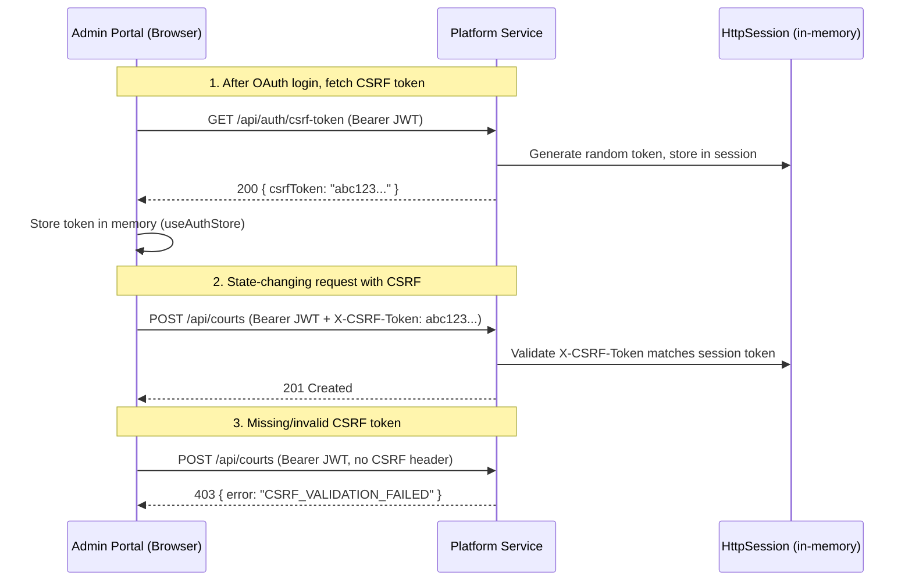
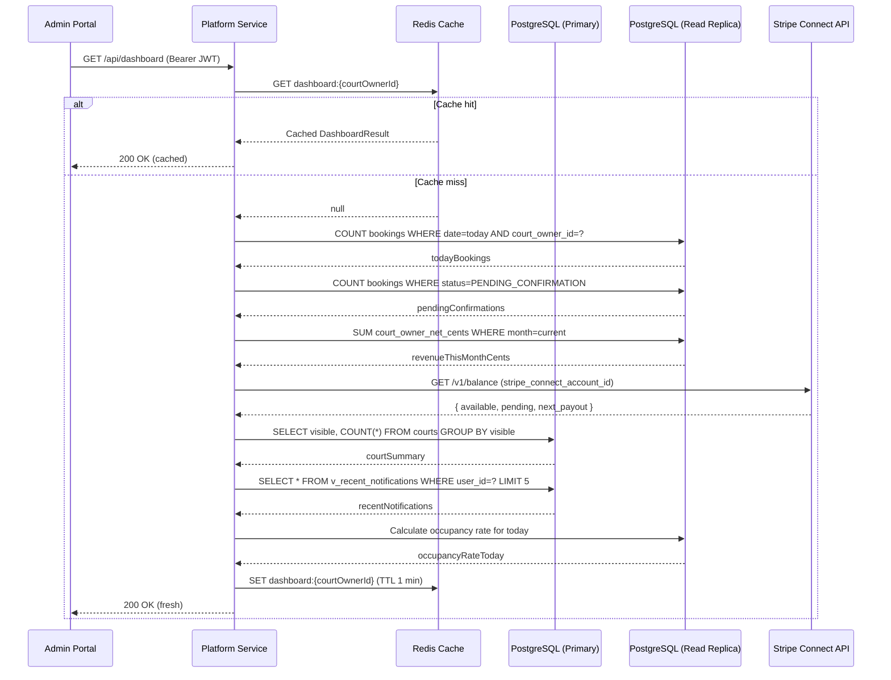
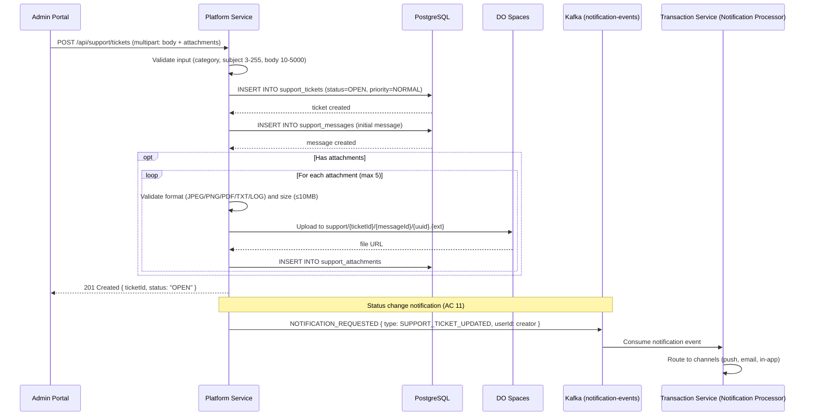
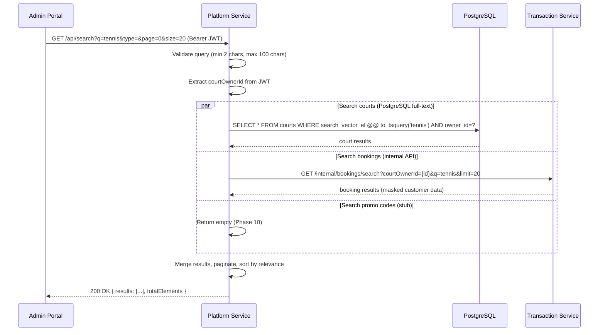
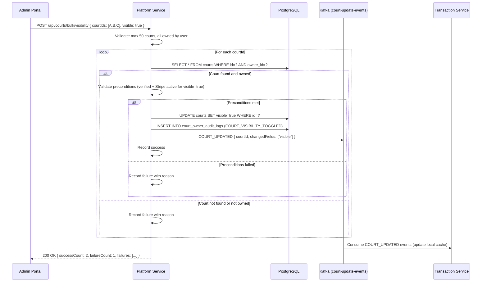

# Design Document — Phase 6: Admin, Analytics & Support

## Overview

Phase 6 implements the admin dashboard, analytics, support ticket system, platform administration, and the React admin web portal for the Court Booking Platform. This phase targets three codebases: `court-booking-platform-service` (analytics API, support tickets, feature flags, admin operations, global search, GDPR export, session management, profile photo), `court-booking-transaction-service` (reminder rule evaluation job, internal booking search API, internal dispute API), and `court-booking-admin-web` (React + Ant Design admin portal).

### Key Capabilities

1. **Enhanced Dashboard**: Today's bookings, revenue summary, occupancy rates, pending actions, "Needs Attention" widget with reminder rule alerts
2. **Analytics API**: Revenue reports, booking trends, occupancy heatmaps using PostgreSQL read replica, with CSV/PDF export and rate limiting
3. **Support Ticket System**: Full CRUD with message threads, file attachments (DigitalOcean Spaces), assignment, status lifecycle, and metrics
4. **Feature Flag Management**: CRUD for platform-wide toggles with Redis caching and cache invalidation
5. **Platform Admin Operations**: User suspend/unsuspend, dispute escalation proxy, platform-wide analytics
6. **Global Search**: Cross-entity search across courts (PostgreSQL full-text search), bookings (internal API to Transaction Service), and promo codes (stub until Phase 10)
7. **Bulk Court Visibility Toggle**: Multi-court visibility update with validation and audit logging
8. **Admin Web Portal**: React 18 + TypeScript + Ant Design 5 + React Router v6 + TanStack Query v5 + react-i18next + Recharts + STOMP WebSocket
9. **Admin UI Security**: CSRF (Synchronizer Token Pattern), session timeout (30 min), data masking, rate limiting (Redis sliding window), CSP headers
10. **Analytics Events Consumer**: Kafka consumer for `analytics-events` topic with idempotent processing
11. **Reminder Rule Evaluation**: Quartz job evaluating UNPAID_BOOKING, PAYMENT_HELD_NOT_CAPTURED, PENDING_CONFIRMATION, NO_CONTACT_MANUAL, LOW_OCCUPANCY rules
12. **GDPR Data Export**: Async ZIP generation (JSON + CSV) stored in DO Spaces with 7-day expiry
13. **Active Sessions Management**: List/revoke sessions from `refresh_tokens` table
14. **Profile Photo Upload**: Image upload to DO Spaces with validation
15. **Multi-Language Support (i18n)**: Accept-Language routing, translations API, react-i18next in admin portal

### Architecture Principles

Following the hexagonal architecture (Buckpal pattern) established in Phases 2-5:
- **Domain Layer**: Pure Java entities and value objects with business logic
- **Application Layer**: Use cases (ports) and services orchestrating domain operations
- **Adapter Layer**: Web controllers, persistence adapters, Kafka consumers, external API clients, Redis adapters

### Design Decisions

| Decision | Rationale |
|----------|-----------|
| Read replica for analytics | Avoids impacting booking performance with heavy aggregation queries |
| Redis sliding window for rate limiting | Per-user rate limiting that works across multiple pods |
| CSRF via Synchronizer Token Pattern | Standard protection for the admin web portal's state-changing requests |
| Proxy pattern for disputes | Platform Service proxies to Transaction Service internal API — keeps admin endpoints centralized |
| PostgreSQL full-text search (tsvector) | Sufficient for court name/description search; avoids Elasticsearch complexity |
| Async GDPR export | Large data exports run as background jobs to avoid request timeouts |
| Ant Design for admin portal | Enterprise-grade component library with built-in table, form, and dashboard components |
| TanStack Query for server state | Stale-while-revalidate caching, automatic refetch, and mutation-based cache invalidation |
| `AbstractRoutingDataSource` for read replica | Spring-native approach; routes by `@Transactional(readOnly=true)` annotation without code changes in services |
| Session-based CSRF token | Stateless JWT auth + session-scoped CSRF token stored in `HttpSession`; admin portal is browser-based so sessions are acceptable for CSRF only |
| `@Async` for GDPR export | Simpler than a message queue for single-service async work; Spring's `@Async` with a bounded thread pool is sufficient |
| User-Agent parsing via `ua-parser` | Lightweight library for extracting device/browser info from User-Agent header for session display |

## Architecture

### High-Level Component Diagram

```
┌─────────────────────────────────────────────────────────────────────────────────┐
│                         Admin Web Portal (React)                                 │
│  ┌──────────┐ ┌──────────┐ ┌──────────┐ ┌──────────┐ ┌──────────┐             │
│  │Dashboard │ │ Courts   │ │Bookings  │ │Analytics │ │ Settings │             │
│  │Page      │ │ Pages    │ │ Pages    │ │ Pages    │ │ Pages    │             │
│  └────┬─────┘ └────┬─────┘ └────┬─────┘ └────┬─────┘ └────┬─────┘             │
│       │             │            │             │            │                    │
│  ┌────┴─────────────┴────────────┴─────────────┴────────────┴──────────────┐    │
│  │  Axios HTTP Client (JWT injection, CSRF, token refresh, error handling) │    │
│  │  STOMP WebSocket Client (SockJS, auto-reconnect, exponential backoff)   │    │
│  └─────────────────────────────────────────────────────────────────────────┘    │
└────────────────────────────────────┬────────────────────────────────────────────┘
                                     │ HTTPS / WSS
                                     ▼
┌─────────────────────────────────────────────────────────────────────────────────┐
│                        NGINX Ingress Controller                                  │
│  /api/auth/*, /api/courts/*, /api/analytics/*, /api/support/*, /api/admin/*     │
│  /api/search/*, /api/users/*, /api/feature-flags/*, /api/settings/*             │
│  → Platform Service                                                              │
│  /api/bookings/*, /api/payments/*, /api/notifications/*, /ws/*                  │
│  → Transaction Service                                                           │
└───────────────┬─────────────────────────────────────┬───────────────────────────┘
                │                                     │
                ▼                                     ▼
┌───────────────────────────────┐   ┌───────────────────────────────────────────┐
│     Platform Service          │   │     Transaction Service                    │
│     (Phase 6 additions)       │   │     (Phase 6 additions)                    │
│                               │   │                                            │
│  Analytics API (read replica) │   │  ReminderRuleEvaluationJob (Quartz)       │
│  Support Ticket System        │◄──┤  Internal Booking Search API              │
│  Feature Flag Management      │   │  Internal Dispute API                      │
│  Admin User Management        │   │                                            │
│  Global Search                │   └──────────────┬────────────────────────────┘
│  Audit Log Query API          │                  │
│  GDPR Data Export             │                  │
│  Session Management           │                  │
│  Profile Photo Upload         │                  │
│  CSRF Token Endpoint          │                  │
│  Rate Limiting (Redis)        │                  │
│  Analytics Events Consumer    │                  │
│  Translations API             │                  │
│  Bulk Visibility Toggle       │                  │
│  i18n / Accept-Language       │                  │
└───────────┬───────────────────┘                  │
            │                                      │
            ▼                                      ▼
┌───────────────┐  ┌────────┐  ┌──────────┐  ┌────────────────┐
│ PostgreSQL    │  │ Redis  │  │ Redpanda │  │ DO Spaces      │
│ + Read Replica│  │        │  │(Kafka)   │  │                │
│               │  │ Cache  │  │          │  │ Support files  │
│ platform      │  │ Rate   │  │analytics │  │ Profile photos │
│ transaction   │  │ Limits │  │-events   │  │ GDPR exports   │
│ (cross-schema)│  │ Flags  │  │          │  │                │
└───────────────┘  └────────┘  └──────────┘  └────────────────┘
```

### Kafka Event Flow (Phase 6)

```
┌─────────────────────────────────────────────────────────────────────────────┐
│                           Kafka Topics (Phase 6)                             │
├─────────────────────────────────────────────────────────────────────────────┤
│                                                                              │
│  analytics-events (NEW consumer)        notification-events (existing)       │
│  ┌────────────────────┐                ┌────────────────────┐               │
│  │ BOOKING_ANALYTICS  │                │ NOTIFICATION_       │               │
│  │ PAYMENT_ANALYTICS  │                │ REQUESTED           │               │
│  │ USER_ANALYTICS     │                │                     │               │
│  └────────────────────┘                │ New types:          │               │
│           │                            │ SUPPORT_TICKET_     │               │
│           ▼                            │   UPDATED           │               │
│  ┌────────────────────┐                │ REMINDER_ALERT      │               │
│  │ Platform Service   │                │ DATA_EXPORT_READY   │               │
│  │ (analytics-consumer│                └────────────────────┘               │
│  │  consumer group)   │                         │                            │
│  └────────────────────┘                         ▼                            │
│                                        ┌────────────────────┐               │
│  court-update-events (existing)        │ Transaction Service │               │
│  ┌────────────────────┐                │ (notification       │               │
│  │ COURT_UPDATED      │◄──────────────│  processor)         │               │
│  │ (visibility toggle)│                └────────────────────┘               │
│  └────────────────────┘                                                     │
│                                                                              │
└─────────────────────────────────────────────────────────────────────────────┘
```

### Read Replica DataSource Configuration

```
┌─────────────────────────────────────────────────────────────────┐
│                    Platform Service                              │
│                                                                  │
│  ┌──────────────────────┐    ┌──────────────────────────────┐   │
│  │ Primary DataSource   │    │ Read Replica DataSource       │   │
│  │ (read-write)         │    │ (read-only)                   │   │
│  │                      │    │                                │   │
│  │ Court CRUD           │    │ Analytics queries              │   │
│  │ Support tickets      │    │ Revenue aggregation            │   │
│  │ Feature flags        │    │ Occupancy heatmap              │   │
│  │ User management      │    │ Platform-wide analytics        │   │
│  │ Audit logs (write)   │    │ CSV/PDF export queries         │   │
│  └──────────┬───────────┘    └──────────────┬───────────────┘   │
│             │                                │                    │
│             ▼                                ▼                    │
│  ┌──────────────────┐         ┌──────────────────────────────┐  │
│  │ PostgreSQL       │────────►│ PostgreSQL Read Replica       │  │
│  │ (Primary)        │  async  │ (Streaming Replication)       │  │
│  └──────────────────┘  repl   └──────────────────────────────┘  │
└─────────────────────────────────────────────────────────────────┘
```

#### Read Replica Spring Boot Configuration

**`application.yml` additions for read replica:**

```yaml
# Phase 6 — Read Replica DataSource
spring:
  datasource:
    primary:
      url: ${DB_PRIMARY_URL:jdbc:postgresql://localhost:5432/courtbooking}
      username: ${DB_PRIMARY_USERNAME:platform_service}
      password: ${DB_PRIMARY_PASSWORD:}
      hikari:
        pool-name: primary-pool
        maximum-pool-size: 10
        minimum-idle: 2
    replica:
      url: ${DB_REPLICA_URL:jdbc:postgresql://localhost:5433/courtbooking}
      username: ${DB_REPLICA_USERNAME:platform_service_readonly}
      password: ${DB_REPLICA_PASSWORD:}
      hikari:
        pool-name: replica-pool
        maximum-pool-size: 15
        minimum-idle: 5
        read-only: true
```

**`ReadReplicaRoutingDataSource` — `AbstractRoutingDataSource` implementation:**

```java
package gr.courtbooking.platform.config;

import org.springframework.jdbc.datasource.lookup.AbstractRoutingDataSource;
import org.springframework.transaction.support.TransactionSynchronizationManager;

/**
 * Routes to the read replica when the current transaction is marked readOnly,
 * otherwise routes to the primary datasource.
 */
public class ReadReplicaRoutingDataSource extends AbstractRoutingDataSource {

    private static final String PRIMARY = "PRIMARY";
    private static final String REPLICA = "REPLICA";

    @Override
    protected Object determineCurrentLookupKey() {
        return TransactionSynchronizationManager.isCurrentTransactionReadOnly()
                ? REPLICA : PRIMARY;
    }
}
```

**`DataSourceConfig` — wires both datasources:**

```java
package gr.courtbooking.platform.config;

import com.zaxxer.hikari.HikariDataSource;
import org.springframework.boot.context.properties.ConfigurationProperties;
import org.springframework.boot.jdbc.DataSourceBuilder;
import org.springframework.context.annotation.Bean;
import org.springframework.context.annotation.Configuration;
import org.springframework.context.annotation.Primary;

import javax.sql.DataSource;
import java.util.Map;

@Configuration
public class DataSourceConfig {

    @Bean
    @ConfigurationProperties("spring.datasource.primary")
    public DataSource primaryDataSource() {
        return DataSourceBuilder.create().type(HikariDataSource.class).build();
    }

    @Bean
    @ConfigurationProperties("spring.datasource.replica")
    public DataSource replicaDataSource() {
        return DataSourceBuilder.create().type(HikariDataSource.class).build();
    }

    @Bean
    @Primary
    public DataSource routingDataSource() {
        ReadReplicaRoutingDataSource routing = new ReadReplicaRoutingDataSource();
        routing.setTargetDataSources(Map.of(
                "PRIMARY", primaryDataSource(),
                "REPLICA", replicaDataSource()
        ));
        routing.setDefaultTargetDataSource(primaryDataSource());
        return routing;
    }
}
```

**Usage in services — `@Transactional(readOnly = true)` routes to replica:**

```java
@Service
@RequiredArgsConstructor
public class AnalyticsService implements GetRevenueAnalyticsUseCase {

    private final AnalyticsReadPort analyticsReadPort;

    @Override
    @Transactional(readOnly = true)  // ← Routes to read replica
    public RevenueAnalyticsResult getRevenue(AnalyticsQuery query) {
        return analyticsReadPort.queryRevenue(
            query.courtOwnerId(), query.from(), query.to(),
            query.courtId(), query.courtType());
    }
}
```

### CSRF Flow Detail

#### CSRF Architecture

The admin web portal is a browser-based SPA that uses JWT for authentication but needs CSRF protection for state-changing requests. The approach uses a session-scoped CSRF token (Synchronizer Token Pattern) alongside the stateless JWT auth.



**Spring Security CSRF filter configuration:**

```java
// Added to SecurityConfig.java — Phase 6 CSRF filter
@Bean
public CsrfValidationFilter csrfValidationFilter() {
    return new CsrfValidationFilter(objectMapper);
}

// In securityFilterChain():
// Insert CSRF filter AFTER JWT auth (needs authenticated principal)
.addFilterAfter(csrfValidationFilter(), JwtAuthenticationFilter.class)
```

**`CsrfValidationFilter` implementation:**

```java
package gr.courtbooking.platform.adapter.in.web.security;

@Component
@Slf4j
public class CsrfValidationFilter extends OncePerRequestFilter {

    private static final Set<String> CSRF_METHODS = Set.of("POST", "PUT", "DELETE", "PATCH");
    private static final String CSRF_HEADER = "X-CSRF-Token";
    private static final String CSRF_SESSION_ATTR = "CSRF_TOKEN";
    // Skip CSRF for internal APIs and auth endpoints
    private static final Set<String> CSRF_EXEMPT_PREFIXES = Set.of(
        "/internal/", "/api/auth/oauth/", "/api/auth/refresh", "/api/auth/csrf-token",
        "/actuator/"
    );

    private final ObjectMapper objectMapper;

    public CsrfValidationFilter(ObjectMapper objectMapper) {
        this.objectMapper = objectMapper;
    }

    @Override
    protected void doFilterInternal(HttpServletRequest request,
                                     HttpServletResponse response,
                                     FilterChain filterChain) throws ServletException, IOException {
        if (!CSRF_METHODS.contains(request.getMethod())) {
            filterChain.doFilter(request, response);
            return;
        }

        String path = request.getRequestURI();
        if (CSRF_EXEMPT_PREFIXES.stream().anyMatch(path::startsWith)) {
            filterChain.doFilter(request, response);
            return;
        }

        // Only enforce CSRF for requests with Origin header (browser requests)
        String origin = request.getHeader("Origin");
        if (origin == null) {
            filterChain.doFilter(request, response);
            return;
        }

        HttpSession session = request.getSession(false);
        String sessionToken = session != null
                ? (String) session.getAttribute(CSRF_SESSION_ATTR) : null;
        String headerToken = request.getHeader(CSRF_HEADER);

        if (sessionToken == null || !sessionToken.equals(headerToken)) {
            response.setStatus(HttpServletResponse.SC_FORBIDDEN);
            response.setContentType("application/json");
            objectMapper.writeValue(response.getOutputStream(),
                Map.of("error", "CSRF_VALIDATION_FAILED",
                       "message", "Invalid or missing CSRF token"));
            return;
        }

        filterChain.doFilter(request, response);
    }
}
```

**`CsrfTokenController` implementation:**

```java
package gr.courtbooking.platform.adapter.in.web;

@RestController
@RequestMapping("/api/auth")
public class CsrfTokenController {

    @GetMapping("/csrf-token")
    public ResponseEntity<Map<String, String>> getCsrfToken(HttpServletRequest request) {
        HttpSession session = request.getSession(true);
        String token = UUID.randomUUID().toString();
        session.setAttribute("CSRF_TOKEN", token);
        session.setMaxInactiveInterval(1800); // 30 min
        return ResponseEntity.ok(Map.of("csrfToken", token));
    }
}
```

**How CSRF interacts with JWT auth flow:**
1. JWT auth is stateless — validated per-request from the `Authorization: Bearer` header
2. CSRF token is session-scoped — stored in `HttpSession` (in-memory, not Redis)
3. The `CsrfValidationFilter` runs AFTER `JwtAuthenticationFilter` so the user is already authenticated
4. CSRF is only enforced for browser requests (detected by `Origin` header presence)
5. Internal service-to-service calls (no `Origin` header) bypass CSRF validation

### i18n / Accept-Language Routing Detail

#### Spring `LocaleResolver` and Interceptor Configuration

```java
package gr.courtbooking.platform.config;

import org.springframework.context.MessageSource;
import org.springframework.context.annotation.Bean;
import org.springframework.context.annotation.Configuration;
import org.springframework.context.support.ReloadableResourceBundleMessageSource;
import org.springframework.web.servlet.LocaleResolver;
import org.springframework.web.servlet.config.annotation.InterceptorRegistry;
import org.springframework.web.servlet.config.annotation.WebMvcConfigurer;
import org.springframework.web.servlet.i18n.AcceptHeaderLocaleResolver;

import java.util.List;
import java.util.Locale;

@Configuration
public class I18nConfig implements WebMvcConfigurer {

    @Bean
    public LocaleResolver localeResolver() {
        AcceptHeaderLocaleResolver resolver = new AcceptHeaderLocaleResolver();
        resolver.setDefaultLocale(Locale.ENGLISH);
        resolver.setSupportedLocales(List.of(
            new Locale("el"),  // Greek
            Locale.ENGLISH     // English
        ));
        return resolver;
    }

    @Bean
    public MessageSource messageSource() {
        ReloadableResourceBundleMessageSource source = new ReloadableResourceBundleMessageSource();
        source.setBasename("classpath:messages");
        source.setDefaultEncoding("UTF-8");
        source.setFallbackToSystemLocale(false);
        return source;
    }

    @Override
    public void addInterceptors(InterceptorRegistry registry) {
        registry.addInterceptor(new ContentLanguageInterceptor());
    }
}
```

**`ContentLanguageInterceptor` — injects `Content-Language` response header:**

```java
package gr.courtbooking.platform.adapter.in.web.interceptor;

import org.springframework.web.servlet.HandlerInterceptor;
import org.springframework.web.servlet.LocaleResolver;
import org.springframework.web.servlet.support.RequestContextUtils;

import jakarta.servlet.http.HttpServletRequest;
import jakarta.servlet.http.HttpServletResponse;

public class ContentLanguageInterceptor implements HandlerInterceptor {

    @Override
    public boolean preHandle(HttpServletRequest request, HttpServletResponse response,
                              Object handler) {
        LocaleResolver resolver = RequestContextUtils.getLocaleResolver(request);
        if (resolver != null) {
            Locale locale = resolver.resolveLocale(request);
            response.setHeader("Content-Language", locale.getLanguage());
        }
        return true;
    }
}
```

**Language resolution priority:**
1. `Accept-Language` HTTP header (if present and supported: `el` or `en`)
2. Authenticated user's `language` preference from `users.language` column (resolved in service layer)
3. Default: `en` (English)

**Court data language fallback logic (in service layer):**

```java
// In CourtResponseMapper or equivalent
public String resolveCourtName(Court court, String requestedLanguage) {
    if ("el".equals(requestedLanguage)) {
        return court.getNameEl() != null ? court.getNameEl()
             : court.getNameEn() != null ? court.getNameEn()
             : "Unnamed Court";
    }
    return court.getNameEn() != null ? court.getNameEn()
         : court.getNameEl() != null ? court.getNameEl()
         : "Unnamed Court";
}
```

**Admin portal i18n initialization and language switching:**

```typescript
// src/lib/i18n.ts
import i18n from 'i18next';
import { initReactI18next } from 'react-i18next';
import HttpBackend from 'i18next-http-backend';

i18n
  .use(HttpBackend)
  .use(initReactI18next)
  .init({
    fallbackLng: 'en',
    supportedLngs: ['el', 'en'],
    ns: ['common', 'dashboard', 'courts', 'bookings', 'analytics', 'support', 'settings', 'admin'],
    defaultNS: 'common',
    backend: {
      loadPath: `${import.meta.env.VITE_PLATFORM_API_URL}/api/admin/translations?namespace={{ns}}&language={{lng}}`,
      // Fallback to local bundles if API unavailable
      allowMultiLoading: false,
    },
    interpolation: { escapeValue: false },
  });

export default i18n;
```

```typescript
// Language switcher component in Header
function LanguageSwitcher() {
  const { i18n } = useTranslation();
  const updateProfile = useUpdateProfile();

  const handleChange = (lang: 'el' | 'en') => {
    i18n.changeLanguage(lang);
    updateProfile.mutate({ language: lang }); // Persist to user profile
  };

  return (
    <Segmented
      value={i18n.language}
      options={[
        { label: 'EL', value: 'el' },
        { label: 'EN', value: 'en' },
      ]}
      onChange={handleChange}
    />
  );
}
```

### Spring Security Configuration for Rate Limiting

The existing `RateLimitFilter` in Platform Service (from Phase 2) is extended for Phase 6 to distinguish read vs write operations.

**Filter ordering in the security filter chain:**

```
Request → RateLimitFilter → JwtAuthenticationFilter → CsrfValidationFilter → SuspendedUserFilter → Controller
```

**Extended `RateLimitFilter` — distinguishes read vs write:**

```java
package gr.courtbooking.platform.adapter.in.web.security;

@Slf4j
public class RateLimitFilter extends OncePerRequestFilter {

    private static final Set<String> WRITE_METHODS = Set.of("POST", "PUT", "DELETE", "PATCH");
    private static final Set<String> EXEMPT_PREFIXES = Set.of(
        "/actuator/", "/internal/", "/api/auth/oauth/", "/api/auth/refresh"
    );

    // Phase 6 rate limits (Req 14.10)
    private static final int READ_LIMIT_PER_MINUTE = 100;
    private static final int WRITE_LIMIT_PER_MINUTE = 30;
    private static final int WINDOW_SECONDS = 60;

    private final RateLimitPort rateLimitPort;
    private final ObjectMapper objectMapper;

    @Override
    protected void doFilterInternal(HttpServletRequest request,
                                     HttpServletResponse response,
                                     FilterChain filterChain) throws ServletException, IOException {
        String path = request.getRequestURI();
        if (EXEMPT_PREFIXES.stream().anyMatch(path::startsWith)) {
            filterChain.doFilter(request, response);
            return;
        }

        // Extract user ID from JWT (if present) for per-user limiting
        String userId = extractUserIdFromJwt(request);
        if (userId == null) {
            filterChain.doFilter(request, response);
            return;
        }

        boolean isWrite = WRITE_METHODS.contains(request.getMethod());
        String limitType = isWrite ? "write" : "read";
        String key = userId + ":" + limitType;
        int limit = isWrite ? WRITE_LIMIT_PER_MINUTE : READ_LIMIT_PER_MINUTE;

        if (!rateLimitPort.isAllowed(key, limit, WINDOW_SECONDS)) {
            long retryAfter = rateLimitPort.getRetryAfterSeconds(key);
            response.setStatus(429);
            response.setHeader("Retry-After", String.valueOf(retryAfter));
            response.setContentType("application/json");
            objectMapper.writeValue(response.getOutputStream(), Map.of(
                "error", "RATE_LIMIT_EXCEEDED",
                "retryAfterSeconds", retryAfter
            ));
            return;
        }

        filterChain.doFilter(request, response);
    }
}
```

### Notification Event Publishing for Support Tickets (Req 6 AC 11)

When a support ticket status changes, Platform Service publishes a `NOTIFICATION_REQUESTED` event to the `notification-events` Kafka topic.

**Event payload structure (follows `kafka-event-contracts.json` `NOTIFICATION_REQUESTED` schema):**

```json
{
  "eventId": "uuid",
  "eventType": "NOTIFICATION_REQUESTED",
  "source": "platform-service",
  "timestamp": "2026-04-17T10:30:00Z",
  "traceId": "...",
  "spanId": "...",
  "payload": {
    "userId": "ticket-creator-uuid",
    "notificationType": "SUPPORT_TICKET_UPDATED",
    "urgency": "STANDARD",
    "title": {
      "el": "Ενημέρωση αιτήματος υποστήριξης",
      "en": "Support ticket updated"
    },
    "body": {
      "el": "Το αίτημα #TKT-1234 άλλαξε κατάσταση σε: Σε εξέλιξη",
      "en": "Ticket #TKT-1234 status changed to: In Progress"
    },
    "data": {
      "ticketId": "ticket-uuid",
      "deepLink": "/support/tickets/ticket-uuid"
    },
    "channels": ["PUSH", "EMAIL", "IN_APP"]
  }
}
```

**Integration in `SupportTicketService`:**

```java
@Override
public SupportTicket updateStatus(UUID ticketId, String newStatus, String resolutionNotes) {
    SupportTicket ticket = ticketPersistencePort.loadById(ticketId)
        .orElseThrow(() -> new TicketNotFoundException(ticketId));
    ticket.transitionTo(newStatus);
    if (resolutionNotes != null) ticket.setResolutionNotes(resolutionNotes);
    SupportTicket saved = ticketPersistencePort.save(ticket);

    // Publish notification to ticket creator
    notificationEventPublisherPort.publishNotificationRequested(
        NotificationRequestedEvent.builder()
            .userId(ticket.getUserId())
            .notificationType("SUPPORT_TICKET_UPDATED")
            .urgency("STANDARD")
            .titleEl("Ενημέρωση αιτήματος υποστήριξης")
            .titleEn("Support ticket updated")
            .bodyEl("Το αίτημα #" + ticketId.toString().substring(0, 8) + " άλλαξε κατάσταση σε: " + newStatus)
            .bodyEn("Ticket #" + ticketId.toString().substring(0, 8) + " status changed to: " + newStatus)
            .data(Map.of("ticketId", ticketId.toString(), "deepLink", "/support/tickets/" + ticketId))
            .channels(List.of("PUSH", "EMAIL", "IN_APP"))
            .build()
    );

    return saved;
}
```

### GDPR Export Job Implementation Detail

**Triggering mechanism — `@Async` with bounded thread pool:**

```java
@Configuration
@EnableAsync
public class AsyncConfig {

    @Bean("gdprExportExecutor")
    public Executor gdprExportExecutor() {
        ThreadPoolTaskExecutor executor = new ThreadPoolTaskExecutor();
        executor.setCorePoolSize(2);
        executor.setMaxPoolSize(4);
        executor.setQueueCapacity(20);
        executor.setThreadNamePrefix("gdpr-export-");
        executor.setRejectedExecutionHandler(new ThreadPoolExecutor.CallerRunsPolicy());
        executor.initialize();
        return executor;
    }
}
```

**`GdprDataExportService` implementation:**

```java
@Service
@RequiredArgsConstructor
@Slf4j
public class GdprDataExportService implements RequestDataExportUseCase, GetDataExportQuery {

    private final LoadCourtPort loadCourtPort;
    private final AuditLogPort auditLogPort;
    private final UserManagementPort userManagementPort;
    private final AnalyticsReadPort analyticsReadPort;
    private final DataExportStoragePort exportStoragePort;
    private final ExportRateLimitPort exportRateLimitPort;
    private final NotificationEventPublisherPort notificationPublisher;
    private final DataExportStatusPort exportStatusPort;  // Redis-backed status tracking

    @Override
    public DataExportRequest requestExport(UserId userId) {
        if (exportRateLimitPort.isRateLimited(userId, "gdpr-export")) {
            throw new ExportRateLimitExceededException(
                exportRateLimitPort.getRetryAfterSeconds(userId, "gdpr-export"));
        }

        UUID exportId = UUID.randomUUID();
        DataExportRequest request = new DataExportRequest(
            exportId, userId, "PROCESSING", null,
            Instant.now(), null, null);

        // Track status in Redis: key = gdpr-export:{exportId}, TTL = 8 days
        exportStatusPort.save(request);
        exportRateLimitPort.recordExport(userId, "gdpr-export");

        // Trigger async generation
        generateExportAsync(userId, exportId);

        return request;
    }

    @Async("gdprExportExecutor")
    public void generateExportAsync(UserId userId, UUID exportId) {
        try {
            // 1. Collect data from all sources
            UserDetail profile = userManagementPort.loadUserDetail(userId.value())
                .orElseThrow();
            List<Court> courts = loadCourtPort.loadByOwnerId(userId);
            // Bookings fetched via cross-schema view
            // Revenue data from analytics read port

            // 2. Generate JSON + CSV files
            byte[] profileJson = objectMapper.writeValueAsBytes(profile);
            byte[] courtsJson = objectMapper.writeValueAsBytes(courts);
            byte[] courtsCsv = generateCourtsCsv(courts);
            // ... bookings, revenue similarly

            // 3. Bundle into ZIP
            byte[] zipData = createZipArchive(Map.of(
                "profile.json", profileJson,
                "courts.json", courtsJson,
                "courts.csv", courtsCsv
                // ... bookings.json, bookings.csv, revenue.json, revenue.csv
            ));

            // 4. Upload to DO Spaces: exports/{userId}/{exportId}.zip
            String downloadUrl = exportStoragePort.storeExport(userId, exportId, zipData);

            // 5. Update status
            exportStatusPort.save(new DataExportRequest(
                exportId, userId, "READY", downloadUrl,
                Instant.now(), Instant.now(),
                Instant.now().plus(7, ChronoUnit.DAYS)));

            // 6. Notify user
            notificationPublisher.publishNotificationRequested(/* DATA_EXPORT_READY event */);

        } catch (Exception e) {
            log.error("GDPR export failed for user={}, exportId={}", userId, exportId, e);
            exportStatusPort.save(new DataExportRequest(
                exportId, userId, "FAILED", null,
                Instant.now(), null, null));
        }
    }
}
```

**Export status tracking — Redis (not a database table):**

Redis key: `gdpr-export:{exportId}` with 8-day TTL. Value is a JSON-serialized `DataExportRequest` record. This avoids adding a new database table for a transient status that expires after 7 days.

### Session Management Implementation Detail

**User-Agent parsing for device/browser extraction:**

```java
// Using ua-parser library (com.github.ua-parser:uap-java)
package gr.courtbooking.platform.application.service;

import ua_parser.Client;
import ua_parser.Parser;

@Service
@RequiredArgsConstructor
public class SessionManagementService implements ListActiveSessionsQuery, RevokeSessionUseCase {

    private final RefreshTokenPersistencePort refreshTokenPort;
    private final AuditLogPort auditLogPort;
    private final Parser uaParser = new Parser();

    @Override
    @Transactional(readOnly = true)
    public List<SessionInfo> listSessions(UserId userId) {
        return refreshTokenPort.loadActiveByUserId(userId).stream()
            .map(token -> {
                Client client = uaParser.parse(token.getDeviceInfo());
                return new SessionInfo(
                    token.getId(),
                    extractDeviceType(client),       // "Desktop", "Mobile", "Tablet"
                    client.userAgent.family + " " + client.userAgent.major,  // "Chrome 120"
                    maskIpAddress(token.getIpAddress()),  // "192.168.***.***"
                    token.getLastUsedAt(),
                    token.getId().equals(getCurrentSessionId(userId))  // current session flag
                );
            })
            .toList();
    }

    @Override
    public void revokeSession(UUID sessionId, UserId userId) {
        RefreshToken token = refreshTokenPort.loadById(sessionId)
            .orElseThrow(() -> new SessionNotFoundException(sessionId));

        if (!token.getUserId().equals(userId.value())) {
            throw new ForbiddenException("Cannot revoke another user's session");
        }

        // Prevent revoking current session
        if (sessionId.equals(getCurrentSessionId(userId))) {
            throw new CannotRevokeCurrentSessionException();
        }

        refreshTokenPort.invalidate(sessionId);

        auditLogPort.log(AuditLogEntry.of(
            userId, null, "SESSION_REVOKED", "REFRESH_TOKEN", sessionId,
            Map.of("deviceInfo", token.getDeviceInfo(),
                   "ipAddress", maskIpAddress(token.getIpAddress())),
            null, null));
    }

    private String maskIpAddress(String ip) {
        if (ip == null) return "***.***.***";
        String[] parts = ip.split("\\.");
        if (parts.length == 4) {
            return parts[0] + "." + parts[1] + ".***.***";
        }
        // IPv6: mask last 4 groups
        return ip.replaceAll(":[^:]+:[^:]+:[^:]+:[^:]+$", ":****:****:****:****");
    }

    private String extractDeviceType(Client client) {
        if (client.device.family.contains("Mobile") || client.device.family.contains("iPhone"))
            return "Mobile";
        if (client.device.family.contains("Tablet") || client.device.family.contains("iPad"))
            return "Tablet";
        return "Desktop";
    }
}
```

**`SessionInfo` domain model:**

```java
public record SessionInfo(
    UUID sessionId,
    String deviceType,    // "Desktop", "Mobile", "Tablet"
    String browser,       // "Chrome 120", "Safari 17", "Firefox 121"
    String ipAddress,     // Partially masked: "192.168.***.***"
    Instant lastActivity,
    boolean current       // true if this is the requesting session
) {}
```

**Current session detection:** The current session is identified by matching the refresh token hash from the request's cookie/header against the `refresh_tokens` table entries for the user.

### Sequence Diagrams

#### Dashboard Data Aggregation Flow



#### Support Ticket Creation with Notification



#### Global Search Across Services



#### Bulk Visibility Toggle with Kafka Events



### application.yml Configuration Snippets (Phase 6 Additions)

```yaml
# ── Phase 6 additions to platform-service application.yml ──

spring:
  # Read Replica DataSource (see DataSourceConfig.java for wiring)
  datasource:
    primary:
      url: ${DB_PRIMARY_URL:jdbc:postgresql://localhost:5432/courtbooking}
      username: ${DB_PRIMARY_USERNAME:platform_service}
      password: ${DB_PRIMARY_PASSWORD:}
      hikari:
        pool-name: primary-pool
        maximum-pool-size: 10
        minimum-idle: 2
    replica:
      url: ${DB_REPLICA_URL:jdbc:postgresql://localhost:5433/courtbooking}
      username: ${DB_REPLICA_USERNAME:platform_service_readonly}
      password: ${DB_REPLICA_PASSWORD:}
      hikari:
        pool-name: replica-pool
        maximum-pool-size: 15
        minimum-idle: 5
        read-only: true

  # Async thread pool for GDPR exports
  task:
    execution:
      pool:
        core-size: 2
        max-size: 4
        queue-capacity: 20
      thread-name-prefix: gdpr-export-

# Kafka consumer for analytics-events
app:
  kafka:
    topics:
      analytics-events: analytics-events
    consumer:
      analytics-events:
        group-id: platform-service-analytics-consumer
        auto-offset-reset: latest

# Redis configuration for rate limiting, feature flags, export limits
cache:
  feature-flags:
    ttl: ${CACHE_FEATURE_FLAGS_TTL:5m}
  rate-limit:
    read:
      max-requests: 100
      window-seconds: 60
    write:
      max-requests: 30
      window-seconds: 60
  export-limit:
    max-per-day: 10
    ttl: 24h
  gdpr-export-limit:
    max-per-day: 10
    ttl: 24h
  reminder-fired:
    ttl: 30d
  reminder-dismissed:
    ttl: 30d

# GDPR export storage
gdpr:
  export:
    storage-path-prefix: exports
    expiry-days: 7

# Profile photo storage
profile:
  photo:
    storage-path-prefix: profiles
    max-size-bytes: 2097152  # 2 MB
    accepted-formats: JPEG,PNG,WEBP
```

**Quartz job configuration for `ReminderRuleEvaluationJob` (Transaction Service `application.yml`):**

```yaml
# ── Phase 6 additions to transaction-service application.yml ──

# Quartz job for reminder rule evaluation
app:
  jobs:
    reminder-rule-evaluation:
      cron: "0 0/30 * * * ?"   # Every 30 minutes
      enabled: ${REMINDER_RULE_EVALUATION_ENABLED:true}

  # Internal API to Platform Service for fetching reminder rules
  platform-service:
    base-url: ${PLATFORM_SERVICE_URL:http://court-booking-platform-service:8080}
    internal-api-key: ${INTERNAL_API_KEY:}
    reminder-rules-endpoint: /internal/reminder-rules/active
```

### Admin Web Portal Routing Configuration

**Route definitions with lazy loading and role-based guards:**

```typescript
// src/app/routes/index.tsx
import { lazy, Suspense } from 'react';
import { createBrowserRouter, Navigate } from 'react-router-dom';
import { AppLayout } from '@/components/layout/AppLayout';
import { ProtectedRoute } from './ProtectedRoute';
import { RoleGuard } from './RoleGuard';
import { PageSkeleton } from '@/components/feedback/PageSkeleton';

// Lazy-loaded page components
const LoginPage = lazy(() => import('@/features/auth/pages/LoginPage'));
const DashboardPage = lazy(() => import('@/features/dashboard/pages/DashboardPage'));
const CourtListPage = lazy(() => import('@/features/courts/pages/CourtListPage'));
const CourtFormPage = lazy(() => import('@/features/courts/pages/CourtFormPage'));
const CourtDetailPage = lazy(() => import('@/features/courts/pages/CourtDetailPage'));
const BookingListPage = lazy(() => import('@/features/bookings/pages/BookingListPage'));
const BookingCalendarPage = lazy(() => import('@/features/bookings/pages/BookingCalendarPage'));
const PendingBookingsPage = lazy(() => import('@/features/bookings/pages/PendingBookingsPage'));
const ManualBookingPage = lazy(() => import('@/features/bookings/pages/ManualBookingPage'));
const BookingDetailPage = lazy(() => import('@/features/bookings/pages/BookingDetailPage'));
const RevenueAnalyticsPage = lazy(() => import('@/features/analytics/pages/RevenueAnalyticsPage'));
const UsageAnalyticsPage = lazy(() => import('@/features/analytics/pages/UsageAnalyticsPage'));
const HeatmapPage = lazy(() => import('@/features/analytics/pages/HeatmapPage'));
const SupportTicketListPage = lazy(() => import('@/features/support/pages/SupportTicketListPage'));
const SupportTicketDetailPage = lazy(() => import('@/features/support/pages/SupportTicketDetailPage'));
const SettingsPage = lazy(() => import('@/features/settings/pages/SettingsPage'));
const AuditLogPage = lazy(() => import('@/features/settings/pages/AuditLogPage'));
const HolidayCalendarPage = lazy(() => import('@/features/courts/pages/HolidayCalendarPage'));

// Admin-only pages
const AdminUserManagementPage = lazy(() => import('@/features/admin/pages/UserManagementPage'));
const AdminVerificationQueuePage = lazy(() => import('@/features/admin/pages/VerificationQueuePage'));
const AdminFeatureFlagsPage = lazy(() => import('@/features/admin/pages/FeatureFlagsPage'));
const AdminPlatformAnalyticsPage = lazy(() => import('@/features/admin/pages/PlatformAnalyticsPage'));
const AdminDisputesPage = lazy(() => import('@/features/admin/pages/DisputesPage'));
const AdminSupportPage = lazy(() => import('@/features/admin/pages/AdminSupportPage'));

const withSuspense = (Component: React.LazyExoticComponent<any>) => (
  <Suspense fallback={<PageSkeleton />}>
    <Component />
  </Suspense>
);

export const router = createBrowserRouter([
  { path: '/login', element: withSuspense(LoginPage) },

  {
    path: '/',
    element: <ProtectedRoute><AppLayout /></ProtectedRoute>,
    children: [
      { index: true, element: <Navigate to="/dashboard" replace /> },
      { path: 'dashboard', element: withSuspense(DashboardPage) },

      // Court management
      { path: 'courts', element: withSuspense(CourtListPage) },
      { path: 'courts/new', element: withSuspense(CourtFormPage) },
      { path: 'courts/:courtId', element: withSuspense(CourtDetailPage) },
      { path: 'courts/:courtId/edit', element: withSuspense(CourtFormPage) },
      { path: 'holidays', element: withSuspense(HolidayCalendarPage) },

      // Booking management
      { path: 'bookings', element: withSuspense(BookingListPage) },
      { path: 'bookings/calendar', element: withSuspense(BookingCalendarPage) },
      { path: 'bookings/pending', element: withSuspense(PendingBookingsPage) },
      { path: 'bookings/manual', element: withSuspense(ManualBookingPage) },
      { path: 'bookings/:bookingId', element: withSuspense(BookingDetailPage) },

      // Analytics
      { path: 'analytics/revenue', element: withSuspense(RevenueAnalyticsPage) },
      { path: 'analytics/usage', element: withSuspense(UsageAnalyticsPage) },
      { path: 'analytics/heatmap', element: withSuspense(HeatmapPage) },

      // Support
      { path: 'support', element: withSuspense(SupportTicketListPage) },
      { path: 'support/:ticketId', element: withSuspense(SupportTicketDetailPage) },

      // Settings
      { path: 'settings', element: withSuspense(SettingsPage) },
      { path: 'audit-log', element: withSuspense(AuditLogPage) },

      // Admin-only routes (PLATFORM_ADMIN)
      {
        path: 'admin',
        element: <RoleGuard requiredRole="PLATFORM_ADMIN" />,
        children: [
          { path: 'users', element: withSuspense(AdminUserManagementPage) },
          { path: 'verifications', element: withSuspense(AdminVerificationQueuePage) },
          { path: 'feature-flags', element: withSuspense(AdminFeatureFlagsPage) },
          { path: 'analytics', element: withSuspense(AdminPlatformAnalyticsPage) },
          { path: 'disputes', element: withSuspense(AdminDisputesPage) },
          { path: 'support', element: withSuspense(AdminSupportPage) },
        ],
      },
    ],
  },
]);
```

**`ProtectedRoute` — redirects unauthenticated users:**

```typescript
// src/app/routes/ProtectedRoute.tsx
function ProtectedRoute({ children }: { children: ReactNode }) {
  const { isAuthenticated, isLoading } = useAuthStore();

  if (isLoading) return <PageSkeleton />;
  if (!isAuthenticated) return <Navigate to="/login" replace />;

  return <>{children}</>;
}
```

**`RoleGuard` — protects admin-only routes:**

```typescript
// src/app/routes/RoleGuard.tsx
function RoleGuard({ requiredRole }: { requiredRole: string }) {
  const user = useAuthStore((s) => s.user);

  if (!user || user.role !== requiredRole) {
    return <Navigate to="/dashboard" replace />;
  }

  return <Outlet />;
}
```

### Admin Portal State Management Detail

**Auth store (Zustand):**

```typescript
// src/stores/authStore.ts
import { create } from 'zustand';
import { devtools } from 'zustand/middleware';

type AuthState = {
  user: User | null;
  accessToken: string | null;
  csrfToken: string | null;
  isAuthenticated: boolean;
  isLoading: boolean;
  login: (oauthProvider: string, oauthToken: string) => Promise<void>;
  logout: () => void;
  refreshToken: () => Promise<void>;
  fetchCsrfToken: () => Promise<void>;
  setUser: (user: User) => void;
};

export const useAuthStore = create<AuthState>()(
  devtools((set, get) => ({
    user: null,
    accessToken: null,
    csrfToken: null,
    isAuthenticated: false,
    isLoading: true,

    login: async (oauthProvider, oauthToken) => {
      const { accessToken, refreshToken, user } = await authApi.login(oauthProvider, oauthToken);
      set({ user, accessToken, isAuthenticated: true, isLoading: false });
      // Store refresh token in httpOnly cookie (set by server)
      // Fetch CSRF token after login
      await get().fetchCsrfToken();
    },

    logout: () => {
      authApi.logout().catch(() => {});
      set({ user: null, accessToken: null, csrfToken: null, isAuthenticated: false });
    },

    refreshToken: async () => {
      try {
        const { accessToken } = await authApi.refresh();
        set({ accessToken });
      } catch {
        get().logout();
      }
    },

    fetchCsrfToken: async () => {
      const { csrfToken } = await authApi.getCsrfToken();
      set({ csrfToken });
    },

    setUser: (user) => set({ user }),
  }))
);
```

**UI store (Zustand):**

```typescript
// src/stores/uiStore.ts
import { create } from 'zustand';
import { persist } from 'zustand/middleware';

type UIState = {
  sidebarCollapsed: boolean;
  theme: 'light' | 'dark';
  toggleSidebar: () => void;
  setTheme: (theme: 'light' | 'dark') => void;
};

export const useUIStore = create<UIState>()(
  persist(
    (set) => ({
      sidebarCollapsed: false,
      theme: 'light',
      toggleSidebar: () => set((s) => ({ sidebarCollapsed: !s.sidebarCollapsed })),
      setTheme: (theme) => set({ theme }),
    }),
    { name: 'ui-preferences' }
  )
);
```

**TanStack Query configuration:**

```typescript
// src/app/providers/QueryProvider.tsx
import { QueryClient, QueryClientProvider } from '@tanstack/react-query';

const queryClient = new QueryClient({
  defaultOptions: {
    queries: {
      staleTime: 5 * 60 * 1000,       // 5 minutes
      gcTime: 10 * 60 * 1000,         // 10 minutes (formerly cacheTime)
      retry: 1,
      refetchOnWindowFocus: true,
    },
    mutations: {
      retry: 0,
    },
  },
});

// Query key factories per feature
export const dashboardKeys = {
  all: ['dashboard'] as const,
  summary: () => [...dashboardKeys.all, 'summary'] as const,
};

export const courtKeys = {
  all: ['courts'] as const,
  lists: () => [...courtKeys.all, 'list'] as const,
  list: (filters: CourtFilters) => [...courtKeys.lists(), filters] as const,
  details: () => [...courtKeys.all, 'detail'] as const,
  detail: (id: string) => [...courtKeys.details(), id] as const,
};

export const bookingKeys = {
  all: ['bookings'] as const,
  lists: () => [...bookingKeys.all, 'list'] as const,
  list: (filters: BookingFilters) => [...bookingKeys.lists(), filters] as const,
  pending: () => [...bookingKeys.all, 'pending'] as const,
  detail: (id: string) => [...bookingKeys.all, 'detail', id] as const,
};

export const analyticsKeys = {
  revenue: (params: AnalyticsParams) => ['analytics', 'revenue', params] as const,
  usage: (params: AnalyticsParams) => ['analytics', 'usage', params] as const,
  heatmap: (params: AnalyticsParams) => ['analytics', 'heatmap', params] as const,
};
```

### Scheduled Jobs (Phase 6 additions)

| Job | Service | Schedule | Description | Requirement |
|-----|---------|----------|-------------|-------------|
| `ReminderRuleEvaluationJob` | Transaction Service | Every 30 min (Quartz) | Evaluates all active reminder rules against booking data | Req 18 |
| `GdprDataExportJob` | Platform Service | On-demand (`@Async`) | Generates ZIP archive of user data | Req 21 |

### Database Migrations (Flyway)

| Migration | Service | Description |
|-----------|---------|-------------|
| `V8__phase6_schema_changes.sql` | Platform Service | ALTER `reminder_rules.rule_type` CHECK, ADD `PAYOUT_ISSUES` to `support_tickets.category`, CREATE `admin_audit_logs` table, CREATE `v_recent_notifications` view, ADD `tsvector` columns + GIN indexes on `courts` |


## Components and Interfaces

### Platform Service — Incoming Ports (Use Cases)

#### Analytics (Req 2, 3, 4)

```java
public interface GetRevenueAnalyticsUseCase {
    RevenueAnalyticsResult getRevenue(AnalyticsQuery query);
}

public interface GetUsageAnalyticsUseCase {
    UsageAnalyticsResult getUsage(AnalyticsQuery query);
}

public interface GetOccupancyHeatmapUseCase {
    HeatmapResult getHeatmap(AnalyticsQuery query);
}

public interface ExportAnalyticsUseCase {
    byte[] exportCsv(AnalyticsQuery query);
    byte[] exportPdf(AnalyticsQuery query);
}

public record AnalyticsQuery(
    UserId courtOwnerId, LocalDate from, LocalDate to,
    UUID courtId, String courtType
) {
    public AnalyticsQuery {
        requireNonNull(courtOwnerId); requireNonNull(from); requireNonNull(to);
        if (from.isAfter(to)) throw new InvalidDateRangeException("from must be before to");
        if (ChronoUnit.DAYS.between(from, to) > 365) throw new InvalidDateRangeException("Date range must not exceed 365 days");
    }
}
```

#### Dashboard Enhancement (Req 1)

```java
public interface GetDashboardUseCase {
    DashboardResult getDashboard(UserId courtOwnerId);
}

public record DashboardResult(
    int todayBookings, int pendingConfirmations, long revenueThisMonthCents,
    LocalDate nextPayoutDate, Long nextPayoutAmountCents, double occupancyRateToday,
    ActionRequired actionRequired, List<RecentNotification> recentNotifications,
    CourtSummary courtSummary, String verificationStatus, String stripeConnectStatus
) {
    public record ActionRequired(int pendingBookings, int unpaidManualBookings,
                                  int expiringPromos, int reminderAlerts) {}
    public record RecentNotification(UUID id, String type, String message,
                                      Instant createdAt, boolean read) {}
    public record CourtSummary(int totalCourts, int visibleCourts, int hiddenCourts) {}
}
```

#### Audit Log Query (Req 5)

```java
public interface QueryAuditLogUseCase {
    Page<AuditLogEntry> getAuditLogs(AuditLogQuery query, Pageable pageable);
}

public record AuditLogQuery(UserId courtOwnerId, Instant from, Instant to, String action, UUID courtId) {}

public interface QueryAdminAuditLogUseCase {
    Page<AuditLogEntry> getAdminAuditLogs(UUID targetCourtOwnerId, AuditLogQuery query, Pageable pageable);
}
```

#### Support Ticket System (Req 6, 7)

```java
public interface CreateSupportTicketUseCase { SupportTicket createTicket(CreateTicketCommand command); }
public interface ListSupportTicketsQuery {
    Page<SupportTicketSummary> listTickets(UserId userId, String status, Pageable pageable);
    Page<SupportTicketSummary> listAllTickets(String status, String priority, Pageable pageable);
}
public interface GetSupportTicketQuery { SupportTicketDetail getTicket(UUID ticketId, UserId requesterId); }
public interface AddSupportMessageUseCase { SupportMessage addMessage(AddMessageCommand command); }
public interface UploadSupportAttachmentUseCase { SupportAttachment uploadAttachment(UUID ticketId, UUID messageId, FileUpload file); }
public interface AssignSupportTicketUseCase { SupportTicket assignTicket(UUID ticketId, UUID assigneeId); }
public interface UpdateSupportTicketStatusUseCase { SupportTicket updateStatus(UUID ticketId, String newStatus, String resolutionNotes); }
public interface GetSupportMetricsQuery { SupportMetrics getMetrics(LocalDate from, LocalDate to); }
```

#### Feature Flag Management (Req 8)

```java
public interface ListFeatureFlagsQuery { List<FeatureFlag> listFlags(); }
public interface GetFeatureFlagQuery { Optional<FeatureFlag> getFlag(String flagKey); }
public interface UpdateFeatureFlagUseCase { FeatureFlag updateFlag(String flagKey, boolean enabled, UserId updatedBy); }
public interface CreateFeatureFlagUseCase { FeatureFlag createFlag(String flagKey, String description, boolean enabled, UserId createdBy); }
public interface DeleteFeatureFlagUseCase { void deleteFlag(String flagKey); }
```

#### Admin User Management (Req 9)

```java
public interface ListUsersQuery { Page<UserSummary> listUsers(UserSearchCriteria criteria, Pageable pageable); }
public interface GetUserDetailQuery { UserDetail getUserDetail(UUID userId); }
public interface SuspendUserUseCase { void suspendUser(UUID userId, String reason, UserId adminId); }
public interface UnsuspendUserUseCase { void unsuspendUser(UUID userId, UserId adminId); }
```

#### Dispute Escalation (Req 10), Platform Analytics (Req 11), Global Search (Req 12)

```java
public interface ListDisputesQuery { Page<DisputeSummary> listDisputes(String status, Pageable pageable); }
public interface GetDisputeDetailQuery { DisputeDetail getDisputeDetail(UUID disputeId); }
public interface AddDisputeNoteUseCase { void addNote(UUID disputeId, String note, boolean visibleToParties, UserId adminId); }
public interface GetPlatformAnalyticsQuery { PlatformAnalyticsResult getPlatformAnalytics(LocalDate from, LocalDate to); }
public interface GlobalSearchUseCase { SearchResult search(SearchQuery query); }
```

#### Bulk Visibility Toggle (Req 13), CSRF (Req 14), GDPR Export (Req 21), Sessions (Req 22), Profile Photo (Req 23), Translations (Req 30)

```java
// Extends existing BulkCourtOperationsUseCase
public interface BulkCourtOperationsUseCase {
    BulkOperationResult bulkUpdatePricing(BulkPricingCommand command);
    BulkOperationResult bulkUpdateAvailabilityWindows(BulkAvailabilityCommand command);
    BulkOperationResult bulkToggleVisibility(BulkVisibilityCommand command);
    BulkOperationResult cloneCourtConfig(CloneCourtConfigCommand command);
}
public interface GetCsrfTokenUseCase { String getCsrfToken(HttpServletRequest request); }
public interface RequestDataExportUseCase { DataExportRequest requestExport(UserId userId); }
public interface GetDataExportQuery { DataExportStatus getExportStatus(UUID exportId, UserId userId); }
public interface ListActiveSessionsQuery { List<SessionInfo> listSessions(UserId userId); }
public interface RevokeSessionUseCase { void revokeSession(UUID sessionId, UserId userId); }
public interface UploadProfilePhotoUseCase { String uploadPhoto(UserId userId, FileUpload photo); }
public interface DeleteProfilePhotoUseCase { void deletePhoto(UserId userId); }
public interface ListTranslationsQuery { List<Translation> listTranslations(String namespace, String language); }
public interface UpsertTranslationUseCase { Translation upsertTranslation(String key, String namespace, String language, String value); }
```

### Platform Service — Outgoing Ports (SPIs)

```java
// ── Analytics Persistence (Read Replica) ──
public interface AnalyticsReadPort {
    RevenueAnalyticsResult queryRevenue(UserId courtOwnerId, LocalDate from, LocalDate to, UUID courtId, String courtType);
    UsageAnalyticsResult queryUsage(UserId courtOwnerId, LocalDate from, LocalDate to, UUID courtId, String courtType);
    HeatmapResult queryHeatmap(UserId courtOwnerId, LocalDate from, LocalDate to, UUID courtId, String courtType);
    PlatformAnalyticsResult queryPlatformAnalytics(LocalDate from, LocalDate to);
    int countTodayBookings(UserId courtOwnerId);
    long sumRevenueThisMonth(UserId courtOwnerId);
    double calculateOccupancyToday(UserId courtOwnerId);
}

// ── Support Ticket Persistence ──
public interface SupportTicketPersistencePort { /* save, loadById, loadByUserId, loadAll, computeMetrics */ }
public interface SupportMessagePersistencePort { /* save, loadByTicketId, findFirstNonCreatorMessageTime */ }
public interface SupportAttachmentPersistencePort { /* save, loadByMessageId, countByMessageId */ }

// ── Feature Flag Persistence + Cache ──
public interface FeatureFlagPersistencePort { /* loadAll, loadByKey, save, deleteByKey */ }
public interface FeatureFlagCachePort { /* get, put, putAll, invalidate, invalidateAll */ }

// ── Admin Audit Log, User Management, Search, Transaction Service Proxy ──
public interface AdminAuditLogPersistencePort { void log(AdminAuditLogEntry entry); }
public interface UserManagementPort { /* searchUsers, loadUserDetail, updateUserStatus, invalidateAllRefreshTokens */ }
public interface CourtSearchPort { /* searchCourts, searchCourtsGlobal */ }
public interface TransactionServicePort { /* searchBookings, searchBookingsGlobal, listDisputes, getDisputeDetail, addDisputeNote */ }

// ── Rate Limiting, Export, Storage ──
public interface ExportRateLimitPort { boolean isRateLimited(UserId userId, String limitType); void recordExport(UserId userId, String limitType); long getRetryAfterSeconds(UserId userId, String limitType); }
public interface DataExportStoragePort { String storeExport(UserId userId, UUID exportId, byte[] zipData); Optional<String> getDownloadUrl(UUID exportId); }
public interface DataExportStatusPort { void save(DataExportRequest request); Optional<DataExportRequest> load(UUID exportId); }
public interface ProfilePhotoStoragePort { String uploadPhoto(UserId userId, FileUpload photo); void deletePhoto(String photoUrl); }
public interface StripeConnectPayoutPort { Optional<PayoutInfo> getNextPayout(String stripeConnectAccountId); }
public interface RateLimitPort { boolean isAllowed(String key, int maxRequests, int windowSeconds); long getRetryAfterSeconds(String key); }
public interface TranslationPersistencePort { List<Translation> loadByNamespaceAndLanguage(String namespace, String language); Translation upsert(Translation translation); }
public interface ReminderDismissedPort { void dismiss(UUID ruleId, UUID bookingId); boolean isDismissed(UUID ruleId, UUID bookingId); }
```

### Transaction Service — New Ports (Phase 6)

```java
// Internal API for booking search and disputes
public interface SearchBookingsInternalQuery { List<BookingSearchResult> searchBookings(UUID courtOwnerId, String query, int limit); List<BookingSearchResult> searchBookingsGlobal(String query, int limit); }
public interface ListDisputesInternalQuery { Page<DisputeSummary> listDisputes(String status, Pageable pageable); DisputeDetail getDisputeDetail(UUID disputeId); }
public interface AddDisputeNoteInternalUseCase { void addNote(UUID disputeId, String note, boolean visibleToParties, UUID adminId); }

// Reminder Rule Evaluation
public interface EvaluateReminderRulesUseCase { void evaluateAllRules(); }
public interface ReminderRuleFetchPort { List<ReminderRuleInfo> getAllActiveRules(); }
public interface ReminderFiredTrackingPort { boolean hasFired(UUID ruleId, UUID bookingId); void markFired(UUID ruleId, UUID bookingId); boolean isDismissed(UUID ruleId, UUID bookingId); }
```

### Web Controllers — Platform Service (Phase 6)

| Controller | Endpoints | Description | Requirement |
|------------|-----------|-------------|-------------|
| `AnalyticsController` | `GET /api/analytics/revenue`, `GET /api/analytics/usage`, `GET /api/analytics/heatmap`, `GET /api/analytics/export` | Analytics API with export | Req 2, 3, 4 |
| `AuditLogController` | `GET /api/audit-logs` | Court owner audit log query | Req 5 |
| `SupportTicketController` | `POST/GET /api/support/tickets`, `GET .../tickets/{id}`, `POST .../tickets/{id}/messages`, `POST .../attachments`, `PUT .../assign`, `PUT .../status` | Support ticket system | Req 6 |
| `AdminSupportController` | `GET /api/admin/support/metrics` | Support metrics | Req 7 |
| `AdminFeatureFlagController` | `GET/POST/PUT/DELETE /api/admin/feature-flags/*` | Feature flag CRUD | Req 8 |
| `FeatureFlagController` | `GET /api/feature-flags/{flagKey}` | Public flag endpoint | Req 8 |
| `AdminUserController` | `GET /api/admin/users`, `GET .../users/{id}`, `POST .../suspend`, `POST .../unsuspend` | User management | Req 9 |
| `AdminDisputeController` | `GET /api/admin/disputes`, `GET .../disputes/{id}`, `POST .../disputes/{id}/notes` | Dispute escalation | Req 10 |
| `AdminAnalyticsController` | `GET /api/admin/analytics` | Platform-wide analytics | Req 11 |
| `AdminAuditLogController` | `GET /api/admin/audit-logs` | Admin audit log query | Req 5 |
| `SearchController` | `GET /api/search` | Court owner global search | Req 12 |
| `AdminSearchController` | `GET /api/admin/search` | Admin global search | Req 12 |
| `BulkVisibilityController` | `POST /api/courts/bulk/visibility` | Bulk visibility toggle | Req 13 |
| `CourtCloneController` | `POST /api/courts/{id}/clone` | Clone court config | Req 13 |
| `CsrfTokenController` | `GET /api/auth/csrf-token` | CSRF token endpoint | Req 14 |
| `DataExportController` | `POST /api/users/me/data-export`, `GET .../data-exports/{id}` | GDPR export | Req 21 |
| `SessionController` | `GET /api/users/me/sessions`, `DELETE .../sessions/{id}` | Session management | Req 22 |
| `ProfilePhotoController` | `POST/DELETE /api/users/me/profile-photo` | Profile photo | Req 23 |
| `AdminTranslationsController` | `GET/PUT /api/admin/translations` | Translations management | Req 30 |

### Web Controllers — Transaction Service (Phase 6)

| Controller | Endpoints | Description | Requirement |
|------------|-----------|-------------|-------------|
| `InternalBookingSearchController` | `GET /internal/bookings/search` | Booking search for global search | Req 12 |
| `InternalDisputeController` | `GET /internal/disputes`, `GET .../disputes/{id}`, `POST .../disputes/{id}/notes` | Dispute proxy for admin | Req 10 |
| `InternalReminderRulesController` | `GET /internal/reminder-rules/active` | Active rules for evaluation job | Req 18 |


## Data Models

### New Domain Entities — Platform Service

#### SupportTicket

```java
public class SupportTicket {
    private UUID id;
    private UserId userId;
    private String category;    // BOOKING, PAYMENT, COURT, ACCOUNT, TECHNICAL, PAYOUT_ISSUES, OTHER
    private String subject;
    private String status;      // OPEN, IN_PROGRESS, WAITING_ON_USER, RESOLVED, CLOSED
    private String priority;    // LOW, NORMAL, HIGH, URGENT
    private UUID assignedTo;
    private UUID relatedBookingId;
    private UUID relatedCourtId;
    private Map<String, Object> diagnosticData;
    private Instant createdAt;
    private Instant updatedAt;
    private Instant resolvedAt;

    public void transitionTo(String newStatus) {
        if (!isValidTransition(this.status, newStatus))
            throw new InvalidStatusTransitionException(this.status, newStatus);
        this.status = newStatus;
        this.updatedAt = Instant.now();
        if ("RESOLVED".equals(newStatus)) this.resolvedAt = Instant.now();
    }

    private static boolean isValidTransition(String from, String to) {
        return switch (from + "->" + to) {
            case "OPEN->IN_PROGRESS", "IN_PROGRESS->WAITING_ON_USER",
                 "IN_PROGRESS->RESOLVED", "WAITING_ON_USER->IN_PROGRESS",
                 "RESOLVED->CLOSED" -> true;
            default -> "CLOSED".equals(to); // any -> CLOSED (admin only)
        };
    }
}
```

#### Other Domain Records

```java
public record SupportMessage(UUID id, UUID ticketId, UUID senderId, String body, List<SupportAttachment> attachments, Instant createdAt) {}
public record SupportAttachment(UUID id, UUID messageId, String fileUrl, String fileName, int fileSizeBytes, String mimeType, Instant createdAt) {}
public record FeatureFlag(UUID id, String flagKey, boolean enabled, String description, UUID updatedBy, Instant updatedAt) {}
public record AdminAuditLogEntry(UUID id, UUID adminId, UUID targetUserId, String action, String reason, Map<String, Object> metadata, String ipAddress, Instant createdAt) {}
public record Translation(UUID id, String namespace, String key, String language, String value, Instant createdAt, Instant updatedAt) {}
public record DataExportRequest(UUID exportId, UserId userId, String status, String downloadUrl, Instant requestedAt, Instant completedAt, Instant expiresAt) {}
public record SessionInfo(UUID sessionId, String deviceType, String browser, String ipAddress, Instant lastActivity, boolean current) {}
```

### Analytics Response Models

```java
public record RevenueAnalyticsResult(
    Period period, int totalBookings, int confirmedBookings, int cancelledBookings, int noShows,
    long revenueGrossCents, long platformFeesCents, long revenueNetCents,
    List<CourtBreakdown> courtBreakdown, PeriodComparison previousPeriodComparison
) {
    public record Period(LocalDate from, LocalDate to) {}
    public record CourtBreakdown(UUID courtId, String courtName, int bookings, long revenueCents, double occupancyRate) {}
    public record PeriodComparison(double bookingsChange, double revenueChange) {}
}

public record UsageAnalyticsResult(
    RevenueAnalyticsResult.Period period, double occupancyRate,
    List<PeakHour> peakHours, List<CourtUsageBreakdown> courtBreakdown
) {
    public record PeakHour(String dayOfWeek, int hour, int bookingCount) {}
    public record CourtUsageBreakdown(UUID courtId, String courtName, int bookings, double occupancyRate) {}
}

public record HeatmapResult(RevenueAnalyticsResult.Period period, List<DayHeatmap> heatmap) {
    public record DayHeatmap(String dayOfWeek, List<HourCell> hours) {}
    public record HourCell(int hour, int bookingCount, double occupancyRate) {}
}

public record PlatformAnalyticsResult(
    RevenueAnalyticsResult.Period period, int totalUsers, int newUsersInPeriod, int totalCourtOwners,
    int totalCourts, int totalBookings, long totalRevenueCents, long totalPlatformFeesCents, int activeUsers,
    List<CourtTypeCount> bookingsByCourtType, List<TopCourt> topCourts, List<UserGrowthPoint> userGrowth
) {
    public record CourtTypeCount(String courtType, int count) {}
    public record TopCourt(UUID courtId, String courtName, int bookings, long revenueCents) {}
    public record UserGrowthPoint(LocalDate date, int newUsers, int cumulativeUsers) {}
}
```

### Database Schema Changes (Flyway Migration V8)

```sql
-- V8__phase6_schema_changes.sql

-- 1. ALTER reminder_rules.rule_type CHECK constraint
ALTER TABLE platform.reminder_rules DROP CONSTRAINT IF EXISTS reminder_rules_rule_type_check;
ALTER TABLE platform.reminder_rules ADD CONSTRAINT reminder_rules_rule_type_check
    CHECK (rule_type IN ('UNPAID_BOOKING','PAYMENT_HELD_NOT_CAPTURED','PENDING_CONFIRMATION','NO_CONTACT_MANUAL','LOW_OCCUPANCY'));

-- 2. ADD PAYOUT_ISSUES to support_tickets.category
ALTER TABLE platform.support_tickets DROP CONSTRAINT IF EXISTS support_tickets_category_check;
ALTER TABLE platform.support_tickets ADD CONSTRAINT support_tickets_category_check
    CHECK (category IN ('BOOKING','PAYMENT','COURT','ACCOUNT','TECHNICAL','PAYOUT_ISSUES','OTHER'));

-- 3. CREATE admin_audit_logs table
CREATE TABLE platform.admin_audit_logs (
    id UUID PRIMARY KEY DEFAULT gen_random_uuid(),
    admin_id UUID NOT NULL REFERENCES platform.users(id),
    target_user_id UUID NOT NULL REFERENCES platform.users(id),
    action VARCHAR(50) NOT NULL,
    reason TEXT,
    metadata JSONB,
    ip_address VARCHAR(45),
    created_at TIMESTAMPTZ NOT NULL DEFAULT NOW()
);
CREATE INDEX idx_admin_audit_logs_admin ON platform.admin_audit_logs(admin_id);
CREATE INDEX idx_admin_audit_logs_target ON platform.admin_audit_logs(target_user_id);
CREATE INDEX idx_admin_audit_logs_created ON platform.admin_audit_logs(created_at);

-- 4. CREATE v_recent_notifications cross-schema view
CREATE OR REPLACE VIEW platform.v_recent_notifications AS
SELECT id, user_id, notification_type AS type, title AS message, created_at,
       CASE WHEN status = 'READ' THEN true ELSE false END AS read
FROM transaction.notifications
WHERE created_at > NOW() - INTERVAL '30 days';
GRANT SELECT ON platform.v_recent_notifications TO platform_service_role;

-- 5. ADD tsvector columns and GIN indexes for full-text search
ALTER TABLE platform.courts ADD COLUMN IF NOT EXISTS search_vector_el tsvector;
ALTER TABLE platform.courts ADD COLUMN IF NOT EXISTS search_vector_en tsvector;
CREATE INDEX IF NOT EXISTS idx_courts_search_el ON platform.courts USING GIN(search_vector_el);
CREATE INDEX IF NOT EXISTS idx_courts_search_en ON platform.courts USING GIN(search_vector_en);

CREATE OR REPLACE FUNCTION platform.courts_search_vector_update() RETURNS trigger AS $
BEGIN
    NEW.search_vector_el := to_tsvector('simple',
        coalesce(NEW.name_el, '') || ' ' || coalesce(NEW.description_el, '') || ' ' || coalesce(NEW.address, ''));
    NEW.search_vector_en := to_tsvector('english',
        coalesce(NEW.name_en, '') || ' ' || coalesce(NEW.description_en, '') || ' ' || coalesce(NEW.address, ''));
    RETURN NEW;
END;
$ LANGUAGE plpgsql;

CREATE TRIGGER courts_search_vector_trigger
    BEFORE INSERT OR UPDATE ON platform.courts
    FOR EACH ROW EXECUTE FUNCTION platform.courts_search_vector_update();

UPDATE platform.courts SET search_vector_el = to_tsvector('simple',
    coalesce(name_el, '') || ' ' || coalesce(description_el, '') || ' ' || coalesce(address, ''));
UPDATE platform.courts SET search_vector_en = to_tsvector('english',
    coalesce(name_en, '') || ' ' || coalesce(description_en, '') || ' ' || coalesce(address, ''));
```

### Admin Web Portal — Project Structure

```
court-booking-admin-web/
├── public/
│   └── locales/                    # Fallback i18n bundles
│       ├── el/translation.json
│       └── en/translation.json
├── src/
│   ├── app/
│   │   ├── providers/              # QueryClient, Theme, Auth, I18n, WebSocket
│   │   ├── routes/                 # Route definitions, guards, lazy loading
│   │   └── App.tsx
│   ├── features/
│   │   ├── auth/                   # OAuth login, token management, CSRF
│   │   ├── dashboard/              # Dashboard page, stat cards, needs-attention
│   │   ├── courts/                 # Court list, create/edit, availability, pricing
│   │   ├── bookings/               # Booking list, calendar, pending queue, manual
│   │   ├── analytics/              # Revenue, usage, heatmap, export
│   │   ├── support/                # Ticket list, detail, create
│   │   ├── settings/               # Profile, notifications, reminders, defaults, security
│   │   ├── admin/                  # Users, verifications, flags, platform analytics, disputes
│   │   └── search/                 # Global search
│   ├── components/
│   │   ├── layout/                 # AppLayout, Sidebar, Header, Breadcrumb
│   │   ├── ui/                     # Shared UI primitives
│   │   └── feedback/               # ErrorBoundary, LoadingSkeleton, RateLimitAlert
│   ├── hooks/                      # useAuth, useWebSocket, useRateLimit, useSessionTimeout
│   ├── lib/                        # Axios instance, WebSocket client, i18n config
│   ├── services/                   # API client functions
│   ├── stores/                     # Zustand stores (auth, ui)
│   ├── types/                      # Generated API types, shared types
│   └── utils/                      # formatCurrency, maskPii, dateUtils
├── .env.local
├── .env.staging
├── .env.production
├── Dockerfile
├── vite.config.ts
├── tsconfig.json
└── package.json
```

### Key Admin Portal Implementation Details

#### Axios Instance with CSRF and Token Refresh

```typescript
// src/lib/axios.ts
const apiClient = axios.create({
  baseURL: import.meta.env.VITE_PLATFORM_API_URL,
  withCredentials: true,
});

apiClient.interceptors.request.use(async (config) => {
  const token = useAuthStore.getState().accessToken;
  if (token) config.headers.Authorization = `Bearer ${token}`;

  if (['post', 'put', 'delete', 'patch'].includes(config.method ?? '')) {
    const csrfToken = useAuthStore.getState().csrfToken;
    if (csrfToken) config.headers['X-CSRF-Token'] = csrfToken;
  }
  return config;
});

apiClient.interceptors.response.use(
  (response) => response,
  async (error) => {
    if (error.response?.status === 401 && !error.config._retry) {
      error.config._retry = true;
      await useAuthStore.getState().refreshToken();
      return apiClient(error.config);
    }
    return Promise.reject(error);
  }
);
```

#### Session Timeout Implementation

```typescript
// src/hooks/useSessionTimeout.ts
const TIMEOUT_MS = 30 * 60 * 1000;
const WARNING_MS = 25 * 60 * 1000;

function useSessionTimeout() {
  const [showWarning, setShowWarning] = useState(false);
  const lastActivity = useRef(Date.now());

  useEffect(() => {
    const resetTimer = () => { lastActivity.current = Date.now(); };
    const events = ['mousedown', 'keydown', 'scroll', 'touchstart'];
    events.forEach(e => window.addEventListener(e, resetTimer));

    const interval = setInterval(() => {
      const elapsed = Date.now() - lastActivity.current;
      if (elapsed >= TIMEOUT_MS) useAuthStore.getState().logout();
      else if (elapsed >= WARNING_MS) setShowWarning(true);
    }, 10_000);

    return () => {
      events.forEach(e => window.removeEventListener(e, resetTimer));
      clearInterval(interval);
    };
  }, []);

  return { showWarning, extendSession: () => setShowWarning(false) };
}
```

#### Data Masking Utility

```typescript
// src/utils/maskPii.ts
export function maskEmail(email: string): string {
  const [local, domain] = email.split('@');
  return `${local[0]}***@${domain}`;
}

export function maskPhone(phone: string): string {
  if (phone.length < 6) return '***';
  return `${phone.slice(0, 6)}** *** *${phone.slice(-2)}`;
}
```

#### Rate Limiting — Platform Service (Redis Sliding Window)

```java
@Component
@RequiredArgsConstructor
public class RateLimitRedisAdapter implements RateLimitPort {

    private final StringRedisTemplate redisTemplate;

    @Override
    public boolean isAllowed(String key, int maxRequests, int windowSeconds) {
        String redisKey = "rate-limit:" + key;
        long now = Instant.now().toEpochMilli();
        long windowStart = now - (windowSeconds * 1000L);

        redisTemplate.opsForZSet().removeRangeByScore(redisKey, 0, windowStart);
        Long count = redisTemplate.opsForZSet().zCard(redisKey);
        if (count != null && count >= maxRequests) return false;

        redisTemplate.opsForZSet().add(redisKey, String.valueOf(now), now);
        redisTemplate.expire(redisKey, Duration.ofSeconds(windowSeconds));
        return true;
    }

    @Override
    public long getRetryAfterSeconds(String key) {
        String redisKey = "rate-limit:" + key;
        Set<String> oldest = redisTemplate.opsForZSet().range(redisKey, 0, 0);
        if (oldest == null || oldest.isEmpty()) return 0;
        long oldestTs = Long.parseLong(oldest.iterator().next());
        long retryAt = oldestTs + 60_000;
        return Math.max(0, (retryAt - Instant.now().toEpochMilli()) / 1000);
    }
}
```

#### Occupancy Rate Calculation Algorithm

```java
public double calculateOccupancyRate(UUID courtId, LocalDate from, LocalDate to) {
    List<AvailabilityWindow> windows = loadAvailabilityPort.loadWindowsByCourtId(courtId);
    List<AvailabilityOverride> overrides = loadAvailabilityPort
        .loadOverridesByCourtIdAndDateRange(courtId, from, to);

    long totalAvailableMinutes = 0;
    for (LocalDate date = from; !date.isAfter(to); date = date.plusDays(1)) {
        DayOfWeek dow = date.getDayOfWeek();
        for (AvailabilityWindow w : windows) {
            if (w.dayOfWeek().equals(dow.name())) {
                long windowMinutes = Duration.between(w.startTime(), w.endTime()).toMinutes();
                long blockedMinutes = overrides.stream()
                    .filter(o -> o.date().equals(date))
                    .mapToLong(o -> overlapMinutes(w, o))
                    .sum();
                totalAvailableMinutes += (windowMinutes - blockedMinutes);
            }
        }
    }

    long bookedMinutes = analyticsReadPort.sumBookedMinutes(courtId, from, to);
    if (totalAvailableMinutes == 0) return 0.0;
    return Math.min(1.0, (double) bookedMinutes / totalAvailableMinutes);
}
```

#### Reminder Rule Evaluation Job (Transaction Service)

```java
@Component
@RequiredArgsConstructor
@Slf4j
public class ReminderRuleEvaluationJob implements Job {

    private final ReminderRuleFetchPort reminderRuleFetchPort;
    private final LoadBookingPort loadBookingPort;
    private final ReminderFiredTrackingPort trackingPort;
    private final NotificationEventPublisherPort notificationPublisher;

    @Override
    public void execute(JobExecutionContext context) {
        List<ReminderRuleInfo> rules = reminderRuleFetchPort.getAllActiveRules();

        for (ReminderRuleInfo rule : rules) {
            if (!rule.enabled()) continue;

            List<Booking> matchingBookings = switch (rule.ruleType()) {
                case "UNPAID_BOOKING" -> findUnpaidBookings(rule);
                case "PAYMENT_HELD_NOT_CAPTURED" -> findHeldPayments(rule);
                case "PENDING_CONFIRMATION" -> findPendingConfirmations(rule);
                case "NO_CONTACT_MANUAL" -> findNoContactManual(rule);
                case "LOW_OCCUPANCY" -> List.of();
                default -> List.of();
            };

            for (Booking booking : matchingBookings) {
                if (trackingPort.hasFired(rule.id(), booking.getId())
                    || trackingPort.isDismissed(rule.id(), booking.getId())) continue;
                publishReminderNotification(rule, booking);
                trackingPort.markFired(rule.id(), booking.getId());
            }

            if ("LOW_OCCUPANCY".equals(rule.ruleType())) evaluateLowOccupancy(rule);
        }
    }
}
```

#### Analytics Events Kafka Consumer (Platform Service)

```java
@Component
@RequiredArgsConstructor
@Slf4j
public class AnalyticsEventKafkaConsumer {

    private final DashboardCachePort dashboardCachePort;
    private final NotificationDeduplicationPort deduplicationPort;

    @KafkaListener(topics = "analytics-events", groupId = "platform-service-analytics-consumer",
                   properties = {"auto.offset.reset=latest"})
    public void consume(ConsumerRecord<String, String> record) {
        try {
            JsonNode envelope = objectMapper.readTree(record.value());
            String eventId = envelope.get("eventId").asText();
            if (deduplicationPort.isProcessed(eventId)) return;

            String eventType = envelope.get("eventType").asText();
            JsonNode payload = envelope.get("payload");

            switch (eventType) {
                case "BOOKING_ANALYTICS" -> handleBookingAnalytics(payload);
                case "PAYMENT_ANALYTICS" -> handlePaymentAnalytics(payload);
                case "USER_ANALYTICS" -> handleUserAnalytics(payload);
                default -> log.warn("Unknown analytics event type: {}", eventType);
            }
            deduplicationPort.markProcessed(eventId);
        } catch (Exception e) {
            log.warn("Failed to process analytics event: {}", e.getMessage());
        }
    }

    private void handleBookingAnalytics(JsonNode payload) {
        UUID courtOwnerId = UUID.fromString(payload.get("courtOwnerId").asText());
        dashboardCachePort.invalidate(new UserId(courtOwnerId));
    }
}
```


## Correctness Properties

*A property is a characteristic or behavior that should hold true across all valid executions of a system — essentially, a formal statement about what the system should do. Properties serve as the bridge between human-readable specifications and machine-verifiable correctness guarantees.*

### Property 1: Occupancy Rate Bounded Range

*For any* court, date range, and set of bookings, the computed occupancy rate SHALL always be between 0.0 and 1.0 inclusive. This applies to dashboard occupancy, analytics occupancy, and heatmap cell occupancy.

**Validates: Requirements 1.7, 2.5, 3.4, 20.4**

### Property 2: Revenue Decomposition Invariant

*For any* analytics response (revenue report), `revenueGrossCents` SHALL equal `platformFeesCents + revenueNetCents`. This invariant holds regardless of the date range, court filter, or court type filter.

**Validates: Requirements 2.1, 20.3**

### Property 3: Date Range Validation

*For any* date range where the number of days between `from` and `to` exceeds 365, the analytics and export endpoints SHALL reject the request with a 400 error. Conversely, any date range of 365 days or fewer SHALL be accepted (assuming `from <= to`).

**Validates: Requirements 2.2, 4.6**

### Property 4: Comparison Period Symmetry

*For any* analytics request with a date range of N days, the `previousPeriodComparison` SHALL be computed over a preceding period of exactly N days. The comparison period length SHALL always equal the requested period length.

**Validates: Requirements 2.3, 20.11**

### Property 5: Audit Log Filter Correctness

*For any* audit log query filtered by date range `[from, to]`, every returned entry's `createdAt` timestamp SHALL satisfy `from <= createdAt <= to`. No entries outside the range SHALL be returned.

**Validates: Requirements 5.1, 20.10**

### Property 6: Audit Log Isolation

*For any* court owner querying their audit logs, the result set SHALL contain only entries where `courtOwnerId` matches the authenticated user. No entries belonging to other court owners SHALL be returned.

**Validates: Requirements 5.3**

### Property 7: Support Ticket State Machine

*For any* support ticket status transition request, the resulting status SHALL be reachable from the current status according to the defined state machine: OPEN→IN_PROGRESS, IN_PROGRESS→WAITING_ON_USER, IN_PROGRESS→RESOLVED, WAITING_ON_USER→IN_PROGRESS, RESOLVED→CLOSED, any→CLOSED (admin only). Invalid transitions SHALL be rejected with 422.

**Validates: Requirements 6.9, 20.7**

### Property 8: Support Ticket Isolation

*For any* user listing their support tickets, the result set SHALL contain only tickets where `userId` matches the authenticated user. PLATFORM_ADMIN and SUPPORT_AGENT users are exempt and may see all tickets.

**Validates: Requirements 6.2**

### Property 9: Feature Flag Read-After-Write Consistency

*For any* feature flag update (setting `enabled` to true or false), reading the flag immediately after the update SHALL return the new value. The cache invalidation ensures this consistency.

**Validates: Requirements 8.2, 20.9**

### Property 10: Search Result Isolation

*For any* global search query by a court owner, all returned results SHALL contain only entities owned by the authenticated court owner. No results belonging to other court owners SHALL be included. PLATFORM_ADMIN searches are exempt from this constraint.

**Validates: Requirements 12.1, 20.8**

### Property 11: Bulk Operation Completeness

*For any* bulk visibility toggle operation with N court IDs, `successCount + failureCount` SHALL equal N. Every court ID in the input SHALL appear in either the success or failure set, with no court ID missing or duplicated.

**Validates: Requirements 13.1, 20.6**

### Property 12: Reminder Deduplication

*For any* reminder rule and booking combination, the evaluation job SHALL produce at most one notification event. Re-evaluating the same rule against the same booking SHALL not produce a duplicate notification. Similarly, if a reminder has been dismissed, re-evaluation SHALL not produce a notification for that rule-booking pair.

**Validates: Requirements 18.8, 18.10**

### Property 13: Disabled Rule Isolation

*For any* reminder rule with `active = false`, the evaluation job SHALL never produce notification events for that rule, regardless of how many matching bookings exist.

**Validates: Requirements 18.1, 18.9, 20.15**

### Property 14: Analytics Additivity

*For any* valid date range, computing analytics for the full period and then computing analytics for two non-overlapping sub-periods that together cover the same range SHALL produce totals where `subPeriod1.totalBookings + subPeriod2.totalBookings == fullPeriod.totalBookings`.

**Validates: Requirements 20.1**

### Property 15: Court Summary Partition Invariant

*For any* court owner with N courts, the dashboard `courtSummary.totalCourts` SHALL equal `courtSummary.visibleCourts + courtSummary.hiddenCourts`. The visible and hidden counts form a complete partition of all courts.

**Validates: Requirements 20.2**

### Property 16: CSV Export Round-Trip

*For any* analytics data set, exporting to CSV and then parsing the CSV file and summing the `revenueNetCents` column SHALL produce a value equal to the `revenueNetCents` from the corresponding analytics API response.

**Validates: Requirements 20.5**

### Property 17: GDPR Export Completeness

*For any* court owner requesting a GDPR data export, the set of court IDs in the exported `courts.json` file SHALL equal the set of court IDs returned by `GET /api/courts/owner/me` for that user. No courts SHALL be missing from the export.

**Validates: Requirements 20.13**

### Property 18: Session Revocation Consistency

*For any* session revocation operation, listing active sessions via `GET /api/users/me/sessions` immediately after revoking a session SHALL NOT include the revoked session ID in the result set.

**Validates: Requirements 20.14**


## Error Handling

### Platform Service Error Handling

| Error Scenario | HTTP Status | Error Code | Response Body |
|---------------|-------------|------------|---------------|
| Invalid date range (> 365 days) | 400 | `INVALID_DATE_RANGE` | `{ error, message, maxDays: 365 }` |
| Court not owned by user | 403 | `FORBIDDEN` | `{ error, message }` |
| Export rate limit exceeded | 429 | `EXPORT_RATE_LIMIT_EXCEEDED` | `{ error, maxExportsPerDay: 10, retryAfterSeconds }` |
| API rate limit exceeded | 429 | `RATE_LIMIT_EXCEEDED` | `{ error, retryAfterSeconds }` + `Retry-After` header |
| Invalid ticket status transition | 422 | `INVALID_STATUS_TRANSITION` | `{ error, currentStatus, requestedStatus }` |
| User already suspended | 422 | `USER_ALREADY_SUSPENDED` | `{ error }` |
| User not suspended | 422 | `USER_NOT_SUSPENDED` | `{ error }` |
| Feature flag key exists | 409 | `FLAG_KEY_EXISTS` | `{ error }` |
| Invalid file format | 400 | `INVALID_FILE_FORMAT` | `{ error, acceptedFormats }` |
| File too large | 400 | `FILE_TOO_LARGE` | `{ error, maxSizeBytes }` |
| Bulk limit exceeded | 400 | `BULK_LIMIT_EXCEEDED` | `{ error, maxCourts: 50 }` |
| Cannot revoke current session | 422 | `CANNOT_REVOKE_CURRENT_SESSION` | `{ error, message }` |
| GDPR export rate limited | 429 | `DATA_EXPORT_RATE_LIMIT_EXCEEDED` | `{ error, maxExportsPerDay: 10, retryAfterSeconds }` |
| Assignee not admin | 400 | `ASSIGNEE_NOT_ADMIN` | `{ error }` |
| Search query too short | 400 | `QUERY_TOO_SHORT` | `{ error, minLength: 2 }` |
| Search query too long | 400 | `QUERY_TOO_LONG` | `{ error, maxLength: 100 }` |
| CSRF token missing/invalid | 403 | `CSRF_VALIDATION_FAILED` | `{ error }` |

### Admin Web Portal Error Handling Strategy

| Error Type | Handling |
|-----------|----------|
| Network errors (timeout, 5xx) | Ant Design `notification.error()` toast with "Something went wrong" + Retry button |
| Client errors (4xx) | Display specific error message from API `message` field |
| 401 Unauthorized | Silent token refresh via `POST /api/auth/refresh`, automatic request retry |
| 429 Rate Limited | Read `Retry-After` header, display countdown timer in `Alert` component, disable action button |
| 409 Conflict (optimistic locking) | Display conflict resolution dialog showing diff between local and server state |
| Form validation errors | Inline field-level errors via Ant Design `Form.Item` with server-side error mapping |
| WebSocket disconnect | Display "Live updates paused" indicator, exponential backoff reconnection |

### Graceful Degradation

| Component | Degradation Behavior |
|-----------|---------------------|
| Redis cache unavailable | Dashboard computes directly from database (slower but functional) |
| Read replica unavailable | Analytics queries fall back to primary database |
| Stripe Connect API unavailable | Dashboard shows `nextPayoutDate: null`, `nextPayoutAmountCents: null` |
| Transaction Service internal API unavailable | Global search returns only court results (booking search omitted) |
| WebSocket disconnected | Admin portal shows stale data with "Live updates paused" indicator |
| DigitalOcean Spaces unavailable | File uploads return 503 with retry guidance |


## Testing Strategy

### Property-Based Testing

Property-based tests use **jqwik** (Java) for Platform Service and Transaction Service, and **fast-check** (TypeScript) for the Admin Web Portal. Each property test runs a minimum of 100 iterations.

Tag format: `Feature: phase-6-admin-analytics-support, Property {number}: {title}`

#### Platform Service Property Tests (jqwik)

| Property | Test Class | Generator Strategy |
|----------|-----------|-------------------|
| P1: Occupancy Rate Bounded | `OccupancyRatePropertyTest` | Generate random availability windows (0-7 per day), random bookings (0-50), random date ranges (1-30 days). Verify rate ∈ [0.0, 1.0] |
| P2: Revenue Decomposition | `RevenueDecompositionPropertyTest` | Generate random bookings with random amounts (100-50000 cents), random platform fee percentages (5-15%). Verify gross = fees + net |
| P3: Date Range Validation | `DateRangeValidationPropertyTest` | Generate random date pairs. Verify ranges > 365 days rejected, ≤ 365 accepted |
| P4: Comparison Period Symmetry | `ComparisonPeriodPropertyTest` | Generate random date ranges (1-365 days). Verify comparison period length equals request period length |
| P5: Audit Log Filter | `AuditLogFilterPropertyTest` | Generate random audit entries with random timestamps, random filter ranges. Verify all returned entries within range |
| P6: Audit Log Isolation | `AuditLogIsolationPropertyTest` | Generate random court owners (2-5) with random audit entries. Verify each owner sees only their own |
| P7: Ticket State Machine | `TicketStateMachinePropertyTest` | Generate random (currentStatus, requestedStatus) pairs from all combinations. Verify only valid transitions succeed |
| P8: Ticket Isolation | `TicketIsolationPropertyTest` | Generate random users (2-5) with random tickets. Verify each user sees only their own |
| P9: Flag Read-After-Write | `FeatureFlagConsistencyPropertyTest` | Generate random flag keys and boolean values. Update then read, verify consistency |
| P10: Search Isolation | `SearchIsolationPropertyTest` | Generate random court owners with random courts. Search, verify all results belong to searcher |
| P11: Bulk Completeness | `BulkVisibilityCompletenessPropertyTest` | Generate random court ID lists (1-50), mix of owned/non-owned. Verify success + failure = total |
| P14: Analytics Additivity | `AnalyticsAdditivityPropertyTest` | Generate random date ranges, split into two sub-periods. Verify booking count additivity |
| P15: Court Summary Partition | `CourtSummaryPartitionPropertyTest` | Generate random courts with random visibility. Verify total = visible + hidden |
| P16: CSV Round-Trip | `CsvExportRoundTripPropertyTest` | Generate random analytics data, export CSV, parse, verify totals match |
| P17: GDPR Completeness | `GdprExportCompletenessPropertyTest` | Generate random courts for a user, export, verify all court IDs present |
| P18: Session Revocation | `SessionRevocationPropertyTest` | Generate random sessions, revoke one, list, verify revoked absent |

#### Transaction Service Property Tests (jqwik)

| Property | Test Class | Generator Strategy |
|----------|-----------|-------------------|
| P12: Reminder Dedup | `ReminderDeduplicationPropertyTest` | Generate random rules and bookings. Evaluate twice, verify at most one notification per rule-booking pair |
| P13: Disabled Rule Isolation | `DisabledRuleIsolationPropertyTest` | Generate random rules with active=false and matching bookings. Evaluate, verify zero notifications |

#### Admin Web Portal Property Tests (fast-check)

| Property | Test File | Generator Strategy |
|----------|----------|-------------------|
| P7: Ticket State Machine (client) | `ticketStateMachine.property.test.ts` | Generate random status pairs, verify `isValidTransition()` utility matches server behavior |
| P2: Revenue Decomposition (display) | `revenueDisplay.property.test.ts` | Generate random revenue data, verify `formatRevenue()` correctly decomposes gross into fees + net |

### Unit Tests (Example-Based)

| Area | Test Focus | Framework |
|------|-----------|-----------|
| Dashboard Service | Known data → expected response structure | JUnit 5 + Mockito |
| Analytics Service | Known bookings → expected aggregations | JUnit 5 + Mockito |
| Support Ticket Service | Status transitions, message creation, attachment validation | JUnit 5 + Mockito |
| Feature Flag Service | CRUD operations, cache behavior | JUnit 5 + Mockito |
| User Management Service | Suspend/unsuspend, token invalidation | JUnit 5 + Mockito |
| Export Service | CSV column structure, PDF generation | JUnit 5 + Mockito |
| Rate Limit Adapter | Sliding window behavior | JUnit 5 + embedded Redis |
| Data Masking Utility | Email/phone masking patterns | JUnit 5 |
| Occupancy Calculator | Known availability + bookings → expected rate | JUnit 5 |
| Reminder Rule Evaluator | Each rule type with matching/non-matching bookings | JUnit 5 + Mockito |
| Session Management Service | User-Agent parsing, IP masking, current session detection | JUnit 5 + Mockito |
| GDPR Export Service | Data collection, ZIP generation, status tracking | JUnit 5 + Mockito |
| CSRF Validation Filter | Token validation, exempt paths, Origin header check | JUnit 5 + MockMvc |
| i18n Locale Resolution | Accept-Language header parsing, fallback chain | JUnit 5 |
| Admin Portal Components | Page rendering, form validation, error states | Vitest + React Testing Library |

### Integration Tests

| Area | Test Focus | Framework |
|------|-----------|-----------|
| Analytics Read Replica | Verify queries route to read replica DataSource | @SpringBootTest + Testcontainers |
| Support Ticket Lifecycle | Create → message → assign → resolve → close → notification published | @SpringBootTest + Testcontainers |
| Feature Flag Cache | Update → cache invalidation → read consistency | @SpringBootTest + embedded Redis |
| Kafka Analytics Consumer | Publish event → verify dashboard cache invalidation | @SpringBootTest + Testcontainers (Kafka) |
| Full-Text Search | Insert courts → search with tsvector → verify results | @DataJpaTest + Testcontainers |
| CSRF Token Flow | Get token → submit with token → verify accepted; submit without → verify 403 | @WebMvcTest |
| Rate Limiting | Exceed limit → verify 429 → wait → verify allowed | @SpringBootTest + embedded Redis |
| Internal API (booking search) | Platform Service → Transaction Service internal API | @SpringBootTest + WireMock |
| Reminder Rule Evaluation | Create rules + bookings → run job → verify notifications published | @SpringBootTest + Testcontainers |
| GDPR Export End-to-End | Request export → verify async processing → verify ZIP in Spaces | @SpringBootTest + Testcontainers |
| Session Management | Create sessions → list → revoke → verify absent | @SpringBootTest + Testcontainers |
| Bulk Visibility with Kafka | Toggle visibility → verify COURT_UPDATED events published | @SpringBootTest + Testcontainers (Kafka) |
| i18n Accept-Language Routing | Send requests with different Accept-Language → verify Content-Language header | @WebMvcTest |

### Smoke Tests

| Area | Test Focus |
|------|-----------|
| Admin Portal Build | `npm run build` succeeds without errors |
| Admin Portal Routes | All routes render without crash |
| Platform Service Startup | Application context loads with Phase 6 beans |
| Flyway Migration V8 | Migration applies cleanly on fresh and existing databases |
| Read Replica Connection | Read replica DataSource connects and responds |
| CSRF Endpoint | `GET /api/auth/csrf-token` returns valid token |
| Rate Limit Redis | Rate limit Redis keys are created and expire correctly |
