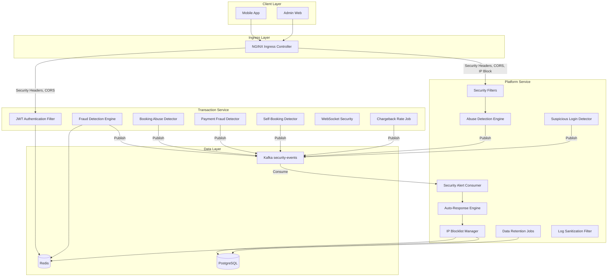
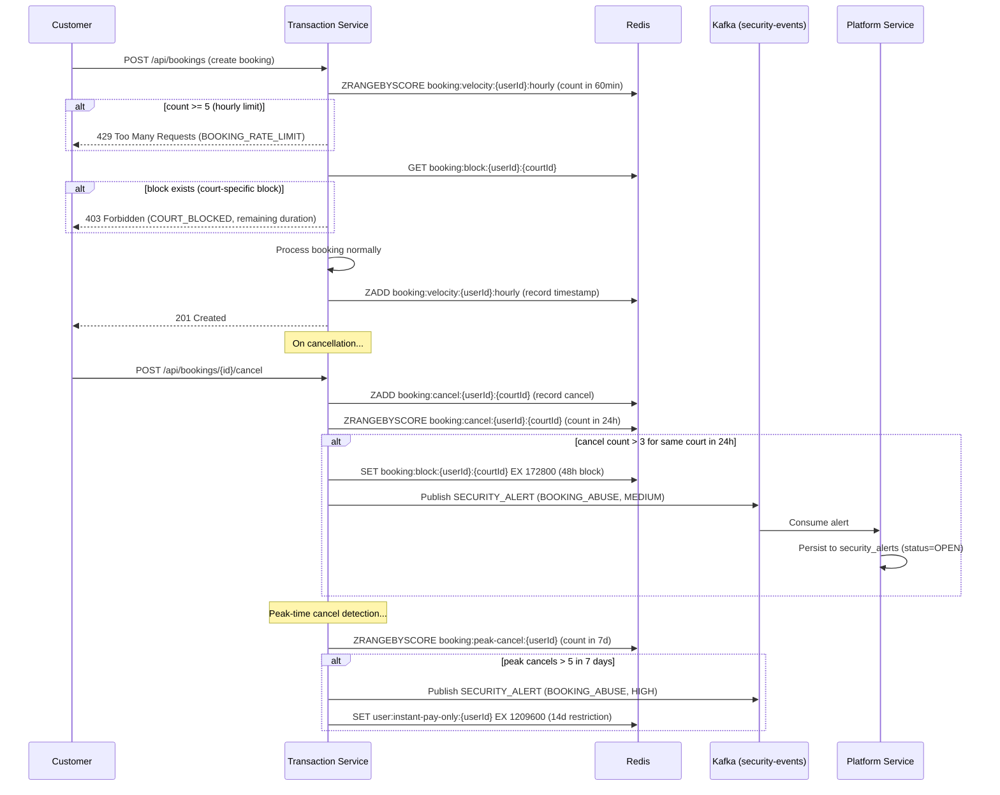
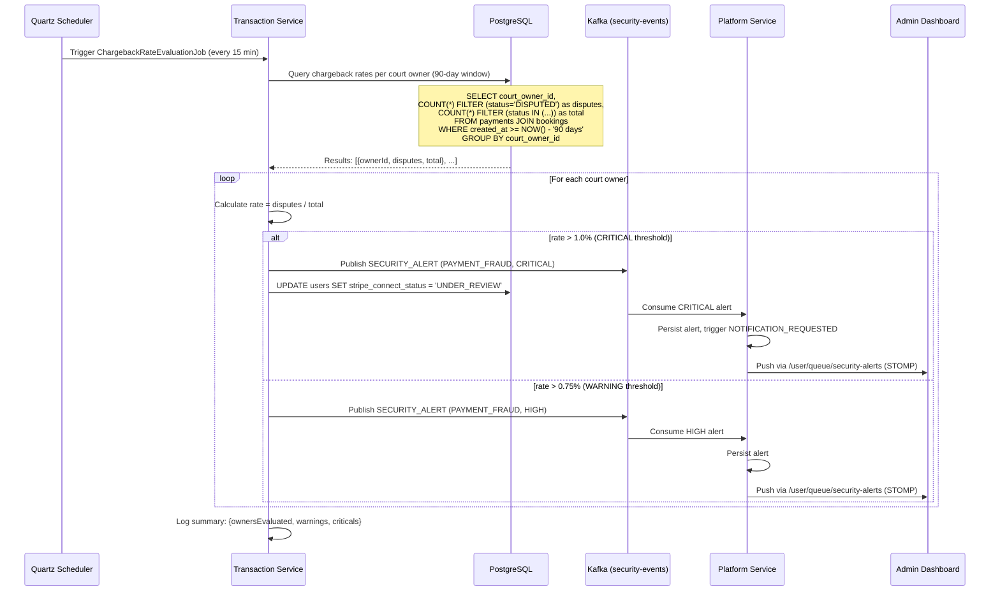
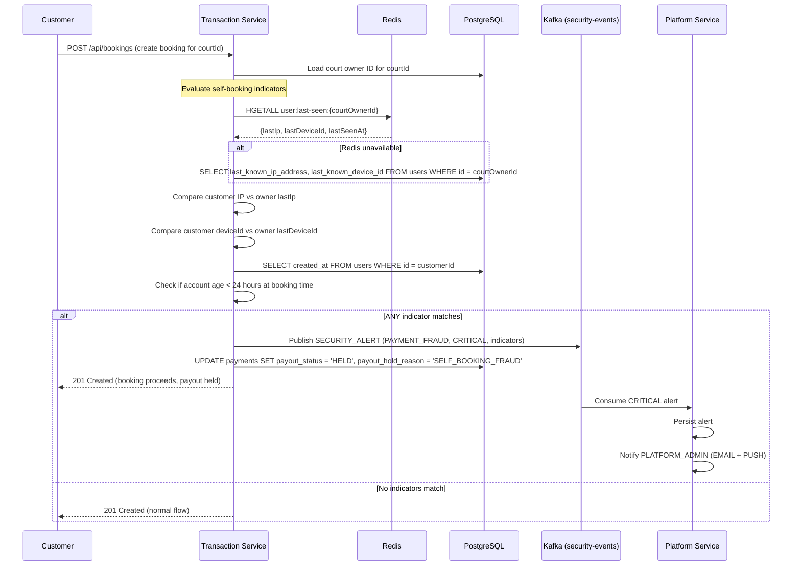
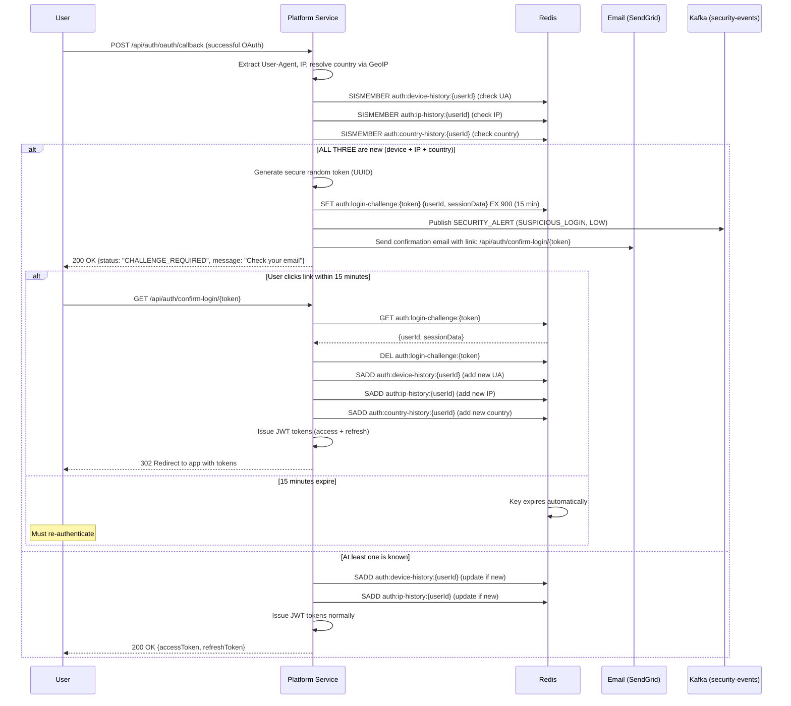
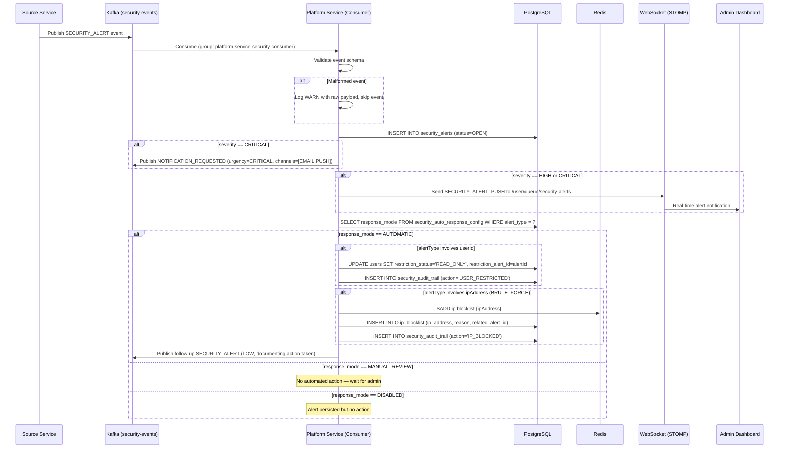
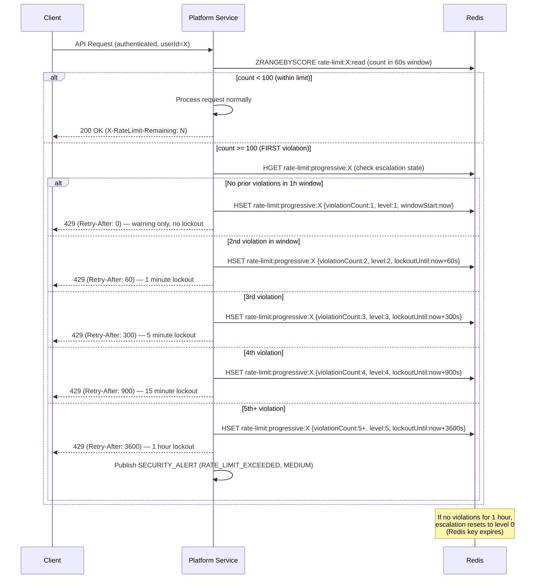
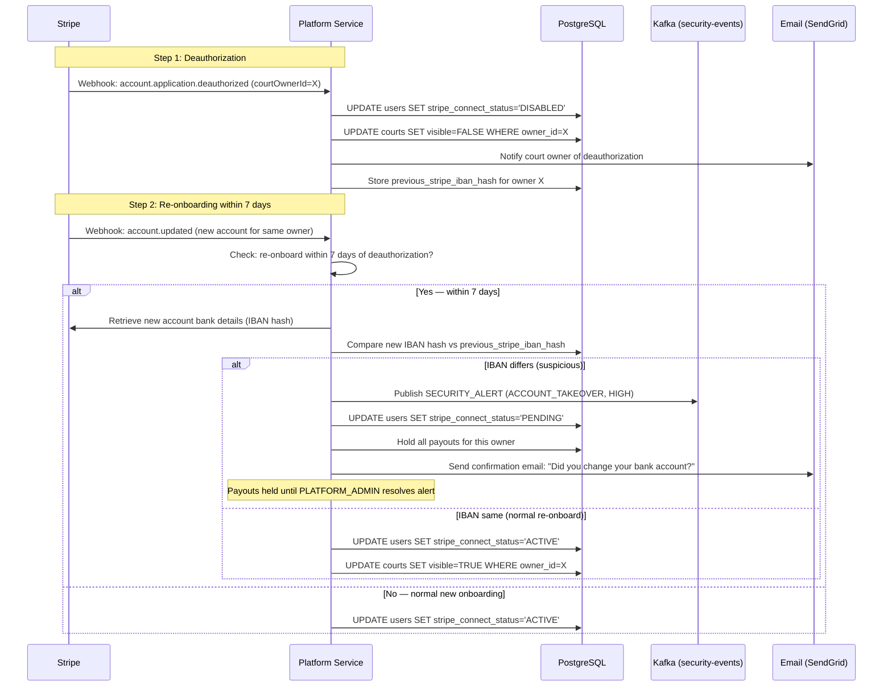

# Design Document — Phase 7: Security Hardening

## Overview

Phase 7 hardens the Court Booking Platform against OWASP Top 10 vulnerabilities, implements abuse detection with automated mitigation, enforces data lifecycle policies, and secures real-time communication channels. This phase extends existing security infrastructure (filters, tables, Kafka topics) and closes remaining gaps in the Transaction Service, NGINX Ingress, and admin web application.

### Key Capabilities

1. **Transaction Service JWT Enforcement**: Wire `JwtAuthenticationFilter` into Transaction Service with full role-based authorization and JWKS caching
2. **Abuse Detection Engine**: Booking abuse, payment fraud, credential stuffing, scraping detection with configurable thresholds
3. **Automated Security Responses**: Configurable auto-response rules (IP blocking, account restriction) triggered by alert severity
4. **Progressive Rate Limiting**: Escalating lockout durations on repeated violations
5. **IP Blocklist Management**: Redis-backed blocklist with NGINX sync, LRU fallback, and admin CRUD API
6. **WebSocket Security**: Token refresh flow, channel authorization enforcement, message validation and rate limiting
7. **Data Protection**: Log sanitization, data retention/anonymization jobs, encryption verification
8. **Security Dashboard**: Real-time alert streaming, filtering, status management, auto-response configuration
9. **Payout & Self-Booking Fraud Detection**: Threshold-based payout monitoring and cross-account indicator matching
10. **Secret Rotation**: Zero-downtime rotation procedures for JWT keys, DB credentials, API keys, webhook secrets

### Design Decisions

| Decision | Rationale |
|----------|-----------|
| Reuse `JwtAuthenticationFilter` from `court-booking-common` in Transaction Service | Consistent JWT validation across services; single source of truth for token parsing |
| Redis sliding windows for abuse detection counters | Sub-millisecond lookups, automatic expiry, works across pods |
| Separate `SecurityEventPublisherPort` (hexagonal port) | Decouples detection logic from Kafka transport; testable with mocks |
| LRU cache fallback for IP blocklist | Resilience against Redis outages; fail-closed after 30s ensures security |
| Progressive lockout in `ApiRateLimitFilter` extension | Extends existing filter without replacing it; backward-compatible |
| Logback `TurboFilter` for log sanitization | Intercepts all log events before appenders; zero code changes in business logic |
| Quartz jobs for retention/anonymization | Consistent with existing scheduled job pattern (Phase 4/5); clustered via JDBC |
| Channel authorization in STOMP `ChannelInterceptor` | Spring WebSocket native pattern; runs before message delivery |
| `security_audit_trail` as append-only table | Immutable audit log; no UPDATE/DELETE permissions granted to application role |
| Auto-response config in DB (not Redis) | Infrequently changed; needs durability and audit trail; cached in-memory with 60s TTL |
| JwksCachingService with dual-key retention | Bridges max access-token lifetime (15 min) during key rotation; avoids mass token invalidation |
| OWASP HTML Sanitizer (not custom regex) | Battle-tested allowlist-based sanitization; handles edge cases regex cannot |
| External Secrets Operator for credential rotation | Kubernetes-native; zero-downtime rotation with grace periods |

## Architecture

### High-Level Security Architecture



### Platform Service — Phase 7 Filter Chain

The existing filter chain is extended with IP blocklist checking in `RateLimitFilter` and progressive escalation in `ApiRateLimitFilter`:

```
Request → RateLimitFilter (auth rate limit + IP blocklist check + account-level lockout)
        → JwtAuthenticationFilter (RS256 validation)
        → ApiRateLimitFilter (per-user limits + progressive escalation)
        → CsrfValidationFilter (double-submit cookie)
        → SuspendedUserFilter (Redis SET lookup)
        → ScrapingDetectionFilter (NEW — pattern detection, after-the-fact recording)
        → Controller
```

### Transaction Service — Phase 7 Filter Chain

```
Request → IpBlocklistFilter (NEW — Redis blocklist check with LRU fallback)
        → JwtAuthenticationFilter (WIRED — from court-booking-common, JWKS-backed)
        → TransactionRateLimitFilter (NEW — per-user limits + progressive escalation)
        → BookingAbuseFilter (NEW — velocity + court-block check on booking endpoints)
        → Controller
```

### Transaction Service — WebSocket Security

```
WebSocket Upgrade → JWT validation on ?token= query param (Phase 5, unchanged)
                  → ChannelAuthorizationInterceptor (NEW — role/ownership checks on SUBSCRIBE)
                  → MessageValidationInterceptor (NEW — schema + size + rate limit on SEND)
                  → TokenRefreshHandler (NEW — handles /app/token-refresh messages)
                  → STOMP Handler
```

## Components and Interfaces

### Platform Service — Full Hexagonal Package Layout (Phase 7 Additions)

```
gr.courtbooking.platform/
├── adapter/
│   ├── in/
│   │   ├── kafka/
│   │   │   └── SecurityEventKafkaConsumer.java          # Consumes security-events topic
│   │   ├── scheduler/
│   │   │   ├── UserAnonymizationJob.java                # Weekly user data anonymization
│   │   │   ├── AuditLogArchivalJob.java                 # Monthly audit log archival
│   │   │   └── SecurityAlertArchivalJob.java            # Monthly security alert archival
│   │   └── web/
│   │       ├── security/
│   │       │   └── ScrapingDetectionFilter.java         # Scraping pattern detection filter
│   │       ├── SecurityAlertController.java             # GET/POST /api/admin/security/alerts
│   │       ├── IpBlocklistController.java               # CRUD /api/admin/security/blocked-ips
│   │       ├── AutoResponseConfigController.java        # GET/PUT /api/admin/security/auto-responses
│   │       ├── SuspiciousLoginController.java           # GET /api/auth/confirm-login/{token}
│   │       └── dto/
│   │           ├── SecurityAlertResponse.java
│   │           ├── SecurityAlertSummaryResponse.java
│   │           ├── AcknowledgeAlertRequest.java
│   │           ├── ResolveAlertRequest.java
│   │           ├── BlockedIpResponse.java
│   │           ├── AddBlockedIpRequest.java
│   │           ├── AutoResponseConfigResponse.java
│   │           └── UpdateAutoResponseRequest.java
│   └── out/
│       ├── kafka/
│       │   └── SecurityEventKafkaPublisher.java         # Publishes to security-events topic
│       ├── persistence/
│       │   ├── SecurityAlertPersistenceAdapter.java     # security_alerts CRUD
│       │   ├── SecurityAuditTrailPersistenceAdapter.java # security_audit_trail append
│       │   ├── AutoResponseConfigPersistenceAdapter.java # security_auto_response_config
│       │   ├── IpBlocklistPersistenceAdapter.java       # ip_blocklist table CRUD
│       │   ├── UserRestrictionPersistenceAdapter.java   # users.restriction_status updates
│       │   ├── repository/
│       │   │   ├── SecurityAlertRepository.java
│       │   │   ├── SecurityAuditTrailRepository.java
│       │   │   ├── AutoResponseConfigRepository.java
│       │   │   └── IpBlocklistRepository.java
│       │   ├── entity/
│       │   │   ├── SecurityAlertJpaEntity.java
│       │   │   ├── SecurityAuditTrailJpaEntity.java
│       │   │   ├── AutoResponseConfigJpaEntity.java
│       │   │   └── IpBlocklistJpaEntity.java
│       │   └── mapper/
│       │       ├── SecurityAlertPersistenceMapper.java
│       │       └── IpBlocklistPersistenceMapper.java
│       ├── redis/
│       │   ├── IpBlocklistRedisAdapter.java             # Redis SET/SORTED SET for blocklist
│       │   ├── ScrapingDetectionRedisAdapter.java       # Request recording + indicator reads
│       │   ├── ProgressiveRateLimitRedisAdapter.java    # Escalation state in Redis HASH
│       │   ├── SuspiciousLoginRedisAdapter.java         # Device/IP/country history SETs
│       │   ├── AccountLockoutRedisAdapter.java          # Email-keyed failed attempt counters
│       │   └── DistributedAttackRedisAdapter.java       # Cross-account same-IP tracking
│       ├── geoip/
│       │   └── GeoIpLookupAdapter.java                  # MaxMind GeoLite2 country lookup
│       └── spaces/
│           └── ColdStorageSpacesAdapter.java            # Archive upload to DO Spaces
├── application/
│   ├── port/
│   │   ├── in/
│   │   │   ├── ProcessSecurityAlertUseCase.java
│   │   │   ├── ManageAutoResponseConfigUseCase.java
│   │   │   ├── ManageIpBlocklistUseCase.java
│   │   │   ├── DetectScrapingUseCase.java
│   │   │   ├── DetectBruteForceUseCase.java
│   │   │   ├── DetectSuspiciousLoginUseCase.java
│   │   │   ├── ConfirmSuspiciousLoginUseCase.java
│   │   │   ├── QuerySecurityAlertsUseCase.java
│   │   │   ├── UpdateAlertStatusUseCase.java
│   │   │   └── GetAlertSummaryUseCase.java
│   │   └── out/
│   │       ├── SecurityEventPublisherPort.java
│   │       ├── SecurityAlertPersistencePort.java
│   │       ├── SecurityAuditTrailPort.java
│   │       ├── IpBlocklistPort.java
│   │       ├── ProgressiveRateLimitPort.java
│   │       ├── ScrapingDetectionPort.java
│   │       ├── UserRestrictionPort.java
│   │       ├── AccountLockoutPort.java
│   │       ├── DistributedAttackDetectionPort.java
│   │       ├── SuspiciousLoginPort.java
│   │       ├── GeoIpLookupPort.java
│   │       ├── AutoResponseConfigPersistencePort.java
│   │       └── ColdStoragePort.java
│   └── service/
│       ├── SecurityAlertConsumerService.java            # Kafka consumer → persist → auto-respond
│       ├── AutoResponseService.java                     # Evaluates auto-response rules
│       ├── IpBlocklistService.java                      # Blocklist CRUD + Redis sync
│       ├── ScrapingDetectionService.java                # Evaluates 3 scraping indicators
│       ├── BruteForceDetectionService.java              # Distributed attack + account lockout
│       ├── SuspiciousLoginService.java                  # Device/IP/country novelty check
│       ├── ProgressiveRateLimitService.java             # Escalation logic
│       ├── SecurityAlertQueryService.java               # Paginated alert queries
│       ├── AlertStatusTransitionService.java            # Status machine enforcement
│       ├── UserAnonymizationService.java                # Anonymization logic
│       ├── AuditLogArchivalService.java                 # Archival logic
│       └── SecurityAlertArchivalService.java            # Alert archival logic
├── config/
│   └── SecurityConfig.java                              # Extended with ScrapingDetectionFilter
└── domain/
    ├── model/
    │   ├── SecurityAlert.java                           # Domain entity with status machine
    │   ├── AutoResponseConfig.java                      # Per-alertType response mode
    │   ├── SecurityAuditEntry.java                      # Immutable audit record
    │   ├── BlockedIpEntry.java                          # IP/CIDR with reason and TTL
    │   ├── ScrapingIndicators.java                      # Missing UA, high freq, enumeration
    │   ├── ProgressiveRateLimitState.java               # Violation count + lockout level
    │   └── SuspiciousLoginChallenge.java                # Token, userId, expiresAt
    └── exception/
        ├── InvalidAlertTransitionException.java
        ├── IpBlocklistValidationException.java
        └── AlertNotFoundException.java
```

### Transaction Service — Full Hexagonal Package Layout (Phase 7 Additions)

```
gr.courtbooking.transaction/
├── adapter/
│   ├── in/
│   │   ├── scheduler/
│   │   │   ├── ChargebackRateEvaluationJob.java         # Every 15 min chargeback rate check
│   │   │   └── BookingAnonymizationJob.java             # Monthly booking anonymization
│   │   └── web/
│   │       └── security/
│   │           ├── IpBlocklistFilter.java               # Redis blocklist check + LRU fallback
│   │           ├── TransactionRateLimitFilter.java      # Per-user rate limits + progressive
│   │           ├── BookingAbuseFilter.java              # Velocity + court-block pre-check
│   │           └── JwksCachingService.java              # JWKS fetch, cache, refresh
│   ├── websocket/
│   │   ├── ChannelAuthorizationInterceptor.java         # SUBSCRIBE authorization
│   │   ├── MessageValidationInterceptor.java            # Schema + size + rate limit
│   │   └── TokenRefreshHandler.java                     # /app/token-refresh processing
│   └── out/
│       ├── kafka/
│       │   └── SecurityEventKafkaPublisher.java         # Publishes to security-events topic
│       ├── redis/
│       │   ├── BookingVelocityRedisAdapter.java         # Booking count sliding windows
│       │   ├── PaymentFraudRedisAdapter.java            # Card fingerprint tracking
│       │   ├── PayoutFraudRedisAdapter.java             # Weekly payout totals
│       │   ├── SelfBookingFraudRedisAdapter.java        # User last-seen tracking
│       │   ├── IpBlocklistRedisAdapter.java             # Blocklist check + LRU cache
│       │   ├── TransactionRateLimitRedisAdapter.java    # Per-user rate limit counters
│       │   ├── JwksCacheRedisAdapter.java               # JWKS JSON cache (24h TTL)
│       │   └── WebSocketRateLimitRedisAdapter.java      # Per-connection message counters
│       └── http/
│           └── JwksHttpClient.java                      # Fetches JWKS from Platform Service
├── application/
│   ├── port/
│   │   ├── in/
│   │   │   ├── DetectBookingAbuseUseCase.java
│   │   │   ├── DetectPaymentFraudUseCase.java
│   │   │   ├── DetectSelfBookingFraudUseCase.java
│   │   │   ├── DetectPayoutFraudUseCase.java
│   │   │   └── EvaluateChargebackRateUseCase.java
│   │   └── out/
│   │       ├── SecurityEventPublisherPort.java
│   │       ├── BookingVelocityPort.java
│   │       ├── PaymentFraudDetectionPort.java
│   │       ├── PayoutFraudDetectionPort.java
│   │       ├── SelfBookingFraudPort.java
│   │       ├── UserLastSeenPort.java
│   │       ├── JwksCachingPort.java
│   │       ├── TransactionIpBlocklistPort.java
│   │       └── TransactionRateLimitPort.java
│   └── service/
│       ├── BookingAbuseDetectionService.java            # Velocity + cancel pattern + court block
│       ├── PaymentFraudDetectionService.java            # Card-testing + country mismatch
│       ├── ChargebackRateEvaluationService.java         # Rate calculation + alert publishing
│       ├── PayoutFraudDetectionService.java             # Threshold checks + payout hold
│       ├── SelfBookingFraudDetectionService.java        # IP/device/age indicator matching
│       ├── JwksCachingServiceImpl.java                  # JWKS fetch + cache + rotation bridge
│       └── BookingAnonymizationService.java             # Booking data anonymization
├── config/
│   ├── SecurityConfig.java                              # FULL replacement with role-based rules
│   ├── WebSocketSecurityConfig.java                     # Interceptor registration
│   └── QuartzConfig.java                                # Extended with ChargebackRateEvaluationJob
└── domain/
    ├── model/
    │   ├── BookingAbuseResult.java
    │   ├── PaymentFraudResult.java
    │   ├── SelfBookingFraudResult.java
    │   └── ChargebackRateResult.java
    └── exception/
        ├── BookingVelocityExceededException.java
        ├── CourtBlockedException.java
        └── PaymentBlockedException.java
```

### Admin Web — Full Component Layout (Phase 7 Additions)

```
court-booking-admin-web/src/
├── features/
│   └── security/
│       ├── pages/
│       │   ├── SecurityAlertsPage.tsx                   # Alert list with filters + real-time
│       │   ├── SecurityAlertDetailPage.tsx              # Detail view + acknowledge/resolve
│       │   ├── AutoResponseConfigPage.tsx               # Auto-response rule configuration
│       │   └── IpBlocklistPage.tsx                      # IP blocklist management CRUD
│       ├── components/
│       │   ├── AlertsTable.tsx                          # Ant Design Table with filters
│       │   ├── AlertSeverityBadge.tsx                   # Color-coded severity indicator
│       │   ├── AlertStatusTag.tsx                       # Status with transition actions
│       │   ├── AlertSummaryCards.tsx                    # Aggregate counts by severity
│       │   ├── AlertDetailPanel.tsx                     # Full alert metadata display
│       │   ├── ResolveAlertModal.tsx                    # Resolution notes form
│       │   ├── BlockedIpTable.tsx                       # IP list with add/remove
│       │   ├── AddBlockedIpModal.tsx                    # IP/CIDR input with validation
│       │   ├── AutoResponseRuleCard.tsx                 # Per-alertType toggle card
│       │   └── SecurityAlertToast.tsx                   # Real-time alert notification toast
│       ├── hooks/
│       │   ├── useSecurityAlerts.ts                     # TanStack Query for alert list
│       │   ├── useSecurityAlertDetail.ts                # TanStack Query for single alert
│       │   ├── useAlertSummary.ts                       # TanStack Query for summary
│       │   ├── useBlockedIps.ts                         # TanStack Query for blocklist
│       │   ├── useAutoResponseConfig.ts                 # TanStack Query for config
│       │   ├── useSecurityWebSocket.ts                  # STOMP subscription hook
│       │   └── useAlertMutations.ts                     # Acknowledge/resolve mutations
│       └── services/
│           └── securityService.ts                       # API client for security endpoints
├── stores/
│   └── useSecurityStore.ts                              # Zustand store for security state
└── routes/
    └── securityRoutes.tsx                               # Route definitions for security pages
```


## Detailed Component Implementations

### Transaction Service SecurityConfig.java — Full Replacement

```java
package gr.courtbooking.transaction.config;

import com.fasterxml.jackson.databind.ObjectMapper;
import gr.courtbooking.transaction.adapter.in.web.security.BookingAbuseFilter;
import gr.courtbooking.transaction.adapter.in.web.security.IpBlocklistFilter;
import gr.courtbooking.transaction.adapter.in.web.security.JwksCachingService;
import gr.courtbooking.transaction.adapter.in.web.security.TransactionRateLimitFilter;
import gr.courtbooking.common.security.JwtAuthenticationFilter;
import gr.courtbooking.transaction.application.port.out.BookingVelocityPort;
import gr.courtbooking.transaction.application.port.out.TransactionIpBlocklistPort;
import gr.courtbooking.transaction.application.port.out.TransactionRateLimitPort;
import org.springframework.context.annotation.Bean;
import org.springframework.context.annotation.Configuration;
import org.springframework.http.HttpMethod;
import org.springframework.security.config.annotation.method.configuration.EnableMethodSecurity;
import org.springframework.security.config.annotation.web.builders.HttpSecurity;
import org.springframework.security.config.annotation.web.configuration.EnableWebSecurity;
import org.springframework.security.config.annotation.web.configurers.AbstractHttpConfigurer;
import org.springframework.security.config.http.SessionCreationPolicy;
import org.springframework.security.web.SecurityFilterChain;
import org.springframework.security.web.authentication.UsernamePasswordAuthenticationFilter;

/**
 * Security configuration for the Transaction Service — Phase 7 full enforcement.
 *
 * <p>Replaces the Phase 4 permissive configuration with complete role-based
 * authorization. Filter chain order:
 * <ol>
 *   <li>{@link IpBlocklistFilter} — Redis blocklist check with LRU fallback</li>
 *   <li>{@link JwtAuthenticationFilter} — RS256 validation via JWKS</li>
 *   <li>{@link TransactionRateLimitFilter} — Per-user rate limits + progressive escalation</li>
 *   <li>{@link BookingAbuseFilter} — Velocity + court-block pre-check</li>
 *   <li>Controllers</li>
 * </ol>
 */
@Configuration
@EnableWebSecurity
@EnableMethodSecurity
public class SecurityConfig {

    private final JwksCachingService jwksCachingService;
    private final TransactionIpBlocklistPort ipBlocklistPort;
    private final TransactionRateLimitPort rateLimitPort;
    private final BookingVelocityPort bookingVelocityPort;
    private final ObjectMapper objectMapper;

    public SecurityConfig(JwksCachingService jwksCachingService,
                         TransactionIpBlocklistPort ipBlocklistPort,
                         TransactionRateLimitPort rateLimitPort,
                         BookingVelocityPort bookingVelocityPort,
                         ObjectMapper objectMapper) {
        this.jwksCachingService = jwksCachingService;
        this.ipBlocklistPort = ipBlocklistPort;
        this.rateLimitPort = rateLimitPort;
        this.bookingVelocityPort = bookingVelocityPort;
        this.objectMapper = objectMapper;
    }

    @Bean
    public SecurityFilterChain securityFilterChain(HttpSecurity http) throws Exception {
        return http
                .csrf(AbstractHttpConfigurer::disable)
                .sessionManagement(session -> session
                        .sessionCreationPolicy(SessionCreationPolicy.STATELESS))

                .authorizeHttpRequests(auth -> auth
                        // ═══════════════════════════════════════════════════════════
                        // PUBLIC ENDPOINTS — No authentication required (Req 1.7)
                        // ═══════════════════════════════════════════════════════════
                        .requestMatchers("/actuator/health/**").permitAll()
                        .requestMatchers("/api/webhooks/stripe").permitAll()
                        .requestMatchers("/ws/**").permitAll()
                        .requestMatchers("/v3/api-docs/**").permitAll()
                        .requestMatchers("/swagger-ui/**").permitAll()
                        .requestMatchers("/swagger-ui.html").permitAll()

                        // ═══════════════════════════════════════════════════════════
                        // CUSTOMER ROLE ENDPOINTS (Req 1.4)
                        // BookingController — customer booking operations
                        // ═══════════════════════════════════════════════════════════
                        .requestMatchers(HttpMethod.POST, "/api/bookings").hasRole("CUSTOMER")
                        .requestMatchers(HttpMethod.PUT, "/api/bookings/*/modify").hasRole("CUSTOMER")
                        .requestMatchers(HttpMethod.POST, "/api/bookings/*/cancel").hasRole("CUSTOMER")
                        .requestMatchers(HttpMethod.GET, "/api/bookings").hasAnyRole("CUSTOMER", "COURT_OWNER", "PLATFORM_ADMIN")
                        .requestMatchers(HttpMethod.GET, "/api/bookings/*/receipt").hasAnyRole("CUSTOMER", "COURT_OWNER")

                        // RecurringBookingController — customer recurring bookings
                        .requestMatchers(HttpMethod.POST, "/api/bookings/recurring").hasRole("CUSTOMER")
                        .requestMatchers(HttpMethod.GET, "/api/bookings/recurring/*").hasAnyRole("CUSTOMER", "COURT_OWNER")

                        // PaymentController — customer payment operations
                        .requestMatchers(HttpMethod.POST, "/api/payments/methods").hasRole("CUSTOMER")
                        .requestMatchers(HttpMethod.GET, "/api/payments/methods").hasRole("CUSTOMER")
                        .requestMatchers(HttpMethod.DELETE, "/api/payments/methods/*").hasRole("CUSTOMER")
                        .requestMatchers(HttpMethod.GET, "/api/payments/*/dispute").hasAnyRole("CUSTOMER", "COURT_OWNER")

                        // ═══════════════════════════════════════════════════════════
                        // COURT_OWNER ROLE ENDPOINTS (Req 1.5)
                        // ManualBookingController — court owner manual bookings
                        // ═══════════════════════════════════════════════════════════
                        .requestMatchers(HttpMethod.POST, "/api/bookings/manual").hasRole("COURT_OWNER")
                        .requestMatchers(HttpMethod.POST, "/api/bookings/*/confirm").hasRole("COURT_OWNER")
                        .requestMatchers(HttpMethod.POST, "/api/bookings/*/reject").hasRole("COURT_OWNER")
                        .requestMatchers(HttpMethod.POST, "/api/bookings/*/no-show").hasRole("COURT_OWNER")
                        .requestMatchers(HttpMethod.POST, "/api/bookings/*/mark-paid").hasRole("COURT_OWNER")
                        .requestMatchers(HttpMethod.GET, "/api/bookings/pending").hasRole("COURT_OWNER")

                        // BulkBookingController — court owner bulk operations
                        .requestMatchers(HttpMethod.POST, "/api/bookings/bulk-action").hasRole("COURT_OWNER")

                        // BookingCalendarController — court owner calendar export
                        .requestMatchers(HttpMethod.GET, "/api/bookings/calendar/ical").hasRole("COURT_OWNER")

                        // StripeConnectController — court owner Stripe Connect
                        .requestMatchers("/api/stripe-connect/**").hasRole("COURT_OWNER")

                        // PaymentController — court owner payout views
                        .requestMatchers(HttpMethod.GET, "/api/payments/payouts").hasRole("COURT_OWNER")

                        // ═══════════════════════════════════════════════════════════
                        // PLATFORM_ADMIN ROLE ENDPOINTS (Req 1.6)
                        // ═══════════════════════════════════════════════════════════
                        .requestMatchers("/api/admin/**").hasRole("PLATFORM_ADMIN")

                        // ═══════════════════════════════════════════════════════════
                        // SHARED AUTHENTICATED ENDPOINTS
                        // ═══════════════════════════════════════════════════════════
                        .requestMatchers(HttpMethod.GET, "/api/bookings/*").authenticated()

                        // All other API endpoints require authentication
                        .requestMatchers("/api/**").authenticated()

                        .anyRequest().permitAll()
                )

                // Filter chain order: IpBlocklist → JWT → RateLimit → BookingAbuse → Controller
                .addFilterBefore(ipBlocklistFilter(), UsernamePasswordAuthenticationFilter.class)
                .addFilterBefore(jwtAuthenticationFilter(), UsernamePasswordAuthenticationFilter.class)
                .addFilterAfter(transactionRateLimitFilter(), JwtAuthenticationFilter.class)
                .addFilterAfter(bookingAbuseFilter(), TransactionRateLimitFilter.class)

                .build();
    }

    @Bean
    public IpBlocklistFilter ipBlocklistFilter() {
        return new IpBlocklistFilter(ipBlocklistPort, objectMapper);
    }

    @Bean
    public JwtAuthenticationFilter jwtAuthenticationFilter() {
        return new JwtAuthenticationFilter(jwksCachingService, objectMapper);
    }

    @Bean
    public TransactionRateLimitFilter transactionRateLimitFilter() {
        return new TransactionRateLimitFilter(rateLimitPort, objectMapper);
    }

    @Bean
    public BookingAbuseFilter bookingAbuseFilter() {
        return new BookingAbuseFilter(bookingVelocityPort, objectMapper);
    }
}
```

### JwksCachingService — Complete Implementation Design

```java
package gr.courtbooking.transaction.adapter.in.web.security;

import gr.courtbooking.transaction.application.port.out.JwksCachingPort;
import io.micrometer.core.instrument.Counter;
import io.micrometer.core.instrument.MeterRegistry;
import org.slf4j.Logger;
import org.slf4j.LoggerFactory;
import org.springframework.scheduling.annotation.Scheduled;
import org.springframework.stereotype.Service;

import java.security.PublicKey;
import java.time.Duration;
import java.time.Instant;
import java.util.Map;
import java.util.Optional;
import java.util.concurrent.ConcurrentHashMap;
import java.util.concurrent.atomic.AtomicReference;

/**
 * JWKS caching service for Transaction Service JWT validation.
 *
 * <p>Fetches public keys from Platform Service JWKS endpoint, caches with 24h TTL,
 * handles unknown kid refresh, retains retired keys for 15 minutes, and implements
 * exponential backoff retry on failure.
 *
 * <p>Key lifecycle:
 * <ol>
 *   <li>On startup: fetch JWKS from Platform Service</li>
 *   <li>Cache keys in memory with 24h TTL</li>
 *   <li>On unknown kid: trigger immediate refresh</li>
 *   <li>On key removal from upstream: retain locally for 15 minutes</li>
 *   <li>On Platform Service unreachable: serve from cache, retry with backoff</li>
 * </ol>
 *
 * <p>Backoff schedule: 1s, 2s, 4s, 8s, 16s, 32s, 60s (max)
 */
@Service
public class JwksCachingService implements JwksCachingPort {

    private static final Logger log = LoggerFactory.getLogger(JwksCachingService.class);

    private static final Duration CACHE_TTL = Duration.ofHours(24);
    private static final Duration RETIRED_KEY_RETENTION = Duration.ofMinutes(15);
    private static final Duration MAX_BACKOFF = Duration.ofSeconds(60);
    private static final Duration INITIAL_BACKOFF = Duration.ofSeconds(1);

    private final JwksHttpClient jwksHttpClient;
    private final MeterRegistry meterRegistry;
    private final Counter jwksUnavailableCounter;

    // Active keys from latest JWKS fetch
    private final ConcurrentHashMap<String, CachedKey> activeKeys = new ConcurrentHashMap<>();
    // Retired keys (removed from upstream but retained for grace period)
    private final ConcurrentHashMap<String, RetiredKey> retiredKeys = new ConcurrentHashMap<>();
    // Last successful fetch timestamp
    private final AtomicReference<Instant> lastFetchTime = new AtomicReference<>(Instant.EPOCH);
    // Current backoff duration for retry
    private final AtomicReference<Duration> currentBackoff = new AtomicReference<>(INITIAL_BACKOFF);
    // Whether a background refresh is in progress
    private volatile boolean refreshInProgress = false;

    public JwksCachingService(JwksHttpClient jwksHttpClient, MeterRegistry meterRegistry) {
        this.jwksHttpClient = jwksHttpClient;
        this.meterRegistry = meterRegistry;
        this.jwksUnavailableCounter = Counter.builder("jwks_unavailable_total")
                .description("Count of JWKS unavailable events")
                .register(meterRegistry);
    }

    @Override
    public PublicKey getKey(String kid) {
        // 1. Check active keys
        CachedKey cached = activeKeys.get(kid);
        if (cached != null && !cached.isExpired()) {
            return cached.key();
        }

        // 2. Check retired keys (grace period)
        RetiredKey retired = retiredKeys.get(kid);
        if (retired != null && !retired.isExpired()) {
            return retired.key();
        }

        // 3. Unknown kid — trigger refresh
        log.info("Unknown kid '{}', triggering JWKS refresh", kid);
        refreshKeys();

        // 4. Re-check after refresh
        cached = activeKeys.get(kid);
        if (cached != null) {
            return cached.key();
        }

        // 5. Still not found — JWKS unavailable
        jwksUnavailableCounter.increment();
        log.error("Key '{}' not found after JWKS refresh — JWKS_UNAVAILABLE", kid);
        return null; // Caller (filter) returns 503
    }

    @Override
    public synchronized void refreshKeys() {
        if (refreshInProgress) return;
        refreshInProgress = true;

        try {
            Map<String, PublicKey> fetched = jwksHttpClient.fetchJwks();

            // Move removed keys to retired set
            activeKeys.forEach((kid, cachedKey) -> {
                if (!fetched.containsKey(kid)) {
                    retiredKeys.put(kid, new RetiredKey(cachedKey.key(), Instant.now()));
                    log.info("Key '{}' retired, will be available for {} more minutes",
                            kid, RETIRED_KEY_RETENTION.toMinutes());
                }
            });

            // Update active keys
            activeKeys.clear();
            fetched.forEach((kid, key) ->
                    activeKeys.put(kid, new CachedKey(key, Instant.now())));

            lastFetchTime.set(Instant.now());
            currentBackoff.set(INITIAL_BACKOFF); // Reset backoff on success
            log.info("JWKS refreshed successfully, {} active keys", activeKeys.size());

        } catch (Exception e) {
            log.warn("JWKS refresh failed: {}. Serving from cache. Retry in {}s",
                    e.getMessage(), currentBackoff.get().toSeconds());

            // Schedule background retry with exponential backoff
            scheduleBackgroundRetry();
        } finally {
            refreshInProgress = false;
        }
    }

    @Override
    public boolean hasKey(String kid) {
        return activeKeys.containsKey(kid) || retiredKeys.containsKey(kid);
    }

    @Scheduled(fixedDelay = 3600000) // Every hour — proactive refresh
    public void scheduledRefresh() {
        if (Duration.between(lastFetchTime.get(), Instant.now()).compareTo(CACHE_TTL) > 0) {
            log.info("JWKS cache TTL expired, refreshing");
            refreshKeys();
        }
        // Clean up expired retired keys
        retiredKeys.entrySet().removeIf(entry -> entry.getValue().isExpired());
    }

    private void scheduleBackgroundRetry() {
        Duration backoff = currentBackoff.get();
        // Exponential backoff: double each time, cap at MAX_BACKOFF
        Duration nextBackoff = backoff.multipliedBy(2);
        if (nextBackoff.compareTo(MAX_BACKOFF) > 0) {
            nextBackoff = MAX_BACKOFF;
        }
        currentBackoff.set(nextBackoff);
        // Retry scheduled via Spring @Async or ScheduledExecutorService
    }

    private record CachedKey(PublicKey key, Instant fetchedAt) {
        boolean isExpired() {
            return Duration.between(fetchedAt, Instant.now()).compareTo(CACHE_TTL) > 0;
        }
    }

    private record RetiredKey(PublicKey key, Instant retiredAt) {
        boolean isExpired() {
            return Duration.between(retiredAt, Instant.now()).compareTo(RETIRED_KEY_RETENTION) > 0;
        }
    }
}
```

### ScrapingDetectionFilter — Complete Implementation Design

```java
package gr.courtbooking.platform.adapter.in.web.security;

import com.fasterxml.jackson.databind.ObjectMapper;
import gr.courtbooking.platform.application.port.out.ScrapingDetectionPort;
import gr.courtbooking.platform.application.port.out.SecurityEventPublisherPort;
import gr.courtbooking.platform.domain.model.ScrapingIndicators;
import jakarta.servlet.FilterChain;
import jakarta.servlet.ServletException;
import jakarta.servlet.http.HttpServletRequest;
import jakarta.servlet.http.HttpServletResponse;
import org.slf4j.Logger;
import org.slf4j.LoggerFactory;
import org.springframework.web.filter.OncePerRequestFilter;

import java.io.IOException;
import java.util.regex.Pattern;

/**
 * Scraping detection filter that records requests and evaluates indicators.
 *
 * <p>Runs AFTER SuspendedUserFilter. Records every request for the IP, then
 * evaluates three indicators:
 * <ol>
 *   <li>Missing or empty User-Agent header</li>
 *   <li>Sustained rate > 10 req/sec over rolling 5-second window</li>
 *   <li>Resource enumeration: 10+ requests to same path template in 30s
 *       with mix of 200/404 responses (at least 3 x 404)</li>
 * </ol>
 *
 * <p>This filter does NOT block requests itself — it publishes SECURITY_ALERT
 * events and lets the progressive rate limiter handle blocking. The filter
 * records the response status code after the request completes (via
 * afterCompletion pattern).
 */
public class ScrapingDetectionFilter extends OncePerRequestFilter {

    private static final Logger log = LoggerFactory.getLogger(ScrapingDetectionFilter.class);

    // Path template normalization: replace UUIDs with {id}
    private static final Pattern UUID_PATTERN =
            Pattern.compile("[0-9a-f]{8}-[0-9a-f]{4}-[0-9a-f]{4}-[0-9a-f]{4}-[0-9a-f]{12}");

    private final ScrapingDetectionPort scrapingDetectionPort;
    private final SecurityEventPublisherPort securityEventPublisherPort;
    private final ObjectMapper objectMapper;

    public ScrapingDetectionFilter(ScrapingDetectionPort scrapingDetectionPort,
                                   SecurityEventPublisherPort securityEventPublisherPort,
                                   ObjectMapper objectMapper) {
        this.scrapingDetectionPort = scrapingDetectionPort;
        this.securityEventPublisherPort = securityEventPublisherPort;
        this.objectMapper = objectMapper;
    }

    @Override
    protected void doFilterInternal(HttpServletRequest request, HttpServletResponse response,
                                    FilterChain filterChain) throws ServletException, IOException {
        String clientIp = getClientIp(request);
        String pathTemplate = normalizePathTemplate(request.getRequestURI());
        String userAgent = request.getHeader("User-Agent");

        // Indicator 1: Missing User-Agent
        if (userAgent == null || userAgent.isBlank()) {
            log.debug("Missing User-Agent from IP {}", clientIp);
            publishScrapingAlert(clientIp, "MISSING_USER_AGENT", 1);
        }

        // Let the request proceed — record status code after completion
        filterChain.doFilter(request, response);

        // After response: record request for frequency and enumeration analysis
        int statusCode = response.getStatus();
        scrapingDetectionPort.recordRequest(clientIp, pathTemplate, statusCode);

        // Evaluate indicators 2 and 3
        ScrapingIndicators indicators = scrapingDetectionPort.getIndicators(clientIp);

        // Indicator 2: High frequency (>10 req/sec over 5s window = >50 requests in 5s)
        if (indicators.requestsInFiveSeconds() > 50) {
            publishScrapingAlert(clientIp, "HIGH_FREQUENCY", indicators.requestsInFiveSeconds());
        }

        // Indicator 3: Resource enumeration
        if (indicators.hasEnumerationPattern(pathTemplate)) {
            publishScrapingAlert(clientIp, "SEQUENTIAL_ENUMERATION",
                    indicators.pathRequestCount(pathTemplate));
        }
    }

    private void publishScrapingAlert(String ipAddress, String indicator, int requestCount) {
        securityEventPublisherPort.publishSecurityAlert(
                SecurityAlertEvent.builder()
                        .alertType(AlertType.SCRAPING)
                        .severity(Severity.MEDIUM)
                        .ipAddress(ipAddress)
                        .description("Scraping pattern detected: " + indicator)
                        .metadata(Map.of(
                                "indicator", indicator,
                                "requestCount", requestCount,
                                "ipAddress", ipAddress
                        ))
                        .build()
        );
    }

    private String normalizePathTemplate(String path) {
        return UUID_PATTERN.matcher(path).replaceAll("{id}");
    }

    private String getClientIp(HttpServletRequest request) {
        String xForwardedFor = request.getHeader("X-Forwarded-For");
        if (xForwardedFor != null && !xForwardedFor.isBlank()) {
            return xForwardedFor.split(",")[0].trim();
        }
        return request.getRemoteAddr();
    }
}
```


### IpBlocklistFilter with LRU Fallback — Implementation Design

```java
package gr.courtbooking.transaction.adapter.in.web.security;

import com.fasterxml.jackson.databind.ObjectMapper;
import gr.courtbooking.transaction.application.port.out.TransactionIpBlocklistPort;
import io.micrometer.core.instrument.Counter;
import io.micrometer.core.instrument.MeterRegistry;
import jakarta.servlet.FilterChain;
import jakarta.servlet.ServletException;
import jakarta.servlet.http.HttpServletRequest;
import jakarta.servlet.http.HttpServletResponse;
import org.slf4j.Logger;
import org.slf4j.LoggerFactory;
import org.springframework.http.MediaType;
import org.springframework.web.filter.OncePerRequestFilter;

import java.io.IOException;
import java.time.Duration;
import java.time.Instant;
import java.util.LinkedHashMap;
import java.util.Map;
import java.util.concurrent.atomic.AtomicReference;

/**
 * IP blocklist filter with LRU cache fallback for Redis unavailability.
 *
 * <p>Behavior:
 * <ul>
 *   <li>Normal: Check Redis blocklist, update LRU cache on success</li>
 *   <li>Redis unavailable: Serve from LRU cache (1000 entries, 60s TTL)</li>
 *   <li>Redis unavailable >30s AND cold cache: Fail closed (503)</li>
 * </ul>
 */
public class IpBlocklistFilter extends OncePerRequestFilter {

    private static final Logger log = LoggerFactory.getLogger(IpBlocklistFilter.class);
    private static final int LRU_CACHE_SIZE = 1000;
    private static final Duration LRU_TTL = Duration.ofSeconds(60);
    private static final Duration FAIL_CLOSED_THRESHOLD = Duration.ofSeconds(30);

    private final TransactionIpBlocklistPort blocklistPort;
    private final ObjectMapper objectMapper;
    private final Counter redisUnavailableCounter;

    // LRU cache: IP → (blocked, cachedAt)
    private final LinkedHashMap<String, CacheEntry> lruCache =
            new LinkedHashMap<>(LRU_CACHE_SIZE, 0.75f, true) {
                @Override
                protected boolean removeEldestEntry(Map.Entry<String, CacheEntry> eldest) {
                    return size() > LRU_CACHE_SIZE;
                }
            };

    private final AtomicReference<Instant> lastSuccessfulRedisRead =
            new AtomicReference<>(Instant.now());
    private volatile boolean cacheEverPopulated = false;

    public IpBlocklistFilter(TransactionIpBlocklistPort blocklistPort,
                            ObjectMapper objectMapper,
                            MeterRegistry meterRegistry) {
        this.blocklistPort = blocklistPort;
        this.objectMapper = objectMapper;
        this.redisUnavailableCounter = Counter.builder("blocklist_redis_unavailable_total")
                .register(meterRegistry);
    }

    @Override
    protected void doFilterInternal(HttpServletRequest request, HttpServletResponse response,
                                    FilterChain filterChain) throws ServletException, IOException {
        String clientIp = getClientIp(request);

        try {
            boolean blocked = blocklistPort.isBlocked(clientIp);
            // Update LRU cache on successful Redis read
            synchronized (lruCache) {
                lruCache.put(clientIp, new CacheEntry(blocked, Instant.now()));
                cacheEverPopulated = true;
            }
            lastSuccessfulRedisRead.set(Instant.now());

            if (blocked) {
                writeBlockedResponse(response, clientIp);
                return;
            }
        } catch (Exception e) {
            // Redis unavailable — fallback to LRU cache
            redisUnavailableCounter.increment();
            log.warn("Redis unavailable for blocklist check, falling back to LRU cache: {}",
                    e.getMessage());

            Boolean cachedResult = checkLruCache(clientIp);
            if (cachedResult != null) {
                if (cachedResult) {
                    writeBlockedResponse(response, clientIp);
                    return;
                }
                // Not blocked per cache — allow through
            } else {
                // Not in LRU cache — check fail-closed condition
                Duration sinceLastSuccess = Duration.between(
                        lastSuccessfulRedisRead.get(), Instant.now());

                if (sinceLastSuccess.compareTo(FAIL_CLOSED_THRESHOLD) > 0 || !cacheEverPopulated) {
                    log.error("FAIL CLOSED: Redis unavailable for {}s, LRU cache miss for IP {}",
                            sinceLastSuccess.toSeconds(), clientIp);
                    writeServiceUnavailableResponse(response);
                    return;
                }
                // Within threshold, IP not in cache — allow through (optimistic)
            }
        }

        filterChain.doFilter(request, response);
    }

    private Boolean checkLruCache(String ip) {
        synchronized (lruCache) {
            CacheEntry entry = lruCache.get(ip);
            if (entry == null) return null;
            if (Duration.between(entry.cachedAt(), Instant.now()).compareTo(LRU_TTL) > 0) {
                lruCache.remove(ip);
                return null;
            }
            return entry.blocked();
        }
    }

    private void writeBlockedResponse(HttpServletResponse response, String ip) throws IOException {
        response.setStatus(HttpServletResponse.SC_FORBIDDEN);
        response.setContentType(MediaType.APPLICATION_JSON_VALUE);
        objectMapper.writeValue(response.getOutputStream(), Map.of(
                "error", "IP_BLOCKED",
                "message", "Access denied"
        ));
    }

    private void writeServiceUnavailableResponse(HttpServletResponse response) throws IOException {
        response.setStatus(HttpServletResponse.SC_SERVICE_UNAVAILABLE);
        response.setContentType(MediaType.APPLICATION_JSON_VALUE);
        objectMapper.writeValue(response.getOutputStream(), Map.of(
                "error", "SERVICE_UNAVAILABLE",
                "message", "Security service temporarily unavailable"
        ));
    }

    private String getClientIp(HttpServletRequest request) {
        String xff = request.getHeader("X-Forwarded-For");
        if (xff != null && !xff.isBlank()) return xff.split(",")[0].trim();
        return request.getRemoteAddr();
    }

    private record CacheEntry(boolean blocked, Instant cachedAt) {}
}
```

### PiiSanitizationFilter (Logback TurboFilter) — Complete Implementation

```java
package gr.courtbooking.common.logging;

import ch.qos.logback.classic.Level;
import ch.qos.logback.classic.Logger;
import ch.qos.logback.classic.turbo.TurboFilter;
import ch.qos.logback.core.spi.FilterReply;
import org.slf4j.Marker;

import java.util.regex.Pattern;

/**
 * Logback TurboFilter that sanitizes PII and sensitive data from all log output.
 *
 * <p>Intercepts log events BEFORE they reach appenders. Replaces:
 * <ul>
 *   <li>JWT tokens: strings starting with "eyJ" (base64-encoded JSON header)</li>
 *   <li>Credit card numbers: sequences of 13-19 consecutive digits</li>
 *   <li>Stripe API keys: strings starting with "sk_" or "rk_" followed by alphanumeric</li>
 *   <li>Stripe webhook secrets: strings starting with "whsec_"</li>
 *   <li>Authorization header values: "Bearer ..." patterns</li>
 *   <li>Email addresses: basic email pattern (for log messages, not structured fields)</li>
 * </ul>
 *
 * <p>Lifecycle: Registered in logback-spring.xml as a TurboFilter. Starts with
 * the logging system, before any log events are processed.
 */
public class PiiSanitizationFilter extends TurboFilter {

    private static final String REDACTED = "[REDACTED]";

    // JWT tokens: eyJ followed by base64url characters (at least 20 chars total)
    private static final Pattern JWT_PATTERN =
            Pattern.compile("eyJ[A-Za-z0-9_-]{20,}(?:\\.[A-Za-z0-9_-]+){1,2}");

    // Credit card numbers: 13-19 consecutive digits (with optional spaces/dashes)
    private static final Pattern CARD_PATTERN =
            Pattern.compile("\\b\\d{4}[- ]?\\d{4}[- ]?\\d{4}[- ]?\\d{1,7}\\b");

    // Stripe API keys: sk_test_*, sk_live_*, rk_test_*, rk_live_*
    private static final Pattern STRIPE_KEY_PATTERN =
            Pattern.compile("(?:sk|rk|pk)_(?:test|live)_[A-Za-z0-9]{20,}");

    // Stripe webhook secrets: whsec_*
    private static final Pattern WEBHOOK_SECRET_PATTERN =
            Pattern.compile("whsec_[A-Za-z0-9]{20,}");

    // Bearer token in Authorization header value
    private static final Pattern BEARER_PATTERN =
            Pattern.compile("Bearer\\s+[A-Za-z0-9._-]+");

    // Refresh token hashes (SHA-256 hex strings of exactly 64 chars)
    private static final Pattern HASH_PATTERN =
            Pattern.compile("\\b[a-f0-9]{64}\\b");

    @Override
    public FilterReply decide(Marker marker, Logger logger, Level level,
                              String format, Object[] params, Throwable t) {
        // TurboFilter cannot modify the message directly — we use a MessageConverter
        // approach via MDC or a custom appender wrapper. In practice, this filter
        // signals NEUTRAL and the actual sanitization happens in a custom
        // PatternLayoutEncoder that calls sanitize() on the formatted message.
        return FilterReply.NEUTRAL;
    }

    /**
     * Sanitizes a log message string, replacing all sensitive patterns with [REDACTED].
     * Called by the custom PatternLayoutEncoder before writing to the log sink.
     */
    public static String sanitize(String message) {
        if (message == null || message.isEmpty()) return message;

        String result = message;
        result = JWT_PATTERN.matcher(result).replaceAll(REDACTED);
        result = STRIPE_KEY_PATTERN.matcher(result).replaceAll(REDACTED);
        result = WEBHOOK_SECRET_PATTERN.matcher(result).replaceAll(REDACTED);
        result = BEARER_PATTERN.matcher(result).replaceAll("Bearer " + REDACTED);
        result = CARD_PATTERN.matcher(result).replaceAll(REDACTED);
        result = HASH_PATTERN.matcher(result).replaceAll(REDACTED);
        return result;
    }

    @Override
    public void start() {
        super.start();
    }

    @Override
    public void stop() {
        super.stop();
    }
}
```

### WebSocket Security Interceptors — Complete Implementation

#### ChannelAuthorizationInterceptor

```java
package gr.courtbooking.transaction.adapter.websocket;

import gr.courtbooking.common.security.AuthenticatedUser;
import org.slf4j.Logger;
import org.slf4j.LoggerFactory;
import org.springframework.messaging.Message;
import org.springframework.messaging.MessageChannel;
import org.springframework.messaging.simp.stomp.StompCommand;
import org.springframework.messaging.simp.stomp.StompHeaderAccessor;
import org.springframework.messaging.support.ChannelInterceptor;
import org.springframework.messaging.support.MessageHeaderAccessor;
import org.springframework.stereotype.Component;

import java.security.Principal;
import java.util.Map;
import java.util.Set;
import java.util.regex.Matcher;
import java.util.regex.Pattern;

/**
 * Channel authorization interceptor enforcing the channel authorization matrix
 * from websocket-message-contracts.json.
 *
 * <p>Runs on SUBSCRIBE frames. Validates:
 * <ul>
 *   <li>User role is in the allowed roles for the destination</li>
 *   <li>For /user/queue/* destinations: user is the resource owner</li>
 *   <li>For /topic/courts/{courtId}/*: any authenticated user (public data)</li>
 * </ul>
 *
 * <p>On authorization failure: sends STOMP ERROR frame and closes connection
 * with WebSocket close code 4002.
 */
@Component
public class ChannelAuthorizationInterceptor implements ChannelInterceptor {

    private static final Logger log = LoggerFactory.getLogger(ChannelAuthorizationInterceptor.class);

    private static final Pattern COURT_TOPIC_PATTERN =
            Pattern.compile("/topic/courts/([^/]+)/(availability|matches)");

    // Channel authorization matrix (from websocket-message-contracts.json)
    private static final Map<String, Set<String>> DESTINATION_ROLES = Map.of(
            "/topic/courts/{courtId}/availability",
            Set.of("CUSTOMER", "COURT_OWNER", "SUPPORT_AGENT", "PLATFORM_ADMIN"),
            "/topic/courts/{courtId}/matches",
            Set.of("CUSTOMER", "COURT_OWNER"),
            "/user/queue/bookings",
            Set.of("CUSTOMER", "COURT_OWNER"),
            "/user/queue/notifications",
            Set.of("CUSTOMER", "COURT_OWNER", "SUPPORT_AGENT", "PLATFORM_ADMIN"),
            "/user/queue/matches",
            Set.of("CUSTOMER"),
            "/user/queue/system",
            Set.of("CUSTOMER", "COURT_OWNER", "SUPPORT_AGENT", "PLATFORM_ADMIN"),
            "/user/queue/security-alerts",
            Set.of("PLATFORM_ADMIN", "SUPPORT_AGENT")
    );

    @Override
    public Message<?> preSend(Message<?> message, MessageChannel channel) {
        StompHeaderAccessor accessor = MessageHeaderAccessor.getAccessor(
                message, StompHeaderAccessor.class);

        if (accessor == null || accessor.getCommand() != StompCommand.SUBSCRIBE) {
            return message;
        }

        String destination = accessor.getDestination();
        if (destination == null) return message;

        Principal principal = accessor.getUser();
        if (!(principal instanceof AuthenticatedUser user)) {
            log.warn("Unauthenticated SUBSCRIBE attempt to {}", destination);
            throw new SecurityException("AUTH_DENIED: Not authenticated");
        }

        String role = user.role().name();
        String normalizedDest = normalizeDestination(destination);

        // Check role authorization
        Set<String> allowedRoles = DESTINATION_ROLES.get(normalizedDest);
        if (allowedRoles == null) {
            log.warn("Unknown destination {} from user {}", destination, user.userId());
            throw new SecurityException("AUTH_DENIED: Unknown destination");
        }

        if (!allowedRoles.contains(role)) {
            log.warn("User {} (role={}) denied access to {}", user.userId(), role, destination);
            throw new SecurityException("AUTH_DENIED: Insufficient permissions for " + destination);
        }

        // /user/queue/* destinations are automatically scoped to the authenticated user
        // by Spring's user destination resolution — no additional ownership check needed
        // for user-prefixed queues. The STOMP broker ensures isolation.

        log.debug("User {} authorized for {}", user.userId(), destination);
        return message;
    }

    private String normalizeDestination(String destination) {
        // Normalize court topic patterns
        Matcher courtMatcher = COURT_TOPIC_PATTERN.matcher(destination);
        if (courtMatcher.matches()) {
            return "/topic/courts/{courtId}/" + courtMatcher.group(2);
        }

        // User queue destinations are already normalized
        if (destination.startsWith("/user/queue/")) {
            return destination;
        }

        return destination;
    }
}
```

#### MessageValidationInterceptor

```java
package gr.courtbooking.transaction.adapter.websocket;

import gr.courtbooking.common.security.AuthenticatedUser;
import org.slf4j.Logger;
import org.slf4j.LoggerFactory;
import org.springframework.data.redis.core.StringRedisTemplate;
import org.springframework.messaging.Message;
import org.springframework.messaging.MessageChannel;
import org.springframework.messaging.simp.stomp.StompCommand;
import org.springframework.messaging.simp.stomp.StompHeaderAccessor;
import org.springframework.messaging.support.ChannelInterceptor;
import org.springframework.messaging.support.MessageHeaderAccessor;
import org.springframework.stereotype.Component;

import java.security.Principal;
import java.time.Duration;
import java.time.Instant;
import java.util.concurrent.ConcurrentHashMap;
import java.util.concurrent.atomic.AtomicInteger;
import java.util.concurrent.atomic.AtomicLong;

/**
 * Message validation interceptor for WebSocket security.
 *
 * <p>Enforces:
 * <ul>
 *   <li>Maximum message size: 64KB (65,536 bytes)</li>
 *   <li>Rate limit: 10 messages/second per connection</li>
 *   <li>Invalid message counter: disconnect at 3 invalid messages</li>
 *   <li>Consecutive rate limit violations: disconnect at 3 consecutive seconds</li>
 * </ul>
 */
@Component
public class MessageValidationInterceptor implements ChannelInterceptor {

    private static final Logger log = LoggerFactory.getLogger(MessageValidationInterceptor.class);

    private static final int MAX_MESSAGE_SIZE_BYTES = 65_536;
    private static final int MAX_MESSAGES_PER_SECOND = 10;
    private static final int MAX_INVALID_MESSAGES = 3;
    private static final int MAX_CONSECUTIVE_RATE_VIOLATIONS = 3;

    // Per-connection state (keyed by session ID)
    private final ConcurrentHashMap<String, ConnectionState> connectionStates =
            new ConcurrentHashMap<>();

    @Override
    public Message<?> preSend(Message<?> message, MessageChannel channel) {
        StompHeaderAccessor accessor = MessageHeaderAccessor.getAccessor(
                message, StompHeaderAccessor.class);

        if (accessor == null || accessor.getCommand() != StompCommand.SEND) {
            return message;
        }

        String sessionId = accessor.getSessionId();
        if (sessionId == null) return message;

        ConnectionState state = connectionStates.computeIfAbsent(
                sessionId, k -> new ConnectionState());

        // 1. Size validation
        byte[] payload = (byte[]) message.getPayload();
        if (payload != null && payload.length > MAX_MESSAGE_SIZE_BYTES) {
            state.incrementInvalid();
            if (state.invalidCount() >= MAX_INVALID_MESSAGES) {
                throw new MessageValidationException(
                        "INVALID_MESSAGE: Max invalid messages exceeded", 4004);
            }
            throw new MessageValidationException(
                    "MESSAGE_TOO_LARGE: Max size is 64KB", 4004);
        }

        // 2. Rate limiting
        long now = Instant.now().getEpochSecond();
        int messagesThisSecond = state.recordMessage(now);

        if (messagesThisSecond > MAX_MESSAGES_PER_SECOND) {
            state.recordRateViolation(now);
            if (state.consecutiveRateViolations() >= MAX_CONSECUTIVE_RATE_VIOLATIONS) {
                throw new MessageValidationException(
                        "RATE_LIMITED: Exceeded rate limit for 3 consecutive seconds", 4003);
            }
            // Drop excess message silently (warning sent at most once per second)
            return null;
        } else {
            state.resetRateViolations(now);
        }

        return message;
    }

    public void removeConnection(String sessionId) {
        connectionStates.remove(sessionId);
    }

    private static class ConnectionState {
        private final AtomicInteger invalidMessages = new AtomicInteger(0);
        private final AtomicLong lastSecond = new AtomicLong(0);
        private final AtomicInteger messagesInCurrentSecond = new AtomicInteger(0);
        private final AtomicInteger consecutiveRateViolationSeconds = new AtomicInteger(0);
        private final AtomicLong lastViolationSecond = new AtomicLong(0);

        void incrementInvalid() { invalidMessages.incrementAndGet(); }
        int invalidCount() { return invalidMessages.get(); }

        int recordMessage(long currentSecond) {
            if (lastSecond.get() != currentSecond) {
                lastSecond.set(currentSecond);
                messagesInCurrentSecond.set(1);
                return 1;
            }
            return messagesInCurrentSecond.incrementAndGet();
        }

        void recordRateViolation(long currentSecond) {
            if (lastViolationSecond.get() == currentSecond - 1) {
                consecutiveRateViolationSeconds.incrementAndGet();
            } else {
                consecutiveRateViolationSeconds.set(1);
            }
            lastViolationSecond.set(currentSecond);
        }

        void resetRateViolations(long currentSecond) {
            if (lastViolationSecond.get() < currentSecond - 1) {
                consecutiveRateViolationSeconds.set(0);
            }
        }

        int consecutiveRateViolations() {
            return consecutiveRateViolationSeconds.get();
        }
    }
}
```

### ChargebackRateEvaluationJob — Quartz Job Design

```java
package gr.courtbooking.transaction.adapter.in.scheduler;

import gr.courtbooking.transaction.application.port.in.EvaluateChargebackRateUseCase;
import org.quartz.DisallowConcurrentExecution;
import org.quartz.Job;
import org.quartz.JobExecutionContext;
import org.quartz.JobExecutionException;
import org.slf4j.Logger;
import org.slf4j.LoggerFactory;
import org.springframework.stereotype.Component;

/**
 * Quartz job that evaluates chargeback rates per court owner every 15 minutes.
 *
 * <p>Schedule: {@code 0 0/15 * * * ?} (every 15 minutes)
 *
 * <p>Logic:
 * <ol>
 *   <li>Query all court owners with at least 1 payment in the rolling 90-day window</li>
 *   <li>For each court owner, calculate: disputes / total_successful_payments</li>
 *   <li>If rate > 0.75%: publish HIGH severity SECURITY_ALERT (PAYMENT_FRAUD)</li>
 *   <li>If rate > 1.0%: publish CRITICAL severity SECURITY_ALERT, set account UNDER_REVIEW</li>
 *   <li>Skip court owners already in UNDER_REVIEW status (avoid duplicate alerts)</li>
 * </ol>
 *
 * <p>Query:
 * <pre>
 * SELECT p.court_owner_id,
 *        COUNT(*) FILTER (WHERE p.status = 'DISPUTED') AS dispute_count,
 *        COUNT(*) FILTER (WHERE p.status IN ('CAPTURED', 'REFUNDED', 'PARTIALLY_REFUNDED', 'DISPUTED'))
 *            AS total_payments
 * FROM transaction.payments p
 *   JOIN transaction.bookings b ON p.booking_id = b.id
 * WHERE p.created_at >= NOW() - INTERVAL '90 days'
 * GROUP BY b.court_owner_id
 * HAVING COUNT(*) FILTER (WHERE p.status IN ('CAPTURED', 'REFUNDED', 'PARTIALLY_REFUNDED', 'DISPUTED')) > 0
 * </pre>
 *
 * <p>Clustered: Yes (via Quartz JDBC job store, {@code isClustered=true}).
 * Only one instance runs across the cluster.
 *
 * @see EvaluateChargebackRateUseCase
 */
@Component
@DisallowConcurrentExecution
public class ChargebackRateEvaluationJob implements Job {

    private static final Logger log = LoggerFactory.getLogger(ChargebackRateEvaluationJob.class);

    private static final double WARNING_THRESHOLD = 0.0075; // 0.75%
    private static final double CRITICAL_THRESHOLD = 0.01;  // 1.0%

    private final EvaluateChargebackRateUseCase evaluateChargebackRateUseCase;

    public ChargebackRateEvaluationJob(EvaluateChargebackRateUseCase evaluateChargebackRateUseCase) {
        this.evaluateChargebackRateUseCase = evaluateChargebackRateUseCase;
    }

    @Override
    public void execute(JobExecutionContext context) throws JobExecutionException {
        log.info("ChargebackRateEvaluationJob started");
        try {
            var result = evaluateChargebackRateUseCase.evaluateAll();
            log.info("ChargebackRateEvaluationJob completed: {} owners evaluated, " +
                            "{} warnings, {} critical",
                    result.ownersEvaluated(), result.warningCount(), result.criticalCount());
        } catch (Exception e) {
            log.error("ChargebackRateEvaluationJob failed", e);
            throw new JobExecutionException(e);
        }
    }
}
```

**QuartzConfig extension for ChargebackRateEvaluationJob:**

```java
// Added to existing QuartzConfig.java
@Bean
public JobDetail chargebackRateEvaluationJobDetail() {
    return JobBuilder.newJob(ChargebackRateEvaluationJob.class)
            .withIdentity("chargebackRateEvaluationJob", "security")
            .storeDurably()
            .build();
}

@Bean
public Trigger chargebackRateEvaluationTrigger() {
    return TriggerBuilder.newTrigger()
            .forJob(chargebackRateEvaluationJobDetail())
            .withIdentity("chargebackRateEvaluationTrigger", "security")
            .withSchedule(CronScheduleBuilder.cronSchedule("0 0/15 * * * ?")
                    .withMisfireHandlingInstructionDoNothing())
            .build();
}
```


### Data Retention Job Implementations

#### UserAnonymizationJob

```java
package gr.courtbooking.platform.adapter.in.scheduler;

import org.quartz.DisallowConcurrentExecution;
import org.quartz.Job;
import org.quartz.JobExecutionContext;
import org.quartz.JobExecutionException;
import org.slf4j.Logger;
import org.slf4j.LoggerFactory;
import org.springframework.stereotype.Component;
import org.springframework.transaction.annotation.Transactional;

/**
 * Weekly job that anonymizes user data for accounts deleted >30 days ago.
 *
 * <p>Schedule: {@code 0 0 3 ? * SUN} (every Sunday at 03:00 UTC)
 * <p>Batch size: 10,000 records per execution
 *
 * <p>SQL:
 * <pre>
 * UPDATE platform.users
 * SET name = 'Anonymized User',
 *     email = CONCAT('anonymized_', id::text, '@deleted.local'),
 *     phone = NULL,
 *     profile_image_url = NULL,
 *     business_name = NULL,
 *     tax_id = NULL,
 *     business_address = NULL,
 *     contact_phone = NULL,
 *     updated_at = NOW()
 * WHERE status = 'DELETED'
 *   AND updated_at < NOW() - INTERVAL '30 days'
 *   AND name != 'Anonymized User'
 * LIMIT 10000;
 *
 * -- Cascade: clear OAuth provider emails
 * UPDATE platform.oauth_providers op
 * SET email = NULL
 * FROM platform.users u
 * WHERE op.user_id = u.id AND u.name = 'Anonymized User' AND op.email IS NOT NULL;
 *
 * -- Cascade: invalidate refresh tokens
 * UPDATE platform.refresh_tokens rt
 * SET invalidated = TRUE
 * FROM platform.users u
 * WHERE rt.user_id = u.id AND u.name = 'Anonymized User' AND rt.invalidated = FALSE;
 * </pre>
 */
@Component
@DisallowConcurrentExecution
public class UserAnonymizationJob implements Job {
    private static final Logger log = LoggerFactory.getLogger(UserAnonymizationJob.class);
    private static final int BATCH_SIZE = 10_000;

    // ... constructor injection of UserAnonymizationService

    @Override
    public void execute(JobExecutionContext context) throws JobExecutionException {
        log.info("UserAnonymizationJob started");
        try {
            int processed = userAnonymizationService.anonymizeDeletedUsers(BATCH_SIZE);
            log.info("UserAnonymizationJob completed: {} users anonymized", processed);
            // Publish summary to security audit trail (no PII)
            securityAuditTrailPort.recordAction(SecurityAuditEntry.builder()
                    .action("USER_ANONYMIZATION_COMPLETED")
                    .metadata(Map.of("recordsProcessed", processed))
                    .build());
        } catch (Exception e) {
            log.error("UserAnonymizationJob failed after partial execution", e);
            throw new JobExecutionException(e);
        }
    }
}
```

#### AuditLogArchivalJob

```java
/**
 * Monthly job that archives audit logs older than 2 years to cold storage.
 *
 * <p>Schedule: {@code 0 0 4 1 * ?} (1st of every month at 04:00 UTC)
 * <p>Batch size: 10,000 records per execution
 *
 * <p>Process:
 * <ol>
 *   <li>Query records older than 2 years (LIMIT 10000)</li>
 *   <li>Serialize to JSON Lines format</li>
 *   <li>Compress with gzip</li>
 *   <li>Upload to DO Spaces: audit-archives/{year}/{month}/audit_logs_{timestamp}.jsonl.gz</li>
 *   <li>Delete archived records from active table</li>
 *   <li>If upload fails: rollback deletion, log error, retry next month</li>
 * </ol>
 */
@Component
@DisallowConcurrentExecution
public class AuditLogArchivalJob implements Job { /* ... */ }
```

#### SecurityAlertArchivalJob

```java
/**
 * Monthly job that archives resolved/false-positive security alerts older than 1 year.
 *
 * <p>Schedule: {@code 0 0 5 1 * ?} (1st of every month at 05:00 UTC)
 * <p>Batch size: 10,000 records per execution
 *
 * <p>SQL selection:
 * <pre>
 * SELECT * FROM platform.security_alerts
 * WHERE status IN ('RESOLVED', 'FALSE_POSITIVE')
 *   AND resolved_at < NOW() - INTERVAL '1 year'
 * ORDER BY resolved_at ASC
 * LIMIT 10000;
 * </pre>
 *
 * <p>Archive path: security-archives/{year}/{month}/alerts_{timestamp}.jsonl.gz
 */
@Component
@DisallowConcurrentExecution
public class SecurityAlertArchivalJob implements Job { /* ... */ }
```

#### BookingAnonymizationJob (Transaction Service)

```java
/**
 * Monthly job that anonymizes booking records older than 2 years.
 *
 * <p>Schedule: {@code 0 0 4 1 * ?} (1st of every month at 04:00 UTC)
 * <p>Batch size: 10,000 records per execution
 *
 * <p>Anonymization:
 * <ul>
 *   <li>customer_name → 'Anonymized User'</li>
 *   <li>customer_phone → NULL</li>
 *   <li>notes → NULL</li>
 *   <li>Retains: amounts, dates, court_id, status (for analytics)</li>
 * </ul>
 *
 * <p>SQL:
 * <pre>
 * UPDATE transaction.bookings
 * SET customer_name = 'Anonymized User',
 *     customer_phone = NULL,
 *     notes = NULL,
 *     updated_at = NOW()
 * WHERE created_at < NOW() - INTERVAL '2 years'
 *   AND customer_name IS NOT NULL
 *   AND customer_name != 'Anonymized User'
 * LIMIT 10000;
 * </pre>
 */
@Component
@DisallowConcurrentExecution
public class BookingAnonymizationJob implements Job { /* ... */ }
```

## Sequence Diagrams

### Booking Abuse Detection Flow



### Chargeback Rate Monitoring Flow



### Self-Booking Fraud Detection Flow



### Suspicious Login Challenge Flow



### Security Event Consumption → Auto-Response Flow



### Progressive Rate Limiting Escalation Flow



### Stripe Connect Monitoring — Deauthorize-Reauthorize Detection



## Data Models

### Domain Entities — Platform Service

#### SecurityAlert (Rich Domain Entity with Status Machine)

```java
package gr.courtbooking.platform.domain.model;

import java.time.Instant;
import java.util.Map;
import java.util.Set;
import java.util.UUID;

/**
 * Security alert domain entity with enforced status machine transitions.
 *
 * <p>Status machine:
 * <pre>
 *   OPEN → ACKNOWLEDGED → INVESTIGATING → RESOLVED
 *   OPEN → INVESTIGATING → RESOLVED
 *   OPEN → FALSE_POSITIVE
 *   ACKNOWLEDGED → RESOLVED
 *   ACKNOWLEDGED → FALSE_POSITIVE
 *   INVESTIGATING → RESOLVED
 *   INVESTIGATING → FALSE_POSITIVE
 * </pre>
 *
 * <p>Terminal states: RESOLVED, FALSE_POSITIVE (no transitions out)
 */
public class SecurityAlert {

    private UUID id;
    private AlertType alertType;
    private Severity severity;
    private UUID userId;            // nullable — not all alerts are user-specific
    private String ipAddress;       // nullable — not all alerts are IP-specific
    private String description;
    private Map<String, Object> metadata;
    private AlertStatus status;
    private UUID acknowledgedBy;
    private UUID resolvedBy;
    private String resolutionNotes;
    private Instant createdAt;
    private Instant acknowledgedAt;
    private Instant resolvedAt;

    // Valid transitions from each status
    private static final Map<AlertStatus, Set<AlertStatus>> VALID_TRANSITIONS = Map.of(
            AlertStatus.OPEN, Set.of(
                    AlertStatus.ACKNOWLEDGED,
                    AlertStatus.INVESTIGATING,
                    AlertStatus.FALSE_POSITIVE
            ),
            AlertStatus.ACKNOWLEDGED, Set.of(
                    AlertStatus.INVESTIGATING,
                    AlertStatus.RESOLVED,
                    AlertStatus.FALSE_POSITIVE
            ),
            AlertStatus.INVESTIGATING, Set.of(
                    AlertStatus.RESOLVED,
                    AlertStatus.FALSE_POSITIVE
            ),
            AlertStatus.RESOLVED, Set.of(),
            AlertStatus.FALSE_POSITIVE, Set.of()
    );

    public void transitionTo(AlertStatus newStatus, UUID actorId, String notes) {
        Set<AlertStatus> allowed = VALID_TRANSITIONS.getOrDefault(this.status, Set.of());
        if (!allowed.contains(newStatus)) {
            throw new InvalidAlertTransitionException(this.status, newStatus);
        }

        // Terminal states require resolution notes
        if ((newStatus == AlertStatus.RESOLVED || newStatus == AlertStatus.FALSE_POSITIVE)
                && (notes == null || notes.isBlank())) {
            throw new IllegalArgumentException("Resolution notes required for terminal states");
        }

        // First transition out of OPEN records acknowledgedBy
        if (this.status == AlertStatus.OPEN && this.acknowledgedBy == null) {
            this.acknowledgedBy = actorId;
            this.acknowledgedAt = Instant.now();
        }

        // Transition to terminal state records resolvedBy
        if (newStatus == AlertStatus.RESOLVED || newStatus == AlertStatus.FALSE_POSITIVE) {
            this.resolvedBy = actorId;
            this.resolvedAt = Instant.now();
            this.resolutionNotes = notes;
        }

        this.status = newStatus;
    }

    public boolean isTerminal() {
        return status == AlertStatus.RESOLVED || status == AlertStatus.FALSE_POSITIVE;
    }

    public boolean isActionable() {
        return status == AlertStatus.OPEN || status == AlertStatus.ACKNOWLEDGED
                || status == AlertStatus.INVESTIGATING;
    }
}

public enum AlertType {
    BOOKING_ABUSE, PAYMENT_FRAUD, SCRAPING, BRUTE_FORCE,
    SUSPICIOUS_LOGIN, RATE_LIMIT_EXCEEDED, WEBHOOK_REPLAY, ACCOUNT_TAKEOVER
}

public enum Severity {
    LOW, MEDIUM, HIGH, CRITICAL
}

public enum AlertStatus {
    OPEN, ACKNOWLEDGED, INVESTIGATING, RESOLVED, FALSE_POSITIVE
}
```

#### AutoResponseConfig (Domain Entity)

```java
package gr.courtbooking.platform.domain.model;

import java.util.UUID;

/**
 * Per-alertType auto-response configuration.
 *
 * <p>Determines what automated action (if any) the platform takes when
 * a security alert of a given type is consumed from Kafka.
 *
 * <p>Response modes:
 * <ul>
 *   <li>AUTOMATIC — execute the configured action immediately (IP block, user restriction)</li>
 *   <li>MANUAL_REVIEW — persist alert, notify admin, wait for manual action</li>
 *   <li>DISABLED — persist alert only, no notification or action</li>
 * </ul>
 */
public class AutoResponseConfig {

    private UUID id;
    private AlertType alertType;
    private ResponseMode responseMode;
    private String actionDescription;   // human-readable description of what AUTOMATIC does
    private boolean notifyOnTrigger;    // send admin notification even in AUTOMATIC mode

    public enum ResponseMode {
        AUTOMATIC, MANUAL_REVIEW, DISABLED
    }

    public boolean shouldAutoRespond() {
        return responseMode == ResponseMode.AUTOMATIC;
    }

    public boolean shouldNotify() {
        return notifyOnTrigger || responseMode == ResponseMode.MANUAL_REVIEW;
    }
}
```

#### SecurityAuditEntry (Immutable Value Object)

```java
package gr.courtbooking.platform.domain.model;

import java.time.Instant;
import java.util.Map;
import java.util.UUID;

/**
 * Immutable audit trail entry for security-related actions.
 *
 * <p>Append-only — no UPDATE or DELETE operations permitted.
 * Records automated actions (IP blocks, user restrictions) and
 * manual admin actions (alert resolution, config changes).
 */
public record SecurityAuditEntry(
    UUID id,
    String action,              // e.g., IP_BLOCKED, USER_RESTRICTED, ALERT_RESOLVED, CONFIG_UPDATED
    UUID actorId,               // nullable for automated actions (system actor)
    UUID targetUserId,          // nullable — the affected user
    String targetIpAddress,     // nullable — the affected IP
    UUID relatedAlertId,        // nullable — the triggering alert
    Map<String, Object> metadata,
    Instant createdAt
) {
    public static Builder builder() { return new Builder(); }

    public static class Builder {
        private String action;
        private UUID actorId;
        private UUID targetUserId;
        private String targetIpAddress;
        private UUID relatedAlertId;
        private Map<String, Object> metadata;

        public Builder action(String action) { this.action = action; return this; }
        public Builder actorId(UUID actorId) { this.actorId = actorId; return this; }
        public Builder targetUserId(UUID targetUserId) { this.targetUserId = targetUserId; return this; }
        public Builder targetIpAddress(String ip) { this.targetIpAddress = ip; return this; }
        public Builder relatedAlertId(UUID alertId) { this.relatedAlertId = alertId; return this; }
        public Builder metadata(Map<String, Object> metadata) { this.metadata = metadata; return this; }

        public SecurityAuditEntry build() {
            return new SecurityAuditEntry(
                    UUID.randomUUID(), action, actorId, targetUserId,
                    targetIpAddress, relatedAlertId, metadata, Instant.now()
            );
        }
    }
}
```

#### BlockedIpEntry (Domain Entity)

```java
package gr.courtbooking.platform.domain.model;

import java.time.Instant;
import java.util.UUID;

/**
 * Represents a blocked IP address or CIDR range.
 *
 * <p>Supports:
 * <ul>
 *   <li>Individual IPv4 addresses (e.g., 192.168.1.100)</li>
 *   <li>CIDR ranges with prefix /8 to /32 (e.g., 10.0.0.0/24)</li>
 *   <li>Optional TTL (expires_at) for temporary blocks</li>
 *   <li>Reference to triggering security alert</li>
 * </ul>
 */
public class BlockedIpEntry {

    private UUID id;
    private String ipAddress;       // individual IP or network address
    private String cidrRange;       // nullable — full CIDR notation if range
    private String reason;          // max 500 characters
    private UUID blockedBy;         // admin user ID or system UUID for auto-blocks
    private UUID relatedAlertId;    // nullable — triggering alert
    private Instant expiresAt;      // nullable — permanent if null
    private Instant createdAt;

    public boolean isExpired() {
        return expiresAt != null && Instant.now().isAfter(expiresAt);
    }

    public boolean isCidrRange() {
        return cidrRange != null && cidrRange.contains("/");
    }

    public boolean isPermanent() {
        return expiresAt == null;
    }

    /**
     * Validates IP address format (IPv4 only for this platform).
     */
    public static boolean isValidIpv4(String ip) {
        return ip != null && ip.matches(
                "^((25[0-5]|2[0-4]\\d|[01]?\\d\\d?)\\.){3}(25[0-5]|2[0-4]\\d|[01]?\\d\\d?)$");
    }

    /**
     * Validates CIDR range format with prefix between /8 and /32.
     */
    public static boolean isValidCidr(String cidr) {
        if (cidr == null || !cidr.contains("/")) return false;
        String[] parts = cidr.split("/");
        if (parts.length != 2) return false;
        if (!isValidIpv4(parts[0])) return false;
        try {
            int prefix = Integer.parseInt(parts[1]);
            return prefix >= 8 && prefix <= 32;
        } catch (NumberFormatException e) {
            return false;
        }
    }
}
```

### Redis Data Structures

| Key Pattern | Type | TTL | Purpose | Used By |
|-------------|------|-----|---------|---------|
| `ip:blocklist` | SET | None (permanent) | Global IP blocklist for fast O(1) membership check | `IpBlocklistFilter`, `IpBlocklistRedisAdapter` |
| `ip:blocklist:cidr` | SORTED SET | None | CIDR ranges scored by prefix length for range matching | `IpBlocklistRedisAdapter` |
| `booking:velocity:{userId}:hourly` | SORTED SET | 2h | Booking timestamps in rolling 60-min window (score=epoch ms) | `BookingVelocityRedisAdapter`, `BookingAbuseFilter` |
| `booking:velocity:{userId}:daily` | SORTED SET | 25h | Booking timestamps in rolling 24-hour window | `BookingVelocityRedisAdapter` |
| `booking:cancel:{userId}:{courtId}` | SORTED SET | 25h | Cancellation timestamps per user-court pair (24h window) | `BookingVelocityRedisAdapter` |
| `booking:block:{userId}:{courtId}` | STRING | 48h (172800s) | Court-specific booking block flag | `BookingVelocityRedisAdapter`, `BookingAbuseFilter` |
| `booking:peak-cancel:{userId}` | SORTED SET | 8d | Peak-time cancellation timestamps (7-day window) | `BookingVelocityRedisAdapter` |
| `user:instant-pay-only:{userId}` | STRING | 14d (1209600s) | Instant-pay-only restriction flag | `BookingVelocityRedisAdapter` |
| `payment:card-test:{userId}` | SORTED SET | 2h | Failed payment card fingerprints with timestamps (1h window) | `PaymentFraudRedisAdapter` |
| `payment:card-success:{userId}` | SORTED SET | 2h | Successful payment card fingerprints with timestamps (1h window) | `PaymentFraudRedisAdapter` |
| `payment:blocked:{userId}` | STRING | 1h (3600s) | Payment block flag after card-testing detection | `PaymentFraudRedisAdapter` |
| `payout:weekly:{courtOwnerId}` | HASH | 8d | Weekly payout totals: `{total_cents, payout_count, week_start}` | `PayoutFraudRedisAdapter` |
| `user:last-seen:{userId}` | HASH | 30d | Last-seen tracking: `{lastIp, lastDeviceId, lastSeenAt}` | `SelfBookingFraudRedisAdapter`, `UserLastSeenPort` |
| `rate-limit:progressive:{identifier}` | HASH | 1h | Progressive escalation state: `{violationCount, level, lockoutUntil, windowStart}` | `ProgressiveRateLimitRedisAdapter` |
| `rate-limit:{userId}:read` | SORTED SET | 2min | Per-user read request timestamps (60s sliding window) | `TransactionRateLimitRedisAdapter` |
| `rate-limit:{userId}:write` | SORTED SET | 2min | Per-user write request timestamps (60s sliding window) | `TransactionRateLimitRedisAdapter` |
| `scraping:requests:{ip}` | SORTED SET | 10s | Request timestamps per IP (5s rolling window for frequency) | `ScrapingDetectionRedisAdapter` |
| `scraping:path:{ip}:{pathTemplate}` | HASH | 35s | Path-specific request tracking: `{count_200, count_404, total}` (30s window) | `ScrapingDetectionRedisAdapter` |
| `auth:failed:{email}` | HASH | 15min | Email-keyed failed attempt counter: `{count, windowStart, lockedUntil}` | `AccountLockoutRedisAdapter` |
| `auth:failed:ip:{ip}` | HASH | 15min | IP-keyed failed attempt counter (Phase 2 extension) | `AccountLockoutRedisAdapter` |
| `auth:distributed:{ip}` | SET | 5min | Distinct email addresses that failed auth from this IP | `DistributedAttackRedisAdapter` |
| `auth:device-history:{userId}` | SET | 90d | Known User-Agent strings for this user | `SuspiciousLoginRedisAdapter` |
| `auth:ip-history:{userId}` | SET | 90d | Known IP addresses for this user | `SuspiciousLoginRedisAdapter` |
| `auth:country-history:{userId}` | SET | 90d | Known login countries for this user | `SuspiciousLoginRedisAdapter` |
| `auth:login-challenge:{token}` | STRING (JSON) | 15min (900s) | Suspicious login challenge data: `{userId, sessionData, createdAt}` | `SuspiciousLoginRedisAdapter` |
| `auth:unlock:{token}` | STRING (JSON) | 30min (1800s) | Account unlock token data: `{email, userId, createdAt}` | `AccountLockoutRedisAdapter` |
| `jwks:cache` | STRING (JSON) | 24h | Cached JWKS JSON response from Platform Service | `JwksCacheRedisAdapter` |
| `ws:invalid-msg:{sessionId}` | STRING (counter) | Session lifetime | Invalid message count per WebSocket connection | `WebSocketRateLimitRedisAdapter` |
| `ws:rate:{sessionId}` | HASH | Session lifetime | Per-second message counters: `{currentSecond, count, consecutiveViolations}` | `WebSocketRateLimitRedisAdapter` |


## Database Migrations

### V7__phase7_security_schema.sql (Platform Schema)

```sql
-- ============================================================================
-- Phase 7: Security Hardening — Platform Schema Extensions
-- ============================================================================
-- Extends users table with security tracking columns
-- Extends stripe_connect_status CHECK constraint with UNDER_REVIEW
-- Creates security_auto_response_config table with seed data
-- Creates security_audit_trail table (append-only)
-- ============================================================================

-- ============================================================================
-- USERS TABLE EXTENSIONS
-- ============================================================================

-- Add security tracking columns to users table
ALTER TABLE platform.users
    ADD COLUMN last_known_ip_address VARCHAR(45),
    ADD COLUMN last_known_device_id VARCHAR(255),
    ADD COLUMN last_seen_at TIMESTAMPTZ,
    ADD COLUMN restriction_status VARCHAR(20) DEFAULT NULL
        CHECK (restriction_status IN ('READ_ONLY', 'SUSPENDED', NULL)),
    ADD COLUMN restriction_reason VARCHAR(500),
    ADD COLUMN restriction_alert_id UUID REFERENCES platform.security_alerts(id),
    ADD COLUMN restricted_at TIMESTAMPTZ,
    ADD COLUMN previous_stripe_iban_hash VARCHAR(64);

-- Index for restriction lookups (active restrictions only)
CREATE INDEX idx_users_restriction_status ON platform.users(restriction_status)
    WHERE restriction_status IS NOT NULL;

-- Index for last-seen tracking (for self-booking fraud fallback queries)
CREATE INDEX idx_users_last_seen ON platform.users(last_seen_at)
    WHERE last_seen_at IS NOT NULL;

-- ============================================================================
-- STRIPE CONNECT STATUS EXTENSION
-- ============================================================================

-- Extend stripe_connect_status CHECK constraint to include UNDER_REVIEW
-- Drop existing constraint and recreate with new value
ALTER TABLE platform.users
    DROP CONSTRAINT IF EXISTS users_stripe_connect_status_check;

ALTER TABLE platform.users
    ADD CONSTRAINT users_stripe_connect_status_check
    CHECK (stripe_connect_status IN ('NOT_STARTED','PENDING','ACTIVE','RESTRICTED','DISABLED','UNDER_REVIEW'));

-- ============================================================================
-- SECURITY AUTO-RESPONSE CONFIGURATION TABLE
-- ============================================================================

CREATE TABLE platform.security_auto_response_config (
    id UUID PRIMARY KEY DEFAULT gen_random_uuid(),
    alert_type VARCHAR(50) NOT NULL UNIQUE
        CHECK (alert_type IN ('BOOKING_ABUSE','PAYMENT_FRAUD','SCRAPING','BRUTE_FORCE',
                              'SUSPICIOUS_LOGIN','RATE_LIMIT_EXCEEDED','WEBHOOK_REPLAY','ACCOUNT_TAKEOVER')),
    response_mode VARCHAR(20) NOT NULL DEFAULT 'MANUAL_REVIEW'
        CHECK (response_mode IN ('AUTOMATIC','MANUAL_REVIEW','DISABLED')),
    action_description TEXT,
    notify_on_trigger BOOLEAN NOT NULL DEFAULT TRUE,
    created_at TIMESTAMPTZ NOT NULL DEFAULT NOW(),
    updated_at TIMESTAMPTZ NOT NULL DEFAULT NOW()
);

-- Seed default auto-response configuration
INSERT INTO platform.security_auto_response_config (alert_type, response_mode, action_description, notify_on_trigger) VALUES
    ('BRUTE_FORCE', 'AUTOMATIC', 'Auto-block IP for 24 hours when distributed attack detected (20+ failures across 3+ accounts from same IP in 5 minutes)', TRUE),
    ('SCRAPING', 'AUTOMATIC', 'Auto-block IP for 1 hour when scraping pattern confirmed (high frequency or resource enumeration)', TRUE),
    ('BOOKING_ABUSE', 'MANUAL_REVIEW', 'Court-specific blocks applied by Transaction Service; admin reviews for account-level action', TRUE),
    ('PAYMENT_FRAUD', 'MANUAL_REVIEW', 'Chargeback rate alerts and card-testing blocks require admin review for account action', TRUE),
    ('SUSPICIOUS_LOGIN', 'DISABLED', 'Handled by email challenge flow; no additional auto-response needed', FALSE),
    ('RATE_LIMIT_EXCEEDED', 'DISABLED', 'Progressive rate limiting handles escalation; alert is informational only', FALSE),
    ('WEBHOOK_REPLAY', 'MANUAL_REVIEW', 'Potential webhook replay attack requires investigation', TRUE),
    ('ACCOUNT_TAKEOVER', 'AUTOMATIC', 'Auto-restrict account to READ_ONLY and hold payouts when IBAN change detected after deauthorization', TRUE);

-- ============================================================================
-- SECURITY AUDIT TRAIL TABLE (APPEND-ONLY)
-- ============================================================================

CREATE TABLE platform.security_audit_trail (
    id UUID PRIMARY KEY DEFAULT gen_random_uuid(),
    action VARCHAR(100) NOT NULL,
    actor_id UUID REFERENCES platform.users(id),
    target_user_id UUID REFERENCES platform.users(id),
    target_ip_address VARCHAR(45),
    related_alert_id UUID REFERENCES platform.security_alerts(id),
    metadata JSONB,
    created_at TIMESTAMPTZ NOT NULL DEFAULT NOW()
);

-- Revoke UPDATE and DELETE from application role (append-only enforcement)
-- Note: Applied via separate GRANT script in production; documented here for clarity
-- REVOKE UPDATE, DELETE ON platform.security_audit_trail FROM court_booking_app;

-- Indexes for audit trail queries
CREATE INDEX idx_security_audit_trail_action ON platform.security_audit_trail(action);
CREATE INDEX idx_security_audit_trail_actor ON platform.security_audit_trail(actor_id)
    WHERE actor_id IS NOT NULL;
CREATE INDEX idx_security_audit_trail_target_user ON platform.security_audit_trail(target_user_id)
    WHERE target_user_id IS NOT NULL;
CREATE INDEX idx_security_audit_trail_alert ON platform.security_audit_trail(related_alert_id)
    WHERE related_alert_id IS NOT NULL;
CREATE INDEX idx_security_audit_trail_created ON platform.security_audit_trail(created_at);

-- ============================================================================
-- IP BLOCKLIST TABLE EXTENSION
-- ============================================================================

-- Extend reason column from 255 to 500 characters (Req 7.2)
ALTER TABLE platform.ip_blocklist
    ALTER COLUMN reason TYPE VARCHAR(500);

-- Add source column to distinguish manual vs auto blocks
ALTER TABLE platform.ip_blocklist
    ADD COLUMN source VARCHAR(20) NOT NULL DEFAULT 'MANUAL'
        CHECK (source IN ('MANUAL', 'AUTO_RESPONSE', 'SYSTEM'));
```

### V2__phase7_fraud_columns.sql (Transaction Schema)

```sql
-- ============================================================================
-- Phase 7: Security Hardening — Transaction Schema Extensions
-- ============================================================================
-- Adds fraud detection columns to bookings and payments tables
-- ============================================================================

-- ============================================================================
-- BOOKINGS TABLE EXTENSIONS
-- ============================================================================

-- Fraud review flag for country-mismatch detection (Req 4.5)
ALTER TABLE transaction.bookings
    ADD COLUMN fraud_review_required BOOLEAN NOT NULL DEFAULT FALSE;

-- Fraud metadata for storing detection details (card country, user country, indicators)
ALTER TABLE transaction.bookings
    ADD COLUMN fraud_metadata JSONB;

-- Index for fraud review queue
CREATE INDEX idx_bookings_fraud_review ON transaction.bookings(fraud_review_required)
    WHERE fraud_review_required = TRUE;

-- ============================================================================
-- PAYMENTS TABLE EXTENSIONS
-- ============================================================================

-- Payout hold status for self-booking fraud and chargeback rate holds (Req 4.1, Req 4.2)
ALTER TABLE transaction.payments
    ADD COLUMN payout_status VARCHAR(20) DEFAULT 'NORMAL'
        CHECK (payout_status IN ('NORMAL', 'HELD', 'RELEASED', 'FORFEITED'));

-- Reason for payout hold
ALTER TABLE transaction.payments
    ADD COLUMN payout_hold_reason VARCHAR(50)
        CHECK (payout_hold_reason IN ('SELF_BOOKING_FRAUD', 'HIGH_CHARGEBACK_RATE',
                                       'ACCOUNT_TAKEOVER', 'MANUAL_HOLD'));

-- Reference to the security alert that triggered the hold
ALTER TABLE transaction.payments
    ADD COLUMN payout_held_alert_id UUID;

-- Index for held payouts (admin review queue)
CREATE INDEX idx_payments_payout_held ON transaction.payments(payout_status)
    WHERE payout_status = 'HELD';

-- Index for payout hold reason queries
CREATE INDEX idx_payments_payout_reason ON transaction.payments(payout_hold_reason)
    WHERE payout_hold_reason IS NOT NULL;
```

### Rollback SQL

#### Rollback V7__phase7_security_schema.sql (Platform)

```sql
-- ============================================================================
-- ROLLBACK: Phase 7 Platform Schema Extensions
-- ============================================================================

-- Drop security audit trail table
DROP TABLE IF EXISTS platform.security_audit_trail;

-- Drop auto-response config table
DROP TABLE IF EXISTS platform.security_auto_response_config;

-- Remove users table extensions
ALTER TABLE platform.users
    DROP COLUMN IF EXISTS last_known_ip_address,
    DROP COLUMN IF EXISTS last_known_device_id,
    DROP COLUMN IF EXISTS last_seen_at,
    DROP COLUMN IF EXISTS restriction_status,
    DROP COLUMN IF EXISTS restriction_reason,
    DROP COLUMN IF EXISTS restriction_alert_id,
    DROP COLUMN IF EXISTS restricted_at,
    DROP COLUMN IF EXISTS previous_stripe_iban_hash;

-- Revert stripe_connect_status CHECK constraint (remove UNDER_REVIEW)
ALTER TABLE platform.users
    DROP CONSTRAINT IF EXISTS users_stripe_connect_status_check;

ALTER TABLE platform.users
    ADD CONSTRAINT users_stripe_connect_status_check
    CHECK (stripe_connect_status IN ('NOT_STARTED','PENDING','ACTIVE','RESTRICTED','DISABLED'));

-- Revert ip_blocklist reason column size
ALTER TABLE platform.ip_blocklist
    ALTER COLUMN reason TYPE VARCHAR(255);

-- Remove source column from ip_blocklist
ALTER TABLE platform.ip_blocklist
    DROP COLUMN IF EXISTS source;

-- Drop indexes
DROP INDEX IF EXISTS platform.idx_users_restriction_status;
DROP INDEX IF EXISTS platform.idx_users_last_seen;
DROP INDEX IF EXISTS platform.idx_security_audit_trail_action;
DROP INDEX IF EXISTS platform.idx_security_audit_trail_actor;
DROP INDEX IF EXISTS platform.idx_security_audit_trail_target_user;
DROP INDEX IF EXISTS platform.idx_security_audit_trail_alert;
DROP INDEX IF EXISTS platform.idx_security_audit_trail_created;
```

#### Rollback V2__phase7_fraud_columns.sql (Transaction)

```sql
-- ============================================================================
-- ROLLBACK: Phase 7 Transaction Schema Extensions
-- ============================================================================

-- Remove bookings fraud columns
ALTER TABLE transaction.bookings
    DROP COLUMN IF EXISTS fraud_review_required,
    DROP COLUMN IF EXISTS fraud_metadata;

-- Remove payments payout columns
ALTER TABLE transaction.payments
    DROP COLUMN IF EXISTS payout_status,
    DROP COLUMN IF EXISTS payout_hold_reason,
    DROP COLUMN IF EXISTS payout_held_alert_id;

-- Drop indexes
DROP INDEX IF EXISTS transaction.idx_bookings_fraud_review;
DROP INDEX IF EXISTS transaction.idx_payments_payout_held;
DROP INDEX IF EXISTS transaction.idx_payments_payout_reason;
```


## NGINX Ingress Configuration

### Security Headers

```yaml
# Added to court-booking-ingress metadata.annotations
apiVersion: networking.k8s.io/v1
kind: Ingress
metadata:
  name: court-booking-ingress
  annotations:
    # ═══════════════════════════════════════════════════════════════════════════
    # SECURITY HEADERS (Req 8.1–8.5)
    # ═══════════════════════════════════════════════════════════════════════════
    nginx.ingress.kubernetes.io/configuration-snippet: |
      # HSTS — 1 year with subdomains and preload (Req 8.1)
      more_set_headers "Strict-Transport-Security: max-age=31536000; includeSubDomains; preload";
      # Prevent MIME type sniffing (Req 8.2)
      more_set_headers "X-Content-Type-Options: nosniff";
      # Prevent clickjacking (Req 8.3)
      more_set_headers "X-Frame-Options: DENY";
      # Control referrer information (Req 8.4)
      more_set_headers "Referrer-Policy: strict-origin-when-cross-origin";
      # Restrict browser features (Req 8.5)
      more_set_headers "Permissions-Policy: camera=(), microphone=(), geolocation=(self)";
```

### CORS Configuration

```yaml
    # ═══════════════════════════════════════════════════════════════════════════
    # CORS CONFIGURATION (Req 9.1–9.7)
    # ═══════════════════════════════════════════════════════════════════════════
    nginx.ingress.kubernetes.io/enable-cors: "true"
    # Allowlisted origins only — no wildcards (Req 9.1, 9.4)
    nginx.ingress.kubernetes.io/cors-allow-origin: "https://admin.courtbooking.gr"
    # Allowed methods (Req 9.2)
    nginx.ingress.kubernetes.io/cors-allow-methods: "GET, POST, PUT, DELETE, OPTIONS"
    # Allowed headers (Req 9.3)
    nginx.ingress.kubernetes.io/cors-allow-headers: "Authorization, Content-Type, Accept, Accept-Language, X-Idempotency-Key, X-Request-ID, X-CSRF-Token"
    # Allow credentials for cookie-based admin sessions (Req 9.7)
    nginx.ingress.kubernetes.io/cors-allow-credentials: "true"
    # Cache preflight for 24 hours (Req 9.6)
    nginx.ingress.kubernetes.io/cors-max-age: "86400"
```

### Webhook IP Allowlist

```yaml
    # ═══════════════════════════════════════════════════════════════════════════
    # WEBHOOK IP ALLOWLIST (Req 11.3)
    # Defense-in-depth only — primary protection is signature verification.
    # Stripe IP ranges sourced from https://stripe.com/docs/ips
    # Refreshed quarterly and on Stripe security advisories.
    # ═══════════════════════════════════════════════════════════════════════════
    nginx.ingress.kubernetes.io/server-snippet: |
      location = /api/webhooks/stripe {
        # Stripe webhook IP ranges (as of 2024-Q4)
        allow 3.18.12.63;
        allow 3.130.192.0/24;
        allow 13.235.14.0/24;
        allow 13.235.122.0/24;
        allow 18.211.135.69;
        allow 35.154.171.200;
        allow 52.15.183.38;
        allow 54.88.130.119;
        allow 54.88.130.237;
        allow 54.187.174.169;
        allow 54.187.205.235;
        allow 54.187.216.72;
        deny all;

        proxy_pass http://transaction-service.default.svc.cluster.local:8080;
        proxy_set_header Host $host;
        proxy_set_header X-Real-IP $remote_addr;
        proxy_set_header X-Forwarded-For $proxy_add_x_forwarded_for;
        proxy_set_header X-Forwarded-Proto $scheme;
      }
```

### Request Body Size Limits

```yaml
    # ═══════════════════════════════════════════════════════════════════════════
    # REQUEST BODY SIZE LIMITS
    # ═══════════════════════════════════════════════════════════════════════════
    # Default: 1MB for API requests
    nginx.ingress.kubernetes.io/proxy-body-size: "1m"
    # Image upload paths get 10MB limit (court images)
    nginx.ingress.kubernetes.io/server-snippet: |
      location ~ ^/api/courts/.*/images {
        client_max_body_size 10m;
        proxy_pass http://platform-service.default.svc.cluster.local:8080;
      }
```

### TLS Configuration

```yaml
    # ═══════════════════════════════════════════════════════════════════════════
    # TLS CONFIGURATION (Req 15.1)
    # ═══════════════════════════════════════════════════════════════════════════
    # Minimum TLS 1.2 — disable TLS 1.0 and 1.1
    nginx.ingress.kubernetes.io/ssl-protocols: "TLSv1.2 TLSv1.3"
    # ECDHE-based forward-secrecy ciphers only
    nginx.ingress.kubernetes.io/ssl-ciphers: "ECDHE-ECDSA-AES128-GCM-SHA256:ECDHE-RSA-AES128-GCM-SHA256:ECDHE-ECDSA-AES256-GCM-SHA384:ECDHE-RSA-AES256-GCM-SHA384:ECDHE-ECDSA-CHACHA20-POLY1305:ECDHE-RSA-CHACHA20-POLY1305"
    nginx.ingress.kubernetes.io/ssl-prefer-server-ciphers: "true"
```

### HTTP → HTTPS Redirect

```yaml
    # ═══════════════════════════════════════════════════════════════════════════
    # HTTP → HTTPS REDIRECT (Req 8.7)
    # ═══════════════════════════════════════════════════════════════════════════
    nginx.ingress.kubernetes.io/ssl-redirect: "true"
    nginx.ingress.kubernetes.io/force-ssl-redirect: "true"
```

### IP Blocklist Sync CronJob

```yaml
# ═══════════════════════════════════════════════════════════════════════════
# IP BLOCKLIST SYNC CRONJOB (Req 7.6)
# Reads blocked IPs from Redis SET, writes to ConfigMap every 60 seconds.
# NGINX reloads ConfigMap on change via inotify.
# ═══════════════════════════════════════════════════════════════════════════
apiVersion: batch/v1
kind: CronJob
metadata:
  name: ip-blocklist-sync
  namespace: default
spec:
  schedule: "* * * * *"  # Every minute
  concurrencyPolicy: Forbid
  successfulJobsHistoryLimit: 3
  failedJobsHistoryLimit: 3
  jobTemplate:
    spec:
      template:
        spec:
          restartPolicy: OnFailure
          containers:
            - name: blocklist-sync
              image: redis:7-alpine
              command:
                - /bin/sh
                - -c
                - |
                  # Fetch all blocked IPs from Redis SET
                  BLOCKED_IPS=$(redis-cli -h $REDIS_HOST -p $REDIS_PORT --tls \
                    --cert /certs/tls.crt --key /certs/tls.key --cacert /certs/ca.crt \
                    SMEMBERS ip:blocklist | sort)

                  # Generate NGINX deny directives
                  DENY_RULES=""
                  for ip in $BLOCKED_IPS; do
                    DENY_RULES="${DENY_RULES}deny ${ip};\n"
                  done

                  # Write to ConfigMap via kubectl
                  kubectl create configmap nginx-ip-blocklist \
                    --from-literal=blocklist.conf="$DENY_RULES" \
                    --dry-run=client -o yaml | kubectl apply -f -
              env:
                - name: REDIS_HOST
                  valueFrom:
                    secretKeyRef:
                      name: redis-credentials
                      key: host
                - name: REDIS_PORT
                  value: "6379"
              volumeMounts:
                - name: redis-certs
                  mountPath: /certs
                  readOnly: true
          volumes:
            - name: redis-certs
              secret:
                secretName: redis-tls-certs
          serviceAccountName: blocklist-sync-sa
---
# ServiceAccount with minimal RBAC for ConfigMap updates
apiVersion: v1
kind: ServiceAccount
metadata:
  name: blocklist-sync-sa
  namespace: default
---
apiVersion: rbac.authorization.k8s.io/v1
kind: Role
metadata:
  name: blocklist-sync-role
  namespace: default
rules:
  - apiGroups: [""]
    resources: ["configmaps"]
    resourceNames: ["nginx-ip-blocklist"]
    verbs: ["get", "create", "update", "patch"]
---
apiVersion: rbac.authorization.k8s.io/v1
kind: RoleBinding
metadata:
  name: blocklist-sync-binding
  namespace: default
subjects:
  - kind: ServiceAccount
    name: blocklist-sync-sa
    namespace: default
roleRef:
  kind: Role
  name: blocklist-sync-role
  apiGroup: rbac.authorization.k8s.io
```


## Application Configuration

### Platform Service — application.yml Additions

```yaml
# ═══════════════════════════════════════════════════════════════════════════
# Phase 7: Security Hardening Configuration — Platform Service
# ═══════════════════════════════════════════════════════════════════════════

spring:
  kafka:
    consumer:
      # Security event consumer configuration (Req 2.3)
      properties:
        "[spring.json.trusted.packages]": "gr.courtbooking.common.event"
    listener:
      # Dedicated listener container for security events
      security-consumer:
        group-id: platform-service-security-consumer
        auto-offset-reset: earliest
        concurrency: 2
        ack-mode: RECORD

# ─────────────────────────────────────────────────────────────────────────
# GeoIP Configuration (Req 5.2, 5.4)
# ─────────────────────────────────────────────────────────────────────────
security:
  geoip:
    database-path: /opt/geoip/GeoLite2-Country.mmdb
    cache-size: 10000
    fallback-on-error: true  # Skip country check if GeoIP unavailable (Req 5.4)

  # ─────────────────────────────────────────────────────────────────────────
  # Progressive Rate Limiting Thresholds (Req 6.3–6.5)
  # ─────────────────────────────────────────────────────────────────────────
  rate-limit:
    progressive:
      enabled: true
      window-duration: PT1H          # 1-hour sliding window
      escalation-levels:
        - level: 1
          lockout-duration: PT0S     # Warning only, no lockout
        - level: 2
          lockout-duration: PT1M     # 1 minute
        - level: 3
          lockout-duration: PT5M     # 5 minutes
        - level: 4
          lockout-duration: PT15M    # 15 minutes
        - level: 5
          lockout-duration: PT1H     # 1 hour (max)
      alert-at-level: 5             # Publish SECURITY_ALERT at this level

  # ─────────────────────────────────────────────────────────────────────────
  # Scraping Detection Thresholds (Req 6.1)
  # ─────────────────────────────────────────────────────────────────────────
  scraping:
    high-frequency:
      window-seconds: 5
      max-requests: 50              # >10 req/sec over 5s = >50 requests
    enumeration:
      window-seconds: 30
      min-requests: 10
      min-404-count: 3
    missing-user-agent:
      enabled: true

  # ─────────────────────────────────────────────────────────────────────────
  # Brute Force Detection (Req 5.1, 5.5)
  # ─────────────────────────────────────────────────────────────────────────
  brute-force:
    distributed-attack:
      window-minutes: 5
      min-failures: 20
      min-distinct-accounts: 3
      block-duration: PT24H
    account-lockout:
      window-minutes: 15
      max-failures-per-email: 5
      lockout-duration: PT30M
      unlock-token-validity: PT30M

  # ─────────────────────────────────────────────────────────────────────────
  # Suspicious Login (Req 5.2, 5.3)
  # ─────────────────────────────────────────────────────────────────────────
  suspicious-login:
    challenge-validity: PT15M       # 15-minute confirmation window
    history-retention: P90D         # 90-day device/IP/country history

  # ─────────────────────────────────────────────────────────────────────────
  # Auto-Response Configuration Cache
  # ─────────────────────────────────────────────────────────────────────────
  auto-response:
    cache-ttl: PT60S                # In-memory cache TTL for DB config

  # ─────────────────────────────────────────────────────────────────────────
  # IP Blocklist (Req 7.1, 7.5)
  # ─────────────────────────────────────────────────────────────────────────
  ip-blocklist:
    max-entries: 100000
    lru-cache-size: 1000
    lru-cache-ttl: PT60S
    fail-closed-threshold: PT30S

# ─────────────────────────────────────────────────────────────────────────
# Data Retention Job Schedules (Req 16)
# ─────────────────────────────────────────────────────────────────────────
data-retention:
  user-anonymization:
    cron: "0 0 3 ? * SUN"          # Every Sunday at 03:00 UTC
    batch-size: 10000
    retention-days: 30              # Anonymize deleted users after 30 days
  audit-log-archival:
    cron: "0 0 4 1 * ?"            # 1st of every month at 04:00 UTC
    batch-size: 10000
    retention-years: 2              # Archive logs older than 2 years
    archive-bucket: audit-archives
  security-alert-archival:
    cron: "0 0 5 1 * ?"            # 1st of every month at 05:00 UTC
    batch-size: 10000
    retention-years: 1              # Archive resolved alerts older than 1 year
    archive-bucket: security-archives
```

### Transaction Service — application.yml Additions

```yaml
# ═══════════════════════════════════════════════════════════════════════════
# Phase 7: Security Hardening Configuration — Transaction Service
# ═══════════════════════════════════════════════════════════════════════════

security:
  # ─────────────────────────────────────────────────────────────────────────
  # JWKS Configuration (Req 1.1, 1.8)
  # ─────────────────────────────────────────────────────────────────────────
  jwks:
    endpoint-url: http://platform-service:8080/api/auth/.well-known/jwks.json
    cache-ttl: PT24H                # 24-hour cache TTL
    retired-key-retention: PT15M    # Retain retired keys for 15 minutes
    refresh-interval: PT1H          # Proactive refresh every hour
    backoff:
      initial: PT1S
      max: PT60S
      multiplier: 2

  # ─────────────────────────────────────────────────────────────────────────
  # Booking Velocity Limits (Req 3.1)
  # ─────────────────────────────────────────────────────────────────────────
  booking-abuse:
    velocity:
      hourly-limit: 5               # Max 5 bookings per user per 60 minutes
      daily-limit: 10               # Max 10 bookings per user per 24 hours
    cancel-pattern:
      same-court-threshold: 3       # >3 cancels for same court in 24h → block
      same-court-block-duration: PT48H
      peak-cancel-threshold: 5      # >5 peak-time cancels in 7 days → restriction
      peak-cancel-window: P7D
      instant-pay-restriction-duration: P14D
    duplicate-detection:
      window-seconds: 5             # Same user/court/date/time within 5s → 409

  # ─────────────────────────────────────────────────────────────────────────
  # Chargeback Rate Thresholds (Req 4.1, 4.2)
  # ─────────────────────────────────────────────────────────────────────────
  chargeback:
    evaluation-cron: "0 0/15 * * * ?"  # Every 15 minutes
    rolling-window-days: 90
    warning-threshold: 0.0075       # 0.75% → HIGH alert
    critical-threshold: 0.01        # 1.0% → CRITICAL alert + UNDER_REVIEW

  # ─────────────────────────────────────────────────────────────────────────
  # Payment Fraud Detection (Req 4.3, 4.4)
  # ─────────────────────────────────────────────────────────────────────────
  payment-fraud:
    card-testing:
      window-duration: PT1H         # 1-hour sliding window
      failed-card-threshold: 3      # 3+ distinct failed fingerprints → HIGH alert + block
      success-card-threshold: 3     # 3+ distinct successful fingerprints → MEDIUM alert
      block-duration: PT1H          # Block payment attempts for 1 hour

  # ─────────────────────────────────────────────────────────────────────────
  # Payout Fraud Detection (Req 4.1, 4.2)
  # ─────────────────────────────────────────────────────────────────────────
  payout-fraud:
    weekly-threshold-cents: 500000  # €5,000 weekly payout threshold for review
    iban-change-window: P7D         # 7-day window for deauth-reauth detection

  # ─────────────────────────────────────────────────────────────────────────
  # Self-Booking Fraud Detection
  # ─────────────────────────────────────────────────────────────────────────
  self-booking:
    indicators:
      ip-match: true                # Customer IP matches court owner last-seen IP
      device-match: true            # Customer device matches court owner device
      account-age-hours: 24         # Account younger than 24h at booking time
    action: HOLD_PAYOUT             # Hold payout on any indicator match

  # ─────────────────────────────────────────────────────────────────────────
  # Rate Limiting (Transaction Service)
  # ─────────────────────────────────────────────────────────────────────────
  rate-limit:
    read:
      window-seconds: 60
      max-requests: 100
    write:
      window-seconds: 60
      max-requests: 30
    progressive:
      enabled: true
      window-duration: PT1H

  # ─────────────────────────────────────────────────────────────────────────
  # WebSocket Security (Req 12–14)
  # ─────────────────────────────────────────────────────────────────────────
  websocket:
    token-expiry-warning-seconds: 60
    token-refresh-grace-seconds: 60
    max-message-size-bytes: 65536
    max-messages-per-second: 10
    max-invalid-messages: 3
    max-consecutive-rate-violations: 3

# ─────────────────────────────────────────────────────────────────────────
# Data Retention (Transaction Service)
# ─────────────────────────────────────────────────────────────────────────
data-retention:
  booking-anonymization:
    cron: "0 0 4 1 * ?"            # 1st of every month at 04:00 UTC
    batch-size: 10000
    retention-years: 2              # Anonymize bookings older than 2 years
```

### Logback Configuration — PiiSanitizationFilter Registration

```xml
<!-- logback-spring.xml — Added to BOTH platform-service and transaction-service -->
<?xml version="1.0" encoding="UTF-8"?>
<configuration>
    <!-- ═══════════════════════════════════════════════════════════════════ -->
    <!-- PII SANITIZATION FILTER (Req 16.1, 16.3, 16.4)                    -->
    <!-- Intercepts all log events and replaces sensitive patterns with     -->
    <!-- [REDACTED] before writing to any appender.                        -->
    <!-- ═══════════════════════════════════════════════════════════════════ -->
    <turboFilter class="gr.courtbooking.common.logging.PiiSanitizationFilter" />

    <!-- Custom encoder that applies sanitization to formatted messages -->
    <conversionRule conversionWord="sanitizedMsg"
                    converterClass="gr.courtbooking.common.logging.SanitizedMessageConverter" />

    <springProfile name="!test">
        <appender name="CONSOLE" class="ch.qos.logback.core.ConsoleAppender">
            <encoder class="net.logstash.logback.encoder.LogstashEncoder">
                <!-- JSON structured logging with sanitized messages -->
                <customFields>{"service":"${spring.application.name}"}</customFields>
                <fieldNames>
                    <message>message</message>
                </fieldNames>
                <!-- Message provider with sanitization -->
                <provider class="gr.courtbooking.common.logging.SanitizedMessageProvider" />
            </encoder>
        </appender>
    </springProfile>

    <springProfile name="test">
        <appender name="CONSOLE" class="ch.qos.logback.core.ConsoleAppender">
            <encoder>
                <pattern>%d{HH:mm:ss.SSS} [%thread] %-5level %logger{36} - %sanitizedMsg%n</pattern>
            </encoder>
        </appender>
    </springProfile>

    <root level="INFO">
        <appender-ref ref="CONSOLE" />
    </root>

    <!-- Security-specific loggers -->
    <logger name="gr.courtbooking.platform.adapter.in.web.security" level="DEBUG" />
    <logger name="gr.courtbooking.transaction.adapter.in.web.security" level="DEBUG" />
    <logger name="gr.courtbooking.common.logging.PiiSanitizationFilter" level="WARN" />
</configuration>
```


## Admin Web — Content Security Policy

### vite.config.ts CSP Configuration

```typescript
// court-booking-admin-web/vite.config.ts — CSP configuration
import { defineConfig, loadEnv } from 'vite';
import react from '@vitejs/plugin-react';

export default defineConfig(({ mode }) => {
  const env = loadEnv(mode, process.cwd(), '');

  const apiOrigin = env.VITE_API_ORIGIN || 'http://localhost:8080';
  const wsOrigin = env.VITE_WS_ORIGIN || 'ws://localhost:8080';

  // Build CSP based on environment variables (Req 8.6)
  const csp = [
    "default-src 'self'",
    "script-src 'self'",
    "style-src 'self' 'unsafe-inline'",
    "img-src 'self' https://*.digitaloceanspaces.com",
    `connect-src 'self' ${apiOrigin} ${wsOrigin} https://api.stripe.com`,
    "frame-src https://js.stripe.com",
    "font-src 'self'",
  ].join('; ');

  return {
    plugins: [react()],
    server: {
      port: 3000,
    },
    define: {
      __CSP_POLICY__: JSON.stringify(csp),
    },
  };
});
```

### Environment-Specific Policies

**Production** (`.env.production`):
```env
VITE_API_ORIGIN=https://api.courtbooking.gr
VITE_WS_ORIGIN=wss://api.courtbooking.gr
```

Resolved CSP:
```
default-src 'self'; script-src 'self'; style-src 'self' 'unsafe-inline'; img-src 'self' https://*.digitaloceanspaces.com; connect-src 'self' https://api.courtbooking.gr wss://api.courtbooking.gr https://api.stripe.com; frame-src https://js.stripe.com; font-src 'self'
```

**Staging** (`.env.staging`):
```env
VITE_API_ORIGIN=https://staging-api.courtbooking.gr
VITE_WS_ORIGIN=wss://staging-api.courtbooking.gr
```

Resolved CSP:
```
default-src 'self'; script-src 'self'; style-src 'self' 'unsafe-inline'; img-src 'self' https://*.digitaloceanspaces.com; connect-src 'self' https://staging-api.courtbooking.gr wss://staging-api.courtbooking.gr https://api.stripe.com; frame-src https://js.stripe.com; font-src 'self'
```

**Development** (`.env.local`):
```env
VITE_API_ORIGIN=http://localhost:8080
VITE_WS_ORIGIN=ws://localhost:8080
```

Resolved CSP:
```
default-src 'self'; script-src 'self'; style-src 'self' 'unsafe-inline'; img-src 'self' https://*.digitaloceanspaces.com; connect-src 'self' http://localhost:8080 ws://localhost:8080 https://api.stripe.com; frame-src https://js.stripe.com; font-src 'self'
```

### SecurityAlertsPage.tsx — Component Skeleton

```tsx
// court-booking-admin-web/src/features/security/pages/SecurityAlertsPage.tsx
import React, { useEffect, useState } from 'react';
import { Table, Select, DatePicker, Space, Badge, Button, notification } from 'antd';
import { useSecurityAlerts } from '../hooks/useSecurityAlerts';
import { useAlertSummary } from '../hooks/useAlertSummary';
import { useSecurityWebSocket } from '../hooks/useSecurityWebSocket';
import { AlertSummaryCards } from '../components/AlertSummaryCards';
import { AlertSeverityBadge } from '../components/AlertSeverityBadge';
import { AlertStatusTag } from '../components/AlertStatusTag';
import { SecurityAlertToast } from '../components/SecurityAlertToast';
import type { SecurityAlert, AlertFilters } from '../../../types/security';

const { RangePicker } = DatePicker;

/**
 * Security Alerts dashboard page with real-time STOMP subscription.
 *
 * Features:
 * - Summary cards (counts by severity for OPEN/ACKNOWLEDGED/INVESTIGATING)
 * - Filterable, sortable, paginated table
 * - Real-time alert push via STOMP /user/queue/security-alerts
 * - Toast notifications for HIGH/CRITICAL alerts
 */
export const SecurityAlertsPage: React.FC = () => {
  const [filters, setFilters] = useState<AlertFilters>({
    status: undefined,
    severity: undefined,
    alertType: undefined,
    dateRange: undefined,
    page: 0,
    size: 20,
  });

  const { data: alerts, isLoading, refetch } = useSecurityAlerts(filters);
  const { data: summary } = useAlertSummary();

  // Real-time STOMP subscription for security alerts
  const { lastAlert } = useSecurityWebSocket({
    destination: '/user/queue/security-alerts',
    onMessage: (alert: SecurityAlert) => {
      // Show toast for HIGH/CRITICAL alerts
      if (alert.severity === 'HIGH' || alert.severity === 'CRITICAL') {
        notification.warning({
          message: `${alert.severity} Security Alert`,
          description: alert.description,
          duration: 10,
          key: alert.id,
        });
      }
      // Refetch to include new alert in table
      refetch();
    },
  });

  const columns = [
    {
      title: 'Severity',
      dataIndex: 'severity',
      key: 'severity',
      render: (severity: string) => <AlertSeverityBadge severity={severity} />,
      sorter: true,
      width: 100,
    },
    {
      title: 'Type',
      dataIndex: 'alertType',
      key: 'alertType',
      filters: [
        { text: 'Booking Abuse', value: 'BOOKING_ABUSE' },
        { text: 'Payment Fraud', value: 'PAYMENT_FRAUD' },
        { text: 'Scraping', value: 'SCRAPING' },
        { text: 'Brute Force', value: 'BRUTE_FORCE' },
        { text: 'Suspicious Login', value: 'SUSPICIOUS_LOGIN' },
        { text: 'Rate Limit', value: 'RATE_LIMIT_EXCEEDED' },
        { text: 'Webhook Replay', value: 'WEBHOOK_REPLAY' },
        { text: 'Account Takeover', value: 'ACCOUNT_TAKEOVER' },
      ],
    },
    {
      title: 'Status',
      dataIndex: 'status',
      key: 'status',
      render: (status: string, record: SecurityAlert) => (
        <AlertStatusTag status={status} alertId={record.id} onTransition={refetch} />
      ),
    },
    {
      title: 'Description',
      dataIndex: 'description',
      key: 'description',
      ellipsis: true,
    },
    {
      title: 'IP Address',
      dataIndex: 'ipAddress',
      key: 'ipAddress',
    },
    {
      title: 'Created',
      dataIndex: 'createdAt',
      key: 'createdAt',
      sorter: true,
      defaultSortOrder: 'descend' as const,
    },
    {
      title: 'Actions',
      key: 'actions',
      render: (_: unknown, record: SecurityAlert) => (
        <Button type="link" href={`/security/alerts/${record.id}`}>
          View
        </Button>
      ),
    },
  ];

  return (
    <div className="security-alerts-page">
      <h1>Security Alerts</h1>

      <AlertSummaryCards summary={summary} />

      <Space style={{ marginBottom: 16 }}>
        <Select
          placeholder="Status"
          allowClear
          onChange={(value) => setFilters((f) => ({ ...f, status: value, page: 0 }))}
          options={[
            { label: 'Open', value: 'OPEN' },
            { label: 'Acknowledged', value: 'ACKNOWLEDGED' },
            { label: 'Investigating', value: 'INVESTIGATING' },
            { label: 'Resolved', value: 'RESOLVED' },
            { label: 'False Positive', value: 'FALSE_POSITIVE' },
          ]}
        />
        <Select
          placeholder="Severity"
          allowClear
          onChange={(value) => setFilters((f) => ({ ...f, severity: value, page: 0 }))}
          options={[
            { label: 'Critical', value: 'CRITICAL' },
            { label: 'High', value: 'HIGH' },
            { label: 'Medium', value: 'MEDIUM' },
            { label: 'Low', value: 'LOW' },
          ]}
        />
        <RangePicker
          onChange={(dates) =>
            setFilters((f) => ({
              ...f,
              dateRange: dates ? [dates[0]!.toISOString(), dates[1]!.toISOString()] : undefined,
              page: 0,
            }))
          }
        />
      </Space>

      <Table
        columns={columns}
        dataSource={alerts?.content}
        loading={isLoading}
        rowKey="id"
        pagination={{
          current: (filters.page ?? 0) + 1,
          pageSize: filters.size,
          total: alerts?.totalElements,
          onChange: (page, pageSize) =>
            setFilters((f) => ({ ...f, page: page - 1, size: pageSize })),
        }}
      />
    </div>
  );
};
```

### useSecurityWebSocket Hook

```typescript
// court-booking-admin-web/src/features/security/hooks/useSecurityWebSocket.ts
import { useEffect, useRef, useState } from 'react';
import { Client, IMessage } from '@stomp/stompjs';
import { useAuthStore } from '../../../stores/useAuthStore';
import type { SecurityAlert } from '../../../types/security';

interface UseSecurityWebSocketOptions {
  destination: string;
  onMessage: (alert: SecurityAlert) => void;
}

/**
 * STOMP WebSocket subscription hook for real-time security alerts.
 *
 * Connects to /ws with JWT token, subscribes to the specified destination,
 * handles token refresh on TOKEN_EXPIRING messages, and reconnects on
 * connection loss with exponential backoff.
 */
export function useSecurityWebSocket({ destination, onMessage }: UseSecurityWebSocketOptions) {
  const { accessToken, refreshAccessToken } = useAuthStore();
  const [lastAlert, setLastAlert] = useState<SecurityAlert | null>(null);
  const clientRef = useRef<Client | null>(null);

  useEffect(() => {
    if (!accessToken) return;

    const wsUrl = `${import.meta.env.VITE_WS_ORIGIN}/ws?token=${accessToken}`;

    const client = new Client({
      brokerURL: wsUrl,
      reconnectDelay: 5000,
      heartbeatIncoming: 10000,
      heartbeatOutgoing: 10000,
      onConnect: () => {
        // Subscribe to security alerts destination
        client.subscribe(destination, (message: IMessage) => {
          const alert: SecurityAlert = JSON.parse(message.body);
          setLastAlert(alert);
          onMessage(alert);
        });

        // Subscribe to system messages for token refresh
        client.subscribe('/user/queue/system', (message: IMessage) => {
          const systemMsg = JSON.parse(message.body);
          if (systemMsg.type === 'TOKEN_EXPIRING') {
            handleTokenRefresh(client);
          }
        });
      },
      onDisconnect: () => {
        console.debug('Security WebSocket disconnected');
      },
      onStompError: (frame) => {
        console.error('STOMP error:', frame.headers['message']);
      },
    });

    client.activate();
    clientRef.current = client;

    return () => {
      client.deactivate();
    };
  }, [accessToken, destination]);

  const handleTokenRefresh = async (client: Client) => {
    try {
      const newToken = await refreshAccessToken();
      if (newToken && client.connected) {
        client.publish({
          destination: '/app/token-refresh',
          body: JSON.stringify({ token: newToken }),
        });
      }
    } catch (error) {
      console.error('Token refresh failed:', error);
    }
  };

  return { lastAlert };
}
```


## API Endpoint Specifications

### Security Alerts API

| Method | Path | Auth | Request Body | Response | Description | Requirement |
|--------|------|------|--------------|----------|-------------|-------------|
| `GET` | `/api/admin/security/alerts` | PLATFORM_ADMIN | — | `Page<SecurityAlertResponse>` | List alerts with filters: `?severity=HIGH&alertType=BRUTE_FORCE&status=OPEN&from=2024-01-01T00:00:00Z&to=2024-03-31T23:59:59Z&page=0&size=20&sort=createdAt,desc` | Req 2.5 |
| `GET` | `/api/admin/security/alerts/summary` | PLATFORM_ADMIN | — | `SecurityAlertSummaryResponse` | Aggregate counts by severity for actionable alerts (OPEN, ACKNOWLEDGED, INVESTIGATING) | Req 2.5 |
| `GET` | `/api/admin/security/alerts/{id}` | PLATFORM_ADMIN | — | `SecurityAlertDetailResponse` | Full alert detail including metadata, audit trail entries, and related alerts | Req 2.5 |
| `POST` | `/api/admin/security/alerts/{id}/acknowledge` | PLATFORM_ADMIN | `AcknowledgeAlertRequest` (optional notes) | `SecurityAlertResponse` | Transition alert from OPEN → ACKNOWLEDGED | Req 2.6 |
| `POST` | `/api/admin/security/alerts/{id}/resolve` | PLATFORM_ADMIN | `ResolveAlertRequest` (resolution_notes required, max 2000 chars) | `SecurityAlertResponse` | Transition alert to RESOLVED or FALSE_POSITIVE | Req 2.6 |

**SecurityAlertResponse:**
```json
{
  "id": "uuid",
  "alertType": "BRUTE_FORCE",
  "severity": "CRITICAL",
  "userId": "uuid | null",
  "ipAddress": "192.168.1.100 | null",
  "description": "Distributed brute force attack detected...",
  "metadata": { "distinctAccounts": 5, "failedAttempts": 47 },
  "status": "OPEN",
  "acknowledgedBy": "uuid | null",
  "resolvedBy": "uuid | null",
  "resolutionNotes": "string | null",
  "createdAt": "2024-01-15T10:30:00Z",
  "acknowledgedAt": "2024-01-15T10:35:00Z | null",
  "resolvedAt": "null"
}
```

**SecurityAlertSummaryResponse:**
```json
{
  "critical": 2,
  "high": 5,
  "medium": 12,
  "low": 8,
  "totalActionable": 27
}
```

### IP Blocklist API

| Method | Path | Auth | Request Body | Response | Description | Requirement |
|--------|------|------|--------------|----------|-------------|-------------|
| `GET` | `/api/admin/security/blocked-ips` | PLATFORM_ADMIN | — | `Page<BlockedIpResponse>` | List blocked IPs: `?page=0&size=50&sort=createdAt,desc` | Req 7.2 |
| `POST` | `/api/admin/security/blocked-ips` | PLATFORM_ADMIN | `AddBlockedIpRequest` | `BlockedIpResponse` (201) | Add IP or CIDR range to blocklist | Req 7.2 |
| `DELETE` | `/api/admin/security/blocked-ips/{id}` | PLATFORM_ADMIN | — | 204 No Content | Remove IP from blocklist | Req 7.2 |

**AddBlockedIpRequest:**
```json
{
  "ipAddress": "192.168.1.100",
  "cidrRange": "192.168.1.0/24",
  "reason": "Repeated brute force attempts from this range",
  "expiresAt": "2024-04-15T00:00:00Z | null"
}
```

**BlockedIpResponse:**
```json
{
  "id": "uuid",
  "ipAddress": "192.168.1.100",
  "cidrRange": "192.168.1.0/24 | null",
  "reason": "Repeated brute force attempts",
  "blockedBy": "uuid",
  "blockedByName": "Admin User",
  "relatedAlertId": "uuid | null",
  "source": "MANUAL | AUTO_RESPONSE | SYSTEM",
  "expiresAt": "2024-04-15T00:00:00Z | null",
  "createdAt": "2024-01-15T10:30:00Z"
}
```

**Validation errors (400):**
```json
{
  "error": "VALIDATION_FAILED",
  "message": "Invalid CIDR range: prefix must be between /8 and /32",
  "field": "cidrRange"
}
```

### Auto-Response Configuration API

| Method | Path | Auth | Request Body | Response | Description | Requirement |
|--------|------|------|--------------|----------|-------------|-------------|
| `GET` | `/api/admin/security/auto-responses` | PLATFORM_ADMIN | — | `List<AutoResponseConfigResponse>` | Get all auto-response configurations | — |
| `PUT` | `/api/admin/security/auto-responses/{alertType}` | PLATFORM_ADMIN | `UpdateAutoResponseRequest` | `AutoResponseConfigResponse` | Update response mode for an alert type | — |

**UpdateAutoResponseRequest:**
```json
{
  "responseMode": "AUTOMATIC | MANUAL_REVIEW | DISABLED",
  "notifyOnTrigger": true
}
```

**AutoResponseConfigResponse:**
```json
{
  "id": "uuid",
  "alertType": "BRUTE_FORCE",
  "responseMode": "AUTOMATIC",
  "actionDescription": "Auto-block IP for 24 hours when distributed attack detected",
  "notifyOnTrigger": true,
  "updatedAt": "2024-01-15T10:30:00Z"
}
```

### Suspicious Login Confirmation

| Method | Path | Auth | Request Body | Response | Description | Requirement |
|--------|------|------|--------------|----------|-------------|-------------|
| `GET` | `/api/auth/confirm-login/{token}` | None (public) | — | 302 Redirect | Confirm suspicious login challenge; issues JWT and redirects to app | Req 5.2, 5.3 |

**Success:** 302 redirect to mobile app deep link with tokens in query params.

**Expired/Invalid token:** 410 Gone with error page redirect.

### Account Unlock

| Method | Path | Auth | Request Body | Response | Description | Requirement |
|--------|------|------|--------------|----------|-------------|-------------|
| `GET` | `/api/auth/unlock/{token}` | None (public) | — | 200 OK / 302 Redirect | Unlock account after email-keyed lockout; resets failed attempt counters | Req 5.5 |

**Success:** Resets both IP-keyed and email-keyed failed attempt counters, returns confirmation page or redirects to login.

**Expired/Invalid token (30-min validity):** 410 Gone.


## Correctness Properties

### Property 1: JWT Rejection Completeness
For any request to a non-public Transaction Service endpoint with a missing, expired, or invalid-signature JWT token, the response status code is always 401 Unauthorized.
Validates: Requirements 1.1, 1.2

### Property 2: Role-Based Access Enforcement
For any authenticated request where the JWT role claim does not match the required role for the endpoint, the response status code is always 403 Forbidden.
Validates: Requirements 1.3, 1.4, 1.5, 1.6

### Property 3: Resource Ownership Enforcement
For any CUSTOMER role request to `GET /api/bookings/{id}` where the JWT `sub` claim does not match the booking's customer ID, the response status code is always 403 Forbidden.
Validates: Requirement 1.9

### Property 4: JWKS Cache Resilience
For any sequence of JWT validations where the Platform Service JWKS endpoint becomes unreachable, all requests presenting a `kid` that exists in the local cache continue to be validated successfully until the cache TTL (24h) expires.
Validates: Requirement 1.8

### Property 5: JWKS Retired Key Grace Period
For any key rotation event where a key is removed from the upstream JWKS, tokens signed with that key remain valid for at least 15 minutes after the removal is detected.
Validates: Requirement 1.8

### Property 6: Security Alert Schema Completeness
For any SECURITY_ALERT event published to Kafka, the event always contains: alertType (valid enum), severity (valid enum), description (non-empty, ≤1000 chars), metadata (≤10KB), and timestamp (ISO-8601).
Validates: Requirement 2.2

### Property 7: Alert Status Machine Integrity
For any sequence of status transitions on a SecurityAlert, the final status is reachable from the initial status via the defined transition graph, and no transition out of RESOLVED or FALSE_POSITIVE is ever accepted.
Validates: Requirement 2.6

### Property 8: Booking Velocity Limit Enforcement
For any user creating bookings, the 6th booking attempt within a rolling 60-minute window always receives a 429 response, and the 11th attempt within a rolling 24-hour window always receives a 429 response.
Validates: Requirement 3.1

### Property 9: Court-Specific Block Enforcement
For any user who has cancelled more than 3 bookings for the same court within 24 hours, all subsequent booking attempts for that court within the next 48 hours receive a 403 response with the remaining block duration.
Validates: Requirements 3.2, 3.3

### Property 10: Duplicate Booking Rejection
For any two booking requests from the same user for the same court, date, and start time within a 5-second window, the second request always receives a 409 Conflict response.
Validates: Requirement 3.5

### Property 11: Chargeback Rate Alert Thresholds
For any court owner whose chargeback rate exceeds 0.75% over a 90-day window, a HIGH severity SECURITY_ALERT is always published. For rates exceeding 1.0%, a CRITICAL alert is published and the account status transitions to UNDER_REVIEW.
Validates: Requirements 4.1, 4.2

### Property 12: Card-Testing Detection
For any user accumulating 3 or more failed payment attempts with distinct card fingerprints within a 1-hour window, a HIGH severity SECURITY_ALERT is always published and further payment attempts are blocked for 1 hour.
Validates: Requirement 4.3

### Property 13: Self-Booking Fraud Payout Hold
For any booking where the customer's IP or device ID matches the court owner's last-seen values, or the customer account is less than 24 hours old, the associated payment's payout_status is always set to HELD.
Validates: Self-booking fraud detection (Req 4 extension)

### Property 14: Distributed Attack Detection
For any IP address from which 20 or more failed authentication attempts occur across 3 or more distinct accounts within a 5-minute window, the IP is always added to the blocklist within 1 second of threshold breach.
Validates: Requirement 5.1

### Property 15: Account-Level Lockout
For any email address with 5 failed authentication attempts within a 15-minute window, all subsequent authentication attempts for that email are rejected with 423 Locked for 30 minutes.
Validates: Requirement 5.5

### Property 16: Suspicious Login Challenge Completeness
For any successful authentication from a simultaneously new device, new IP, and new country, the login is always withheld and a confirmation email is sent, never granting immediate access.
Validates: Requirement 5.2

### Property 17: Suspicious Login Token Expiry
For any suspicious login challenge token not confirmed within 15 minutes, the token always becomes invalid and the session is never established.
Validates: Requirement 5.3

### Property 18: Progressive Rate Limit Escalation Monotonicity
For any sequence of rate limit violations within a 1-hour window, the lockout duration is always monotonically non-decreasing (0s → 60s → 300s → 900s → 3600s).
Validates: Requirement 6.3

### Property 19: Progressive Rate Limit Reset
For any user or IP with no rate limit violations for 1 hour, the escalation level always resets to zero, and the next violation starts at level 1.
Validates: Requirement 6.5

### Property 20: Scraping Detection — High Frequency
For any IP address exceeding 50 requests within a 5-second window, a MEDIUM severity SCRAPING alert is always published.
Validates: Requirement 6.1(b)

### Property 21: IP Blocklist Enforcement
For any IP address present in the Redis blocklist SET, all requests from that IP to both Platform Service and Transaction Service always receive a 403 Forbidden response.
Validates: Requirements 7.4, 7.5

### Property 22: IP Blocklist Fail-Closed
For any state where Redis is unavailable for more than 30 seconds and the LRU cache has no entry for the requesting IP, the request always receives a 503 Service Unavailable response.
Validates: Requirement 7.5

### Property 23: WebSocket Token Refresh Sub-Claim Consistency
For any token refresh message on an established WebSocket connection, if the new token's `sub` claim differs from the connection's authenticated user ID, the refresh is always rejected without closing the connection.
Validates: Requirement 12.7

### Property 24: WebSocket Channel Authorization
For any SUBSCRIBE frame to a destination where the authenticated user's role is not in the allowed roles set, the subscription is always rejected with a STOMP ERROR frame and close code 4002.
Validates: Requirements 13.1, 13.2, 13.3

### Property 25: WebSocket Message Size Limit
For any incoming WebSocket message exceeding 65,536 bytes, the message is always rejected and the invalid message counter is incremented.
Validates: Requirement 14.3

### Property 26: WebSocket Rate Limit Disconnection
For any WebSocket connection exceeding 10 messages per second for 3 consecutive seconds, the connection is always closed with close code 4003.
Validates: Requirement 14.5

### Property 27: Log Sanitization Completeness
For any log message containing a JWT token pattern (eyJ...), Stripe key pattern (sk_/rk_...), or credit card number pattern (13-19 digits), the output always contains [REDACTED] in place of the sensitive value.
Validates: Requirements 16.1, 16.3, 16.4

### Property 28: Security Headers Presence
For any HTTPS response from the NGINX Ingress, the response always contains all five security headers (HSTS, X-Content-Type-Options, X-Frame-Options, Referrer-Policy, Permissions-Policy) with their specified values.
Validates: Requirements 8.1–8.5

### Property 29: CORS Origin Restriction
For any request with an Origin header not matching the allowlisted origins, the response never contains an Access-Control-Allow-Origin header.
Validates: Requirements 9.4, 9.5

### Property 30: Auto-Response Idempotency
For any security alert consumed from Kafka where the auto-response has already been executed (IP already blocked, user already restricted), the auto-response action is not duplicated and no duplicate audit trail entry is created.
Validates: Requirement 2.3 (consumer idempotency)


## Error Handling

### Security Filter Error Responses

| Filter | Error Code | HTTP Status | Condition |
|--------|-----------|-------------|-----------|
| `IpBlocklistFilter` | `IP_BLOCKED` | 403 Forbidden | IP found in Redis blocklist SET or CIDR range match |
| `IpBlocklistFilter` | `SERVICE_UNAVAILABLE` | 503 | Redis unavailable >30s AND LRU cache miss (fail-closed) |
| `JwtAuthenticationFilter` | `TOKEN_MISSING` | 401 Unauthorized | No `Authorization: Bearer` header present |
| `JwtAuthenticationFilter` | `TOKEN_EXPIRED` | 401 Unauthorized | JWT `exp` claim is in the past |
| `JwtAuthenticationFilter` | `TOKEN_INVALID_SIGNATURE` | 401 Unauthorized | RS256 signature verification failed |
| `JwtAuthenticationFilter` | `TOKEN_INVALID_ISSUER` | 401 Unauthorized | JWT `iss` claim does not match expected issuer |
| `JwtAuthenticationFilter` | `JWKS_UNAVAILABLE` | 503 | JWKS endpoint unreachable AND no cached key for presented `kid` |
| `TransactionRateLimitFilter` | `RATE_LIMIT_EXCEEDED` | 429 Too Many Requests | Per-user request count exceeds threshold |
| `TransactionRateLimitFilter` | `PROGRESSIVE_LOCKOUT` | 429 Too Many Requests | User is in progressive lockout period (includes `Retry-After` header) |
| `BookingAbuseFilter` | `BOOKING_RATE_LIMIT` | 429 Too Many Requests | Hourly (5) or daily (10) booking velocity exceeded |
| `BookingAbuseFilter` | `COURT_BLOCKED` | 403 Forbidden | User has active court-specific block (includes remaining duration) |
| `BookingAbuseFilter` | `DUPLICATE_BOOKING` | 409 Conflict | Same user/court/date/time within 5-second window |
| `ScrapingDetectionFilter` | — | — | Does not block requests directly; publishes alerts only |
| `CsrfValidationFilter` | `CSRF_VALIDATION_FAILED` | 403 Forbidden | Missing or invalid X-CSRF-Token on state-changing request |

**Standard error response format:**
```json
{
  "error": "ERROR_CODE",
  "message": "Human-readable description",
  "retryAfter": 300,
  "details": {
    "remainingDuration": "PT47H30M",
    "courtId": "uuid"
  }
}
```

### Abuse Detection Error Responses

| Detection Rule | Error Code | HTTP Status | Condition | Response Details |
|---------------|-----------|-------------|-----------|-----------------|
| Booking velocity (hourly) | `BOOKING_RATE_LIMIT` | 429 | ≥5 bookings in 60 min | `retryAfter` (seconds until window resets) |
| Booking velocity (daily) | `BOOKING_RATE_LIMIT` | 429 | ≥10 bookings in 24h | `retryAfter` (seconds until window resets) |
| Court-specific block | `COURT_BLOCKED` | 403 | Active 48h block for user+court | `remainingDuration`, `courtId`, `reason` |
| Payment card-testing block | `PAYMENT_BLOCKED` | 429 | 3+ distinct failed card fingerprints in 1h | `retryAfter` (seconds until block expires) |
| Account lockout (email) | `ACCOUNT_LOCKED` | 423 Locked | 5 failed auth attempts for email in 15 min | `retryAfter`, `unlockEmailSent: true` |
| Account lockout (IP) | `IP_LOCKED` | 429 | 20 failed auth attempts from IP in 15 min | `retryAfter` (Phase 2 behavior) |
| Instant-pay-only restriction | — | — | User restricted to instant-pay; manual-confirm bookings rejected | `error: INSTANT_PAY_ONLY_RESTRICTION` |

### WebSocket Error Handling

| Close Code | Reason | Condition | Recovery |
|-----------|--------|-----------|----------|
| 4001 | `TOKEN_EXPIRED` | No valid token refresh received within 60s of TOKEN_EXPIRING message | Client must reconnect with new token |
| 4002 | `AUTH_DENIED` | SUBSCRIBE to unauthorized destination (role/ownership check failed) | Connection closed; client must reconnect |
| 4003 | `RATE_LIMITED` | Rate limit exceeded for 3 consecutive seconds (>10 msg/s) | Connection closed; client should back off |
| 4004 | `INVALID_MESSAGE` | 3 invalid messages accumulated OR single message >64KB | Connection closed; client has protocol error |
| 1008 | `POLICY_VIOLATION` | Token refresh with different `sub` claim (3 attempts) | Connection closed; potential attack |
| 1011 | `SERVER_ERROR` | Internal server error during message processing | Client should reconnect with backoff |

**STOMP ERROR frame format:**
```
ERROR
message: AUTH_DENIED: Insufficient permissions for /user/queue/security-alerts
content-type: text/plain

Subscription denied. Your role (CUSTOMER) does not have access to this destination.
```

### Resilience Patterns

| Component | Failure Mode | Behavior | Recovery |
|-----------|-------------|----------|----------|
| Redis (IP blocklist) | Connection timeout | Serve from LRU cache (1000 entries, 60s TTL) | Auto-reconnect; cache refreshes on success |
| Redis (IP blocklist) | Unavailable >30s + cache miss | Fail closed: 503 Service Unavailable | Manual intervention or Redis recovery |
| Redis (rate limiting) | Connection timeout | Allow request through (fail-open for rate limits) | Log WARN, increment `rate_limit_redis_unavailable` metric |
| Redis (booking velocity) | Connection timeout | Allow booking through (fail-open) | Log WARN; velocity check skipped |
| JWKS endpoint | Unreachable | Serve from in-memory cache; retry with exponential backoff (1s→60s max) | Auto-recovery on endpoint availability |
| JWKS endpoint | Unreachable + unknown kid | 503 Service Unavailable | Requires JWKS endpoint recovery |
| Kafka (security-events) | Publish failure | Retry 3x with exponential backoff (1s, 2s, 4s); log ERROR on exhaustion | Alert still detected; just not persisted centrally |
| Kafka (security-events) | Consumer lag | Process events in order; no timeout on consumption | Auto-catches up; alerts may be delayed |
| GeoIP database | File not found / corrupt | Skip country check; proceed with device+IP checks only (Req 5.4) | Replace database file; restart not required |
| Stripe JWKS (webhook) | Signature verification failure | Reject webhook with 400; log WARN with source IP | No recovery needed; legitimate webhooks will retry |
| PostgreSQL (audit trail) | Write failure | Log ERROR; do not block the security action | Retry on next action; gap in audit trail |
| DO Spaces (archival) | Upload failure | Rollback deletion of archived records; retry next month | Manual re-trigger or wait for next scheduled run |


## Testing Strategy

### Property-Based Testing

| Property | Test Class | Generator Strategy |
|----------|-----------|-------------------|
| P1: JWT Rejection Completeness | `JwtAuthenticationFilterPropertyTest` | Generate random JWT payloads with missing/expired/invalid signatures; verify all non-public endpoints return 401 |
| P2: Role-Based Access Enforcement | `RoleBasedAccessPropertyTest` | Generate (endpoint, role) pairs from the authorization matrix; verify mismatched roles always get 403 |
| P3: Resource Ownership Enforcement | `BookingOwnershipPropertyTest` | Generate booking IDs with random owner UUIDs; verify non-owner CUSTOMER always gets 403 |
| P7: Alert Status Machine Integrity | `AlertStatusMachinePropertyTest` | Generate random sequences of status transitions; verify only valid paths succeed and terminal states reject all transitions |
| P8: Booking Velocity Limit | `BookingVelocityPropertyTest` | Generate sequences of 1–15 booking attempts with random timestamps within a 60-min window; verify the 6th always fails |
| P9: Court-Specific Block | `CourtBlockPropertyTest` | Generate cancel sequences (1–10 cancels) for same court within 24h; verify block activates after 3rd and persists for 48h |
| P10: Duplicate Booking Rejection | `DuplicateBookingPropertyTest` | Generate pairs of booking requests with same (user, court, date, time) within 0–10s; verify <5s always gets 409 |
| P12: Card-Testing Detection | `CardTestingDetectionPropertyTest` | Generate payment attempt sequences with 1–5 distinct fingerprints within 1h; verify alert fires at 3 |
| P14: Distributed Attack Detection | `DistributedAttackPropertyTest` | Generate failed auth sequences from same IP across 1–10 accounts; verify threshold at 20 failures + 3 accounts |
| P15: Account-Level Lockout | `AccountLockoutPropertyTest` | Generate 1–10 failed auth attempts for same email within 15 min; verify lockout at 5 |
| P18: Progressive Rate Limit Escalation | `ProgressiveRateLimitPropertyTest` | Generate violation sequences within 1h window; verify lockout durations are monotonically non-decreasing |
| P19: Progressive Rate Limit Reset | `ProgressiveRateLimitResetPropertyTest` | Generate violation + quiet period (>1h) + new violation; verify reset to level 1 |
| P21: IP Blocklist Enforcement | `IpBlocklistEnforcementPropertyTest` | Generate random IPs, add subset to blocklist; verify blocked IPs always get 403, non-blocked pass |
| P22: IP Blocklist Fail-Closed | `IpBlocklistFailClosedPropertyTest` | Simulate Redis unavailability durations (0–60s); verify fail-closed after 30s for cache misses |
| P24: WebSocket Channel Authorization | `WebSocketChannelAuthPropertyTest` | Generate (destination, role) pairs; verify unauthorized combinations always get STOMP ERROR |
| P27: Log Sanitization Completeness | `LogSanitizationPropertyTest` | Generate log messages containing random JWT/card/key patterns; verify all are replaced with [REDACTED] |
| P30: Auto-Response Idempotency | `AutoResponseIdempotencyPropertyTest` | Generate duplicate Kafka events; verify auto-response action executes exactly once |

### Integration Tests

| Test | Infrastructure | Validates |
|------|---------------|-----------|
| `SecurityFilterChainIntegrationTest` | Testcontainers (PostgreSQL, Redis) | Full filter chain order: IP blocklist → JWT → rate limit → booking abuse → controller |
| `JwksCachingIntegrationTest` | WireMock (JWKS endpoint), Testcontainers (Redis) | JWKS fetch, cache, rotation, retired key retention, backoff retry |
| `IpBlocklistRedisIntegrationTest` | Testcontainers (Redis) | Redis SET operations, CIDR matching, LRU fallback on Redis shutdown |
| `SecurityEventKafkaIntegrationTest` | Testcontainers (Redpanda) | Publish → consume → persist → auto-respond full flow |
| `BookingAbuseDetectionIntegrationTest` | Testcontainers (PostgreSQL, Redis) | Velocity limits, court blocks, peak-cancel detection with real Redis sliding windows |
| `ChargebackRateEvaluationIntegrationTest` | Testcontainers (PostgreSQL, Redpanda) | Quartz job execution, rate calculation, alert publishing, UNDER_REVIEW transition |
| `SelfBookingFraudIntegrationTest` | Testcontainers (PostgreSQL, Redis) | IP/device matching, account age check, payout hold |
| `WebSocketSecurityIntegrationTest` | Spring WebSocket test support | Channel authorization, message validation, rate limiting, token refresh |
| `ProgressiveRateLimitIntegrationTest` | Testcontainers (Redis) | Escalation levels, lockout enforcement, window reset |
| `SuspiciousLoginIntegrationTest` | Testcontainers (Redis), WireMock (SendGrid) | Device/IP/country novelty detection, challenge email, confirmation flow |
| `DataRetentionIntegrationTest` | Testcontainers (PostgreSQL) | User anonymization, audit log archival, booking anonymization |
| `PiiSanitizationIntegrationTest` | Logback test appender | End-to-end log output verification with real log statements |
| `NginxSecurityHeadersIntegrationTest` | Testcontainers (NGINX) | All security headers present with correct values |
| `CorsIntegrationTest` | Spring MockMvc | Origin allowlist enforcement, preflight caching, credential headers |

### Unit Tests

| Test | Component | Validates |
|------|-----------|-----------|
| `SecurityAlertStatusMachineTest` | `SecurityAlert` domain entity | All valid transitions succeed; invalid transitions throw `InvalidAlertTransitionException` |
| `BlockedIpEntryValidationTest` | `BlockedIpEntry` domain entity | IPv4 validation, CIDR validation (/8–/32), expiry check |
| `AutoResponseServiceTest` | `AutoResponseService` | Mode evaluation (AUTOMATIC/MANUAL_REVIEW/DISABLED), action dispatch |
| `IpBlocklistServiceTest` | `IpBlocklistService` | Add/remove/list operations, Redis sync, validation |
| `ScrapingDetectionServiceTest` | `ScrapingDetectionService` | Three indicator evaluation, alert publishing |
| `BruteForceDetectionServiceTest` | `BruteForceDetectionService` | Distributed attack threshold, account lockout, unlock flow |
| `SuspiciousLoginServiceTest` | `SuspiciousLoginService` | Novelty detection (all-new vs partial-new), challenge generation |
| `ProgressiveRateLimitServiceTest` | `ProgressiveRateLimitService` | Escalation calculation, window management, reset logic |
| `BookingAbuseDetectionServiceTest` | `BookingAbuseDetectionService` | Velocity check, cancel pattern, peak-time detection |
| `PaymentFraudDetectionServiceTest` | `PaymentFraudDetectionService` | Card-testing detection, country mismatch flagging |
| `ChargebackRateEvaluationServiceTest` | `ChargebackRateEvaluationService` | Rate calculation, threshold comparison, alert severity selection |
| `SelfBookingFraudDetectionServiceTest` | `SelfBookingFraudDetectionService` | Indicator matching (IP, device, age), payout hold decision |
| `JwksCachingServiceTest` | `JwksCachingService` | Cache hit/miss, retired key lookup, refresh trigger, backoff |
| `PiiSanitizationFilterTest` | `PiiSanitizationFilter` | Pattern matching for JWT, cards, Stripe keys, bearer tokens |
| `ChannelAuthorizationInterceptorTest` | `ChannelAuthorizationInterceptor` | Role matrix enforcement, destination normalization |
| `MessageValidationInterceptorTest` | `MessageValidationInterceptor` | Size limit, rate limit, invalid message counter, disconnection |
| `AlertStatusTransitionServiceTest` | `AlertStatusTransitionService` | Transition validation, actor recording, timestamp setting |
| `UserAnonymizationServiceTest` | `UserAnonymizationService` | Field replacement, cascade to OAuth/refresh tokens, batch limiting |

### Smoke Tests

| Test | Endpoint | Validates |
|------|----------|-----------|
| `Phase7SecurityEndpointSmokeTest` | All Phase 7 endpoints | Endpoints respond (not 404/500), correct auth requirements |
| `TransactionServiceJwtSmokeTest` | `POST /api/bookings` | JWT required, valid token accepted, expired token rejected |
| `IpBlocklistApiSmokeTest` | `GET /api/admin/security/blocked-ips` | Requires PLATFORM_ADMIN role, returns paginated response |
| `SecurityAlertsApiSmokeTest` | `GET /api/admin/security/alerts` | Requires PLATFORM_ADMIN role, returns paginated response |
| `WebSocketUpgradeSmokeTest` | `/ws?token=...` | Valid token establishes connection, invalid token rejected |
| `HealthCheckSmokeTest` | `/actuator/health` | Remains accessible without authentication |

### Test Configuration

```yaml
# test/resources/application-test.yml additions for Phase 7
security:
  jwks:
    # Use embedded test keys for unit/integration tests
    endpoint-url: http://localhost:${wiremock.server.port}/api/auth/.well-known/jwks.json
    cache-ttl: PT5S          # Short TTL for test speed
    retired-key-retention: PT2S
  booking-abuse:
    velocity:
      hourly-limit: 5
      daily-limit: 10
  chargeback:
    evaluation-cron: "-"     # Disabled in tests; triggered manually
  rate-limit:
    progressive:
      window-duration: PT10S  # Short window for test speed

# jqwik configuration
jqwik:
  tries: 1000               # Default property test iterations
  max-discard-ratio: 5
  seed: ""                   # Random seed (reproducible via report)
  edge-cases:
    mode: MIXIN              # Mix edge cases into random generation

# Testcontainers versions
testcontainers:
  postgresql: "16-alpine"
  redis: "7-alpine"
  redpanda: "v23.3.5"
  nginx: "1.25-alpine"

# Test tags for selective execution
# @Tag("property-test")     — Property-based tests (jqwik)
# @Tag("integration-test")  — Integration tests (Testcontainers)
# @Tag("smoke-test")        — Smoke tests (fast, no containers)
# @Tag("security-test")     — All Phase 7 security tests
```

```kotlin
// build.gradle.kts — jqwik dependency (already present from Phase 2)
dependencies {
    testImplementation("net.jqwik:jqwik:1.8.2")
    testImplementation("net.jqwik:jqwik-kotlin:1.8.2")
    testImplementation("org.testcontainers:testcontainers:1.19.3")
    testImplementation("org.testcontainers:postgresql:1.19.3")
    testImplementation("org.testcontainers:kafka:1.19.3")
    testImplementation("com.redis.testcontainers:testcontainers-redis:1.6.4")
    testImplementation("org.wiremock:wiremock-standalone:3.3.1")
}

tasks.withType<Test> {
    useJUnitPlatform {
        includeEngines("jqwik", "junit-jupiter")
    }
    // Property tests get more time
    systemProperty("jqwik.tries", "1000")
}
```

