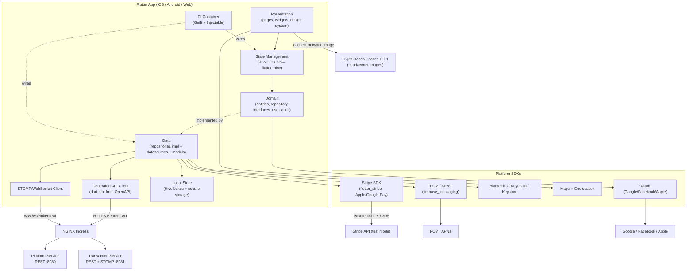
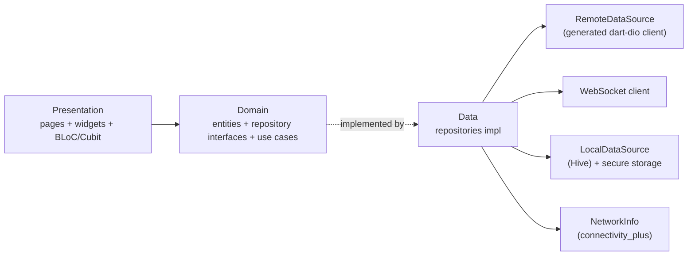

# Design Document — Phase 8: Mobile App (Flutter)

## Overview

Phase 8 delivers `court-booking-mobile-app`: a single Flutter codebase targeting **iOS, Android, and Web** that is a **pure client** of the existing backend. It consumes:

- **Platform Service** (REST) — auth, users/profile/preferences/skill-levels, courts, availability, holidays, weather, map aggregation, favorites, ratings, pricing, cancellation policy, analytics, dashboard, settings, verification, Stripe Connect, support.
- **Transaction Service** (REST + STOMP-over-WebSocket) — bookings, payments, notifications/device tokens, receipts, manual/recurring bookings, Stripe Connect, and all real-time channels.

The app owns **no business logic** that the services own. Server-side validation, pricing, conflict resolution, payment capture, refund calculation, and the reconciliation job remain authoritative. Client-side validation and refund/price previews are UX optimizations only (Req 19, Req 31).

The app serves two audiences from one binary, switched by the JWT `role` claim:

- **Customers** — discover courts on a map, view detail + weather, book and pay via Stripe, manage bookings (incl. recurring), manage profile/preferences, receive notifications.
- **Court owners** — manage courts, view dashboard/calendar, create manual bookings, confirm/reject pending, flag no-shows, mark-paid-externally, complete verification + Stripe Connect onboarding, review analytics. (The Phase 6 React admin web remains the primary owner surface; mobile provides an on-the-go subset.)

### MVP vs Deferred (⏳ Phase 2)

The architecture accommodates Phase 2 features in navigation and models but **does not implement** them. Deferred and kept hidden/disabled, never calling their endpoints (Req 27.5): open match join/create (Req 24), split payments (Req 25), waitlist (Req 26), court ratings & reviews (Req 2.19–2.20), promo codes & dynamic pricing (Req 27), scheduled reports (Req 15.6–15.9). These are marked **⏳ PHASE 2** throughout.

**Subscription stub:** per the master roadmap, all court owners are treated as **Subscribed** until Phase 10. The app **reads** `subscriptionStatus`/`trialDaysRemaining` from `GET /api/users/me` but does **not** enforce them and does **not** render trial banners, countdowns, tier selection, or Stripe Billing screens (⏳ Phase 2). This is the only stub the app honors, and it is **server behavior** — see Decision 2.

### Out of scope (not exposed by current contracts)

- Multi-device "active sessions" list with per-session revoke — app uses per-device `POST /api/auth/logout` + full re-auth.
- Self-service personal-data export endpoint — app surfaces GDPR deletion (`POST /api/users/me/delete`) and routes export requests to the Support Hub (Req 2.9).

---

## Design Decisions & Rationale (Locked Constraints)

These decisions are firm constraints for this phase, not options. Every section below is built to satisfy them.

> **Architecture baseline — follows workspace steering.** The app's technical architecture (state management with **BLoC/Cubit** via `flutter_bloc`, dependency injection with **GetIt + Injectable**, functional error handling with **fpdart `Either<Failure, Success>`**, local storage with **Hive**, **per-feature three-layer Clean Architecture**, **mocktail + bloc_test** as the unit/widget test standard, and the strict analyzer/lint configuration) conforms to the workspace steering file `.kiro/steering/flutter-mobile-app-architecture-context.md`. Where this design previously named different tools, the steering choices take precedence. **Decision 1 (Path A design system)** and **Decision 2/3 (real backend only + locally testable, no API mocking)** are the user's locked decisions and are layered **on top of** that steering baseline — they are not overridden by it.

### Decision 1 — Visual design is "Path A": a Flutter-native design system built from journeys

The app defines its **own Material 3 design system** (token layer, typography, spacing, shape, light/dark, platform adaptation, reusable widget catalog) and builds screens directly from the Customer and Court Owner journeys. A Figma pass is **optional/future** and must not be a build dependency.

- The existing `docs/figma-to-code-guidelines.md` targets the **React/Ant-Design admin web** and **does not apply** to this app. Ant Design is not used.
- The brand palette aligns with the admin web (primary `#1677FF`, success green, warning gold, error red, and a booking-status color map) so the two surfaces feel like one product, but the implementation is pure Flutter `ThemeData`.
- See **Design System & Theming**.

### Decision 2 — Real backend only: no API mocking anywhere in the running app

The running app talks **only** to the real backend. There is **no** in-app mock layer, no fake data source behind a flag, no canned responses.

- A **single generated Dart API client** is produced from the OpenAPI specs (`openapi-generator`, `dart-dio`), and a typed STOMP/WebSocket client is built from `websocket-message-contracts.json`. (Req 27.1)
- The **only** permitted stub is the **backend-side subscription stub** (court owners default to `ACTIVE` until Phase 10). That is server behavior, not app mocking.
- **Test doubles are permitted only in isolated unit/widget tests.** All integration/E2E tests run against the **real local backend stack** (docker-compose + both Spring services on the `local` profile). See **Testing Strategy** and **Local Development & Testing**.

### Decision 3 — Fully functional and locally testable against the real backend

The app is runnable end-to-end on a developer machine against the real services, with real third parties in sandbox/test mode (Stripe test keys + Stripe CLI webhook forwarding, OpenWeatherMap, FCM/APNs sandbox, OAuth test apps). Build-time config flows through `--dart-define`. See **Local Development & Testing** for the runbook, per-platform host mapping, cleartext/ATS notes, and seed guidance.

---

## Architecture

### High-Level Architecture



Key flows:

- **REST** goes through the generated client → Dio interceptor chain → NGINX → Platform/Transaction services.
- **Real-time** is a STOMP-over-WebSocket connection to the Transaction Service at `/ws?token=<jwt>`.
- **Court/owner images** are loaded at runtime from the Spaces CDN (`cached_network_image`); there is no design-time mocking of imagery.
- **Payments** never touch card data in app code — the Stripe SDK collects and confirms; the app only sends the booking request with an idempotency key.

---

## App Architecture (Feature-First Clean Architecture)

The app uses **feature-first Clean Architecture** with three layers per feature and unidirectional dependencies (presentation → domain → data). The domain layer depends only on **abstract repository interfaces** and pure entities; concrete repositories live in the data layer and coordinate the remote data source (which wraps the generated client), the local data source (Hive), and `NetworkInfo`. This mirrors the structure in the workspace steering (`flutter-mobile-app-architecture-context.md`).



Repositories return `Future<Either<Failure, T>>` (fpdart). BLoCs/Cubits call use cases (or repositories directly for simple features), `fold` the `Either`, and emit freezed union states. UI binds with `BlocBuilder`/`BlocListener`/`BlocSelector`.

### State management — BLoC / Cubit (`flutter_bloc`)

**Decision:** use **BLoC/Cubit** via `flutter_bloc` (with `bloc`), per the workspace steering. **BLoC** is used for complex, event-driven state (auth, booking flow, discovery/search, real-time-driven screens); **Cubit** is used for simpler state (form field validation, theme/locale, toggles). All States and Events are **freezed unions** consumed with `state.when(...)` / `state.maybeWhen(...)`.

```dart
// Domain-facing use cases return Either<Failure, T>; the BLoC folds to states.
@freezed
class BookingState with _$BookingState {
  const factory BookingState.initial() = _Initial;
  const factory BookingState.loading() = _Loading;
  const factory BookingState.loaded(List<Booking> bookings) = _Loaded;
  const factory BookingState.failure(Failure failure) = _Failure;
}

@freezed
class BookingEvent with _$BookingEvent {
  const factory BookingEvent.load() = _Load;
  const factory BookingEvent.create(CreateBookingParams params) = _Create;
  const factory BookingEvent.cancel(String id) = _Cancel;
  const factory BookingEvent.statusPatched(BookingStatusUpdate msg) = _StatusPatched; // from WebSocket
}

@injectable
class BookingBloc extends Bloc<BookingEvent, BookingState> {
  BookingBloc(this._getBookings, this._createBooking, this._cancelBooking)
      : super(const BookingState.initial()) {
    on<_Load>(_onLoad);
    // ...
  }
  Future<void> _onLoad(_Load e, Emitter<BookingState> emit) async {
    emit(const BookingState.loading());
    final result = await _getBookings();
    result.fold(
      (failure) => emit(BookingState.failure(failure)),
      (bookings) => emit(BookingState.loaded(bookings)),
    );
  }
}
```

**Rationale:**
- The steering mandates BLoC/Cubit for enterprise/server-state features; `state.when` over freezed unions models the loading/data/failure tri-state that the Req 15 latency tiers and per-section partial-failure (Req 6, Req 15.11) require.
- `BlocListener` cleanly drives side effects (navigation on session expiry Req 18.3, snackbars), `BlocSelector` minimizes rebuilds for hot lists (calendar, map markers), and BLoCs subscribe to cross-cutting streams (connectivity, WebSocket messages) to react to "message → patch state" (Req 8.8, Req 13) and "connectivity restored → drain offline queue" (Req 15.2, Req 20).
- Cross-cutting singletons (auth/token state, connectivity, WebSocket connection) are resolved from **GetIt** (next section) so they are reachable from interceptors and background/notification handlers, not just the widget tree.
- **Testable:** BLoCs are unit-tested with `bloc_test` + `mocktail` doubles; integration tests use the real wired BLoCs against the real backend (Decision 2).

### Dependency Injection — GetIt + Injectable (`core/di`)

Per the steering, DI uses **GetIt** as the service locator with **Injectable** code generation. `configureDependencies()` calls the generated `getIt.init()` at startup.

```dart
// core/di/injection.dart
final getIt = GetIt.instance;

@InjectableInit(preferRelativeImports: false)
Future<void> configureDependencies() async => getIt.init();

// core/di/register_module.dart — third-party singletons
@module
abstract class RegisterModule {
  @lazySingleton
  Dio dio(AuthInterceptor auth, IdempotencyInterceptor idem, RetryInterceptor retry, ErrorInterceptor err) =>
      Dio(BaseOptions(baseUrl: AppConfig.platformBaseUrl))
        ..interceptors.addAll([HeaderInterceptor(), auth, idem, retry, err]);

  @preResolve
  Future<SharedPreferences> get prefs => SharedPreferences.getInstance();

  @preResolve
  Future<Box<dynamic>> get cacheBox => Hive.openBox<dynamic>('cache');
}
```

- Data sources, repositories, use cases, and BLoCs/Cubits are annotated for auto-registration: `@LazySingleton(as: BookingRemoteDataSource)` on datasources, `@LazySingleton(as: BookingRepository)` on repository impls, `@injectable` on use cases, and `@injectable` on BLoCs (a fresh BLoC per `BlocProvider` injection; long-lived cross-cutting ones such as `AuthBloc`, `ThemeCubit`, `LocaleCubit`, `ConnectivityCubit` are `@lazySingleton`).
- `Dio`, `SharedPreferences`, opened `Hive` boxes, `flutter_secure_storage`, the STOMP client, and `Stripe`/Maps SDK wrappers are provided by the `@module RegisterModule`.
- App bootstrap (`main.dart`) calls `await configureDependencies()` after `Hive.initFlutter()`, then mounts a **`MultiBlocProvider`** (see App Entry Point below).

### Routing — go_router (chosen)

`go_router` provides declarative, URL-based routing required for **deep links** (Req 17) on all three platforms, typed route guards for **role-based shells** and **auth gating** (Req 17.2, session-expiry redirect Req 18.3), and nested navigation for the bottom-nav shells. Web URL support comes for free, satisfying the Web target (Req 28).

### Folder structure (feature-first, three-layer)

Per the steering, each feature owns its own `data` / `domain` / `presentation` layers. There is **no** top-level `data/` + `domain/` split; shared concerns live in `core/` and reusable UI in `shared/`.

```
lib/
├── main.dart                          # bootstrap: env, Hive, DI, error zone, MultiBlocProvider
├── app/
│   ├── app.dart                       # MaterialApp.router + theme + locale (BlocBuilder on Theme/LocaleCubit)
│   ├── router/                        # go_router config, guards, deep links
│   └── di/                            # injection.dart (configureDependencies/getIt.init), register_module.dart
├── core/
│   ├── config/                        # AppConfig: --dart-define reader (API_*_BASE_URL, WS_BASE_URL, ...)
│   ├── theme/ (design_system)         # Material 3 tokens, widget catalog (see Design System & Theming)
│   ├── network/                       # Dio + interceptors (auth, idempotency, retry, error→Failure)
│   ├── realtime/                      # STOMP client, subscriptions, backoff
│   ├── storage/                       # Hive boxes, secure storage, cache TTL/evict, offline queue
│   ├── errors/                        # Failure sealed hierarchy + exceptions
│   ├── network_info/                  # NetworkInfo (connectivity_plus)
│   ├── api/                           # generated dart-dio output (platform/ + transaction/) — never hand-edited
│   ├── i18n/ (l10n)                   # ARB-generated localizations, formatters
│   └── observability/                 # crash reporting, telemetry, log sanitizer
├── features/
│   ├── booking/                       # worked example below
│   │   ├── data/
│   │   │   ├── datasources/           # booking_remote_datasource.dart (wraps generated client),
│   │   │   │                          #   booking_local_datasource.dart (Hive)
│   │   │   ├── models/                # DTOs (generated, or thin wrappers) with toEntity()/fromEntity()
│   │   │   └── repositories/          # booking_repository_impl.dart  (@LazySingleton as BookingRepository)
│   │   ├── domain/
│   │   │   ├── entities/              # pure Booking, Slot, ... (freezed)
│   │   │   ├── repositories/          # abstract BookingRepository  -> Either<Failure, T>
│   │   │   └── usecases/              # GetBookings, CreateBooking, CancelBooking (@injectable)
│   │   ├── presentation/
│   │   │   ├── bloc/                  # booking_bloc.dart / _event.dart / _state.dart (freezed)
│   │   │   ├── pages/                 # bookings_page.dart, booking_detail_page.dart
│   │   │   └── widgets/               # booking_card.dart, booking_list.dart
│   │   └── booking.dart               # barrel export
│   ├── auth/  discovery/  map/  court_detail/  my_bookings/
│   ├── notifications/  owner/  verification/  payments/  profile/  support/
│   └── shell/                         # role-based bottom-nav shells (customer / owner)
└── shared/
    ├── widgets/                       # cross-feature reusable widgets
    └── extensions/                    # Dart extensions (DateTime, String, BuildContext, ...)
```

**Booking feature as the worked example** mirrors the steering's `features/bookings/` layout exactly: `BookingRemoteDataSourceImpl` wraps the generated client; `BookingLocalDataSourceImpl` reads/writes Hive; `BookingRepositoryImpl(remoteDataSource, localDataSource, networkInfo)` returns `Either<Failure, Booking>`; use cases wrap the repository; `BookingBloc` folds results into freezed states.

### Import rules

| Import type | Pattern | Example |
|-------------|---------|---------|
| Within a feature | relative `./` | `import 'widgets/booking_card.dart';` |
| Cross-feature | package import (via barrel) | `import 'package:court_booking_app/features/auth/auth.dart';` |
| Core utilities | package import | `import 'package:court_booking_app/core/network/dio_client.dart';` |
| Shared widgets | package import | `import 'package:court_booking_app/shared/widgets/widgets.dart';` |

### Barrel exports

Each feature exposes a single barrel (`features/<feature>/<feature>.dart`, e.g. `features/booking/booking.dart`) re-exporting its public entities, repository interface, use cases, BLoC, and pages, so cross-feature and DI imports go through one stable path. `core/` and `shared/` expose barrels likewise (`shared/widgets/widgets.dart`). The generated API client under `core/api/` is **never edited by hand**; domain entities are mapped from generated DTOs (`toEntity()`) so the app's domain stays decoupled from contract churn and tolerant of additive changes (Req 27.2). See **Reconciling the generated OpenAPI client with the data layer** below.

### App entry point & bootstrap (`main.dart`)

Bootstrap order follows the steering's `main.dart`: bind, read `--dart-define` config, init Hive + `HydratedBloc.storage`, wire DI, then mount a **`MultiBlocProvider`** at the root holding the long-lived singletons; everything runs inside `runZonedGuarded` (see Error Handling).

```dart
Future<void> main() async {
  WidgetsFlutterBinding.ensureInitialized();
  await Hive.initFlutter();
  HydratedBloc.storage = await HydratedStorage.build(
    storageDirectory: await getApplicationDocumentsDirectory(),
  );
  await configureDependencies();            // GetIt + Injectable (getIt.init())
  runZonedGuarded(() => runApp(const CourtBookingApp()), reportCrash);
}

class CourtBookingApp extends StatelessWidget {
  const CourtBookingApp({super.key});
  @override
  Widget build(BuildContext context) {
    return MultiBlocProvider(
      providers: [
        BlocProvider(create: (_) => getIt<AuthBloc>()..add(const AuthEvent.checkRequested())),
        BlocProvider(create: (_) => getIt<ConnectivityCubit>()),
        BlocProvider(create: (_) => getIt<ThemeCubit>()),
        BlocProvider(create: (_) => getIt<LocaleCubit>()),
      ],
      child: BlocBuilder<ThemeCubit, ThemeMode>(
        builder: (context, themeMode) => BlocBuilder<LocaleCubit, Locale>(
          builder: (context, locale) => MaterialApp.router(
            theme: AppTheme.light(), darkTheme: AppTheme.dark(), themeMode: themeMode,
            locale: locale, supportedLocales: AppLocalizations.supportedLocales,
            localizationsDelegates: AppLocalizations.localizationsDelegates,
            routerConfig: getIt<AppRouter>().config,
          ),
        ),
      ),
    );
  }
}
```

Feature-scoped BLoCs (BookingBloc, DiscoveryBloc, …) are provided lower in the tree via `BlocProvider(create: (_) => getIt<XBloc>())` at the route/page level, so each screen gets a fresh instance from GetIt.

---

## Design System & Theming

(Decision 1 — Path A.) The app ships a self-contained Material 3 design system. No Ant Design, no Figma dependency.

### Token layer (`core/design_system/tokens`)

- **Color** — Material 3 `ColorScheme.fromSeed(seedColor: Color(0xFF1677FF))` tuned to the admin-web brand, plus semantic roles: `success` (green), `warning` (gold), `error` (red), `info`. A dedicated **booking-status color map** (single source of truth) is shared by chips, calendar, and markers:

  | Status | Role color | Notes |
  |--------|-----------|-------|
  | `CONFIRMED` | success/green | |
  | `PENDING_CONFIRMATION` | warning/gold | |
  | `CANCELLED` | neutral/grey | |
  | `REJECTED` | error/red | |
  | `COMPLETED` | primary/blue (muted) | |
  | slot `AVAILABLE`/`HELD`/`BOOKED`/`BLOCKED` | green/gold/grey/dark | matches WS contract enum |

  Status is **never conveyed by color alone** — every status surface pairs color with a label and/or icon (Req 23.5). Each role color additionally carries a paired **`on*` foreground** chosen so the text/background pair clears the contrast thresholds in **Contrast tokens** below.
- **Typography** — a single `TextTheme` scale (display→label) using a legible variable font; respects OS text scaling (Req 23.2).
- **Spacing rhythm** — a strict **4 pt base grid** exposed as named tokens (`space.xxs=2, xs=4, sm=8, md=12, lg=16, xl=24, xxl=32, xxxl=48`). All paddings, gaps, and list separators consume these tokens (no magic numbers), giving a consistent vertical/horizontal rhythm across screens. Section gutters are `lg` on phone and `xl` on tablet/wide (see **Responsive breakpoints**).
- **Shape** — corner-radius tokens (`radius.sm=8, md=12, lg=16, pill=999`); cards/sheets use `md`/`lg`, chips/buttons use `pill` or `md`, the booking-confirmation hero card uses `lg`.
- **Elevation & shadow** — a 5-step elevation ramp (`e0`–`e4`) mapped to Material 3 surface-tint + a soft, low-spread shadow token set (ambient + key) rather than harsh default shadows: `e0` flat surfaces, `e1` cards, `e2` raised buttons/bottom-sheets, `e3` dialogs, `e4` menus. Dark theme leans on **surface tint** over drop shadow (shadows read poorly on dark) so depth stays legible.
- **Motion tokens** — duration and easing are tokenized so every animation is consistent and tunable (see **Motion & micro-interactions**): `motion.fast=120ms`, `motion.base=220ms`, `motion.slow=320ms`, `motion.emphasized=400ms`; curves `easing.standard=Curves.easeInOutCubicEmphasized`, `easing.decelerate=Curves.easeOutCubic`, `easing.accelerate=Curves.easeInCubic`. A single `MotionTokens` source feeds both implicit animations and the page-transition theme. **All non-essential motion collapses to near-zero duration when reduce-motion is on** (Req 23.7, Property 29).
- **Light + dark** — both `ThemeData` variants generated from the same tokens; theme mode follows the system and is user-overridable (see **Light & dark theming** for the refinement details).

### Platform adaptation

- **Android** → Material components and page transitions; **Google Pay** button.
- **iOS** → Cupertino touches where they matter: `showCupertinoModalPopup`/Cupertino date & time pickers in the booking flow, `CupertinoSwitch` in settings, Cupertino page transitions, **Apple Pay** button. A small `PlatformAdaptive` widget set wraps these so screens stay declarative.
- **Web** → responsive layouts (breakpoint-based: phone / tablet / wide), pointer + keyboard affordances; capabilities unsupported on web degrade gracefully (Req 28.4).

### Reusable widget catalog (`core/design_system/widgets`)

The catalog is the single source of polished, accessible building blocks every screen composes from, so the visual language is consistent by construction:

- **Buttons** — primary/secondary/tonal/destructive, each with built-in disabled+spinner states for the "disable on submit" rule (Req 16.1) and a **press micro-interaction** (scale-to-0.97 + tint over `motion.fast`) plus a light haptic (see **Haptics**).
- **Status chips** — driven by the booking-status color map; always render **icon + label + color** (never color-only, Req 23.5).
- **Skeleton/shimmer loaders** — `shimmer`-based placeholders that **match the real layout** of the target screen (card silhouettes, list rows, the detail hero) so the 300 ms–2 s tier transitions seamlessly into content (Req 15.5; see **State visuals**).
- **Banners** — `OfflineBanner`, `LiveUpdatesPausedBanner`, `StaleAvailabilityBanner`, `PendingSyncBadge`, `UpdateRequiredScreen` — consistent iconography, dismiss/retry affordances, and live-region semantics.
- **Bottom sheets** — court preview, payment-method picker, filter sheet; all use a **drag handle + drag-to-dismiss** affordance (see **Gestures**).
- **Empty states** — `EmptyState` widget pairing a branded illustration, headline, supportive line, and at least one action (Req 29; see **State visuals** and Property 27).
- **Error/retry** — `SectionError` (per-section retry, Req 6.5) and `FullScreenError` (Contact Support + correlationId), with a friendly illustration rather than a raw error string.
- **Success affordances** — `SuccessCheck` (animated check draw) used by the booking-confirmation screen and other terminal-success moments (see **State visuals**).
- **PlatformAdaptive** wrappers — see **Platform adaptation** (Cupertino pickers/switches on iOS).

### Asset strategy & visual language

- **Iconography** — one icon family throughout (Material Symbols, rounded weight) plus a small set of bespoke `flutter_svg` glyphs for court types (tennis/padel/basketball/football) used identically on markers, chips, and placeholders so a court type always reads the same way.
- **Illustrations** — a single cohesive, flat, brand-tinted illustration set (one accent + neutral line work, supports light/dark variants) used for empty states, onboarding, and friendly errors. Illustrations are decorative (`Semantics(excludeSemantics: true)`) with the meaning carried by adjacent text.
- **Imagery treatment** — court photos render with a consistent aspect ratio, `radius.md` clipping, and a subtle bottom scrim so overlaid text (name/price) stays legible; loaded via `cached_network_image` against the **Spaces CDN** with a court-type placeholder, **progressive fade-in** (`FadeInImage`-style), and on-scroll retry (Req 6.6). **No imagery is mocked** (Decision 2).
- **Elevation & shadow** — applied from the elevation ramp tokens (see Token layer), favoring surface tint on dark.
- **Bundled assets** → Material Symbols + `flutter_svg`; `flutter_native_splash` for splash; `flutter_launcher_icons` for the app icon.

### Motion & micro-interactions

All motion draws from the **motion tokens** (durations + curves) and is centralized so it is consistent and reduce-motion-aware (Req 23.7, Property 29). Implemented with `flutter_animate` (declarative effects) and the `animations` package (Material motion patterns).

- **Page transitions** — Material **shared-axis** (horizontal) for forward/back within a tab, **fade-through** for bottom-nav tab switches, **container transform** for card→detail expansions. Wired into a `PageTransitionsTheme` so go_router routes inherit them.
- **Hero / shared-element** — the **court card → Court Detail** transition is a hero on the court image + container transform on the card surface (`motion.emphasized`, `easing.standard`), so the image and price expand into the detail header rather than a hard cut (Req 6, Customer Journey Step 5).
- **List entrance** — search results, calendar rows, and notification lists use a **staggered fade+slide** (each row offset by ~30 ms, capped so long lists don't feel slow), only on first paint of a result set.
- **Button & tap feedback** — scale/tint press effect on the shared button widget; ink ripples on Android, opacity press on iOS via `PlatformAdaptive`.
- **State-change transitions** — `AnimatedSwitcher` (fade+size, `motion.base`) between loading/empty/error/loaded so latency-tier changes (Req 15) never "pop".
- **Live data** — when an `AVAILABILITY_UPDATE` replaces slot state (Req 13.2), changed slots **cross-fade** rather than jumping; the "Live updates paused"→resumed transition animates the banner in/out.
- **Reduce-motion** — a `MotionConfig` reads `MediaQuery.disableAnimations`/the OS reduce-motion flag; when set, non-essential motion (stagger, hero scale, decorative effects) collapses to an instant cross-fade or no animation, while essential feedback (focus, error) remains (Req 23.7, Property 29).

### Haptic feedback patterns

Haptics are tokenized through a `Haptics` helper (wrapping `HapticFeedback`) and only fire on meaningful events, never on routine scrolls (and are no-ops on Web):

| Event | Haptic |
|-------|--------|
| Primary button / confirm tap | `selectionClick` |
| Booking confirmed (success) | `mediumImpact` + success animation |
| Payment declined / validation error | `heavyImpact` (paired with visual error) |
| Pull-to-refresh trigger | `lightImpact` at threshold |
| Swipe action revealed/committed (cancel/confirm) | `selectionClick` on reveal, `mediumImpact` on commit |
| Toggle favorite | `lightImpact` |

### Gesture affordances

- **Pull-to-refresh** (`RefreshIndicator`, Cupertino sliver refresh on iOS) on Map list-fallback, Discovery results, My Bookings, Owner Calendar, Pending Queue, Notification Center — re-fetches respecting the Req 15.12 throttle.
- **Swipe actions** on booking rows: customer My Bookings → swipe for **Cancel** (with refund-preview confirm, Req 8.4) and **Share**; owner Pending Queue → swipe for **Confirm**/**Reject** (Req 11.4). Destructive swipes require the confirm step; never fire on a single accidental swipe.
- **Bottom-sheet drag** — drag handle + drag-to-dismiss on the court preview, payment-method, and filter sheets; sheets are scrollable when content exceeds height.
- **Map gestures** — pinch-zoom expands clusters (Req 4.5); pan/zoom triggers the debounced reload (Req 4.6); marker tap opens the preview sheet.
- **Carousel** — horizontal swipe on the court image carousel with page dots; keyboard/pointer arrows on Web.

### State visuals (loading, empty, error, success)

Every list/detail screen renders four polished states, transitioned with `AnimatedSwitcher`:

- **Loading** — layout-matched **skeleton/shimmer** (not spinners) for the 300 ms–2 s tier; a labeled overlay for 2–5 s ("Searching for courts…", "Confirming your booking…") (Req 15.4–15.6, Req 31.1).
- **Empty** — branded illustration + headline + supportive copy + action, one per context (no results, no bookings in a group, no notifications, no favorites, no tickets) (Req 29, Property 27).
- **Error / retry** — friendly illustration, plain-language `message` (never a raw status, Req 21.6), a **Retry** control, and **Contact Support** with the captured `correlationId` for non-recoverable errors (Req 15.7, Req 22.2). Per-section variants keep sibling sections visible (Req 6.5).
- **Success** — the booking-confirmation screen plays a one-shot **animated success check** + medium haptic, then reveals the booking summary with Add-to-Calendar/Share/Receipt actions (Req 7.5); cancellations and "marked paid" show a lighter inline success affordance.

### Responsive breakpoints

A `Breakpoints` helper and `ResponsiveLayout` widget select layout by available width, so the same screens scale from phone to tablet to desktop web (Req 28.1, Req 28.4):

| Tier | Width | Layout behavior |
|------|-------|-----------------|
| Phone | `< 600 dp` | single column; bottom-nav shell; full-width sheets |
| Tablet | `600–1023 dp` | two-pane where useful (list + detail on Map/Discovery/My Bookings/Calendar); wider gutters (`xl`); larger image sizes |
| Wide / Web | `≥ 1024 dp` | constrained max content width (centered), persistent side navigation rail instead of bottom nav, multi-column grids for court results |

- **Web pointer & keyboard** — hover states on cards/buttons, focus rings via `FocusTraversalGroup`, Enter/Escape on dialogs, arrow-key carousel/calendar navigation, and visible focus order matching reading order (Req 23 + Req 28.4).
- Capabilities unsupported on Web (native biometrics, native push where unavailable) degrade gracefully with supported alternatives (Req 28.4).

### Light & dark theming (refined)

- Two `ThemeData` variants from the same tokens; **dark uses elevated surface tints** rather than drop shadows, desaturated brand and status colors tuned to keep ≥ 4.5:1 text contrast, and an OLED-friendly deep surface.
- The **booking-status color map** has explicit light/dark pairs so chips/markers/calendar stay legible and consistent in both modes.
- Court imagery gets a slightly stronger scrim in dark mode so overlaid text remains legible.
- Theme mode follows the system by default and is user-overridable (persisted via `ThemeCubit`, below).

### Onboarding (delightful first run)

- A brief **3-screen illustrated onboarding** (discover → book → manage) shown once on first launch, skippable, with the cohesive illustration set and shared-axis transitions; honors reduce-motion.
- **Role selection** (CUSTOMER/COURT_OWNER) and **Terms acceptance** are presented as clean, single-purpose steps with clear primary actions (Req 1.3–1.4); Terms falls back to the cached version with its "last updated" date when unreachable (Req 1.10).
- **In-context permission priming** — a friendly explanation screen precedes each OS permission prompt (location, notifications, biometrics, calendar, camera/photos) so users understand the value before the system dialog (Req 24.1).
- First successful booking shows the success-check celebration to reinforce the core loop.

### Perceived-performance strategy

Tied to the Req 15 latency tiers and Req 31 cold-start budget, the app optimizes *perceived* speed:

- **Instant cached render** — screens with cached data (court detail, My Bookings, favorites, profile) render the cached content **immediately** with a "Last updated X ago" label, then refresh in the background and animate in deltas — so the user rarely sees a blank loading screen (Req 14.2–14.3).
- **Optimistic UI** — favorite toggles and preference changes apply instantly and revert on failure (Req 5.4–5.6, Req 20, Property 10).
- **Skeletons over spinners** — layout-matched skeletons for 300 ms–2 s keep the UI feeling "already there" (Req 15.5).
- **Progressive image fade-in** — court images fade in over a placeholder of the same dimensions, avoiding layout shift; off-screen images lazy-load (Req 31.6).
- **Sub-300 ms = no indicator** — fast responses never flash a loader (Req 15.4), avoiding flicker.
- **Cold start** — deferred/lazy DI for non-critical singletons and a native splash keep interactive content within the 3 s budget on mid-range devices (Req 31.2).

### Accessibility (Req 23)

Accessibility is a first-class property of the design system, not an afterthought: semantic labels on every interactive control, image, and status indicator (Req 23.1); dynamic text scaling to 2× without truncating essential info (Req 23.2); ≥ 4.5:1 / 3:1 contrast enforced by the **contrast tokens** (Req 23.3); ≥ 44×44 logical-pixel tap targets (Req 23.4); **status conveyed by icon + label, never color alone** (Req 23.5); `Semantics` live-region announcements on screen load and error (Req 23.6); and reduce-motion honored across all non-essential animation (Req 23.7, Property 29). These are enforced and verified through the **Accessibility audit checklist** under **Design-quality assurance** below, and complemented by a manual assistive-technology pass before release.

### Design-quality assurance (verifiable visual quality)

Visual quality is treated as testable, not subjective:

- **Golden / visual-regression tests** (`flutter_test` `matchesGoldenFile`, optionally `alchemist`/`golden_toolkit`) for the design-system widget catalog and key screen states (loading/empty/error/loaded, light + dark, phone + tablet widths, default + 2× text scale). Goldens run in CI and gate merges on unintended visual drift.
- **Contrast tokens** — the brand/status role pairs are defined as `(foreground, background)` token pairs and unit-tested to meet **≥ 4.5:1** (normal text) / **≥ 3:1** (large text) (Req 23.3, Property 28); no role pair ships below threshold.
- **Accessibility audit checklist** (run per screen in CI widget tests + a manual pass):
  - semantic label present on every interactive control, image, and status indicator (Req 23.1);
  - tap targets ≥ 44×44 logical px (Req 23.4) — asserted via `meetsGuideline(androidTapTargetGuideline/iOSTapTargetGuideline)`;
  - text scales to 2× without truncating essential info (Req 23.2);
  - status conveyed by icon/label, never color alone (Req 23.5);
  - live-region announcement on screen load and error (Req 23.6);
  - reduce-motion collapses non-essential animation (Req 23.7, Property 29);
  - `meetsGuideline(textContrastGuideline)` on representative screens.
- **Manual verification note** — full WCAG conformance requires manual testing with real assistive technologies (TalkBack/VoiceOver) and expert review; the automated checks above are necessary but not sufficient and are complemented by a manual a11y pass before release.

### Theme & locale persistence (HydratedCubit)

Theme mode and locale are owned by two lightweight Cubits that persist across launches via `hydrated_bloc` (steering §14/§15), keeping the Path A design system's light/dark/system selection and the el/en language choice durable without bespoke storage code:

- **`ThemeCubit extends HydratedCubit<ThemeMode>`** — `setTheme(ThemeMode)`; `toJson`/`fromJson` store `{mode}`. Drives `MaterialApp.router.themeMode`; `theme`/`darkTheme` come from the design system's `AppTheme.light()`/`AppTheme.dark()` (built from the brand tokens in **Token layer**, not the steering's sample green seed).
- **`LocaleCubit extends HydratedCubit<Locale>`** — `setLocale(Locale)`; persists `{languageCode}` for `el`/`en`. The language toggle in Settings/Preferences updates this Cubit and also calls `PUT /api/users/me` so the server-side `Accept-Language` preference stays in sync (Req 21).

Both are registered as `@lazySingleton` and provided at the app root via `MultiBlocProvider` (see App Entry Point). `HydratedBloc.storage` is initialized in `main.dart` before the app runs.

---

## Components and Interfaces

### API Integration Layer (`core/network`)

The generated `dart-dio` client is configured with a shared `Dio` instance and an ordered interceptor chain. (Req 27.1, Req 18, Req 21, Req 16.2)

```mermaid
sequenceDiagram
    participant UC as Use case / Repo
    participant DIO as Dio
    participant I1 as Header interceptor
    participant I2 as Auth interceptor
    participant I3 as Retry/backoff
    participant API as Backend
    UC->>DIO: request
    DIO->>I1: add Accept-Language, X-Idempotency-Key (state-changing), traceparent
    I1->>I2: attach Bearer access token
    I2->>I3: send
    I3->>API: HTTP
    API-->>I3: 401
    I3->>I2: silent refresh + retry once
    API-->>UC: Response / Either&lt;Failure, T&gt;
```

Interceptor responsibilities:

- **Header interceptor** — injects `Accept-Language` (current locale, Req 21.3); injects a client-generated **`X-Idempotency-Key` (UUID v4)** on every state-changing call (`POST/PUT/DELETE` for bookings, payments, cancellations) (Req 16.2, Req 8.5, Req 9.1); injects a `traceparent`/correlation header so client and server traces line up.
- **Auth interceptor** — attaches the `Bearer` access token; on `401`, performs a **single-flight Silent_Token_Refresh** (`POST /api/auth/refresh`), queues concurrent 401s behind the in-flight refresh, then **transparently retries** the original request; on refresh failure routes to login preserving navigation state (Req 18.1–18.3). Proactively refreshes when the token is within 60 s of expiry (Req 18.4).
- **Retry/backoff interceptor** — on transient failures (5xx, timeout, connection error) for **GET only**, auto-retries once after 2 s with exponential backoff; non-GET surfaces a manual "Retry" affordance (Req 15.3). 10 s hard timeout on non-payment requests → auto-cancel + "Something went wrong" with Retry/Contact Support (Req 15.7).
- **Error mapper (`ErrorInterceptor`)** — maps the API **`ErrorResponse`** body `{ error, message, details, timestamp, correlationId }` and the typed `BookingConflictResponse` / `BookingConstraintError` into the app's **`Failure`** sealed hierarchy (see Data Models), capturing `correlationId` for support tickets and telemetry (Req 15.8, Req 22.2, Req 26.3). Following the steering's `ErrorInterceptor` pattern, it rejects the `DioException` carrying a `Failure` in `error`, so each `RemoteDataSource` surfaces a `Failure` and the repository returns `Left(failure)` without re-parsing.
- **Throttle/debounce** — map court search debounced to ≤ 1 req / 500 ms (Req 4.6, Req 31.3); availability refresh throttled to ≤ 1 req / 5 s per court (Req 15.12, Req 31.3).

**Forward compatibility:** the generated deserializers are configured to **ignore unknown fields**, and all enum mapping goes through `tolerantEnum<T>()` that maps unrecognized values to a safe `unknown` variant rather than throwing (Req 27.2, Req 27.4). An `API_Version_Header` check surfaces an "Update required" screen on unsupported major versions (Req 27.3).

### Reconciling the generated OpenAPI client with the data layer (no mocking preserved)

The generated client and the feature-first data layer fit together exactly as the steering's `BookingRepositoryImpl` prescribes, while honoring Decision 2 (no in-app mocking):

- A **single generated `dart-dio` client** is produced from the two OpenAPI specs (`openapi-platform-service.yaml` → `core/api/platform/`, `openapi-transaction-service.yaml` → `core/api/transaction/`) and a typed STOMP client from `websocket-message-contracts.json`. The output is **never hand-edited** (Req 27.1).
- The generated client is consumed **inside each feature's `RemoteDataSource`** (e.g. `BookingRemoteDataSourceImpl` calls the generated bookings API). Data sources never leak into domain or presentation.
- The generated **DTOs serve as the `data/models` layer** (or are wrapped by thin model classes when an app-specific shape is needed). Every model exposes `toEntity()` mapping to a pure `domain/entities` freezed entity (and `fromEntity()` where the app sends data up), exactly like the steering's `BookingModel.toEntity()`.
- `BookingRepositoryImpl(remoteDataSource, localDataSource, networkInfo)` coordinates RemoteDataSource + LocalDataSource (Hive) + `NetworkInfo` and returns `Either<Failure, Entity>` — read-through cache on success, cached fallback (`Right(cached)`) or `Left(NetworkFailure/CacheFailure)` when offline.
- **No hand-written mock data sources exist.** The only stub anywhere remains the **server-side subscription default** (owners treated as `ACTIVE` until Phase 10, Decision 2). Test doubles (mocktail) appear **only** in unit/widget tests; integration/E2E run against the real local stack.

### Real-Time / WebSocket Client (`core/realtime`)

STOMP-over-WebSocket via `stomp_dart_client`, connecting to `wss://<host>/ws?token=<access_jwt>`. (Req 13, Req 18.5)

- **Subscriptions:** `/topic/courts/{courtId}/availability` (per viewed court), `/user/queue/bookings`, `/user/queue/notifications`, `/user/queue/system`. Phase 2 `/topic/courts/{courtId}/matches` and `/user/queue/matches` are **not** subscribed (Req 13.1, Req 27.5).
- **Availability handling:** on `AVAILABILITY_UPDATE` and `AVAILABILITY_SNAPSHOT`, the client **fully replaces** local slot state for the affected date(s) — non-incremental, exactly as the contract specifies (Req 13.2).
- **Booking updates:** `BOOKING_STATUS_UPDATE` patches the matching booking in the My Bookings / calendar caches (status, `noShow`, `paymentStatus`, `refundAmountCents`) without a full reload (Req 8.8).
- **Notifications:** `NOTIFICATION` is surfaced in-app and routed for deep linking via `data.deepLink` (Req 10.2, Req 10.6). Unknown `notificationType` values are ignored gracefully (Req 10.9, Req 27.4).
- **Token lifecycle:** on `TOKEN_EXPIRING` (`/user/queue/system`), obtain a fresh access token and send `TOKEN_REFRESH` on `/app/token-refresh` within 60 s (Req 18.5). On close `4001`, refresh and reconnect, falling back to login if refresh fails (Req 13.9).
- **Reconnection:** exponential backoff `1s, 2s, 4s, 8s, 16s, max 30s` plus **±500 ms jitter** to avoid thundering herd (Req 13.4). `SERVER_SHUTDOWN` / close `4005` reconnect after `reconnectAfterMs` then back off (Req 13.8).
- **Degradation:** on drop, show "Live updates paused" (Req 13.3); after > 60 s down, **poll** `GET /api/courts/{courtId}/availability` every 10 s for the viewed court (Req 13.6); availability older than 30 s or while disconnected shows "Availability may have changed" and force-refreshes on "Book Now" (Req 13.7). On reconnect, fetch a full availability refresh and clear the indicator (Req 13.5).
- **Lifecycle:** release the socket on background, stop polling (Req 31.5); on foreground re-establish and refresh current screen data (Req 13.10, Req 18.6).
- **Rate/error handling:** keep sends ≤ 10 msg/s (Req 13.11); treat `ERROR` frames (`RATE_LIMITED`, `INVALID_SUBSCRIPTION`, …) as non-fatal warnings unless `willDisconnect` is true.

### Offline & Caching (`core/storage`, `core/offline`)

- **Local store:** **Hive** (`hive_flutter`) is the cache + queue store (per the steering's local-storage choice). Typed boxes back the cached entities (courts, court detail, bookings, profile, preferences, favorites, weather), the **offline action queue**, and the **in-flight payment record**. Simple scalar key/values (e.g. last-selected filters, onboarding flags) use **`shared_preferences`**; theme/locale use **HydratedCubit** (see Design System). The relational/ordered-queue and eviction semantics below are implemented over Hive boxes (insertion order preserved via a monotonic key or an index box), exercised by Properties 9 and 11.
- **TTL & limits (Req 14.1, Req 31.4):** 24 h `Cache_TTL`; bounded sets — last **3** searches, last **10** court details, last **50** bookings, profile/preferences/favorites/last weather. Oldest entries evicted when limits exceeded.
- **Staleness UX:** "Last updated X minutes ago" on cached data (Req 14.3); "Data may be outdated" past TTL with refresh-priority (Req 14.4).
- **Offline reads (Req 14.2):** cached court details, booking history, favorites, bundled FAQ.
- **Offline writes disabled (Req 14.5):** booking create/pay/cancel/modify, rating, waitlist/match join all disabled with a "Requires internet" tooltip.
- **Offline action queue (Req 20):** FIFO, **max 50** items, holds favorite toggles and preference saves; processed **in insertion order** on reconnect; "Pending sync" indicator on queued actions; drops/rejects beyond 50 with feedback.
- **Optimistic UI (Req 5.4–5.6, Req 20.1):** favorites and preference changes apply immediately and **revert** on sync failure with an error toast.

### Authentication & Secure Storage (`features/auth`)

- **OAuth** (Google/Facebook/Apple) via `flutter_appauth` (+ Apple/Google sign-in helpers where the native button is required), exchanged for tokens via `POST /api/auth/login` (Req 1.1–1.2). Providers list from `GET /api/auth/providers`; linking via `POST /api/auth/providers/link` (Req 2.4, Req 1.11).
- **Token storage:** Refresh_Token stored **only** in the Secure_Enclave via `flutter_secure_storage` (iOS Keychain / Android Keystore). Access token kept **in memory** only; neither token is written to plain storage or logs (Req 25.1).
- **Biometric unlock** via `local_auth`: on returning launch, biometric gate unlocks the refresh flow; 3 consecutive failures → OAuth login (Req 1.5–1.6). Unavailable enrollment → OAuth fallback (Req 24.4).
- **Role & onboarding:** role selection (CUSTOMER/COURT_OWNER) on first registration (Req 1.3); Terms acceptance before home, with cached-Terms fallback when unreachable (Req 1.4, Req 1.10).
- **Logout:** `POST /api/auth/logout` revokes the device refresh token, clears secure storage + caches, returns to login (Req 2.5).
- **Session expiry:** expired/revoked/replay → login with "Your session has expired, please log in again", preserving navigation state for post-login restore (Req 1.7, Req 18.3).

### Payments (`features/payments`, `features/booking`)

Uses **`flutter_stripe`** with PaymentSheet. The app never handles raw card data. (Req 7, Req 16)

- **Setup / methods:** saved methods from `GET /api/payments/methods`; add card via `POST /api/payments/setup-intent` + Stripe SDK (Req 7.2).
- **Wallets:** Apple Pay (iOS) / Google Pay (Android) offered when available, hidden otherwise (Req 7.3, Req 28.2–28.3).
- **Booking creation:** `POST /api/bookings` with the persisted `X-Idempotency-Key` + Stripe confirmation; `201` → confirmation (instant) or "pending — awaiting owner confirmation" (manual) (Req 7.4–7.6).
- **3DS:** handle the redirect/SCA flow, waiting up to 5 minutes before timeout (Req 7.7).
- **Resilience & recovery (Req 16):**
  - Disable "Confirm and Pay" + spinner on tap to prevent double submit (Req 16.1).
  - Same `X-Idempotency-Key` reused across retries within the 24 h server window (Req 16.2, Req 16.4).
  - Payment > 10 s but possibly processed → "Your payment is being processed — please do not retry", poll `GET /api/bookings` every 5 s for up to 60 s, then offer Contact Support with payment reference (Req 16.3).
  - **Crash/kill recovery (Step 8a reframed client-side):** the in-flight idempotency key + booking intent are **persisted to a Hive box** before the request. On next launch, the app reconciles by **re-issuing the booking create with the same key** (server deduplicates) or by checking recent bookings via `GET /api/bookings`, then shows a "You have an incomplete booking" banner with resume/cancel (Req 16.5). There is no `PENDING_PAYMENT` status filter, so detection is purely client-side via the persisted key + bookings list.
  - Payment-succeeded-but-booking-failed → "Your payment was received…Your payment is safe" + reference, relying on the server reconciliation job + follow-up push (Req 16.6).
  - `402`/decline → show `message`, offer "Try another payment method" (Req 7.8).
  - `409` → "This time slot was just booked by someone else" + alternative slots from `BookingConflictResponse`, "Pick another time" refreshing availability (Req 7.10, Req 16.7).
  - `422` (`BOOKING_WINDOW_EXCEEDED` / `MINIMUM_NOTICE_NOT_MET`) → business-rule message, no auto-retry (Req 7.9).

### Notifications (`features/notifications`)

- **Registration:** on permission grant, obtain FCM/APNs token via `firebase_messaging` and register via `POST /api/notifications/device` with the platform-appropriate token (Req 10.1, Req 28.5). Denied permission still delivers in-app notifications and offers a later enable path (Req 24.3).
- **Delivery:** in-app via WebSocket `NOTIFICATION` while active (Req 10.2); push (FCM/APNs) while backgrounded/closed (Req 10.3); background booking-status push updates the local booking cache for freshness (Req 10.7).
- **Center:** `GET /api/notifications` with read/unread; mark read `POST /api/notifications/{id}/read`, mark all `POST /api/notifications/read-all`; empty-state when none (Req 10.4–10.5, Req 10.10).
- **Types:** render the supported `notificationType` set with titles/bodies/deep links; **gracefully ignore** unsupported/Phase 2 types (`MATCH_*`, `SPLIT_PAYMENT_*`, `WAITLIST_*`) (Req 10.8–10.9).
- **Deep linking:** `data.deepLink` opens the target screen via go_router; unauthenticated → login then resolve original target; missing resource → "This item is no longer available" + safe default; cold-start resolves after init + auth (Req 17).

### Maps & Geolocation (`features/map`)

- **Rendering:** `google_maps_flutter` (native iOS/Android) with `google_maps_flutter_web` for web; markers color-coded by court type, favorites highlighted (Req 4.2).
- **Loading:** bounds-based marker loads via `GET /api/courts/map` with the required `date` param, **debounced ≤ 1 req / 500 ms** on pan/zoom (Req 4.1, Req 4.6, Req 31.3); marker clustering expands on zoom (Req 4.5); tap → bottom-sheet preview (Req 4.7).
- **Filters:** Court_Filter tabs (All/Tennis/Padel/Basketball/Football/Favorites) + indoor/outdoor toggle + Distance_Filter `radiusKm` (default 10, from `maxSearchDistanceKm`) (Req 4.3–4.4, Req 3.3).
- **Permissions/fallback:** denied/unavailable location → center on Athens, "Enable location" banner, manual search (Req 4.8, Req 24.2); court load fail → keep tiles + "Couldn't load courts" retry (Req 4.9); tile fail → distance-sorted list fallback (Req 4.10); empty → widen-radius empty-state (Req 4.11). ⏳ open-match markers (Req 4.12) deferred.

### Navigation & App Shell (`features/shell`, `app/router`)

- **Role-based shells:** a customer bottom nav (Map / Discover / My Bookings / Notifications / Profile) and an owner bottom nav (Dashboard / Calendar / Pending / Courts / More), selected from the JWT `role` claim (Req 11).
- **Guards:** auth guard (unauthenticated → login), role guard (owner-only routes), verification/Stripe sub-state gating that keeps owner booking-dependent features in a consistent disabled/informational state (Req 12.10).
- **Deep links & restoration:** go_router deep-link routing (Req 17), session-expiry redirect preserving state (Req 18.3), restore last active screen on relaunch (Req 18.7).

### Forms & Client-Side Validation (`Form Cubit` pattern)

Following the steering's Form Cubit pattern (§13), each non-trivial form (auth/login, profile edit, booking summary, manual booking, recurring config, support ticket) is backed by a dedicated **Cubit** holding a freezed form state with per-field values, per-field `errorText`, `isValid`, and `isSubmitting`. Field `onChanged` calls a Cubit method that re-runs the field validator and recomputes `isValid` reactively; the submit control is enabled only when `isValid && !isSubmitting`.

```dart
@freezed
class BookingFormState with _$BookingFormState {
  const factory BookingFormState({
    @Default('') String peopleText,
    String? peopleError,
    @Default('') String promoCode,
    String? promoError,
    @Default(false) bool isSubmitting,
    @Default(false) bool isValid,
  }) = _BookingFormState;
}

class BookingFormCubit extends Cubit<BookingFormState> {
  BookingFormCubit() : super(const BookingFormState());
  void peopleChanged(String v) {
    final err = validatePeople(v, capacity); // shared pure validator (Property 17)
    emit(state.copyWith(peopleText: v, peopleError: err, isValid: _ok(err, state.promoError)));
  }
  // promoChanged(...) similarly
}
```

This is where **Req 19 client-side validation** lives: the same pure validators tested by **Property 17** (future date/time, duration matches court config, people ≤ capacity, promo alphanumeric length 3–20) produce the field `errorText`, and **no API request is issued while the form is invalid**. Validation is a UX optimization only — the server remains authoritative (Req 19, Decision intro). The TextField binds `errorText: state.fieldError` exactly as in the steering example.

### Screen Inventory (mapped to requirements + journeys)

Each screen notes its primary API/WS calls and the states it must render (loading via the Req 15 latency tiers / empty per Req 29 / error with retry / populated). Motion, gesture, and state-visual treatments come from the **Design System & Theming** section: list screens get layout-matched skeletons, staggered entrance, and pull-to-refresh; the court card → Court Detail uses a hero/container-transform transition; and terminal-success moments play the animated success check.

| Screen | Primary calls | Key states | Reqs |
|--------|---------------|-----------|------|
| Login / Onboarding | `GET /api/auth/providers`, `POST /api/auth/login`, `POST /api/auth/refresh` | illustrated first-run intro, provider load, OAuth in-progress, biometric prompt, role pick, terms (cached fallback), in-context permission priming, offline banner | 1, 24 |
| Account / Profile | `GET/PUT /api/users/me`, `GET /api/auth/providers`, `POST /api/auth/providers/link`, `POST /api/auth/logout`, `POST /api/users/me/delete` | view, edit+field errors, delete confirm/202/409, offline read-only | 2 |
| Preferences & Skill Levels | `GET/PUT /api/users/me/preferences`, `GET/PUT /api/users/me/skill-levels`, `PUT /api/users/me` (language) | load, optimistic save, pending-sync, error | 3, 20, 21 |
| Map | `GET /api/courts/map` | located/default-city, clustering, preview sheet, couldn't-load, list fallback, empty | 4 |
| Discovery / Search | `GET /api/courts`, `GET /api/weather`, `GET/PUT/DELETE /api/users/me/favorites...` | search results, weather (unavailable/>7d), optimistic favorite, empty, offline | 5 |
| Court Detail | `GET /api/courts/{id}`, `/availability`, `/cancellation-policy`, `GET /api/weather`, ⏳`/ratings` | hero/container-transform entry from card, per-section load/error/retry, image carousel (swipe)+placeholder+fade-in, slots, weather (outdoor) | 6 |
| Booking Flow | `GET /api/payments/methods`, `POST /api/payments/setup-intent`, `POST /api/bookings`, `GET /api/bookings/{id}/receipt` | summary, payment sheet, 3DS, instant/manual result with **animated success check**, decline/409/422 | 7, 16, 19 |
| Recurring Booking | `POST /api/bookings/recurring`, `GET /api/bookings/recurring/{groupId}` | config, 201 group, 207 partial breakdown, instance cancel, offline read-only | 9 |
| My Bookings | `GET /api/bookings`, `GET /api/bookings/{id}`, `PUT .../modify`, `POST .../cancel`, `/cancellation-policy` | grouped lists (pull-to-refresh, **swipe to cancel/share**), refund preview, optimistic cancel, modify 409, WS status patch, offline, empty | 8 |
| Notification Center | `GET /api/notifications`, `POST .../read`, `/read-all` | list read/unread, empty, deep-link tap | 10, 17 |
| Owner Dashboard | `GET /api/courts/owner/me`, `GET /api/dashboard` | summary, reminder-alert badges | 11 |
| Owner Calendar | `GET /api/bookings`, `GET /api/bookings/calendar/ical` | status-colored calendar, filters, iCal export | 11, 30 |
| Pending Queue | `GET /api/bookings/pending`, `POST .../confirm`, `/reject` | queue + countdown (pull-to-refresh, **swipe to confirm/reject**), confirm/reject | 11 |
| Manual Booking | `POST /api/bookings/manual` | slot validation, recurring 207, success | 11, 19 |
| Owner Court Edit | `GET /api/courts/{id}`, `PUT /api/courts/{id}` | inline server validation, no data loss | 11 |
| Owner Analytics | `GET /api/analytics/revenue`, `/usage` | summaries, empty | 11 |
| Owner Notification Settings | `GET/PUT /api/settings/notification-preferences` | load/save | 11 |
| Verification | `POST /api/verification`, `GET /api/verification` | not-submitted/pending/approved/rejected, 409, resubmit | 12 |
| Stripe Connect Onboarding | `GET /api/users/me/stripe-connect`, `/onboard`, `/payouts`, `PUT .../payout-schedule` | status banner, hosted-URL handoff, refresh-on-return, payouts | 12 |
| Support Hub | bundled FAQ, `POST/GET /api/support/tickets`, `/messages`, `/close` | FAQ search, ticket submit (+correlationId, +diagnostics), thread, empty, offline FAQ-only | 22 |
| Settings (security/analytics opt-out, language, theme) | `PUT /api/users/me` | toggles | 21, 25, 26 |

> **Booking status grouping vs. filter (contract nuance, Req 8.1–8.2):** My Bookings groups bookings into five buckets including `REJECTED`, but the `GET /api/bookings` `status` query parameter accepts **only** `CONFIRMED`, `PENDING_CONFIRMATION`, `CANCELLED`, or `COMPLETED`. The app therefore derives the `REJECTED` group **client-side** from the returned items rather than passing `status=REJECTED`, and never sends an unsupported filter value. There is **no `PENDING_PAYMENT` status** in the contract, so incomplete-booking detection is purely client-side (see Payments / Req 16.5).

---

## Data Models

The app's `domain/entities` are pure **freezed** objects **mapped from** the generated DTOs via `toEntity()` (the DTOs are authoritative per the OpenAPI specs; the app does not redefine wire shapes). The models below are the **client-owned** structures for caching, queues, and resilience — the parts the app is responsible for and that the correctness properties target. The cache envelope, bounded buckets, offline action queue, and in-flight payment record are persisted in **Hive boxes** (each with a `TypeAdapter`); simple scalars use `shared_preferences`. `Failure` is the error channel for `Either<Failure, T>`.

```dart
// Money — services return integer minor units (Euro_Cents).
class Money { final int amountCents; const Money(this.amountCents); }
// Formatted for display via locale-aware currency formatter (Req 21.8).

// Cache envelope — every cached entity carries fetch time for TTL/staleness.
class Cached<T> {
  final T value;
  final DateTime fetchedAt;          // basis for "X minutes ago" + 24h TTL
  bool isStale(DateTime now) => now.difference(fetchedAt) >= const Duration(hours: 24);
}

// Bounded cache policy (Req 14.1, Req 31.4)
enum CacheBucket { searches /*3*/, courtDetails /*10*/, bookings /*50*/,
                   profile, preferences, favorites, weather }

// Offline action queue (Req 20) — FIFO, max 50.
enum QueuedActionType { favoriteAdd, favoriteRemove, preferencesUpdate }
class QueuedAction {
  final String id;            // client UUID, also idempotency where relevant
  final QueuedActionType type;
  final Map<String, dynamic> payload;
  final DateTime enqueuedAt;  // ordering key
  final int attempts;
}

// In-flight payment record for crash recovery (Req 16.5)
class PendingBookingIntent {
  final String idempotencyKey;   // UUID v4, reused on retry
  final String courtId;
  final DateTime date; final String startTime; final String endTime;
  final int people; final Money total;
  final DateTime startedAt;
}

// Slot state — fully replaced on AVAILABILITY_UPDATE/SNAPSHOT (Req 13.2)
enum SlotStatus { available, booked, held, blocked, unknown } // tolerant enum
class Slot { final String startTime, endTime; final SlotStatus status;
             final DateTime? holdExpiresAt; }
class CourtAvailability { final String courtId; final DateTime date;
                          final List<Slot> slots; final DateTime updatedAt; }

// Booking (subset the app patches from BOOKING_STATUS_UPDATE, Req 8.8)
enum BookingStatus { pendingConfirmation, confirmed, cancelled, rejected, completed, unknown }
class Booking {
  final String id, courtId, courtName;
  final DateTime date; final String startTime, endTime;
  final BookingStatus status; final bool noShow;
  final String? paymentStatus; final Money? refundAmount;
  final String? recurringGroupId;
}

// Typed failures (fpdart Either<Failure, T>) — see Error Handling.
// Repositories and use cases return Future<Either<Failure, T>>; BLoCs fold to states.
sealed class Failure {
  final String message;            // localized, display-ready
  final String? code;              // server `error` code for programmatic branching
  final String? correlationId;     // for support tickets + telemetry
  const Failure(this.message, {this.code, this.correlationId});
}

// Steering core failures
class ServerFailure extends Failure {                 // 5xx
  const ServerFailure(super.message, {super.code, super.correlationId});
}
class NetworkFailure extends Failure {                // offline / connection / timeout
  const NetworkFailure(super.message);
}
class CacheFailure extends Failure {                  // no/expired cached data
  const CacheFailure(super.message);
}
class ValidationFailure extends Failure {             // 400 — inline field errors
  final Map<String, List<String>> fieldErrors;
  const ValidationFailure(super.message, {this.fieldErrors = const {}, super.code, super.correlationId});
}
class AuthFailure extends Failure {                   // 401 refresh-failed / 403
  const AuthFailure(super.message, {super.code});
}

// App-specific failures that carry the data the UI needs
class NotFoundFailure extends Failure {               // 404
  const NotFoundFailure(super.message, {super.code});
}
class ConflictFailure extends Failure {               // 409 — alternative slots for the UI
  final List<Slot> alternativeSlots;
  const ConflictFailure(super.message, {this.alternativeSlots = const [], super.code, super.correlationId});
}
class BusinessRuleFailure extends Failure {           // 422 — e.g. BOOKING_WINDOW_EXCEEDED
  const BusinessRuleFailure(super.message, {required String super.code, super.correlationId});
}
class RateLimitedFailure extends Failure {            // 429 — drives the countdown / disable
  final Duration retryAfter;
  const RateLimitedFailure(super.message, {required this.retryAfter, super.code});
}
```


---

## Correctness Properties

*A property is a characteristic or behavior that should hold true across all valid executions of a system — essentially, a formal statement about what the system should do. Properties serve as the bridge between human-readable specifications and machine-verifiable correctness guarantees.*

These properties target the app's **own client-side logic** (the resilience, caching, mapping, and validation behavior the app owns). They are pure-function / state-machine properties suitable for property-based testing in Dart, isolated from the network with test doubles. End-to-end behavior is verified separately against the real backend (see Testing Strategy). The list was de-duplicated per the prework reflection.

### Property 1: Idempotency key is generated for every state-changing request and reused on retry

*For any* sequence of state-changing operations (booking create, recurring create, cancel, manual booking, mark-paid) and any interleaving of retries, every emitted request carries a valid UUID v4 `X-Idempotency-Key`, every retry of the *same* logical operation reuses the *original* key, and two distinct operations never share a key.

**Validates: Requirements 8.5, 9.1, 16.2, 16.4**

### Property 2: 401 triggers a single silent refresh and transparently retries the original requests

*For any* set of concurrent in-flight requests that each receive `401`, exactly one token refresh is performed, every original request is retried at most once using the new access token, and each caller receives the retried result — without user interruption.

**Validates: Requirements 18.1, 18.2**

### Property 3: Refresh failure preserves and restores navigation state (round trip)

*For any* navigation stack, when a silent refresh fails the app captures the stack, routes to login, and after successful re-login the restored stack equals the captured stack.

**Validates: Requirements 1.7, 18.3, 17.2**

### Property 4: Availability updates fully replace local slot state (non-incremental)

*For any* prior cached availability and any `AVAILABILITY_UPDATE`/`AVAILABILITY_SNAPSHOT` message, the resulting slot state for each affected date equals exactly the message's slot list (no merge, no leftover slots), and dates not present in the message are unchanged.

**Validates: Requirements 13.2, 13.5**

### Property 5: Booking status updates patch in place without disturbing the list

*For any* cached booking list and any `BOOKING_STATUS_UPDATE` for a listed booking, the result has the same length and same set of ids, only the targeted booking's mutable fields (`status`, `noShow`, `paymentStatus`, `refundAmount`) change to the message values, and all other bookings are byte-for-byte unchanged.

**Validates: Requirements 8.8**

### Property 6: Reconnection backoff follows the schedule and stays within the jitter bound

*For any* reconnection attempt index n, the base delay equals the schedule (1s, 2s, 4s, 8s, 16s, then capped at 30s), the actual delay differs from the base by at most ±500 ms, and no actual delay exceeds 30s + 500 ms.

**Validates: Requirements 13.4, 13.8**

### Property 7: Outbound WebSocket sends never exceed 10 messages per second

*For any* burst of send requests, the number of messages actually dispatched within any 1-second window is at most 10.

**Validates: Requirements 13.11**

### Property 8: WebSocket ERROR frames are fatal only when willDisconnect is true

*For any* `ERROR` frame, the client closes/treats-as-fatal the connection if and only if `willDisconnect` is true; otherwise it is recorded as a non-fatal warning and the connection continues.

**Validates: Requirements 13.11**

### Property 9: Cache respects the 24-hour TTL and per-bucket size limits with oldest-eviction

*For any* sequence of inserts and reads, each bucket's size never exceeds its limit (searches ≤ 3, court details ≤ 10, bookings ≤ 50), the retained items are exactly the most-recently-fetched N, and an entry reports stale if and only if its age is ≥ 24 hours.

**Validates: Requirements 14.1, 14.4, 31.4**

### Property 10: Optimistic updates keep the new state on success and restore the original on failure

*For any* initial state and any optimistic action (favorite toggle, preference change), a successful background sync leaves the new value in place, and a failed sync restores the state exactly to its pre-action value.

**Validates: Requirements 3.2, 5.4, 5.5, 5.6, 20.1, 20.2**

### Property 11: The offline action queue is bounded at 50 and processed in FIFO order

*For any* sequence of enqueued offline actions, the queue never holds more than 50 items, and when connectivity returns the actions are processed in non-decreasing order of their enqueue time.

**Validates: Requirements 20.3, 20.4, 15.2**

### Property 12: Network-dependent actions are disabled exactly when offline

*For any* screen with a mix of network-dependent and local actions, while the device is offline every network-dependent action is disabled and shows a "Requires internet" indicator, and local actions remain enabled.

**Validates: Requirements 1.9, 2.10, 14.5, 22.7**

### Property 13: HTTP status maps to the correct action and retryability

*For any* HTTP status, the app's decision matches the Req 15/Req 31 handling table: transient (5xx/timeout/network) on GET auto-retries exactly once; non-GET auto-retries zero times; `403` is non-retryable with a permission message; `404` removes/navigates-back; `429` reads `Retry-After` into a countdown and disables the action for that duration.

**Validates: Requirements 15.3, 15.9, 15.10**

### Property 14: API error bodies map losslessly to typed errors with the message and code preserved

*For any* `ErrorResponse`/`BookingConflictResponse`/`BookingConstraintError` body, the mapped `Failure` preserves the localized `message` (for display), the `error` code (for programmatic handling), any field `details` (for inline field errors), and the `correlationId` (for support/telemetry).

**Validates: Requirements 2.3, 15.8, 19.3, 21.4, 22.2, 26.3**

### Property 15: Deserialization ignores unknown/newer fields

*For any* valid DTO payload, adding arbitrary unknown fields does not change the parse result: parsing succeeds and yields a value equal to parsing the same payload without the extra fields.

**Validates: Requirements 27.2**

### Property 16: Unknown enum values map to a safe variant and never throw

*For any* string value, enum mapping (`SlotStatus`, `BookingStatus`, `notificationType`) returns a defined variant without throwing; recognized strings map to their corresponding variant, and unrecognized strings map to the `unknown`/ignored variant.

**Validates: Requirements 10.8, 10.9, 27.4**

### Property 17: Client-side validation accepts an input if and only if it satisfies the rules

*For any* booking input, the validator returns valid if and only if the date/time is in the future, the duration matches the court configuration, the number of people does not exceed capacity, and any promo code is alphanumeric of length 3–20; when invalid, no API request is issued.

**Validates: Requirements 19.1, 19.2**

### Property 18: Refund preview is a bounded, monotonic function of the cancellation policy and time-to-booking

*For any* cancellation-policy tier table and any time-to-booking, the refund preview equals the amount of the tier the time falls into, lies within `[0, total]`, and is monotonic non-increasing as the cancellation moves closer to the booking start (cancelling earlier never refunds less than cancelling later).

**Validates: Requirements 8.4**

### Property 19: Euro_Cents render as a correct locale-formatted Euro amount

*For any* integer `amountCents` and locale in {`el`, `en`}, the formatted string represents `amountCents / 100` with exactly two fractional digits, uses that locale's grouping and decimal separators, and includes the Euro symbol.

**Validates: Requirements 21.8**

### Property 20: A 207 Multi-Status recurring result partitions every requested date exactly once

*For any* `207` recurring-booking payload, the breakdown splits the requested dates into a successful set and a conflicting set that are disjoint and whose union is the full set of requested dates, with a reason attached to every conflicting date.

**Validates: Requirements 9.3, 16.8**

### Property 21: A 409 conflict presents exactly the alternative slots returned by the server

*For any* `BookingConflictResponse`, the alternatives presented to the user equal the response's `alternativeSlots` (same set, no more, no fewer).

**Validates: Requirements 7.10, 16.7**

### Property 22: The "Confirm and Pay" control allows at most one in-flight submission

*For any* sequence of tap / success / failure events, the payment control never permits two concurrent submissions, and it returns to the enabled state only after an explicit failure (never after success).

**Validates: Requirements 16.1**

### Property 23: An in-flight payment intent survives a restart and reissues with the same key

*For any* `PendingBookingIntent`, persisting it and then reloading from the local store after a simulated restart yields an intent whose `idempotencyKey` equals the original, and the reconciliation reissue uses that same key.

**Validates: Requirements 16.5**

### Property 24: The post-timeout payment poll schedule is bounded

*For any* payment that exceeds 10 s, the booking poll fires at ~5 s intervals, performs at most 12 polls, stops immediately once a matching booking is found, and otherwise surfaces the Contact-Support option with the payment reference after 60 s.

**Validates: Requirements 16.3**

### Property 25: Diagnostic logs exclude all secrets and PII

*For any* log/diagnostic payload that embeds tokens, card data, or personal data, the sanitized output contains none of those values.

**Validates: Requirements 25.1, 25.4**

### Property 26: Map search and availability refresh respect their rate bounds

*For any* stream of pan/zoom and refresh events, the emitted court-search requests are at most 1 per 500 ms and the emitted availability refreshes are at most 1 per 5 s per court.

**Validates: Requirements 4.6, 15.12, 31.3**

### Property 27: Zero-result responses always render an actionable empty state

*For any* list-screen response containing zero items, the screen renders its empty state with at least one actionable control (adjust filters / discover courts / create ticket / add favorites).

**Validates: Requirements 29.1, 29.2, 29.3, 29.4, 29.5**

### Property 28: Brand color roles meet the accessibility contrast thresholds

*For any* foreground/background role pair used for text in the design system, the computed contrast ratio is ≥ 4.5:1 for normal text and ≥ 3:1 for large text.

**Validates: Requirements 23.3**

### Property 29: Reduce-motion disables non-essential animation

*For any* animation request with a given motion token, when the reduce-motion setting is enabled the effective duration of a **non-essential** animation (page-transition flourish, list stagger, hero scale, decorative effect) is zero (instant), while essential feedback (focus, error indication) is preserved; when reduce-motion is disabled the effective duration equals the token's duration.

**Validates: Requirements 23.7**

### Property 30: Responsive layout selection is a total, monotonic function of width

*For any* available width, the breakpoint selector returns exactly one tier (phone `< 600`, tablet `600–1023`, wide `≥ 1024`), every width maps to a defined tier with no gaps or overlaps, and the selected tier is non-decreasing as width increases.

**Validates: Requirements 28.1, 28.4**

---

## Error Handling

Errors are modeled as the `Failure` sealed hierarchy (fpdart `Either<Failure, T>`; see Data Models). The flow is: **Dio error → `ErrorInterceptor` → typed `Failure` → repository returns `Left(failure)` → BLoC `fold` emits a failure state → UI presenter**. The UI always shows the localized, friendly `message` (never a raw status), uses the `code` for branching, and attaches `correlationId` to support/telemetry (Req 15.6, Req 15.8, Req 21.4, Req 21.6).

### Global handling

- A top-level `runZonedGuarded` + `FlutterError.onError` boundary captures unhandled errors, routes them to crash reporting, and shows a recoverable fallback rather than crashing (Req 26.2).
- A global connectivity listener drives the persistent "No connection" banner and disables network-dependent actions everywhere (Req 15.1, Req 12 mapping in Property 12), and on restore dismisses the banner, refreshes the current screen, and drains the offline queue (Req 15.2).

### HTTP status handling table (Req 15, Req 31)

| Condition | App behavior | Retry |
|-----------|--------------|-------|
| `< 300 ms` response | no loading indicator | — |
| `300 ms – 2 s` | skeleton/shimmer | — |
| `2 s – 5 s` | loading overlay + contextual message | — |
| non-payment `> 10 s` | auto-cancel + "Something went wrong" + Retry/Contact Support | manual |
| `400` | inline field errors from `details`, retain input | no |
| `402` / card decline | show `message`, "Try another payment method" | manual |
| `403` | "You don't have permission" | no |
| `404` | "This item is no longer available", back / evict from cache | no |
| `409` (booking) | "…just booked by someone else" + alternatives + refresh | guided |
| `422` (`BOOKING_WINDOW_EXCEEDED`/`MINIMUM_NOTICE_NOT_MET`) | business-rule message | no auto |
| `429` | read `Retry-After`, countdown, disable action | after timer |
| `5xx` / timeout / network (GET) | auto-retry once after 2 s (backoff) | auto ×1 |
| `5xx` / timeout / network (non-GET) | error + manual "Retry" | manual |
| `207` (recurring) | success/conflict breakdown + Confirm partial / Cancel all | per-row |

Each non-2xx outcome is carried as a `Failure` variant: `400 → ValidationFailure(fieldErrors)`, `401/403 → AuthFailure`, `404 → NotFoundFailure`, `409 → ConflictFailure(alternativeSlots)`, `422 → BusinessRuleFailure(code)`, `429 → RateLimitedFailure(retryAfter)`, `5xx/timeout/connection → ServerFailure`/`NetworkFailure`. The BLoC `fold`s the `Either` and emits the matching failure state; the retryability column above is encoded in how the state layer reacts (auto-retry on GET, manual retry affordance otherwise).

### Partial-failure handling

Aggregate and multi-section screens render each section independently so one failure never blocks the others, each with its own retry (Req 6.4–6.5). `GET /api/courts/map` partial data shows available data with placeholders (e.g., "Weather unavailable") (Req 15.11). Court detail loads images/availability/(⏳ ratings) as independent sections (Req 6.4).

---

## Security (Req 25)

- **Token storage:** Refresh_Token only in the Secure_Enclave (`flutter_secure_storage` → iOS Keychain / Android Keystore); access token in memory only; neither persisted to plain storage or logs (Req 25.1).
- **Transport:** all REST + WebSocket traffic over TLS (Req 25.2).
- **Certificate pinning (SHOULD):** pin backend public keys via a Dio `badCertificateCallback`/pinning adapter, with a configured backup pin to survive certificate rotation without lockout (Req 25.3).
- **Log/diagnostic sanitization:** a `LogSanitizer` redacts tokens, card data, and PII before any log emission or Support_Ticket attachment (Req 25.4, Property 25).
- **Secure screen:** payment/card-entry and account screens set `FLAG_SECURE` (Android) and obscure content in the app-switcher snapshot (iOS), suppressing screenshots and previews (Req 25.5, Req 25.7).
- **Jailbreak/root awareness (SHOULD):** detect compromised devices and warn that secure-storage guarantees may be reduced (Req 25.6).
- **No secrets in the bundle:** only publishable/anon keys (Stripe publishable key, Maps key, OAuth client ids) ship in the build via `--dart-define`; no secret keys (Decision 3, Req 25).

---

## Observability (Req 26)

- **Crash reporting:** unhandled errors/crashes captured with stack trace + non-PII context, reported on next connectivity. Implementation via Firebase Crashlytics (or Sentry) — non-PII only.
- **Telemetry:** screen views, key actions, and performance timings emitted without PII or payment data; `correlationId` attached when available for cross-system tracing (Req 26.1, Req 26.3).
- **Opt-out:** a settings toggle disables analytics + crash reporting (Req 26.4).
- **Destination restriction:** telemetry/crash data is sent only to the project's designated observability endpoint, nowhere else (Req 26.5).

---

## Testing Strategy

The strategy reflects **Decision 2** and the workspace steering test pyramid: **test doubles (mocktail) are allowed only in isolated unit/widget tests; all integration/E2E tests run against the real local backend stack** (docker-compose + both Spring services on the `local` profile). There is no in-app mock layer. The primary unit/widget standard is **`mocktail`** (mocking) + **`bloc_test`** (BLoC/Cubit assertions); **property-based tests** are an **additive** layer on top for the universal client-side invariants.

### Unit tests (domain / use cases / BLoCs / pure logic) — mocktail + bloc_test

Use cases and repositories are tested with **mocktail** doubles (`MockBookingRepository`, `MockBookingRemoteDataSource`, …) asserting `Either<Failure, T>` outcomes. BLoCs/Cubits are tested with **`bloc_test`**, asserting the exact emitted freezed-state sequence:

```dart
blocTest<BookingBloc, BookingState>(
  'emits [loading, loaded] when load succeeds',
  build: () {
    when(() => mockGetBookings()).thenAnswer((_) async => Right(tBookings));
    return BookingBloc(mockGetBookings, mockCreate, mockCancel);
  },
  act: (bloc) => bloc.add(const BookingEvent.load()),
  expect: () => [const BookingState.loading(), BookingState.loaded(tBookings)],
);

blocTest<BookingBloc, BookingState>(
  'emits [loading, failure] when load fails',
  build: () {
    when(() => mockGetBookings()).thenAnswer((_) async => Left(const ServerFailure('boom')));
    return BookingBloc(mockGetBookings, mockCreate, mockCancel);
  },
  act: (bloc) => bloc.add(const BookingEvent.load()),
  expect: () => [const BookingState.loading(), const BookingState.failure(ServerFailure('boom'))],
);
```

Pure-logic units (validators, refund-preview, currency/locale formatting, error mapping, tolerant enum/field decoding, backoff/jitter scheduling, rate/debounce limiters, cache TTL/eviction, offline-queue ordering, sanitization) are tested directly. Network and platform SDKs are replaced with **mocktail doubles here only**.

### Property-based tests (Dart) — additive layer

PBT is kept **in addition to** the mocktail/bloc_test standard because much of the app is pure client logic with universal invariants. Use **`glados` / `fast_check`** (Dart property-testing libraries; if the chosen library lacks a needed generator, describe the generator and fall back to a hand-rolled randomized generator with ≥ 100 cases). jqwik is **backend-only** and is not used in this repo.

- Minimum **100 iterations** per property test.
- Each property test is tagged: **`Feature: phase-8-mobile-app, Property {n}: {property text}`**.
- Each of the 30 Correctness Properties is implemented by a **single** property-based test. Properties that are inherently UI/widget-shaped (10 optimistic revert, 12 offline-disable, 22 single-submit, 27 empty-state, 28 contrast, 29 reduce-motion, 30 responsive breakpoint) are expressed as property tests over the underlying state machine / token model (e.g., the `MotionConfig` duration function for 29, the `Breakpoints` selector for 30, the contrast-token table for 28), with a thin widget test asserting the binding.

### Widget tests (UI states) — mocked BLoCs

For each screen in the inventory, drive the widget with a **mocked BLoC/Cubit** (`MockBookingBloc` via mocktail, provided through `BlocProvider.value`) and stub `state`/`stream`: loading (latency tiers), empty (Req 29), error+retry, populated, and offline/disabled states; deep-link routing; role-based shell selection; accessibility semantics (labels present, tap-target sizes via `meetsGuideline`, reduce-motion). Form Cubits are widget-tested for reactive `errorText` binding (see Form Handling).

**Golden / visual-regression tests** (per **Design-quality assurance**) cover the design-system widget catalog and key screen states across light/dark, phone/tablet widths, and default/2× text scale, and run in CI to gate unintended visual drift.

### Integration / E2E (REAL backend — no mocking)

Run against docker-compose + both services on `local`, with Stripe **test mode** + Stripe CLI webhook forwarding, OpenWeatherMap, FCM/APNs sandbox, and OAuth test apps:

- **Customer journey:** OAuth login → map discovery → court detail (live availability over WebSocket) → booking + Stripe test-card payment (incl. 3DS test card) → receipt → cancel with real refund.
- **Idempotency / never double-book:** issue a booking, force a retry with the same `X-Idempotency-Key`, assert the server returns the same booking and no duplicate is created (validates Property 1 end-to-end).
- **Token refresh transparency:** drive a request past access-token expiry; assert silent refresh + transparent retry with no user interruption (Property 2 end-to-end).
- **Availability full-replace:** trigger a server-side booking that emits `AVAILABILITY_UPDATE`; assert the client's slot state equals the broadcast (Property 4 end-to-end).
- **Court owner journey:** verification submit → Stripe Connect onboarding (test) → manual booking → confirm/reject pending → mark-paid → analytics.

Flutter `integration_test` drives the app; the suite boots against the running local stack (see below). These do not use test doubles.

---

## Local Development & Testing

(Decision 3.) The app is fully runnable on a developer machine against the **real** backend.

### Boot the real backend

```bash
# 1) Infra: PostgreSQL+PostGIS, Redis, Kafka (KRaft)
cd court-booking-infrastructure && docker compose up -d
# wait for container healthchecks to report healthy before starting the services

# 2) Platform Service on :8080 (local profile)
cd court-booking-platform-service && ./gradlew bootRun --args='--spring.profiles.active=local'

# 3) Transaction Service on :8081 (the `local` profile already binds server.port=8081
#    in application-local.yml, so NO --server.port override is needed).
#    Export Stripe test credentials first (see note below):
export STRIPE_API_KEY=sk_test_...                 # Stripe test secret key
export STRIPE_WEBHOOK_SIGNING_SECRET=whsec_...     # from `stripe listen` (step 4)
cd court-booking-transaction-service && ./gradlew bootRun --args='--spring.profiles.active=local'

# 4) Stripe CLI: forward webhooks to the Transaction Service (test mode).
#    The first run prints `whsec_...` — use it for STRIPE_WEBHOOK_SIGNING_SECRET above
#    (start `stripe listen` once to obtain the secret, set it, then start the service).
stripe listen --forward-to localhost:8081/api/webhooks/stripe
```

> **Stripe webhook wiring (precise):** the Transaction Service reads `STRIPE_API_KEY` and `STRIPE_WEBHOOK_SIGNING_SECRET` (defaults `sk_test_placeholder` / `whsec_placeholder` in `application.yml`). The signing secret printed by `stripe listen` must match `STRIPE_WEBHOOK_SIGNING_SECRET`, or webhook signature verification rejects events with `400`. The webhook endpoint is `POST /api/webhooks/stripe` on the Transaction Service (`:8081`). The mobile app never receives webhooks directly — it observes their effects via `BOOKING_STATUS_UPDATE` / `NOTIFICATION` WebSocket messages and the booking poll (Req 16.3).

### Build-time configuration (`--dart-define`)

The app reads config exclusively via `--dart-define` (no secrets baked in):

| Key | Example | Notes |
|-----|---------|-------|
| `API_PLATFORM_BASE_URL` | `http://10.0.2.2:8080` | Platform Service REST |
| `API_TXN_BASE_URL` | `http://10.0.2.2:8081` | Transaction Service REST |
| `WS_BASE_URL` | `ws://10.0.2.2:8081/ws` | STOMP endpoint |
| `STRIPE_PUBLISHABLE_KEY` | `pk_test_...` | publishable only |
| `MAPS_API_KEY` | `AIza...` | platform map key |
| `OBSERVABILITY_DSN` | `...` | crash/telemetry destination |

### Environment configuration (`core/config/AppConfig`)

Per the steering's environment approach (§17, `--dart-define`), a single `AppConfig` abstraction reads all build-time config via `String.fromEnvironment` — there is **no** secret baked into the binary. It reconciles the steering's `Environment.apiBaseUrl` idea with this app's **two** services by exposing typed getters over the existing keys rather than a single base URL:

```dart
abstract class AppConfig {
  static const env = String.fromEnvironment('ENV', defaultValue: 'dev');
  static const platformBaseUrl = String.fromEnvironment('API_PLATFORM_BASE_URL');
  static const txnBaseUrl       = String.fromEnvironment('API_TXN_BASE_URL');
  static const wsBaseUrl        = String.fromEnvironment('WS_BASE_URL');
  static const stripePk         = String.fromEnvironment('STRIPE_PUBLISHABLE_KEY');
  static const mapsApiKey       = String.fromEnvironment('MAPS_API_KEY');
  static const observabilityDsn = String.fromEnvironment('OBSERVABILITY_DSN');
  static bool get isDebug => env == 'dev';
}
```

`AppConfig` is provided through the DI `@module` and injected into the Dio module and SDK wrappers. The per-platform host values for these keys are in **Per-platform host mapping** below; release builds pass production HTTPS values for the same keys.

### Per-platform host mapping

| Target | Platform Service | Transaction Service / WS |
|--------|------------------|--------------------------|
| Android emulator | `http://10.0.2.2:8080` | `http://10.0.2.2:8081`, `ws://10.0.2.2:8081/ws` |
| iOS simulator | `http://localhost:8080` | `http://localhost:8081`, `ws://localhost:8081/ws` |
| Physical device (LAN) | `http://<host-LAN-IP>:8080` | `http://<host-LAN-IP>:8081`, `ws://<host-LAN-IP>:8081/ws` |
| Flutter Web | `http://localhost:8080` | `http://localhost:8081` (ensure backend CORS allows the web origin) |

**Web CORS (precise):** the Flutter web dev server serves on `http://localhost:<port>` (pin it with `flutter run -d chrome --web-port=5000`); both Spring services must include that exact origin in their CORS allowed-origins for the `local` profile, otherwise browser requests are blocked by CORS preflight. Native (Android/iOS) targets are unaffected by CORS.

**Cleartext for local dev only:** Android needs a `network_security_config.xml` permitting cleartext to `10.0.2.2`/LAN IP in **debug** builds only; iOS needs a local **ATS exception** for the dev host in **debug** only. Release builds use HTTPS and the exceptions are absent.

### Real third parties (sandbox/test)

Stripe test keys + Stripe CLI forwarding; OpenWeatherMap dev key; FCM/APNs sandbox; OAuth provider **test** apps (the local Google client id already present in `application-local.yml` can be reused). These are real integrations in test mode — not mocks (Decision 2).

### Seed / bootstrap data

To exercise full journeys there must be real backing data. Reference existing backend seed mechanisms (Flyway `local` migrations under `db/migration/platform/local`, the seeded national holidays in `V6__seed_national_holidays.sql`) and, where a seed is absent, perform the manual setup once via the running APIs / admin web:

1. A **verified court owner** with a Stripe Connect **test** account (run verification approve + `/stripe-connect/onboard` in test mode).
2. One or more **courts** with availability windows and pricing.
3. A **customer** account with a saved Stripe **test** payment method.

A short helper script (`scripts/seed-local.sh` in the mobile repo) automates these calls so a fresh `docker compose down -v` can be re-seeded quickly.

### Local Run Guide (runbook outline)

1. `docker compose up -d` (infra) → wait for healthchecks.
2. Export `STRIPE_API_KEY` / `STRIPE_WEBHOOK_SIGNING_SECRET` (test values), then start Platform (`:8080`) and Transaction (`:8081`) on `local`.
3. `stripe listen --forward-to localhost:8081/api/webhooks/stripe`.
4. Seed data (`scripts/seed-local.sh`).
5. Launch the app with the right `--dart-define` set for the target:
   - Android: `flutter run -d emulator-5554 --dart-define=API_PLATFORM_BASE_URL=http://10.0.2.2:8080 ...`
   - iOS: `flutter run -d <sim> --dart-define=API_PLATFORM_BASE_URL=http://localhost:8080 ...`
   - Web: `flutter run -d chrome --dart-define=API_PLATFORM_BASE_URL=http://localhost:8080 ...`
6. Exercise the customer journey (login → map → detail → book/pay test card → receipt → cancel) and the court-owner journey (verify → Stripe Connect → manual booking → confirm/reject → mark-paid → analytics).
7. `flutter test integration_test/` to run the E2E suite against the running stack.

---

## Coding Standards (Analyzer, Lint, Naming)

The repo adopts the workspace steering's strict analyzer and lint configuration verbatim (steering §11) so the mobile app matches the rest of the codebase's quality bar.

### analysis_options.yaml

```yaml
include: package:flutter_lints/flutter.yaml

analyzer:
  exclude:
    - "**/*.g.dart"          # json_serializable / injectable output
    - "**/*.freezed.dart"    # freezed output
    - "**/*.mocks.dart"      # generated mocks (if any)
    - "lib/core/api/**"      # generated dart-dio OpenAPI client (never hand-edited)
  errors:
    invalid_annotation_target: ignore
  language:
    strict-casts: true
    strict-inference: true
    strict-raw-types: true

linter:
  rules:
    # Representative of the full steering ruleset (see steering §11 for the complete list):
    - avoid_dynamic_calls
    - cancel_subscriptions
    - close_sinks
    - always_declare_return_types
    - avoid_catches_without_on_clauses
    - directives_ordering          # enforces import ordering / barrel discipline
    - prefer_final_locals
    - prefer_single_quotes
    - require_trailing_commas
    - sort_constructors_first
    - type_annotate_public_apis
    - unawaited_futures
    - use_super_parameters
    # ... plus the remaining error/style rules enumerated in the steering file
```

The generated OpenAPI client and codegen outputs are **excluded** from analysis (they are not hand-maintained). `strict-casts`/`strict-inference`/`strict-raw-types` are on, matching the steering. The full enumerated lint set lives in the steering file; the design adopts it wholesale rather than re-listing every rule.

### Naming conventions

| Category | Convention | Example |
|----------|------------|---------|
| Files | snake_case | `booking_repository.dart`, `booking_bloc.dart` |
| Classes | PascalCase | `BookingRepository`, `BookingBloc` |
| Variables / functions | camelCase | `getBookings`, `isLoading` |
| Constants | lowerCamelCase | `defaultTimeout`, `maxRetries` |
| Private members | `_` prefix | `_bookings`, `_handleError` |
| BLoC events | PascalCase | `LoadBookings`, `CreateBooking` |
| BLoC states | PascalCase | `BookingLoading`, `BookingLoaded` |
| Widgets | PascalCase | `BookingCard`, `BookingList` |
| Extensions | `on` + Type | `StringExtension`, `DateTimeExtension` |

**Import rules** and **barrel export** conventions are defined in **App Architecture → Import rules / Barrel exports** (relative within a feature; package imports across features/core/shared; one `<feature>.dart` barrel per feature).

---

## CI/CD (GitHub Actions, `court-booking-mobile-app`)

Aligned with the repo conventions used by the other repos' `.github/workflows/ci.yml` (build → test → scan → gated deploy).

- **PR pipeline:** `flutter pub get` → regenerate API client (`openapi-generator`) and verify no drift → `dart run build_runner build --delete-conflicting-outputs` (freezed/json_serializable/injectable) and verify no drift → `dart format --set-exit-if-changed` → `flutter analyze` (strict analyzer + steering lints) → `flutter test` (unit + widget with mocktail/bloc_test + **property tests, ≥ 100 iterations**) with coverage.
- **Build matrix:** `flutter build apk`/`appbundle` (Android), `flutter build ios --no-codesign` (iOS), `flutter build web` (Web).
- **Optional integration job:** boot an **ephemeral backend** (docker-compose + both service images on `local`, Stripe test keys/CLI) and run `integration_test` against it — honoring the no-mock rule.
- **Gated deploy:** on merge, publish artifacts (Play internal track / TestFlight / web bundle) behind an approval gate, consistent with the platform/transaction service deploy gates.

---

## Dependencies (Pinned Package Stack)

The stack pins to the workspace steering's recommended versions for the core architecture, then **adds** the phase-specific packages this design needs that the steering doesn't list. Versions for the core stack are taken from the steering's package table; additive packages use their current stable major.

### Core stack (from steering — pinned)

| Concern | Package | Version | Rationale |
|---------|---------|---------|-----------|
| State management | `flutter_bloc` | ^8.1.x | BLoC/Cubit pattern (steering §3) |
| State management | `bloc` | ^8.1.x | BLoC core |
| DI | `get_it` | ^7.6.x | service locator (steering §4) |
| DI | `injectable` | ^2.3.x | DI code generation |
| Routing / deep links | `go_router` | ^14.x | declarative URL routing + guards + deep links (Req 17, Req 28) |
| HTTP client | `dio` (+ generated `dart-dio` client) | ^5.4.x | interceptor chain for auth/idempotency/retry; generated from OpenAPI (Req 27.1) |
| Serialization | `freezed` | ^2.4.x | immutable entities + union States/Events (Req 27.2) |
| Serialization | `json_serializable` | ^6.7.x | JSON (de)serialization |
| Functional errors | `fpdart` | ^1.1.x | `Either<Failure, T>`, `Option` |
| Local storage | `hive_flutter` | ^1.1.x | NoSQL cache + offline queue + payment-intent persistence (Req 14, Req 16.5, Req 20) |
| Local storage | `shared_preferences` | ^2.2.x | simple key/value scalars |
| Images | `cached_network_image` | ^3.3.x | CDN court images with placeholders (Decision 1, Req 6.6) |
| Connectivity | `connectivity_plus` | ^6.0.x | `NetworkInfo`; banners + queue drain (Req 15.1–15.2) |
| i18n | `intl` | ^0.19.x | locale currency/date formatting (Req 21) |
| Lint | `flutter_lints` | ^4.0.x | base lint ruleset (see analysis_options.yaml) |
| Testing (dev) | `mocktail` | ^1.0.x | mocking in unit/widget tests only |
| Testing (dev) | `bloc_test` | ^9.1.x | BLoC/Cubit state-sequence assertions |
| Code gen (dev) | `build_runner`, `injectable_generator`, `freezed_annotation`, `json_annotation` | steering | freezed/json/injectable generation |

### Phase-specific additions (additive to the steering core stack)

| Concern | Package | Rationale |
|---------|---------|-----------|
| Theme/locale persistence | `hydrated_bloc` | persist `ThemeCubit`/`LocaleCubit` across launches (Design System) |
| API codegen | `openapi-generator` (build tooling) | single generated Dart client; no hand-written client (Decision 2, Req 27) |
| WebSocket / STOMP | `stomp_dart_client`, `web_socket_channel` | STOMP-over-WebSocket per contract (Req 13) |
| Secure storage | `flutter_secure_storage` | Keychain/Keystore refresh-token storage (Req 25.1) |
| Biometrics | `local_auth` | Face ID / Touch ID / Android biometric unlock (Req 1.5, Req 28) |
| OAuth | `flutter_appauth` (+ provider sign-in helpers) | Google/Facebook/Apple login (Req 1) |
| Payments | `flutter_stripe` | PaymentSheet, SetupIntent, 3DS, Apple/Google Pay (Req 7, Req 16) |
| Push | `firebase_messaging`, `firebase_core` | FCM (Android) + APNs bridge (iOS) (Req 10, Req 28) |
| Crash/telemetry | `firebase_crashlytics` (or `sentry_flutter`) | non-PII crash + telemetry (Req 26) |
| Maps | `google_maps_flutter` (+ `_web`), `google_maps_cluster_manager` | markers, clustering, bounds loading (Req 4) |
| Geolocation / permissions | `geolocator`, `permission_handler` | location + in-context permission requests (Req 4, Req 24) |
| Vector icons / branding | `flutter_svg`, `flutter_launcher_icons`, `flutter_native_splash` | vector icons + bundled branding assets (Decision 1) |
| Calendar / share / directions | `add_2_calendar`, `share_plus`, `url_launcher` | device integrations (Req 30) |
| Motion & micro-interactions | `flutter_animate`, `animations` | tokenized animations, shared-axis/fade-through/container-transform, hero/stagger (Design System) |
| Skeleton loaders | `shimmer` | layout-matched skeleton/shimmer for the 300 ms–2 s tier (Req 15.5; in steering §12 pubspec) |
| Visual-regression (dev) | `alchemist` / `golden_toolkit` | golden tests for the widget catalog + screen states across light/dark, sizes, text scale (Design-quality assurance) |
| Property testing (dev) | `glados` / `fast_check` | additive Dart PBT for the 30 properties (Testing Strategy) |

> `flutter_localizations` ships with the Flutter SDK (used with `intl`). The steering's sample `pubspec.yaml` (steering §12) is the template; this design extends it with the additions above.

---

## Project Structure / Repo Scaffolding (`court-booking-mobile-app`)

```
court-booking-mobile-app/
├── pubspec.yaml
├── analysis_options.yaml          # flutter_lints + project rules
├── l10n.yaml                      # ARB → generated localizations
├── openapi/                       # vendored copies/refs of the two OpenAPI specs
├── tool/generate_api.dart|sh      # runs openapi-generator (dart-dio)
├── android/  ios/  web/           # platform shells (+ debug network/ATS config)
├── lib/                           # see App Architecture folder layout (feature-first 3-layer)
│   ├── main.dart                  # bootstrap + MultiBlocProvider
│   ├── app/                       # app.dart, router/, di/ (configureDependencies, register_module)
│   ├── core/                      # config, theme, network, realtime, storage, errors, api/ (generated), i18n, observability
│   ├── features/<feature>/        # each: data/{datasources,models,repositories} · domain/{entities,repositories,usecases} · presentation/{bloc,pages,widgets} · <feature>.dart barrel
│   └── shared/                    # widgets/, extensions/
├── test/                          # unit + widget + property tests
├── integration_test/              # E2E against the real local backend
├── scripts/seed-local.sh          # seed verified owner, courts, customer
└── .github/workflows/ci.yml       # analyze, format, test, build, optional E2E
```

The repo is greenfield (README/.gitkeep only); this design scaffolds the structure above.

---

## Requirements Traceability

| Requirement | Design sections |
|-------------|-----------------|
| 1 — Auth & onboarding | Authentication & Secure Storage; Navigation & App Shell; Screen Inventory (Login) |
| 2 — Account & profile | Authentication & Secure Storage; Screen Inventory (Account); Offline & Caching; Property 14 |
| 3 — Personalization & preferences | Offline & Caching (optimistic); i18n; Screen Inventory (Preferences); Properties 10, 19 |
| 4 — Map view | Maps & Geolocation; Screen Inventory (Map); Property 26 |
| 5 — Discovery, favorites, weather | Maps & Geolocation; Offline & Caching; Screen Inventory (Discovery); Properties 10, 27 |
| 6 — Court detail | Components (per-section); Design System (images); Error Handling (partial failure); Screen Inventory |
| 7 — Booking flow | Payments; Booking Flow screen; Error Handling table; Properties 1, 17, 21 |
| 8 — My bookings | Real-Time (status patch); Offline & Caching; Screen Inventory; Properties 5, 18 |
| 9 — Recurring bookings | Payments/idempotency; Screen Inventory; Properties 1, 20 |
| 10 — Notifications | Notifications; Real-Time; Properties 16 |
| 11 — Owner operations | Navigation & App Shell; Owner screens in Screen Inventory |
| 12 — Verification & Stripe Connect | Navigation guards; Verification + Stripe Connect screens; Property 3 (state gating) |
| 13 — Real-time WebSocket | Real-Time / WebSocket Client; Properties 4, 5, 6, 7, 8 |
| 14 — Offline caching | Offline & Caching; Data Models; Properties 9, 11, 12 |
| 15 — Network resilience & errors | API Integration; Error Handling table; Design System (state visuals, perceived-performance strategy); Properties 13, 14, 26 |
| 16 — Payment resilience | Payments; Properties 1, 22, 23, 24 |
| 17 — Deep linking | Notifications; Navigation & App Shell; Property 3 |
| 18 — Session & background | API Integration (auth interceptor); Real-Time (token lifecycle); Properties 2, 3 |
| 19 — Client-side validation | Forms & Client-Side Validation (Form Cubit); API Integration; Error Handling; Property 17 |
| 20 — Optimistic UI & offline queue | Offline & Caching; Properties 10, 11 |
| 21 — i18n | Localization (`core/i18n`, `intl`) + Design System (Theme & locale persistence via HydratedCubit); Environment configuration (locale sync); Properties 14, 19 |
| 22 — Support hub & diagnostics | Screen Inventory (Support); Security (sanitization); Property 25 |
| 23 — Accessibility | Design System (Accessibility; Motion & micro-interactions; Design-quality assurance — contrast tokens + a11y checklist); Properties 28, 29 |
| 24 — App permissions | Maps; Notifications; Auth; per-feature in-context requests |
| 25 — Client security | Security; Property 25 |
| 26 — Analytics & crash | Observability |
| 27 — API client gen & versioning | API Integration (forward compat); Reconciling the generated OpenAPI client with the data layer; Dependencies; Properties 15, 16 |
| 28 — Platform coverage | Design System (platform adaptation; responsive breakpoints; web pointer/keyboard); Payments; Notifications; Local Dev (web); Property 30 |
| 29 — Empty states | Design System (empty-state widgets, state visuals); Property 27 |
| 30 — Device integrations | Components (calendar/share/directions); Dependencies |
| 31 — Performance & footprint | API Integration (throttle/debounce); Offline & Caching (bounds); Real-Time (background release); Design System (perceived-performance strategy, cold start); Properties 9, 26 |
